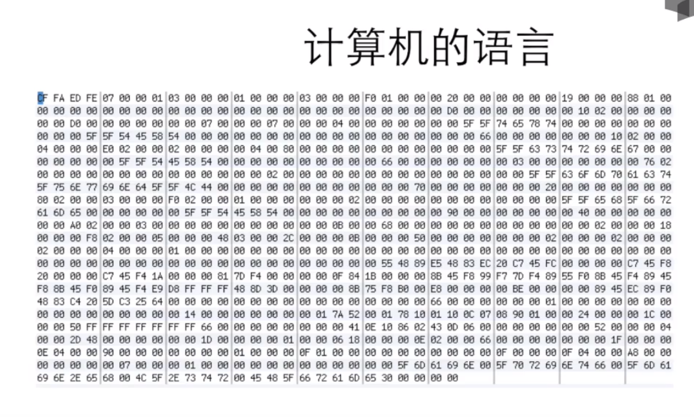
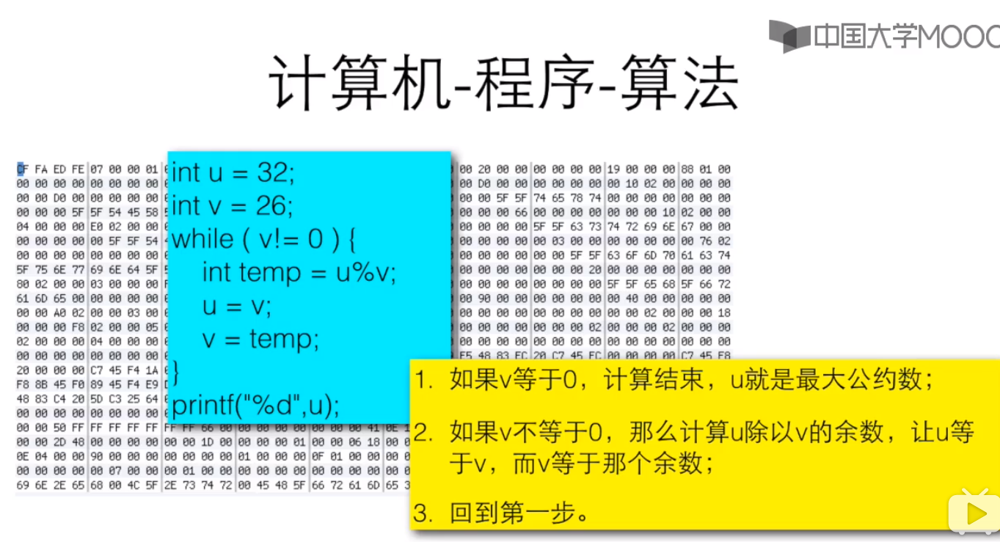
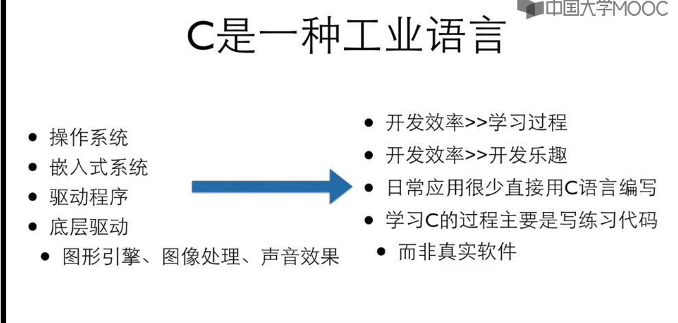
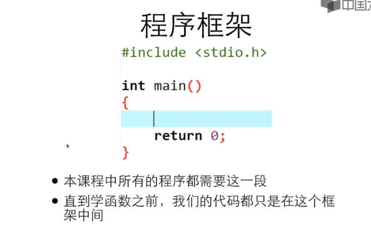
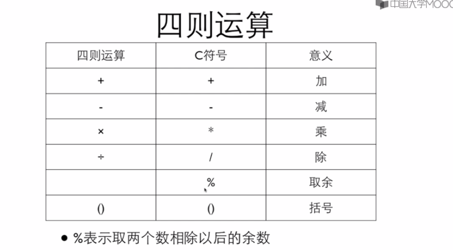

## C语言程序设计基础 

###  1.1、计算机语言

   ```
.程序是用特殊的编程语言写出来表达如何解决问题的
.不是用编程语言来和计算机交谈，而是描述要求它如何做事情的过程或方法
   ```


####  1)、编程语言不是和计算机交谈的语言，计算机其实只懂下面的语言



下面图中，蓝色部分是学习过编程语言的人懂得语言，再往上黄色部分才是普通人懂得东西 如何去计算步骤。也就是算法，



####  2)、算法

 ```
.我们要让计算机做计算，就需要像这样找出计算的步骤，然后用编程语言写出来
.计算机做的所有的事情叫做计算
.计算的步骤就是算法
 ```

### 1.2、计算机的思维方式

一个简单方程，我们学习过方程这些可以很好的理解，但是计算机不能识别。

```
2x+6=20
```


#### 1) 、程序的执行

```
解释：借助一个程序，那个程序能试图理解你的程序，然后按照你的要求执行。

编译：借助一个程序，就像一个翻译，把你的程序翻译成计算机真正能懂的语言---机器语言--写的程序，然后，这个
机器语言写的程序就能直接执行了。
```

#### 2)、解释语言vs编译语言

```
.语言本无编译/解释之分
.常用的执行方式而已
.解释型语言有特殊的计算能力
.编译型语言有确定的运算性能
```

### 1.2.1、为什么是C， 现在的语言基本上都参考c语言来编写

```
.现在的编程语言在语法上的差异很小，几乎都是C-like语言
.语言的能力/使用领域主要是由，库和传统锁决定的
```

### 1.2.2、简单历史

```
.C语言是从B语言发展而来的，B语言是从BCPL发展而来的，BCPL是从FORTARN发展而来的。
.BCPL和B都支持指针间接反射，所以C也支持了
.C语言还受到了PL/1的影响，还和PDP-11的机器语言由很大关系
.1973年3月，第三版的Unix上出现了C语言的编译器
.1973年11月，第四版的Unix(System Four)发布了，这个版本是完全用C语言重新写的。
```

#### 1.2.2.1 C的发展与版本-标准

```
.1989年ANSI发布了一个标准-ANSI C
.1990年ISO接受了ANSI的标准-C89
.C的标准在1995年和1999年两次更新-C95和C99
.所有的当代编译器都支持C99了
```


### 1.2.3、编程软件

#### 1)、C语言用在哪里

```
.操作系统
.嵌入式系统
.驱动程序
.底层驱动
  .图形引擎、图像处理、声音效果
```



#### 2)、编译--->运行

```
.C需要被编译才能运行，所以你需要
  .编辑器
  .编译器
.或者，IDE(集成开发环境)  
```

#### 3)、编译软件

```
.Dev c++
.MS Visual studio Express(Windows)
.Xcode(Mac OSX)
.Eclipse-CDT
.Geany(和MinGW一起)
.Sublime(和MinGW一起)
.vim/emacs(和MinGW一起)


问：轻量级的编程软件，如Geany+MinGW或Sublime Text+MinGW，与专门的IDE如Dev C++相比，什么功能没有了？
答：单步调试
```

### 1.3.1、第一个C程序

```c
#include  <stdio.h>
int main(){
  printf("Hello world!\n");
  return 0;
}
```

### 1.3.2、详解第一个程序

#### 1)、程序框架




#### 2)、输出

 ```
.printf("Hello World!\n");
."" 里面的内容叫做"字符串"，printf会把其中的内容原封不动地输出
. \n表示需要在输出的结果后面换一行
 ```

#### 3)、程序中的错误 (不同的开发工具提示不一样)

```
.编译的时候发现的错误所在的地方会以红色的线或者红色背景色标出来。
.具体的错误原因列在下方的窗口里
.C的编译器给出的错误提示往往不那么好"猜"
```

### 1.3.3、做计算

```
.printf("%d\n", 23+43);
  .%d说明后面有一个整数要输出在这个位置上
.prinf("23+43=%d\n",23+43);  
```

示例代码

```c
#include  <stdio.h>
int main(){
  printf("%d", 12+34);
  return 0;
}
```



1.3.4 


