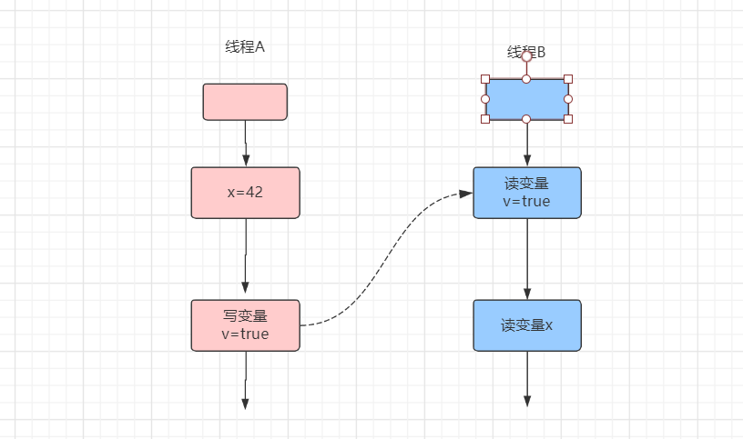

## JAVA 多线程编程实战指南读书笔记

### 1、`` 什么是多线程编程？``

  多线程编程就是以线程为基本抽象单位的一种编程范式。 

**$\textcolor{red}{线程操作资源类}$**

#### 1.1、锁

当多个线程对同一个共享变量/对象进行操作，即使是最简单的操作，如：i++，在处理上实际也涉及到读取、自增、赋值这三个操作，也就是说 **这中间存在时间差，导致多个线程没有按照如程序编写者所设想的去顺序执行，出现错位，从而导致最终结果与预期不一致**。

Java中的多线程同步是通过锁的概念来体现。**锁不是一个对象、不是一个具体的东西，而是一种机制的名称**。锁机制需要保证如下两种特性：

```
互斥性：即在同一时间只允许一个线程持有某个对象锁，通过这种特性来实现多线程中的协调机制，这样在同一时间只有一个线程对需同步的代码块(复合操作)进行访问。互斥性我们也往往称为操作的原子性；

可见性：必须确保在锁被释放之前，对共享变量所做的修改，对于随后获得该锁的另一个线程是可见的（即在获得锁时应获得最新共享变量的值），否则另一个线程可能是在本地缓存的某个副本上继续操作从而引起不一致

```


#### 1.2、挂起、休眠、阻塞与非阻塞

**$\textcolor{red}{挂起(Suspend)}$**：当线程被挂起的时候，其会失去CPU的使用时间，直到被其他线程（用户线程或调度线程）唤醒。

**$\textcolor{red}{休眠（Sleep)}$**：同样是会失去CPU的使用时间，但是在过了指定的休眠时间之后，它会自动激活，无需唤醒（整个唤醒表面看是自动的，**但实际上也得有守护线程去唤醒，只是不需编程者手动干预**）。

**$\textcolor{red}{阻塞（Block）}$**：在线程执行时，**所需要的资源不能得到，则线程被挂起**，直到满足可操作的条件。

**$\textcolor{red}{非阻塞(Block)}$**：在线程执行时，**所需要的资源不能得到，则线程不是被挂起等待**，而是继续执行其余事情，待条件满足了之后，**收到了通知（同样是守护线程去做）再执行**。

```
挂起和休眠是独立的操作系统的概念，而阻塞与非阻塞则是在资源不能得到时的两种处理方式，不限于操作系统，当资源申请不到时，要么挂起线程等待、要么继续执行其他操作，资源被满足后再通知该线程重新请求。显然非阻塞的效率要高于阻塞，相应的实现的复杂度也要高一些
```

#### 1.3、内核态和用户态

有一些系统级的调用，比如：清除时钟、创建进程等这些系统指令，如果这些底层系统级指令能够被应用程序任意访问的话，那么后果是危险的，系统随时可能崩溃，所以 **CPU将所执行的指令设置为多个特权级别，在硬件执行每条指令时都会校验指令的特权**，比如：Intel x86架构的CPU将特权分为0-3四个特权级，0级的权限最高，3权限最低。

而操作系统根据这系统调用的安全性分为两种：**内核态和用户态**。**内核态执行的指令的特权是0，用户态执行的指令的特权是3**

```
内核态:当一个任务（进程）执行系统调用而进入内核指令执行时，进程处于内核运行态（或简称为内核态）；

用户态:当任务（进程）执行自己的代码时，进程就处于用户态；
```


### 2、`` 为什么使用多线程编程？``

  比如 我们在使用手机的时候，我们希望在听歌的时候可以看一些其他的文章，那么这个时候如果是单线程的话 我们就只能 听歌，而不能使用其他的app看 文章这些，这样比较麻烦。而使用了多线程后 我们就可以多个操作都可以进行。

#### 3、``线程的创建、启动和运行``

   在java平台中创建一个线程就是创建一个Thread类的实例。每一个线程都有要执行任务，线程的任务处理逻辑可以在Thread类的run实例方法中直接实现或者通过该方法进行调用, 因此run方法相当于线程的任务处理逻辑入口方法。它是由java虚拟机在运行相应线程时直接调用，而不是由应用代码进行调用。

​    运行一个线程实际上就是让java虚拟机执行该线程的run方法，从而使相应线程的任务处理逻辑代码得以执行。为此，我们首先要启动线程。Thread类 的start方法的作用就是启动相应的线程。启动一个线程实质就是请求java虚拟机运行相应的线程，而这个线程具体何时能够运行是由线程调度器决定的。因此，start方法调用结束并不意味着相应的线程已经开始运行，这个线程可能稍后才被运行，也可能永远都不会被运行。

  创建线程的方式一般有两种，一种是继承Thread类， 一种是实现Runnable接口。继承Thead类 后在子类中覆盖run方法并在该方法中实现线程任务处理逻辑；使用实现接口Runnable方法来实现，并在该实例的run方法中实现任务处理逻辑。

注意：线程属于“一次性用品”，我们不能通过重新调用一个已经运行结束的线程start方法使其重新运行。事实上，start方法也只能够被运行一次，多次调用同一个Thread实例的start方法会导致其抛出IllegalThreadStateException异常。 


### 4、``Thread类中常用方法``

####  4.1 Thread.currentThread()可以返回当前线程。

 由于同一段代码可能被不同的线程执行，因此当前线程是相对的。即 Thread.currentThread()的返回值在代码实际运行的时候可能对应着不同的线程(对象)

####  4.2、join方法

join方法 的作用是 让一个线程"先执行" 后，其他的线程在执行。让相应的线程想暂停下，等另外一个线程运行结束后才开始继续执行。

####  4.3、yield 静态方法

  yield 静态方法的作用相当于执行该方法的线程对线程调度器说，我们现在不急，如果别的人需要处理器资源那么先给它用吧。当然，如果没有其他人要用，我也不介意继续占用。

####  4.4、sleep静态方法

   sleep静态方法的作用相当于执行该方法的线程对线程调度器说，我想小憩一会儿，过段时间在叫醒我 继续干活。

### 5、``线程的声明周期状态``

 5.1 线程的声明周期状态有 ，NEW, RUNABLE, BLOCKED, WAITING, TIMED_WAITING, TERMINATED

 $\textcolor{Red}{NEW}$   ：表示一个已经创建而未启动的线程处于该状态，由于一个线程实例只能够被启动一次，因此一个线程只可能有一次处于该状态。

 $\textcolor{Red}{RUNNABLE}$ : 可以看成一个复合状态，它包含两个子状态 <font color=#FF0000 >READE  </font>和 <font color=#0000FF >RUNNING </font>。前者表示处于该状态的线程可以被线程调度器进行调度从而使之处于RUNNING状态。后者表示处于该状态的线程处于正在运行，即相应线程对象的run方法所对应的指令正处由处理器执行。 处于READ子状态的线程也被称为活跃线程。

$\textcolor{Red}{BLOCKED}$   : 一个线程发起阻塞式I/O操作后，或者申请一个由其他线程持有的独占资源(比如锁)时，相应的线程会处于该状态。处于BLOCKED状态的线程并不会占用处理器资源，因为这些资源 已经让其他线程去使用了。当阻塞式I/O操作完成后，或者线程获得了其申请的资源，该线程的状态又可以转换为RUNNABLE。

 $\textcolor{Red}{WAITING}$    : 一个线程 执行了某些特定的方法之后就会处于这种等待其他线程执行另外一些特定操作的状态，能够使执行线程变更为WAITING 状态的方法包括：Object.wait(), Thread.join(), LockSupport.park(Object)。能够使相应线程从WAITING变更为RUNNABLE的相应方法包括：Object.notify()/notifyAll()和LockSupport.unpark(Object)

  $\textcolor{Red}{TIMED  WAITING}$  : 该状态和WAITING类似，差别在于处于该状态的线程并非无限制地等待其他线程执行特定操作，而是处于带有时间现在的等待状态。当其他线程没有在指定时间内执行该线程所期望的特定操作，该线程的状态自动状态转换为RUNNABLE.

   $\textcolor{Red}{TERMINATED}$    : 已经执行结束 的线程处于该状态。由于一个线程实例只能够被启动一次，因此一个线程也只能有一次处于该状态。Thread.run正常返回或者由于抛出异常而提前终止都会导致相应线程处于该状态。


### 6、``串行、并发与并行``

 串行：比如安装电脑，我们需要报cpu, 显卡这些安装之后，其他事情才能执行。

 并发：这种方式也可以投入一个人。这个人先开始做事情A,事情A的准备活动做好后，在等待事情A完成的这段时间内 开始做事情B,  再等待事情B完成的这段时间内开始做事情C。这个整个过程实际上是已交替的方法利用等待某件事情完成的时间来完成其他事情。

 并行：并行这种方式需要投入人数要多些，每个人负责完成其中一件事情。 

 并发就是在一段时间以交替的方式去完成多个任务，而并行就是以齐头并进的方式去完成多个任务。并发与并行还是存在一些差异。首先，现实世界中的一个人可以以并发的方式去完成几件事情，而软件要以并发的方式去完成几个任务往往需要借助多个线程。


### 7、``竞态``

多线程编程中  进程会遇到一个问题，就是有的时候对同样的输入 ，程序的输入有时候是正确的而有的时候不正确，这种计算结果的正确性与时间有关的现象就称为竞态。

竞态不一定就是导致计算结果的不确定，它只是不排除计算结果时而正确时而错误的可能。

竞态往往伴随着读取脏数据的问题 ，即一个线程读取到一个过时的数据，丢失更新问题。


### 8、``线程安全性``

一般而言，如果一个类在单线程环境下能够正常运行，并且在多线程环境下，在其使用方不做任何的改变的情况下 也能运作正常，那么我们就称之为 线程安全的，相应的我们称这个类具有线程安全性。


### 9、``原子性``

什么是原子性呢？ 原子性表示的意思是不可分割的。对于涉及共享变量访问的操作，若改操作从其执行线程以外的任意线程来看是不可分割的，那么该操作就是原子操作，相应的我们称该操作具有原子性。

  原子性的不可分割 指其访问某个共享变量的操作从其执行线程以外的任何线程来看，该操作要么已经执行结束要么未发生，即其他线程不会 看到 该操作执行了部分的中间效果。

   比如：去ATM去取钱，我们取钱这个操作 要么成功要么失败，成功了我们取到钱了，失败我们没有取到钱。不会出现我们没有取得钱 而银行账户里面的钱少了这种 ，除非ATM出现了问题。

 $\textcolor{Red}{**原子性 就是保证数据完整性和准确性**}。$

在java中有两种方式来实现原子性， $\textcolor{Magenta}{一种是使用Lock(锁)} $，锁具有排他性，即它能够保障一个共享变量在任意一个时刻只能被一个线程访问。这样就排除了多个线程在同一时刻访问共享变量而导致干扰和冲突的可能。

另一种是利用$\textcolor{Magenta}{处理器提供的专门CAS(Compare-and-Swap)指令}$,CAS指令实现原子性的方式与锁实现原子性的方式是相同的，其差别就是在锁通常是在软件这一层实现的，而CAS则是直接在硬件这一层实现的。

### 10、``可见性``

在多线程环境下， 一个线程对共享变量进行更新后，后续访问该变量的线程可能无法立即读取到这个更新的结果，甚至永远也无法读取到这个更新的结果，这就是线程安全问题的另外一个表现形式 可见性

  如果一个线程对共享变量进行更新后，后续访问该变量的线程可以读取到该更新的结果，那么我们就称这个线程对共享变量的更新对其他线程可见，否则我们就称这个线程对共享变量的更新对其他线程不可见。

   多线程程序在可见性方面存在问题意味着某些线程读取了旧数据，而这可能导致程序出现我们所不期望的结果。

   可见性与计算机的存储系统有关，程序的变量可能被分配到寄存器而不是主内存中进行存储。每个处理器都有其寄存器，而一个处理器无法读取到另外一个处理器上寄存器的内容。

   处理器对主内存的访问不是直接访问的，而是通过高速缓存子系统进行的。一个处理器的高速缓存中的内容不能被另外一个处理器直接读取，但是一个处理器可以通过缓存一致性协议（Cache Conherence Protocol）来读取其他处理器高速缓存中的数据，并将读取的到的数据更新到高速缓存中。

### 11、``有序性``

有序性指在什么情况下一个处理器上运行的一个线程所执行的内存访问操作在另一个处理器上运行的其他线程看起来是乱序的。所谓乱序，是指内存访问操作的顺序看起来是发生了变化。

####  11.1 ``重排序的概念``

   我们希望的某个操作必须先于另一操作得以执行，在多核处理器的环境下，这种操作执行的顺序是没有保障的，编译器可能会改变这种执行顺序。从处理器的角度来看 其执行顺序可能会与目标代码所指定的顺序不一致，这种现象就是重排序。

####   11.2 ``指令重排``

​    源代码顺序与程序顺序不一致，或者程序顺序与执行顺序不一致的情况下，我们就是说发生了指令重排。

  java平台包含两种编译器：静态编译器（javac）和动态编译器（JIT编译器），前者是将java源码(.java文本文件)编译为字节码(.class二进制文件)，它是在代码编译阶段介入的。后者的作用是将字节码动态编译为java虚拟机宿主机的本地代码（机器码），它是在java程序运行过程中介入的。

  java平台中，静态编译器基本上不会执行指令重排序，而JIT编译器则可能执行指令重新排序。

####  11.3``存储子系统排序``

​    主内存相对于处理器是一个慢速设备。处理器并不是直接访问内存，而是通过高速缓存访问内存。再次基础上处理器还引入了写缓存器（store buffer,也称为 Write Buffer）以提高写高速缓存操作的效率。  将写缓冲器和高速缓存统称为存储子系统，它其实是处理器的子系统。

  在存储子系统的作用下其他处理器对这两个操作的感知顺序仍然可能与程序顺序不一致，即这两个操作的执行顺序看起来发生了变化。这种现象就是存储子系统重排序，也称为内存重排序

​    指令重排序 的重排序对象是指令，它实实在在地对指令的顺序进行调整，而存储子系统重排序是一种现象而不是一种动作。


### 12、``线程的同步机制``

####   12.1、我们知道线程安全问题的产生前提是多个线程并发访问共享变量、共享资源。

​    我们可以很容易的想到一种保障线程安全的方法----将多个线程对共享数据的并发访问转为串行访问，即一个共享数据一次只能被一个线程访问，该线程访问结束后其他线程才能对其进行访问。 锁就是利用这种思路以保障线程安全的线程同步机制。

####   12.2、 一个线程在访问共享数据的前必须先申请相应的锁

​    线程的这个动作被称为锁的获得(Acquire)。一个线程获得某个锁，我们就称该线程为相应锁的持有线程，一个锁一次只能被一个线程持有。锁的持有线程可以对该锁所保护的共享数据进行访问，访问结束后该线程必须释放(Release)相应的锁。锁的持有线程在其获得锁之后和释放锁之前这段时间内执行的代码被称为临界区（Critical Section）。因此，共享数据只允许在临界区内进行访问，临界区一次只能被一个线程执行。

####    12.3、java平台中，有两种锁 

​    内部锁(Intrinsic Lock)和显示锁(Explicit Lock)。 内部锁通过synchronized关键字实现，显示锁通过java.concurrent.locks.Lock   接口的实现类实现。

####    12.4、锁的作用 

​       互斥性：   锁通过互斥保障原子性的。所谓互斥，就是一次只能被一个线程持有。

​      可重入性：表示一个线程在持有一个锁的时候能否多次申请该锁，如果一个线程持有一个锁的时候还能够继续成功申请该锁那么我们就称该锁是可重入的(Reentrant)，否则就是成该锁为非可重入的锁(Non-reentrant).

​          可重入锁可以被理解为一个对象，这个对象 里包含一个计数器属性，这个属性的初始值是0，表示没有别相应的锁还没有被线程所持有。每次线程获得一个可重入锁的时候，这个计数器就会加1。每次一个线程释放锁的时候，该锁的计数器数据值就会被减1。一个可重入锁初次获取该锁的时候开销相对较大，因为第一次获取锁的时候 需要与其他线程“竞争”以获得锁。

####   12.5、内部锁synchronized关键字

​    java平台中的任何一个对象都有唯一一个与之关联的锁。这种锁被称为监视器（Monitor）或者内部锁（Intrinsic Lock）。内部锁是一种排他锁，它能保证原子性，可见性和有序性。

​    内部锁是通过synchronized实现的，synchronized关键字修饰的方法被称为同步方法，synchronized修饰的静态方法被称为同步静态方法，synchronized修饰的实例方法被称为同步实例方法。同步方法的整个方法体就是一个临界区。

​    锁句柄的变量通常采用final修改，如果不采用final修饰，那么这个变量值一旦改变，那么就导致执行同一个同步块的多个线程实际上使用了不同的锁。 例如

  ```private final Objcet lock = new Object();```

java虚拟机会为每一个内部锁分配一个入口集，用于记录等待获取相应的内部锁的线程。多个线程申请同一个锁的时候，只有一个申请者能够称为该锁的持有线程(即申请锁的操作成功)，而其他申请者的申请操作会失败。这些申请失败的线程不会抛出异常，而是会被暂停（声明周期状态为BLOCKED）并存入相应锁的入口集中等待再次申请锁的机会

注意：java虚拟机对$\textcolor{OrangeRed}{ 内部锁的调度仅支持非公平调度}$，被唤醒的等待线程占用处理器运行时可能还有其他新的活跃线程与该线程抢占这个被释放锁。因此被唤醒的线程不一定能称为该锁的持有线程。


synchronized实现同步得基础：java中的每一个对象都可以作为锁。

具体表现为以下3种形式：

```
对普通同步方法，锁的是当前实例对象。
对静态同步方法，锁的是当前类的class对象。
对同步方法块，锁的是synchonized括号里面配置的对象。
```

当一个线程尝试访问同步代码块时，它首先必须得到锁，退出或抛出异常时必须释放锁。


#### 12.6、显示锁：Lock接口

   在访问共享数据前申请相应的的显示锁，这里我们使用Lock.lock()即可。

```
private final Lock lock = ...//创建一个Lock接口实例

lock.lock();//申请锁lock

try{ // 在此对共享数据进行访问}
finally{ 
//总是在finally块中释放锁，以避免锁泄露
lock.unlock();
//释放锁lock
}
```

   在临界区访问共享数据。Lock.lock()调用与Lock.unlock调用之间的代码区域为临界区。不过，一般视上述的try代码块为临界区。因此，对共享数据的访问都仅仅放在该代码块中。

#### 12.7、显示锁 ReentrantLock 既支持非公平锁也支持公平锁。

ReentrantLock 的一个构造器 

```
ReentrantLock(boolean fair)
```

公平锁保障锁调度的公平性往往是以增加了线程的暂停和唤醒的可能性，即增加了上下文切换为代价。因此，公平锁适合于锁被持有的时间相对长或者线程申请锁的平均时间间隔间相对长的情形。总的来说是有公平锁的开销比使用非公平锁的开销要大，因此显示锁默认使用的非公平调度策略。

  内部锁和显示锁差异：内部锁简单易用，不用担心锁泄露。而显示锁容易被错用而导致锁泄露，因此使用显示锁的时候必须要在finally里面进行 锁的释放。 内部锁在使用是如果线程一直不释放锁，那么同步在该锁上的所有线程就会一直被暂停而是其它任务无法进展。而显示锁则可以在尝试获取锁，通过tryLock方法，如果在一段时间内每一申请到这个锁。那么这个方法返回true，否则，该方法不会导致其他的线程被暂停而是直接返回false。表示未获得相应的锁。

#### 12.8、读写锁

 ReentrantReadWriteLock读写锁，是个可重入锁


#### 12.9、内存屏障(Memory Barrier,也称为Fence)

```
对于同步在同一个锁之上的多个线程，我们称对共享变量进行更新的线程为写线程，对共享变量进行读取的线程为读线程。因此，一个线程可以即是写线程又是读线程。读线程，写线程在访问共享变量是必须持有相应的锁。
```

java虚拟机底层实际上是借助了内存屏障(Memory Barrier,也称为Fence), 内存屏障是对一类仅针对内存对，写操作指令的跨处理器架构的比较底层的抽象。内存屏障是被插入到两个指令间使用的，其作用是禁止编译器，处理器重排序从而保障有序性。

  

```
内存屏障划分有几种：

​ 按照可见性保障来划分，内存屏障分为加载屏障和存储屏障，加载屏障的作用是刷新处理器缓存，存储屏障的作用是冲刷处理器缓存。java虚拟机在MonitorExit(释放锁)对应的机器码指令之后插入一个存储屏障，这就保障了释放锁之前在临界区中对共享变量所做的更新对读线程的执行处理器来说是同步的；相应的：java虚拟机会在MonitorEnter(申请锁)对应的机器码指令之后临界区开始之前插入一个加载屏障，这使得读线程的执行处理器能将写线程对相应共享变量所做的更新从其他处理器同步到该处理器的高速缓存中。因此，可见性的保障是通过写线程和读线程对地使用存储屏障和加载屏障实现的。

​ 按照有序性划分，内存屏障分为 获取屏障(Acquire Barrier)和释放屏障(Release Barrier)。获取屏障的使用方式是在一个读操作之后插入内存屏障，其作用是禁止该读操作与其后的任何写操作之间进行重排序，这相当于在进行后续操作之前要先获得相应共享数据的所有权。 释放屏障的使用方式是在一个写操作之前插入该内存屏障，其作用是禁止该操作与前面的任何读写操作之间进行重排序。这相当于在相应共享数据操作结束后释放所有权。
                             MonitorEnter
                             Load Barrier
                             Acquire Barrier
                                临界区
                             Release Barrier
                             MonitorExit
                             Store Barrier

```


#### 12.10、锁与重排序

```
1、临界区内的操作不能重排序到临界区之外
2、临界区内的操作之间允许重排序
3、临界区外（临界区钱或者临界区后）的操作可以被重排序
```


#### 12.11、volatile关键字

这个关键 常被称为“轻量级锁”，其作用与锁的作用有相同的地方，$\textcolor{Magenta}{它可以保证可见性和有序性}$。所不同 的是，在原子性方面它不仅能保障写volatile变量操作的原子性，但没有锁的排他性；

其次，$\textcolor{Magenta}{volatile关键字的使用不会引起上下文切换,因为没有锁的申请与是释放}$。

volatile关键字 表示被修饰的变量的值容易变化，因而不稳定。volatile变量的不稳定性意味着对这种变量的读和写操作都必须从高速还或者主内存中读取，以读取变量的相对新值。因此，volatile变量不会被编译分配到寄存器进行存储，对volatile变量的读写操作都是内存访问(访问高速缓存相当于内存)操作。

 对应volatile变量的写操作，java虚拟机会在该操作之前插入一个释放屏障，并在该操作之后插入一个存储屏障。

```
      sharedA =1;
      sharedB = "OK";
      Relese Barrier //jvm插入的内存屏障
      volatileVar = true;  //volatile变量写操作
      Store Barrier  //jvm插入的内存屏障
```

释放屏障禁止了volatile写操作与该操作之前的任何读、写操作进行重排序，从而保证了volatile写操作之前的任何读、写操作会先于volatile写操作被提交，即其他线程看到写线程对volatile变量的更新时，写线程在更新volatile变量之前所执行的内存操作的结果对于读线程必然也是可见的。这就保障了读线程对写线程在更新volatile变量前对共享变量所执行的更新操作的感知顺序与相应的源代码顺序一致，即保障了有序性。


##### $\textcolor{red}{Happens-Before规则}$

Happens-Before真正表达的意思是：$\textcolor{red}{前面一个操作的结果对后续操作是可见的。}$而不是前面一个操作发生在后续操作的前面。

规则：

a:程序的顺序性规则

$\textcolor{red}{前面一个操作的结果对后续操作是可见的。}$而不是前面一个操作发生在后续操作的前面。

示例：

```java
// 以下代码来源于【参考 1】
class VolatileExample {
  int x = 0;
  volatile boolean v = false;
  public void writer() {
    x = 42;
    v = true;
  }
  public void reader() {
    if (v == true) {
      // 这里 x 会是多少呢？
    }
  }
}
```

上面程序, 假设A线程执行writer()方法 按照volatile语义会把变量"v=true"写入内存，假设B线程执行reader()方法。同样按照volatile语义，线程B会从内存中读取变量v, 如果线程B看到"v=true"时，那么线程B看到的变量x是多少呢？

从直觉上看，应该是42，那实际应该是多少呢？这个需要看java版本。如果是在低于1.5的版本上运行，x可能是42，也可能是0；如果在1.5以上的版本上运行，x就是42。 这个问题原因是变量x可能被CPU缓存而导致可见性问题。而这个问题再1.5版本已经被圆满解决。java内存模型再1.5版本对volatile语义进行了增强。处理方式是一项Happens-Before中的规则。



从图中可以看到：

1、"x=42" Happens-Before写变量 "v=true"，这是规则1的内容；

2、写变量"v=true" Happens-Before读变量 "v=true"，这是规则2的内容

根据传递性规则，可以得到 "x=42" Happens-Before 读变量"v=true" ,这就意味着 如果线程B读到了 "v=true"，那么线程A设置的"x=42" 对线程B是可见的。也就是说，线程B能看到 "x==42"。


b:管程中锁的规则

```
An unlock on a monitor happens-before every subsequent lock on that monitor. 一个unlock操作Happens-Before后面对同一个锁的lock操作。 
要理解"管程指的是什么"。管程是一种通用的同步原语，在java中指的就是synchronized, synchronized是java里对管程的实现。
```

c:volatile变量规则

```
对一个volatile变量的写操作相对于后续对这个volatile变量的读操作可见。
```

d:线程启动规则

```
Thread对象的start()方法Happens-Before(前面一个操作的结果对后续操作是可见的)此线程的每一个动作。

这条是关于线程启动的。它是指主线程 A 启动子线程 B 后，子线程 B 能够看到主线程在启动子线程 B 前的操作。
```

e:线程终止规则

```
线程中的所有操作都Happens-Before对此线程的终止检测。
```

f: 线程中断规则 

```
对线程interrupt()方法的调用Happens-Before被中断线程的代码检测到中断事件的发生，可以通过Thread.interrupt()方法检测到是否有中断发生。
```

g:对象终结规则

```
一个对象的初始化完成（构造函数执行结束）Happens-Before它的finalize()方法的开始。
```

h:传递性

```
如果A Happens-Before B, 且B Happens-Before C, 那么A Happens-Before C。
```


#### 12.12、CAS与原子变量，CAS(Compare-and-Swarp) 是一种对处理器指令的称呼。 

CAS能将read-modify-write和check-and-act子类的操作转换为原子操作。

```
CAS好比一个代理人，共享同一个变量V的多个线程就是它的客户。当客户需要更新变量V的值的时候，他们需要请求代理人代为修改，为此，客户要告诉代理人其看到的 共享变量的"当前值A" 及其 "期望的新值B".
   boolean compareAndSwap(Variable V, Object A, Object B){
        f(A == V.get()){//check:检查变量值是否被其他线程修改过
           V.set(B); //act:更新变量值
           reture true;
        }
        reture false; //变量值已被其他线程修改，更新失败
   }
```

注意：$\textcolor{Magenta}{CAS有ABA问题}$，就是这个共享变量V, 当线程看到它的值为A的那一刻，其他线程已经将其值更新为B, 接着当前线执行CAS的时候该变量的值又被其他线程更新为A, 那么这个时候我们不能否认变量V没有被其他线程更新过，这种问题就ABA问题。 解决这种问题的方法是 为共享变量的更新引入一个修订好。每次更新共享变量是相应的修订号的值就会被增加1，也就是说，我们将共享变量V的值“扩展” 成一个 有变量实际值和相应修订号所组成的元组，比如：[A,0]->[B,1]-[A,1]，这样每次变量的更新都会导致相应修订号的增加，我们就可以准确的判断究竟变量的值是否被其他线程修改过。 AtomicStampedReference类就是基于这种思想而产生的。

$\textcolor{Magenta}{CAS保障操作的原子性，不能保障可见性，不会导致上下文切换}$。


#### 12.13、static关键字

static关键字在多线程环境下，它能够保证一个线程即使在未使用的其他同步机制的情况下也总是可以读取到一个类的静态变量的初始值。但是，$\textcolor{Magenta}{这种可见性保障仅限于线程初次读取该变量}$。如果这个静态变量在相应类初始化完毕之后被其他线程更新过，那么一个线程要读取该变量的相对新值仍然需要借助锁、volatile关键字等同步机制

```
static关键字仅仅保障读线程能够读取到相应字段的初始值，而不是相对新值
```


#### 12.14、final关键字

```
保障被修饰的变量在其被发布前是初始化完毕的， 不能保障包含final字段的对象本身的可见性
不会导致上下文切换
```

#### 12.15、对象发布

```
将对象引用存储到public变量中，在非private方法中返回一个对象
避免在构造器中将this赋值给一个共享变量
避免在构造器中将this作为参数传递给其他方法
避免在构造器中启动基于匿名类的线程
```


### 13、线程间协作

####      13.1、等待与通知

​       程序要执行需要满足一定的条件才能执行。在多线编程中保护条件未满足可能只是暂时，稍后其他线程可能会更新了保护条件涉及的共享变量而使其成立，因此我们可以将当前线程暂停，直到其所需的保护条件得以成立时再将其唤醒。

```
//原子操作
atomic{
   while(保护条件不成立){
    //暂停当前线程
   }
   //执行目标动作
   doAction();
}
```

 唤醒那些被暂停的线程的过程就成为通知(Notify),.

####  13.2、Object.wait()/Object.wait(long) 以及Object.notify()/notifyAll()可用于实现等待通知：

Object.wait()的作用是使其线程被暂停(其生命周期状态变更为WAITING),该方法可用于实现等待；Object.notify()的作用是唤醒一个被暂停的线程，调用该方法可实现通知。相应的，Object.wait()的执行线程就被称为等待线程；Object.notify()的执行线程就被称为通知线程。

```
synchronized(someObject){
   while(保护条件不成立){
      //调用Object.wait() 暂停当前线程
      someObject.wait();
      }
    // 执行到这里说明保护条件成立
    //执行目标动作
    doActoin();
      
}
```

注意：

  保护条件的判断以及Object.wait()调用应该放在循环语句之中，这是因为 Object.wait()调用返回之后我们需要再 次判断此时保护条件是成立。 要确保目标动作只有保护条件成立的情况下才能执行。

  等待线程对保护条件的判断、Object.wait()的执行以及目标动作的执行必须放在同一个对象(内部锁)所引导的临界区之中。

  $\textcolor{Red}{ Object.wait()暂停当前线程是释放的锁只是与该wait方法所属对象的内部锁}$。当前线程所持有的其他内部锁、显示锁并不会因此被释放。


#### 13.3、执行notify方法的条件。

由于一个线程只有在持有一个对象的内部锁的情况下才能够执行该对象的notify方法，因此Object.notify()调用总是放在相应对象内部锁所引导的临界区之中。也正是由于Object.notify()要求其执行线程必须持有该方法所属对象的内部锁，因此 Object.wait() 在暂停其执行线程的同时必须释放相应的内部锁；否则通知线程无法获得相应的内部锁，也就无法执行相应对象的notify方法来通知线程！Object.notify()的执行线程持有的相应对象的内部锁只有在Object.notify()调用所在的临界区代码执行结束后才会被释放，而Object.notify()本身并不会将这个内部锁释放。 

#### 13.4、减少上下文切换

 . 在保证程序正确性的前提下，使用Object.notify()替代Object.notifyAll()。Object.notify()调用不会导致过早唤醒，因此减少了相应的的上下文切换。

 . 通知线程在执行完Object.notify()/notifyAll()之后尽快释放相应的内部锁。这样可以避免被唤醒的线程在Object.wait()调用返回前再次申请相应的内部锁时，由于该锁尚未被通知线程释放而导致该线程被暂停。

### 14、条件变量Condition

  Condition接口可以作为wait/notify的替代品来实现等待/通知。  每个  Condition实例内部都维护一个拥有存储等待线程的队列(等待队列)。


### 15、倒计时协调器CountDownLatch

  有时候一个线程可能只需要等待其他线程的特定操作结束即可，而不必等待这写线程终止。 CountDownLatch可以用来实现一个(或者多个)线程等待其他线程完成一组特定的操作之后在继续进行。这组操作被称为先决操作。

​    CountDownLatch内部维护一个拥有表示未完成的先决操作数量的计数器， CountDownLatch.countDown每执行一次就会使相应实例的计数器值减少1，CountDownLatch.await()相当于一个受保护方法，其保护条件为“计数器值为0(代表所有先决操作执行完毕)”。因此，当计数器值不为零时 CountDownLatch.await()的执行线程会被暂停，这些线程就被称为相应CountDownLatch的等待线程。CountDownLatch.countDown相当于一个通知方法，它会在计数器到达0的时候唤醒相应实例上的所有等待线程。

   当计数器的值达到0之后，该计数器的值就不会再发生变化。此时，调用CountDownLatch.countDown()并不会导致异常的抛出，并且后续执行CountDownLatch.await()的线程也不会被暂停。因此，CountDownLatch的使用是一次性的：一个CountDownLatch实例只能够实现一次等待和唤醒。

### 16、CyclicBarrier：相互等待对方执行到达代码的某个地方（集合点），这时这些线程才能够继续执行。


```
内部实现原理：内部使用了一个条件变量trip来实现等待/通知。CyclicBarrier内部实现使用了分代（Generation）的概念用于表示CyclicBarrier实例是可以重复使用的，除最后一个线程外的任何一个参与方都相当于一个等待线程，这些线程所使用的保护条件是"当前分代内，尚未执行await方法参与方法个数(parties)为0"。

当前分代的初始状态是parties等于参与方总数(通过构造器中parties参数指定)。CyclicBarrier.await()每被执行一次会使相应实例的parties值减少1。最后一个线程相当于通知线程，它执行CyclicBarrier.await()会使相应实例的parties值变为0，此时该线程会先执行barrierActionrun(),然后再执行trip.signalAll()来唤醒所以等待线程。接着，开始下一个分代，即使CyclicBarrier的parties值又重新恢复为其初始值。
```


### 17、BlockingQueue阻塞队列

 往队列中存入一个元素（对象）的操作被称为put操作，从队列中取出一个元素（对象）的操作被称为take操作。

#### 17.1 ArrayBlockingQueue 

```
内部使用一个数组作为其存储空间，而数组的存储空间是预先分配好的，因此ArrayBlockingQueue 的put操作、take操作本身并不会增加垃圾回收的负担。ArrayBlockingQueue 的缺点是其内部在实现put、take操作时使用的是同一个锁（显示锁），从而导致锁的高争用，进而导致较多的上下文切换
```


#### 17.2  LinkedBlockingQueue 

  ```
LinkedBlockingQueue既能实现无界队列，也能实现有界队列。 该队列的优点是在内部实现put，take方法时分别使用了两个显示锁（putLock和takeLock）,这降低了锁争用的可能性。LinkedBlockingQueue内部存储空间是一个链表，而链表节点（对象）所需的存储空间是动态分配的，put操作，take操作都会导致链表节点的动态创建和移除，LinkedBlockingQueue的缺点是它可能增加垃圾回收的负担。 LinkedBlockingQueue的put和take时两个锁，所以在维护当前队列长度（size）时无法使用一个普通的int型变量而是使用了一个原子变量（AtomicInteger）。这个原子变量可能会被生成者线程和消费者线程争用，因此他可能导致额外的开销。
  ```

#### 17.3 SynchronousQueue 

```
这个队列可以被看做是一种特殊的有界队列。 SynchronousQueue 内部并不维护用于存储队列元素的存储空间。
SynchronousQueue 所实现的通道更像是邮递员投送挂号信时与收件人接触的情形-邮递员必须在收件人签收后才能离开。
因此 SynchronousQueue 适合于消费者处理能力与生产者能相差不大的情况下使用。 
ArrayBlockingQueue 适用于生产者和消费者线程之间的并发程度较低的情况下使用
LinkedBlockingQueue 适用于生产者和消费者线程之间的并发程度较高的情况下使用
```


### 18、线程中断机制

有时候我们需要一个线程请求另外一个线程停止其正在执行的操作。比如，某些比较耗时的任务，我们往往采用专门的工作者线程来负责其执行，如果中要取消(比如用户不想等了) 这类任务的执行，那么就需要借助java线程中断机制。

```
 中断(Interrupt)可以被看作一个线程(发起线程Originator)发送给另一个线程（目标线程Target）的一种指示，该指示用于表示发起线程希望目标线程停止其正在执行的操作。 中断仅仅代表发起线程的一个诉求，而这个诉求能否被满足则取决于目标线程自身----目标线程可能会满足发起线程的诉求，也可能根本不理会发起线程的诉求！java平台会为每个线程维护一个被称为中断标记（Interrupt Status）的布尔类型状态变量用于表示相应线程是否接收到了中断，中断标记值为true表示相应线程收到了中断。目标线程可以通过Thread.currentThread.isInterrupted调用来获取该线程的中断标记值，也可以通过Thread.interrupted来获取并重置（也称为清空）中断标记值。

 目标线程检查中断标记后所执行的操作，被称为目标线程对中断的响应，检查中断响应，设有个发起线程Originator和目标线程target，那么target对中断的响应一般包括：
  ** 无影响。Originator调用target.interrupt()不会对target的运行产生任何影响，这种情形也可以为目标线程无法对中断进行响应。InputStream.read(), ReentrantLock.lock以及申请内部锁等阻塞方法/操作就属于这种类型
  ** 取消任务的运行。 Originator 调用target.interrupt()会使target在侦测到中断(即标记值为true) 那一刻所执行的任务被取消(中止)，而这并不会运行 target继续处理任务
  ** 工作者线程停止。Originator调用target.interrupt会使target终止，即target的生命周期状态变更为TERMINATED
```

$\textcolor{Red}{线程中断即线程运行过程中被其他线程给打断了，}$$\textcolor{Red}{ 它与 stop 最大的区别是：stop 是由系统强制终止线程，而线程中断则是给目标线程发送一个中断信号}$，

$\textcolor{Red}{如果目标线程没有接收线程中断的信号并结束线程，线程则不会终止，具体是否退出或者执行其他逻辑由目标线程决定。}$


#### 18.1、能够响应中断的方法通常是在执行阻塞操作判断中断标志，若中断标志值为true则抛出InterruptedException。

例如, ReentrantLock.lockInterruptibly()的功能与ReentrantLock.lock()类似，二者都能用于申请相应的显示锁，但是ReentrantLock.lockInterruptibly()能够对中断做出响应。ReentrantLock.lockInterruptibly()方法对中断的响应是通过其调用的一个名为 acquireInterruptibly的方法实现的。acquireInterruptibly方法会在执行申请锁这个阻塞操作前检查线程的中断标记，若中断标记为true则抛出InterruptedException异常。


Tips:依照惯例，抛出InterruptedException异常的方法，通常会在其抛出该异常是将当前线程的线程中断标记重置为false


#### 18.2、对InterruptedException异常 的正确处理方式包括以下几种

     * 不捕获InterruptedException。如果应用代码的某个方法调用了能够对中断进行响应的阻塞方法，那么我们可以选择在这个方法的异常 声明（throws)中也加一个InterruptedException。这种做法实质上时当前方法不知道该如何处理比较恰当，因此将 “难题” 抛给其上层代码（比如这个方法的调用方）。
     * 捕获InterruptedException后重新将该异常抛出。使用这种策略通常是由于应用代码需要捕获InterruptedException并对此做一些中间处理（比如处理部分完成的任务），接着再将 “难题” 抛给其上层代码。
     * 捕获InterruptedException并在捕获该异常后中断当前线程。这种策略实际上在捕获到InterruptedException后又恢复中断标志，这相当于当前代码告诉其他代码：“我发现了中断，但我并不知道如何处理比较妥当，因此我为你保留了中断标记，你看着办吧！”


### 19、线程安全的设计技术

####      1、不可变对象

​       指一经创建其状态就保持不变的对象。不可变对象也具有固有的线程安全性，因此不可变对象也可以像无状态对象那样被多个线程共享，而这些线程方法共享对象的时候无须加锁。

​      

