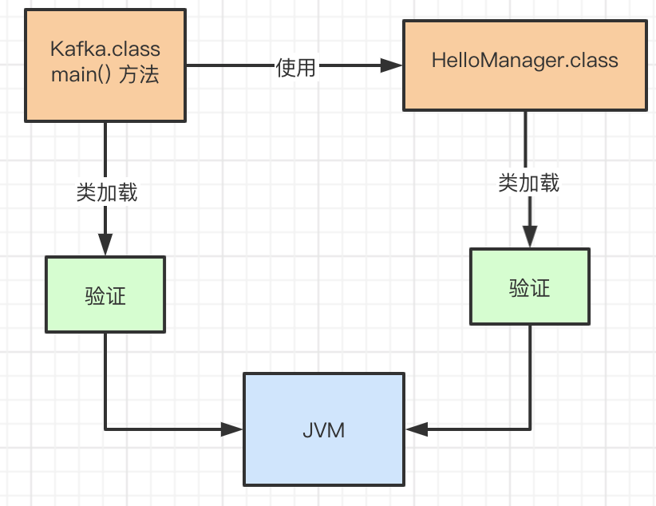
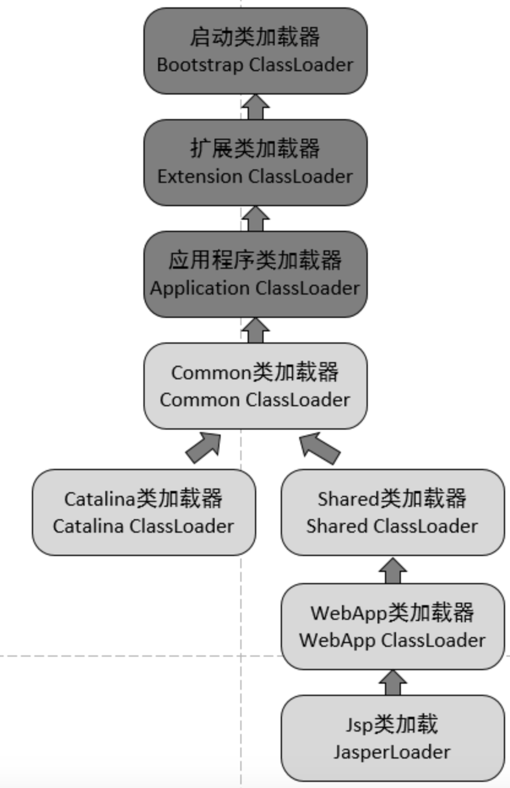
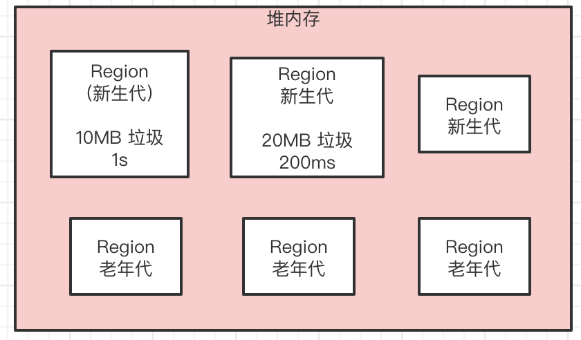
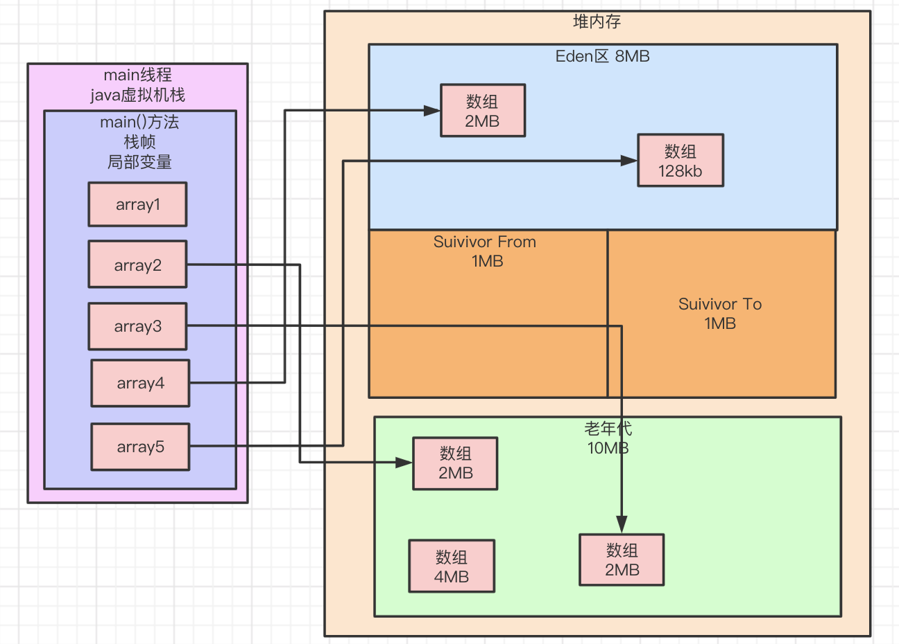

JVM 实战学习

## 1、java代码是如何运行的

   在我们写好的java代码中，每个文件都是以“.java”为后缀的文件，比如User.java、OrderService.java等文件，当我们写好这些".java"后缀的代码文件之后，将代码编译打包 成jar包或者war包，把打包好的文件发布到服务器上去。

​    在打包过程中，会把代码编译成“.class”后缀的字节码文件，“User.class” 等，这个“.class”后缀的字节码文件才是才被运行起来的。

 

对于编译好的".class"字节码，需要使用java -jar 之类的命令来运行，一旦使用了这些命令，实际上就会启动一个jvm进程。而jvm就会来负责运行这些".class"字节码文件。 所以一旦启动系统，其实就是启动了一个jvm 由它在机器上运行这系统。


接下来 ，jvm要运行".class"字节码文件中的代码，那首先要把“.class”文件中包含的各种类给加载进来。就好一个“类加载器的概念”，它把编译好的“.class”字节码文件加载到JVM中，然后供后续代码运行来使用。


最后jvm基于 字节码执行引擎 来执行加载到内存里的 已经写好的那些类。


### 1.2、JVM在什么情况下加载一个类

 在代码中使用这个类的时候会加载，而类从加载到使用有以下过程

```
加载->验证->准备->解析->初始化->使用->卸载
```

举个例子，比如有一个类(Kafka.class), 里面有一个"main()"方法作为入口。 那么jvm启动进程后，会把这个类(Kafka.class)加载到内存里，然后从"main()"方法的入口代码开始执行。


当kafka类中的加入里如下代码

```java
public class Kafka{
   public static void main(String[] args){
      HelloManager hello= new HelloManager();
   }
}
```

使用HelloManager这个类去实例一个对象，此时必须把HelloManager.class 字节码文件中的这个类加载代内存里面来。


#### 1.3、加载、验证和初始化过程

####  (1)、验证

   在将".class"来加载进来时，需要去验证".class"文件是否符合规则，如果".class"文件被篡改了，里面的字节码不符合java虚拟机规范 那JVM是没办法执行这个字节码的。



#### (2)、准备

```java
public class HelloManager{
 public static int flushIntVal;
}
```

这个是HelloManager类，在加载阶段 验证后，确认字节码内容是规范的 那么接下来就是准备阶段，这个阶段是给HelloManager类 分配一定的内存空间，给这类的中的类变量分配内存空和一个默认的初始值。 上面的示例代码中 给"flushIntVal"这个类变量分配内存空间，以及给一个"0"这个初始值。


#### (3)、解析

 这个阶段是把 **符号引用替换为直接引用**的过程


#### (4)、初始化

 在上面说到 准备阶段给"HelloManager"类分配内存空间，另外它的一个类变量"flushInt"也会给一个默认的初始值"0"，那么在初始化阶段就是 正式执行 类初始化的代码了。 比如

```java
public class HelloManager{
 public static int flushIntVal= Configuration.gitInt("xxxxx");
}
```

对着这个flushIntVal 类变量，打算通过Configuration.gitInt("xxxxx");来获取一个值，并赋值给flushIntVal。

但是在准备阶段 不会执行这个逻辑。在准备阶段 只是给"flushIntVal"类变量开辟一个内存空间，然后给一个初始值"0"。 而真正执行这段赋值的代码是在"初始化"阶段执行的。


注意 **如果初始化一个类的时候，发现它的类还没有初始化，那么必须先初始化它的的父类。**

比如

```java
public class HelloManager extends AbstractDataManager{
   public static int flushInterval = Configuration.getInt("re.interval");
  
   public static Map<String, Replica> replicas;
   
   static {
     
   }
   public static void loadReplicaFromDish(){
       this.replicas = new HashMap<String, Replica>();
   }
}
```

如果你要“new HelloManager()”初始化这个类的实例，那么会加载这个类，然后初始化这个类 但是初始化这个类之前，发现AbstractDataManager作为⽗类还没加载和初始化，那么必须先加载这个⽗类，并且初始化这个⽗类。


### 1.4、类的加载器和双亲委派机制

####   (1)、启动类加载器(Bootstrap ClassLoader)

​    它主要负责加载 在机器上安装的java目录下的核心类，在java安装目录下 有一个"lib"目录，这个就是java最核心的一些类库，支撑java系统的运行。

####  (2)、扩展类加载器(Extension ClassLoader)

  在java安装目录下有个 "lib\ext"目录， 这里一些类，就需要这个加载器来 加载 "lib\ext"目录的类

####  (3)、应用程序类加载器(Application ClassLoader)

   这个类负责加载"ClassPath"环境变量所指定的路径中的类。

####  (4)、自定义类加载器 

​    除了上面的几种，还可以自定义类加载器，去根据需要加载你的类。

####  (5)、双亲委派机制

  

双亲委派模型：先找父类加载，不行的话再也下一层级来加载。

#### (6)、Tomcat为什打破了双亲委派机制

Tomcat架构图



前3个类加载和默认的一致，CommonClassLoader、CatalinaClassLoader、SharedClassLoader和WebappClassLoader则是Tomcat自己定义的类加载器，它们分别加载`/common/*`、`/server/*`、`/shared/*`（在tomcat 6之后已经合并到根目录下的lib目录下）和`/WebApp/WEB-INF/*`中的Java类库。其中WebApp类加载器和Jsp类加载器通常会存在多个实例，每一个Web应用程序对应一个WebApp类加载器，每一个JSP文件对应一个Jsp类加载器

```
commonLoader：Tomcat最基本的类加载器，加载路径中的class可以被Tomcat容器本身以及各个Webapp访问；
catalinaLoader：Tomcat容器私有的类加载器，加载路径中的class对于Webapp不可见；
sharedLoader：各个Webapp共享的类加载器，加载路径中的class对于所有Webapp可见，但是对于Tomcat容器不可见；
WebappClassLoader：各个Webapp私有的类加载器，加载路径中的class只对当前Webapp可见；
```

从图的委派关系来看

```
 CommonClassLoader能加载的类都可以被Catalina ClassLoader和SharedClassLoader使用，从而实现了公有类库的共用，而CatalinaClassLoader和Shared ClassLoader自己能加载的类则与对方相互隔离。

 WebAppClassLoader可以使用SharedClassLoader加载到的类，但各个WebAppClassLoader实例之间相互隔离。 
 
 而JasperLoader的加载范围仅仅是这个JSP文件所编译出来的那一个.Class文件，它出现的目的就是为了被丢弃：当Web容器检测到JSP文件被修改时，会替换掉目前的JasperLoader的实例，并通过再建立一个新的Jsp类加载器来实现JSP文件的HotSwap功能。
```

**tomcat 为了实现隔离性**，没有遵守双亲委派这个约定，每个webappClassLoader加载自己的目录下的class文件，不会传递给父类加载器。   与JVM的安全性问题一样，使用单独的ClassLoader去装载tomcat自身的类库，以免遭受其它恶意或无意的破坏


#### (7)、如果tomcat 的 Common ClassLoader 想加载 WebApp ClassLoader 中的类，该怎么办？

可以使用线程上下文类加载器实现，使用线程上下文加载器，可以让父类加载器请求子类加载器去完成类加载的动作


https://www.cnblogs.com/aspirant/p/8991830.html 参考


## 2、JVM中内存区域和作用

### 2.1、JVM的内存区域划分

 当JVM加载类到内存后供后续使用，那么jvm就必须有个内存区域来存放这些类。

 

在我们的代码运行起来之后，就需要执行我们写的一个个方法，而运行方法的时候这些方法里面有很多变量之类的东西，也需要放在内存区域中。


 这就是为什么JVM中划分出不同的内存区域，它是为了我们写好的代码在运行过程中根据需要来使用。

#### (1)、存放类的方法区。

 这个区域主要存放从".class"文件加载进来的类，还有一些类似常量池的放在这区域。不过在JDK1.8这个区域改成了"Metaspaces(元空间)",这个里面存放的还是各种类的信息。

举例 比如下面的代码

```java
public class Kafka{
   public static void main(){
       HelloManager replicaManager = new HelloManager();
   }
}
```

这个两个类加载后就会放在方法区中


我们写的java代码会被翻译成字节码，对应各种字节码指令。然后字节码指令被一条一条的执行，这样才能实现我们写好的代码执行的效果。 所以当JVM加载类信息之后，实现上会使用自己的字节码执行引擎，去执行我们写的代码编译出来的代码指令。


#### (2)、执行代码指令的程序计数器

那么在执行字节码指令的时候，JVM里就需一个特殊的内存区域快，那就是"程序计数器"，就是用来记录当前执行的字节码指令的位置，也就是记录当前执行到哪一条字节码指令。


因为JVM 是支持多个线程的，而你写好的代码会开启有多个线程并发来执行不同的代码，所以就会有多个线程来并发的执行不同的代码指令，因为每个线程都有自己的一个程序计数器，专门记录当前这个线程目前执行到哪一条字节码指令了。


#### (3)、java虚拟机栈

 在下面的示例代码中，在mian方法里 有一个局部变量，这个局部变量在JVM中需要一块区域来存储，这个区域就是Java虚拟机栈。

```java
public class Kafka{
   public static void main(){
       HelloManager helloManager = new HelloManager();
       helloManager.load();
   }
}
```

上面的代码的局部变量"helloManager",它是引用一个HelloManager实例的对象。 这个局部变量存放在java虚拟机栈中，每个线程都有自己的Java虚拟机栈。

 如果一个线程执行了一个方法，就会对这个方法调用创建对应的一个栈帧。 栈帧里就有这个方法的局部变量表、操作数栈、动态连接、方法出口等。

⽐如main线程执⾏了main()⽅法，那么就会给这个main()⽅法创建⼀个栈帧，压⼊main线程的Java虚拟机栈 同时在main()⽅法的栈帧⾥，会存放对应的“helloManager”局部变量。


然后假设线程继续执行HelloManager对象里的方法，就在load方法里定义了一个局部变量 "hashLoad"

```java
public class HelloManager{
   public void load(){
      Boolean hashLoad = false;
   }
}
```

那么main线程在执行上面的load方法时，就会为load方法创建一个栈帧压入线程自己的Java虚拟机里面去。


如果当 load方法执行完毕之后，就会吧"load"方法对应的栈帧从Java虚拟机栈里出栈，然后"main"方法也执行完毕了，就把"main"方法也从Java虚拟机栈里出栈。所以在栈帧里存放了这个方法对应的局部变量之类的数据，包括这个方法执行的其他相关信息，方法执行完毕之后就出栈。

 每个线程在执行代码时，除了程序计数器以外，还搭配了一个Java虚拟机栈在内存区域存放每个方法中的局部变量表。


#### (4)、java堆内存

 示例代码

```java
public class HelloManager{
   public long replicaCount;
  
   public void load(){
      Boolean hashLoad = false;
   }
   
   public Boolean isLocalData(){
     Boolean isCorrupt =fals;
     return isCorrupt;
   }
}
```

在这个"HelloManager"类里"replicaCount"就是属于这个对象实例 的一个数据。类似HelloManager这样的对象实例，就会存放在java堆内存里。

Java堆内存区域⾥会放⼊类似HelloManager的对象，因为在main⽅法⾥创建了HelloManager对象的，那么在线 程执⾏main⽅法代码的时候，就会在main⽅法对应的栈帧的局部变量表⾥，让⼀个引⽤类型的“helloManager”局部变量来存 放HelloManager对象的地址 相当于你可以认为局部变量表⾥的“helloManager”指向了Java堆内存⾥的HelloManager对象.


整体的流程


## 3、JVM的垃圾回收机制

###  3.1、为什需要垃圾回收

  当一个方法执行完毕之后会怎样呢？

```java
public class Kafka{
   public static void main(String[] args){
      loadFroDisk();
   }
   private static void loadFroDisk(){
     HelloManager hellManager = new HelloManger();
     hellManager.load();
   }
}
```

一旦方法里代码执行完毕，那么方法就执行完毕了，也就是说loadFroDisk()方法执行完毕，这个方法执行完毕了之后此时就会把 loadFroDisk方法对应的栈帧从main线程的Java虚拟机栈里出栈。


此时一旦loadFroDisk()方法的栈帧出栈，那么在栈帧里的局部变量 ，"helloManager"也就没有了，也就是说没有任何一个变量指向java堆内存里的"HelloManager"实例对象了。

创建的对象都是占用内存资源的，而且内存资源有限，那么当不需要那些对象时，就需要进行回收处理。

如上的图"HelloManager"对象实例是不需要使用的，已经没有任何地方的局部变量在引用这个实例对象了,而且还占用这内存资源，这个时候就需要进回收处理。 也就是JVM 垃圾回收机制。

JVM本身是有垃圾回收机制，它是一个后台自动运行的线程，这个线程会不断检查JVM堆内存的各个实例对象。


如果某个实例对象没有个任何一个方法的局部变量指向它，也没有任何一个类的静态变量包括常量等指向它。那么这个垃圾回收线程，就会把这个没有指向的"HelloManager"实例对象给回收掉，从内存里清除掉，让它不再占用任何内存资源。不断的释放内存资源


注意方法区内进行回收的条件

```
1.首先是改类的实例对象都已经从java堆内存里被回收
2.其次加载这个类的ClassLoader已经被回收
3.最后，对该类的Class对象没有任何引用
满足这个三个条件就可以回收该类了
```

## 4、对象在JVM内存中如何分配

### 4.1、对象的分配

  在平时代码里创建的对象，一般分为两种，一种是短期存活的，分配在java堆内存之后，迅速使用完就会被垃圾回收。 另外一种是长期存活的，需要一种生存在java堆内存里，让程序后续不停的去使用。

 短期存活的对象是在Java堆内存的新生代里，而长期存活的对象是在Java堆内存的老年代里。

#### (1)、大部分正常对象都优先在新生代分配内存

```java
public class Kafka{
   private static ReplicaFetcher fetcher = new ReplicaFetcher();
  
   public static void main(String[] args){
      loadFroDisk();
   }
   private static void loadFroDisk(){
     HelloManager helloManager = new HelloManger();
     hellManager.load();
   }
   public static void fe(){
      fetcher.fetch();
   }
}
```

如上面的类静态变量"fetcher"引用的那个"ReplicaFetcher"对象，是会长期存活在内存里的。不过就是这种对象，它刚通过"new ReplicaFetcher()"代码来实例化一个对象时，它也是分配在新生代里的。


#### (2)、新生代垃圾回收

 假设我们写的代码中创建了N多对象，然后导致java堆内存里囤积了大量的对象，这些对象之前有人引用，但是现在没有人引用了。


这时，如果给新生代预留分配的内存空间，几乎都被全部对象给占满了。此时假设代码继续运行，它需要在新生代里去分配一个对象，这时发现内存空间不够了。 就会触发一次新生代内存空间的垃圾回收，称为"Minor GC"，有时候也叫做"Young GC",它会尝试把新生代里 那么没有人引用的垃圾对象，都给回收掉。

比如上图中的，''HelloManager"实例对象和大量实例对象，它其实是没有人引用的垃圾对象，此时就会把这"HelloManager"和大量实例对象给回收掉 ，腾出更多的内存空间，然后放一个新的对象到新生代里去。


#### (3)、长期存活的对象

  上图中的"ReplicaFetcher"实例对象，它是一个长期被kafka类 的静态变量"fetcher"引用的长期存活的对象。如果一个实例对象在新生代中，在进行15次垃圾回收之后，还没有被回收掉，就说明它已经15岁了，这个是对象的年龄，每次垃圾回收一次，一个对象没有被回收掉，它的年龄就会增加1。  当一个对象在躲过了15次垃圾回收后，那么就会被认为是长期存活在内存里的对象。他就会被转移到Java堆内存的老年代中去。


## 5、什么情况下JVM内存中的一个对象会被垃圾回收

### 5.1、哪些变量的对象是不能回收的

  JVM使用了一组可达性分析算法来判定哪些对象是可回收的，哪些对象是不可以被回收的。它的意思就 对每个对象都分析一下有谁在引用它，然后一层一层往上攀登，看看是否有一个GCroots。

  比如如下代码

```java
public class Kafka(){
   public static void main(String[] args){
     loadFroDisk();
   }
   private static void loadFroDisk(){
     HelloManager helloManager = new HelloManger();
   }
}
```

这里的代码 中 一个方法创建了一个对象，然后一个局部变量引用了这个对象。


现在假设上图中"HelloManager"对象被局部变量给引用了，那么此时一旦新生代快满了，发生垃圾回收，就会去分析这个"HelloManager"对象的可达性。  这时发现它是不能被回收的，因为它被人引用了，而且是被 局部变量"helloManager"引用的。   

 在JVM规范中，局部变量是可以作为GC Roots的。 只要一个对象被局部变量引用了，那么说明它有一个GC Roots ，此时就不能被回收了。

  还有其他比较常见的 ，类似如下代码

```java
public class Kafka{
   public static HelloManager helloManager = new HelloManager();
}
```


对于上面的图，此时垃圾回收的时候一分析，就发现这个"HelloManager"对象被Kafka类的一个静态变量"helloManager"给引用了。 在JVM规范中，静态变量也是可以作为GC Roots的。此时只要一个对象被GC Roots引用，就不会去回收它。

小结:只要你的对象被方法的局部变量、类的静态变量给引用了，就不会回收它们。


(1)、finalize方法

  有GC Roots引用的对象不能回收，没有GC Roots引用的对象可以回收，如果有GC Roots引用，但是如果是软引用或者弱引用的，也有可能被回收掉。  

 假设那样GC Roots引用的对象，是一定立马被回收吗？其实不是的，有一个finalize方法可以拯救自己。

```java
public class HelloManager{
   public static HelloManager instance;
    @Override
    protected void finalize()throws Throwable{
        HelloManager.instance = this;
    }
}
```

假设有一个HelloManager对象被垃圾回收了，那么假如这个对象重写了Object类中的finalize()方法。此时会先尝试调⽤⼀下他的finalize()⽅法，看是否把⾃⼰这个实例对象给了某个GC Roots变量，⽐如说代码中就给了ReplicaManager 类的静态变量。 如果重新让某个GC Roots变量引⽤了⾃⼰，那么就不⽤被垃圾回收了。


## 6、JVM中的垃圾回收算法

### 6.1、复制算法

  这个算法是针对新生代的垃圾回收算法。简单来说，就是如下图所示，首先把新生代的内存分为两块。

 

接着假设有如下代码，在“loadFroDisk()”⽅法中创建了对象，此时对象就就会分配在新⽣代其中⼀块内存空间 ⾥ 。 ⽽且是由“main线程”的栈内存中的“loadFroDisk()”⽅法的栈帧内的局部变量来引⽤的

```java
public class Kafka(){
   public static void main(String[] args){
     loadFroDisk();
   }
   private static void loadFroDisk(){
     HelloManager helloManager = new HelloManger();
   }
}
```


接着 假设 代码在不停的运行，然后大量的对象都分配在了新生代内存的其中一块内存区域里，也之后分配在那块区域里，分配过后，很快就失去了局部变量或者类变量的引用，成为了垃圾对象。


当新生代内存 那块被分配对象的内存区域基本都快满了，再次要分配对象的时候，发现里面内存空间不足了。此时就会触发Minor GC去回收掉新生代那块被使用的内存空间的垃圾对象。


假设回收时采用的是 对上图中被使用的那块区域中的垃圾对象进行标记，标记出来哪些对象是可以被垃圾回收的，然后就直接对那块内存区域中的对象进行垃圾回收，把内存空出来。 按照这种思路去垃圾回收，可能回收完毕之后内存区域就像下图一样。


从这个图，可以知道 那块被使用的内存区域里，回收了大量的垃圾对象，但是保留了一些被人引用的存活对象。但是这些存活的对象在内存区域中不是连续，进而造成了大量的内存碎片。比如下图中用红色线条比标记的就是内存碎片。


这些内存碎片的大小不一样，有的可能很大，有点可能很小。 内存锁片太多回导致内存浪费问题。 比如要分配一个新的对象，尝试在上图那块被使用的内存区域里去分配，但是因为内存都是分散的不是连续的，所以导致没有一个完整的足够的内存空间来分配新的对象。 

 所以这种直接对一块内存空间回收掉垃圾对象，保留存活对象的方法，是不可取，因为内存碎片太多，会造成大量的内存浪费，很多内存碎片压根没法使用。

#### (1)、一个合理的垃圾回收思路

 在上图中 还有另一半的空白的内存区域没有使用，那么就将这个区域使用起来。 首先对那块使用的内存空间标记出里面 有哪些对象是不能进行垃圾回收的，就是存活的对象，然后把哪些存活的对象转移到另外一块空白的内存中。


只要通过把存活的对象先转移到另外一块空白内存区域，可以把这些对象都比较紧凑的排列在内存里，这样就可以让被转换的那块内存区域几乎没有什么内存碎片，对象都是按照顺序排列在这块内存里。然后被转移的内存区域就可以多出来一大块连续的可用的内存空间。 此时就可以将新对象分配在那块连续内存空间里了。

 

这个时候，再⼀次性把原来使⽤的那块内存区域中的垃圾对象全部⼀扫⽽空，全部给回收掉，空出来⼀块内存区域. 如下图


这就是所谓的“复制算法“，把新⽣代内存划分为两块内存区域，然后只使⽤其中⼀块内存。 

待那块内存快满的时候，就把⾥⾯的存活对象⼀次性转移到另外⼀块内存区域，保证没有内存碎⽚ 接着回收原来那块内存区域的垃圾对象，再次空出来⼀块内存区域。两块内存区域就这么重复着循环使⽤。

#### (2)、复制算法的缺点

  这个算法很明显的缺点就是 ，内存使用率不高，只有一半 的内存可以使用。

   在1989年，Andrew Appel针对具备“朝生夕灭”特点的对象，提出了一种更优化的半区复制分代策 略，Appel式回收的具体做法是把   新生代分为一块较大的Eden空间和两块较小的 Survivor空间，每次分配内存只使用Eden和其中一块Survivor。发生垃圾搜集时，将Eden和Survivor中仍 然存活的对象一次性复制到另外一块Survivor空间上，然后直接清理掉Eden和已用过的那块Survivor空间。

#### (3)、复制算法的优化（新生代比例）

  把新生代内存区域划分为三块: 1个Eden区，2个Survivor区，其中Eden区占80%的内存空间，每块Survivor区各占10%内存空间。


一般使用的时候，就是Eden区和其中一块Survivor区，那就是相当于有900MB的内存可以使用。


  在刚开始对象都是分配在Eden区，如果Eden区域快满了，此时就会触发垃圾回收，此时就会把Eden区中存活的对象一次性转移到一块空着的Survivor区。接着清空Eden区域，然后再分配新对象到Eden区里。 

   Eden区和一块Survivor区里是有对象的，其中Survivor区里放的是上一个Minor GC后存活的对象。如果下次再次Eden区满了，那就再次触发Minor GC，就会把Eden区和放着上一次Minor GC后存活对象的Survivor区内的存活对象，转移到另外一块Survivor区去。

  每次垃圾回收可能存活下来到对象就只有1%,所以设计的时候就留了一块 100MB的内存空间来存放垃圾回收后转移过来的存活对象。

⽐如Eden区+⼀块Survivor区有900MB的内存空间都占满了，但是垃圾回收之后，可能就10MB的对象是存活的。

此时就把那10MB的存活对象转移到另外⼀块Survivor区域就可以，然后再⼀次性把Eden区和之前使⽤的Survivor区⾥的垃圾对象全部回 收掉。


接着新对象继续分配在Eden区和另外那块开始被使⽤的Survivor区，然后始终保持⼀块Survivor区是空着的，就这样⼀直循环使⽤这三 块内存区域。

这么做最⼤的好处，就是只有10%的内存空间是被闲置的，90%的内存都被使⽤上。 ⽆论是垃圾回收的性能，内存碎⽚的控制，还是说内存使⽤的效率，都⾮常的好。


#### (3)、对象进入老年代

 当对象的年龄达到15岁的时候，它会转移到老年代里去。也就是它躲过了15次GC,就会转移到老年代里去。

 (参数设置：-XX:MaxTenuring-Threshold=15)

##### **动态对象年龄判断**  

这里有另外一个规则可以让对象进入老年代，不用等待15次GC。 它的规则就是，假如当前放对象的Survivor区域里，一批对象的总大小大于了这块 Survivor区域的内存大小的50%, 那么此时大于等于这批对象年龄的对象，就可以直接进入老年代了。 


假设这个图里的Survivor1区 有两个对象，这个两个对象的年龄一样都是2，然后它们加起来对象超过50MB,超过了Survivor1区100MB内存的一半了，这个时候Survivor1区里的大于等于2的对象，就要$\textcolor{RED}{全部进入老年代去}$，这就是所谓的动态年龄判断的规则，这条规则也会让一些新生代的对象进入老年代。


##### **大对象直接进入老年代**

有一个JVM参数"PretenureSizeThreshold”，可以把他的值设置为字节数，⽐如“1048576”字节，就是1MB。它大意思是，如果你要创建⼀个⼤于这个⼤⼩的对象，⽐如⼀个超⼤的数组，此时就直接把这个⼤对象放到⽼年 代⾥去。压根⼉不会经过新⽣代。之所以这么做，就是要避免新⽣代⾥出现那种⼤对象，然后屡次躲过GC，还得把他在两个Survivor区域⾥来回复制多次之后才能进⼊⽼ 年代， 那么⼤的⼀个对象在内存⾥来回复制，这样很消耗时间。


##### **老年代空间分配担保规则**

 如果新生代里有大量对象存活下来，是自己Survivor区放不下了 必须转移到老年代去，如果老年代空间也不够放这些对象 该怎么处理呢？

 ⾸先，在执⾏任何⼀次Minor GC之前，JVM会先检查⼀下⽼年代最大连续可⽤内存空间大小，是否⼤于$\textcolor{Red}{新⽣代所有对象的总⼤⼩}$ 。为啥检查这个呢？因为最极端的情况下，可能新⽣代Minor GC过后，所有对象都存活下来了，那岂不是新⽣代所有对象全部要进⼊⽼年 代？如下图。


   如果说发现**⽼年代连续可用的内存⼤⼩** 是*⼤于* 新⽣代所有对象的，此时就可以放⼼⼤胆的对新⽣代发起⼀次Minor GC了，因为即使Minor GC之 后所有对象都存活，Survivor区放不下了，也可以转移到⽼年代去。（空间担保）


   但是假如执⾏Minor GC之前，发现⽼年代连续可⽤内存已经**⼩于**了新⽣代的全部对象⼤⼩了。那么这个时候是不是有可能在Minor GC之后新⽣代的对象全部存活下来，然后全部需要转移到⽼年代去，但是⽼年代空间⼜不够？ 理论上 是有这种可能的。

   所以假如Minor GC之前，发现⽼年代的可⽤内存已经$\textcolor{RED}{⼩于}$了新⽣代的全部对象⼤⼩了，看⼀个“-XX:- HandlePromotionFailure”的参数是否设置了。 如果有这个参数，那么就会继续尝试进⾏下⼀步判断。 

  下⼀步判断，就是看看⽼年代的内存⼤⼩，$\textcolor{RED}{是否⼤于}$之前每⼀次Minor GC后进⼊⽼年代的对象的平均⼤⼩。 举个例⼦，之前每次Minor GC后，平均都有10MB左右的对象会进⼊⽼年代，那么此时⽼年代可⽤内存⼤于10MB。

这就说明，很可能这次Minor GC过后也是差不多10MB左右的对象会进⼊⽼年代，此时⽼年代空间是够的。


如果上面那个步骤判断失败了，或者是"-XX:- HandlePromotionFailure”参数没有设置，此时就会触发一层"Full GC"就是对老年代进行垃圾回收，尽量腾出一些内存空间，然后再指向Minor GC。

如果上面两个步骤都判断成功了，那么此时Minor GC有几种可能。

```
1.Minor GC过后，剩余的存活对象的大小，是小于Survivor区的大小，那么此时存活对象进入Survivor区域即可。
2.Minor GC过后，剩余的存活对象的大小，是大于Survivor区域的大小，但是是小于老年代可用内存大小的，此时就直接进入老年代即可
3.在Minor GC过后，剩余的存活对象的大小，大于了Survivor区域的大小，也大于了老年代可用内存的大小。此时老年代都放不下这些存活对象了，就会发生"Handle Promotion Failure"的情况，这时候就会触发一次"Full GC"
```

Full GC就是对老年代进行垃圾回收，同时也一般会对新生代进行垃圾回收。 这个时候必须把老年代里的没有人引用的对象给回收掉，然后才能让Minor GC过后剩余的存活对象进入老年代里面。

如果Full GC之后，老年代还没有足够的空间存放Minor GC过后的剩余存活对象，那么此时就会导致"OOM"内存溢出了。


#### 注意：FullGC 和空间担保

```
JDK 6 Update 24之 后的规则变为只要老年代的连续空间大于新生代对象总大小或者历次晋升的平均大小，就会进行
Minor GC，否则将进行Full GC。《深入理解java虚拟机》.


```


在空间担保中，老年代的内存空间大于 新生代所有对象的总空间， 这里的意思是 创建的对象在新生代所占用的空间大小


##### **老年代垃圾回收算法**

在上面说到 $\textcolor{RED}{老年代触发垃圾回收的时机}$，一般是两个

```
a. 一个是在Minor GC之前 通过一些检查发现很可能Minor GC之后要进入老年代的对象太多了，老年代放不下了，此时就提取触发Full GC 然后在顺带着进行Minor GC；
b. 一个是在Minor GC之后，发现剩余对象太多放入老年代都放不下。
```

老年代进行垃圾回收采用的算法是 $\textcolor{red}{标记整理算法}$。首先标记出存活的对象。


接着就把老年代中存活的对象在内存进行移动，把存活的对象尽量挪动到一边去，让存活对象紧凑的靠在一起，避免垃圾回收后出现过多的内存锁片。


注意，这个老年代的垃圾回收算法的速度至少 比新生代的垃圾回收算法的速度慢10倍。 

老年代为什么不采用复制算法？ 假如采用复制算法，如果老年代存活对象很多，那么每次 都挪动可能90%的存活对象，这样其效率不高, 而且老年代内存大 扫描对象越久。


如果频繁出现老年代Full GC垃圾回收，会导致系统性能被严重影响，出现频繁卡顿的情况。 那么所谓JVM优化，就是尽可能让对象都在 新⽣代⾥分配和回收，尽量别让太多对象频繁进⼊⽼年代，避免频繁对⽼年代进⾏垃圾回收，同时给系统充⾜的内存 ⼤⼩，避免新⽣代频繁的进⾏垃圾回收。


### 6.2、小结

####  (1)、什么时候触发Minor GC (Young GC)

  ```
当Eden区空间不足时触发Minor GC
  ```

 **Minor GC的过程**

 当发生 Minor GC时，Eden 区和 from 指向的 Survivor 区中的存活对象会被复制(此处采用标记 - 复制算法)到 to 指向的 Survivor区中，然后**交换 from 和 to指针，以保证下一次 Minor GC时，to 指向的 Survivor区还是空的**。


#### (2)、触发Minor GC之前会如何检查老年代大小。 

虚拟机在执行Minor GC之前会判断老年代最大的可用连续空间是否大于新生代的所有对象空间

```
1.如果大于的话，直接执行Minor GC
2.如果小于，判断是否开启HandlePromotionFailure,没有开启直接Full GC
3.如果开启HandlePromotionFailure，JVM会判断老年代的最大连续内存空间是否大于历次晋升的大小，如果小于直接执行Full GG
4.如果大于的话，执行Minor GC
```

#### (3)、Full GC的触发条件

 针对 HotSpot VM的实现，它里面的GC其实准确分类有两种:

  **Partial GC(局部 GC)**: 并不收集整个 GC 堆的模式

```
Young GC: 只收集young gen的GC，Young GC还有种说法就叫做 "Minor GC"
Old GC: 只收集old gen的GC。只有垃圾收集器CMS的concurrent collection 是这个模式
Mixed GC: 收集整个young gen 以及部分old gen的GC。只有垃圾收集器 G1有这个模式
```

 **Full GC**: 收集整个堆，包括 新生代，老年代，永久代(在 JDK 1.8及以后，永久代被移除，换为metaspace 元空间)等所有部分的模式


针对不同的垃圾收集器，Full GC的触发条件可能不都一样。**按HotSpot VM的serial GC的实现来看**，触发条件是:

```
1、当创建一个大对象，Eden区域中放不下这个大对象，会直接保存在老年代当中，如果老年代空间也不足，就会触发Full GC，所以为了避免这种情况，最好不要创建太大对象。


2、在执行Young GC之前，如果判断发现老年代可用空间小于了历次Young GC后升入老年代的平均对象大小的话，那么就会在Young GC之前触发Full GC，先回收掉老年代一批对象，然后再执行Young GC。

3、如果Young GC过后的存活对象太多，Survivor区域放不下，就要放入老年代，要是此时老年代也放不下，就会触发Full GC，回收老年代一批对象，再把这些年轻代的存活对象放入老年代中


4、如果有永久代(perm gen),要在永久代分配空间但已经没有足够空间时，也要触发一次 full GC

5、promotion failure发生在Young GC, 如果Survivor区当中存活对象的年龄达到了设定值，会就将Survivor区当中的对象拷贝到老年代，如果老年代的空间不足，就会发生promotion failure， 接下去就会发生Full GC.

6、老年代自身可以设置一个阈值，有一个JVM参数可以控制，一旦老年代内存使用达到这个阈值，就会触发Full GC，一般建议调节大一些，比如92%


7、System.gc()，heap dump带GC,其默认都是触发 full GC.
```


而**在 Parallel Scavenge 收集器下，默认是在要触发 full GC前先执行一次 young GC**,并且两次GC之间能让应用程序稍微运行一小下，以期降低 full GC的暂停时间 (因为 young GC 会尽量清理了young gen的死对象，减少了 full GC的工作量)。**控制这个行为的VM参数是: -XX:+ScavengeBeforeFullGC**。

并发GC的触发条件就不一样，**以 CMS GC为例，它主要是定时去检查old gen的使用量，但使用量超过了触发比例就会启动一次 CMS GC，对old gen做并发收集**。


#### (4)、Minor GC过后几种情况

```
1.Minor GC过后: 剩余的存活对象的大小< Survivor区内存空间的大小，那么此时存活对象进入Survivor区域即可。

2.Minor GC过后:Survivor区域的大小< 剩余的存活对象的大小< 老年代可用内存大小的，此时存活对象就直接进入老年代即可

3.在Minor GC过后: 剩余的存活对象占内存空间的大小 > Survivor区域内存空间的大小 > 老年代可用内存的大小。此时老年代都放不下这些存活对象了，就会发生"Handle Promotion Failure"的情况，这时候就会触发一次"Full GC", 在老年代腾出空间和，再进行Minor GC，如果腾出空间后还不能存放存活的对象，那么会导致"OOM"
```


#### (5)、新生代 可以分成两块吗？一块eden和 一块Survivor

  如果java堆中 新生代没有Survivor区，只有Eden区 ，这可以吗? 不可以

   因为发生  Ygc 就意味着存活对象直接进入老年代，若老年代空间不够 就会频繁的进行GC。 若区增加老年代空间，这样虽然说减少了老年代GC频率，但是GC所需时间变长(内存越大，扫描对象越久)

 


## 7、Stop the world问题

### 7.1、新生代GC

 新生代内存分为Eden和两个Survivor


当此时系统不停的运行，然后把Eden给塞满了


这个就会触发MinorGC, 在进行垃圾回收是有专门的垃圾回收线程，而且针对不同的内存区域会有不同的垃圾回收器，同时不同的区域有不同的回收算法。


比如针对新生代采用ParNew垃圾回收器来进行回收，然后ParNew垃圾回收器针对新生代采用的就是复制算法来进行垃圾回收。然后垃圾回收 会把Eden区中的存活对象都标记出来，然后全部转移到Survivor1去，接着一次性清空掉Eden中的垃圾对象。


接着系统继续运行，新的对象继续分配在Eden区。 


 当Eden再次塞满的时候，就要再次触发Minor GC了，此时依然是垃圾回收线程运行垃圾回收器中的算法逻辑，也就是采用复制算法逻辑，去标记出Eden和Survivor1的存活对象。 

然后一次性把存活对象转移到Survivor1中去，接着吧Eden和Survivor0的垃圾对象都回收掉。


### 7.2、GC时候不能继续创建新的对象。

  假设允许在GC期间，然后还可以继续让系统在新生代的Eden区了创建新的对象。

 

  比如上图这样，如果一边垃圾回收器在把Eden区和Survivor1里存活的对象标记出来转移到Survivor1去，然后还要想办法把Eden和Survivor2里的垃圾对象清理代哦，结果这个时候系统程序还在不停的在Eden区创建新的对象。 如果新的对象有的很快成了垃圾对象，有的还有人引用存活对象，这就全部乱套了，对于程序新创建的这些对象，无法让垃圾回收器去持续追踪这些新对象。 


### 7.3、Stop the Wrold

 在使用JVM时最大的痛点 就是在垃圾回收的这个过程，因为在垃圾回收的时候，尽可能要要让垃圾回收器专心的工作，不能随便让我们写的Java系统继续创建对象，所以此时JVM会在后台直接进入"Stop the world"状态。

也就是说他会直接停止我们的java系统，让我们写的代码不再运行，然后让垃圾回收线程可以专心的进行垃圾回收的工作。


这样让系统暂停运行，然后不再创建新的对象，同时让垃圾回线程尽快完成垃圾回收工作，就是标记和转移Eden区以及Survivor1的存活对象到Survivor0中去，然后尽快一次性回收掉Eden和Survivor1中的垃圾对象。


一旦垃圾回收完毕，就可以继续恢复我们写的Java系统的工作线程的运行了，然后代码继续运行，继续在Eden中创建新的对象。


"Stop the world"会对系统造成停顿的影响，假设Minor GC要运行100ms，那么可能就会导致我们的系统直接停顿100ms 不能处理任何请求。在这100ms期间用户发起的所有请求都会出现短暂的卡顿，因为系统的工作线程不在运行，不能处理请求。   

 比如一个Web项目 平时一般请求也就是几十ms就可以返回响应，但是现在JVM执行Minor GC，暂停了所有的工作线程，导致请求到响应返回来需要等几百毫秒。 这种情况下用户体验会很差。

###  7.4、不同的垃圾回收器

 一般平时常用的新生代垃圾回收器是ParNew，它针对服务器一般都是多核CPU做了优化，它支持多个线程进行垃圾回收，可以大幅提升回收的性能，缩短回收的时间。  而新生代Serial垃圾回收器是用一个线程进行垃圾回收，然后此时暂停系统工作线程，所以一般在服务器程序中很少使用这种方式。


## 8、JVM老年代回收器CMS

### 8.1、CMS垃圾回收的基本原理

  CMS垃圾回收器一般用在老年代，它采用的是标记-清除算法。通过标记的方法去标记出哪些对象是垃圾对象，然后就把这些垃圾对象清理掉。


上面这个图是一个老年代内存区域对象的分布情况，现假设老年代内存空间小于 历次Minor  GC后升入老年代对象的平均大小,判断Minor GC有风险，可能会提交触发Full GC回收来年代的垃圾对象，或者是一次Minor GC后的对象太多了，都要升入老年代，发现空间不足，出发了一次老年代的Full GC。

  总之要进行Full GC了，先通过追踪GC Roots关联的对象，看看各个对象是否被GC Roots给引用，如果被引用大，那就是存活对象，否则是垃圾对象。先将垃圾对象标记出来，然后一次性把垃圾对象都回收掉。


这种方法 会造成很多内存锁片。


### 8.2、先Stop the World 然后垃圾回收？

  假设先"Stop the World"，那么会停止一切工作线程，然后在去执行"标记-清除"算法，这会导致系统卡顿时间过长，很多响应无法处理。 所以CMS垃圾回收器 采取的是垃圾回收线程和系统工作线程尽量同时执行的模式来处理。


### 8.3、CMS如何实现一边工作的同时进行垃圾回收。

 CMS在执行垃圾回收过程中一共分为4个阶段

```
1.初始标记
2.并发标记
3.重新标记
4.并发清理
```

#### (1).初始标记 

在进行垃圾回收时，先执行初始标记，这个阶段会让系统的工作线程全部停止，进入"Stop the world"。


所谓的“初始标记”，他是说标记出来所有GC Roots直接引用的对象, 比如下面示例代码

```java
public class Kafka{
  private static HelloManager helloManager = new HelloManager();
}

public class HelloManager{
   private  ReplicaFetcher replicaFetcher = new ReplicaFetcher();
}
```

在初始标记阶段，仅仅会通过“helloManager”这个类的静态变量代表的GC Roots，去标记出来他直接引用的HelloManager对象，这就是初始标记的过程。  他不会去管ReplicaFetcher这种对象，因为ReplicaFetcher对象是被helloManager类的“replicaFetcher”实例变量引用的。   而方法的局部变量和类的静态变量可以作为GC Roots，但是类的实例变量不是GC Roots。


第一个阶段 虽然要"Stop the World"暂停一切工作线程，不过它仅仅只是标记GC Roots能直接关联到对象，其速度很快，影响不大。

#### (2).并发标记

 这个阶段就是说从CG Roots的直接关联对象开始遍历整个对象图的过程，这个过程耗时比较长 但是 不需要 停顿工作线程，可以与垃圾收集线程一起并发运行。

​     进行GC Roots追踪，就是去看类似"ReplicaFetcher" 这些类在老年代中全部对象，看它会被谁引用了。 而这里的"ReplicaFetcher"类对象是被 GC Roots 间接引用的，所以此时就不需要回收它。


进行并发标记 系统不会停止工作，它可能会创建新的对象，部分对象可能已经成为垃圾对象了


这个阶段追踪所有对象是否从根源上被GC Roots引用了，但是这个是最耗时的阶段，是跟系统程序并发运行的，所以其实这个阶段不会对系统运行造成影响的。


#### (3)、重新标记阶段

  在第二阶段中，它一般标记存活对象，一边创建新的对象，让老对象变成垃圾对象，所以在第二阶段之后，会有很多存活对象和垃圾对象，是第二阶段没有标记出来的。  重新标记阶段是为了修正并发标记。


所以第三阶段 要让系统停下来, 进行"Stop The World" ，然后重新标记下第二阶段了创建的一些对象，还有一些已经失去引用变成垃圾的情况。


重新标记 的时间比 初始阶段的时间要稍长一点，但也远比并发标记的时间要短。


#### (4)、并发清理

CMS其实在标记-清理之后，会加入一个整理的过程，他是两个算法都用了


 这个阶段是清理删除掉标记阶段判断死亡的对象，这个不需要移动存活对象，所以这个阶段可以和用户线程并发进行。


#### (5)、CMS垃圾回收器的性能

 上面说了CMS垃圾回收器回收机制，可以知道 最耗时的是在第二个阶段 并发标记阶段，这个阶段是对老年代中全部对象进行GC Roots追踪，标记出来哪些对象可以进行回收，然后 就是对各种垃圾对象从内存里清除掉。

 并发标记和并发清除两个阶段是并发执行的，所以这个两个阶段对性能影响不是特别大。 只有第一阶段"初始标记"和第三阶段"重新标记"需要 "Stop the world"，但是这个两个阶段都是简单的标记而已，速度非常快，所以基本上对系统运行影响不大。


#### (6)、CMS垃圾回收器 并发回收垃圾 导致CPU资源紧张

CMS垃圾回收器虽然 能在垃圾回收的同时让系统同时工作，但是在并发标记和并发清理两个 阶段是最耗时阶段，垃圾回收线程和系统工作线程同时工作，会导致有限的CPU资源被垃圾回收线程占用了一部分。

  并发标记的时候，需要对CG Roots的直接关联对象开始遍历整个对象图的过程，这个过程会追踪大量的对象，所以耗时较高。 并发清理，又需要把垃圾对象从各种随机的内存位置清理掉，也比较耗时。


所以在这两个阶段，CMS的垃圾回收线程是比较耗费CPU资源的。CMS默认启动的垃圾回收线程的数量是（CPU核数 + 3）/ 4。

  用最普通的2核4G机器和4核8G机器来计算一下，假设是2核CPU，本来CPU资源就有限，结果此时CMS还会有个“(2 + 3) / 4” = 1个垃圾回收线程，去占用宝贵的一个CPU。


#### (7)、Concurrent Mode Failure问题

  在并发清除阶段，CMS只不过是回收之前标记好的垃圾对象，但是这个系统一直在运行，可能会随着系统运行让一些对象进入老年代，同时还变成了垃圾对象，这种垃圾对象是"浮动垃圾"


​    上图红圈画来的地方，那个对象就是在并发期间，系统程序可能先把某些对象分配在新生代，然后可能触发了一次Minor GC，一些对象进入了老年代，然后短时间内又没有人引用这些对象了。 这种对象，就是老年代的"浮动垃圾"。 虽然成为了垃圾，但是CMS只能回收之前标记出来的垃圾对象，不会回收他们，需要等到下一次GC的时候才会回收他们。 所以为了保证在CMS垃圾回收期间，还有一定的内存空间让一些对象可以进入老年代，一般会预留一些空间。

   CMS垃圾回收的触发时机，其中有一个就是当老年代内存占用达到一定比例了，就自动执行GC。

  “-XX:CMSInitiatingOccupancyFaction”参数可以用来设置老年代占用多少比例的时候触发CMS垃圾回收，JDK 1.6里面默认的值是92%。 就是说老年代占用了92%空间里，就自动进行CMS垃圾回收，预留8%的空间给并发回收期间，系统程序把一些新对象放入老年代中。

   如果在CMS垃圾回收期间，系统程序要放入老年代的对象大于了可用内存空间， 这个时候就会 发生"Concurrent Mode Failure" ,这表示并发垃圾回收失败，一边进行回收，一边把对象放入老年代，内存不够了。 

 此时 就会自动用"Serial Old"垃圾 回收器替代CMS，是直接强行把系统程序“Stop the World”，重新进行长时间的GC Roots追踪，标记出来全部垃圾对象，不允许新的对象产生。 然后一次性把垃圾对象都回收掉，完事儿了再恢复系统线程。

 

#### (8)、内存碎片问题

​    老年代的CMS采用"标记-整理"算法，每次都是标记出垃圾对象，然后一次性回收掉，这样会导致大量的内存碎片。 若内存碎片过多，会导致后续进入老年代的对象没有可用的连续内存空间，然后触发Full GC。

  所以CMS不是完全就仅仅用“标记-清理”算法的，因为**太多的内存碎片实际上会导致更加频繁的Full GC。** 

```
CMS有一个参数是“-XX:+UseCMSCompactAtFullCollection”，默认打开， 他意思是在Full GC之后要再次进行“Stop the World”，停止工作线程，然后进行碎片整理，就是把存活对象挪到一起，空出来大片连续内存空间，避免内存碎片。

还有一个参数是“-XX:CMSFullGCsBeforeCompaction”，这个意思是执行多少次Full GC之后再执行一次内存碎片整理的工作，默认是0，意思就是每次Full GC之后都会进行一次内存整理。
```


#### (9)、为什么老年代的Full GC要比新生代的MinorGC慢很多。

   新生代执行速度快，因为直接从GC Roots出发追踪哪些对象是活的就行了，新生代存活对象是很少的，这个速度是很快的，不需要追踪多少对象。 然后直接把存活对象放入Survivor中，就一次性直接回收Eden和之前使用的Survivor了。

 而CMS的Full GC， 在并发标记阶段，它需要去追逐所有存活对象，老年代存活对象很多，这个过程就会很慢。

而后并发清理阶段，他不是一次性回收一大片内存，而是找到零零散散在各个地方的垃圾对象，速度也很慢； 

最后 还要执行一次内存碎片整理，把大量的存活对象给挪动到一起，空出来连续内存空间，这个过程还得"Stop the World"，那就更慢了。

 若并发清理期间，剩余内存空间不足以存放要放入老年代的对象了，会引发"Concurrent Mode Failure" 问题，这样就会使用"Serial Old"垃圾回收器，会再次"Stop the World"之后慢慢重新来一遍回收的过程，这就更耗时了。


## 9、G1垃圾收集器

### 9.1、G1垃圾收集器内存划分

 G1垃圾收集器把java堆内存拆分为多个大小相等的Region ， 在JVM启动时发现使用的是G1垃圾回收器，此时会自动用堆大小除以2048。 因为JVM最多可以2048个Region, 然后Region的大小必须是2的倍数，比如说是1mb, 2mb,4md等等。


这个G1也有老年代和新生代堆概念，但只是逻辑上的概念， 也就是说，新生代可能包含了某些Region，老年代也可能包含了某些Region。 


G1最大的一个特点，就是可以让我们**设置一个垃圾回收的预期停顿时间**


### 9.2、G1是如何做到对垃圾回收导致的系统停顿可控的

G1 必须追逐每个Region里的回收价值，也就是要知道每个Region里的对象有多少垃圾，如果对这个Region进行垃圾回收，需要消耗多少时间，可以回收掉多少垃圾。

 比如1个Region中 垃圾对象有10MB，回收需要1秒钟，另一个Region中的对象与20MB，回收它们需要200ms

 

然后在垃圾回收的时候，在最近的垃圾回收中导致了几百毫秒的系统停顿，现在又要进行一次垃圾回收，那么必须回收上面图中只需要200ms就能回收20MB垃圾的Region.

### 9.3、Region可能是新生代也可能是老年代

 在G1中，每一个Region可能属于新生代，也可能属于老年代。比如 在刚开始的时候Region谁都不属于，然后分配给了新生代，接着放了很属于新生代的对象，然后触发了垃圾回收了。  那么再下一次分配的时候同一个Region可能被分配了老年代，用了存放老年代的对象。


### 9.4、新生代和老年代的混合垃圾回收

 G1有一个参数，是“-XX:InitiatingHeapOccupancyPercent”，他的默认值是45%， 如果老年代占据了堆内存的45%的Region的时候，此时就会尝试触发 新生代+老年代一起回收的混合回收阶段。


### 9.5、G1垃圾回收过程

 G1回收也分为4个阶段

```
1.初始标记
2.并发标记
3.最终标记
4.筛选回收
```

####  (1)、初始标记阶段

  首先触发"初始标记"，这个过程需要进入"Stop the world"，仅仅只是标记一下GC Roots直接能引用的对象，这个过程速度是很快的。	如下图


#### (2)、并发标记

 这个阶段允许系统程序的运行，同时进行GC Roots追踪，从GC Roots开始追踪所有的存活对象。


#### (3)、最终标记

 这个阶段会进入"Stop the World"，系统程序禁止运行，但是会根据并发标记 阶段记录的那些对象修改，最终标记一下有哪些存活对象，有哪些是垃圾对象。


#### (4)、筛选回收(混合回收)

 最后一个阶段"筛选回收"阶段，这个阶段会计算老年代中每个Region中的存活对象数量，存活对象的占比，还有执行垃圾回收的预期性能和效率。  接着会"停止系统程序" ,然后全力 尽快进行垃圾回收，此时会选择部分Region进行回收，因为必须让垃圾回收的停顿时间控制在我们指定的范围内。


比如说老年代此时有1000个Region都满了，但是因为根据预定目标，本次垃圾回收可能只能停顿200毫秒，那么通过计算得知，可能回收其中800个Region刚好需要200ms，那么就只会回收800个Region，把GC导致的停顿时间控制在我们指定的范围内，如下图


这里当老年代堆内存占比达到45%的时候，触发的是"混合回收"， 所以此时垃圾回收不仅仅是老年代，还会回收新生代，还会回收大对象。


#### (5)、混合回收可以执行多次

 在最后一个阶段 执行的是混合回收，从新生代和老年代都会回收一些Region，不过在回收的时候 会停止所有程序运行，所以说G1是允许执行多次混合回收的。 

  比如说先停止工作，执行一次混合回收 回收掉 一些Region，接着恢复系统运行，然后再次停止系统运行，再执行一次混合回收 回收掉一些Region。

这个通过 参数 “-XX:G1MixedGCCountTarget”控制，就是在一次混合回收的过程中，最后一个阶段执行几次混合回收，默认值是8次

意味着最后一个阶段，先停止系统运行，混合回收一些Region，再恢复系统运行，接着再次禁止系统运行，混合回收一些Region，反复8次。


#### (6)、回收失败发生Full GC

 在进行混合回收的时候，无论是新生代还是老年代都是基于复制算法进行回收，都要把各个Region的存活对象拷贝到别的Region里去，若此时出现拷贝的过程中发现没有空闲的Region可以承载自己的存活对象，就会触发一次失败。


#### (7)、G1垃圾回收器的默认内存布局

```
“-XX:G1NewSizePercent”参数是用来设置新生代初始占比的，默认值为5%即可。
“-XX:G1MaxNewSizePercent”参数是用来设置新生代最大占比的，默认值为60%即可。
```


### 9.6、区分Minor GC(Young GC)、Full GC、Old GC、Major GC、Mixed GC

Minor GC(Young GC) :“新生代”也可以称之为“年轻代”，这两个名词是等价的。那么在年轻代中的Eden内存区域被占满之后，实际上就需要触发年轻代的gc，或者是新生代的gc

Old GC:  老年代发生gc, 称为Old GC更合适。

Full GC：指的是针对新生代、老年代、永久代的全体内存空间的垃圾回收，所以称之为Full GC。 从字面意思上也可以理解，“Full”就是整体的意思，所以就是对JVM进行一次整体的垃圾回收，把各个内存区域的垃圾都回收掉。

Mixed GC: 是G1中特有的概念，主要就是说在G1中，一旦老年代占据堆内存的45%了，就要触发Mixed GC，此时对年轻代和老年代都会进行回收.

#### (1)、Old GC和Full GC的触发时机

```
（1）发生Young GC之前进行检查，如果“老年代可用的连续内存空间” < “新生代历次Young GC后升入老年代的对象总和的平均大小”，说明本次Young GC后可能升入老年代的对象大小，可能超过了老年代当前可用内存空间

此时必须先触发一次Old GC给老年代腾出更多的空间，然后再执行Young GC


（2）执行Young GC之后有一批对象需要放入老年代，此时老年代就是没有足够的内存空间存放这些对象了，此时必须立即触发一次Old GC

（3）老年代内存使用率超过了92%，也要直接触发Old GC，当然这个比例是可以通过参数调整的

```

$\textcolor{red}{注意}$： 在上面的6.2 节中 提到在Full GC 包含Young GC、Old GC和永久代的GC， 所以在执行Old GC后 也会执行Young GC。

#### (2)、永久代满了也会触发Full GC

 触发Full GC的时候其实会带上针对新生代的Young GC，也会有针对老年代的Full GC，还会有针对永久代的GC,所以存放类信息、常量池的永久代满了之后，就会触发一次Full GC。


## 10、案例分析

###  10.1、示例1 模拟对象进入老年代

```java
package com.learn.interview.chapter16;

/**
 * 测试 对象进入老年代
 * @ClassName learn-spring-cloud
 * @Description 描述
 * @Date 2021/2/2 4:17 下午
 * @Author lin
 * @Version 1.0
 */
public class DemoOldGeneration {

    public static void main(String[] args) {
        byte[] array1 = new byte[2 * 1024 * 1024];
        array1 = new byte[2 * 1024 * 1024];
        array1 = new byte[2 * 1024 * 1024];
        array1 = null;
        byte[] array2 = new byte[128* 1024];
        byte[] array3 = new byte[2 * 1024 * 1024];
    }
}

```

通过上述代码模拟进入老年代的情况，如果survivor区域内年龄1+年龄2+年龄3+年龄n的对象总和大于Survivor区的50%，此时年龄n以上的对象会进入老年代，也就是动态年龄判定规则。

```shell
“-XX:NewSize=10485760 -XX:MaxNewSize=10485760 -XX:InitialHeapSize=20971520 -XX:MaxHeapSize=20971520 -XX:SurvivorRatio=8  -XX:MaxTenuringThreshold=15 -XX:PretenureSizeThreshold=10485760 -XX:+UseParNewGC -XX:+UseConcMarkSweepGC -XX:+PrintGCDetails -XX:+PrintGCTimeStamps -Xloggc:gc.log”
```

这里 新生代通过参数"-XX:NewSize"设置"10MB",Eden区是8MB，每个Survivor区是1MB，Java堆总大小是20MB，老年代是10MB，大对象必须超过10MB才会直接进入老年代。

上述代码连续创建了三个2MB的数组，最后还把局部变量array1设置为了null.


然后当执行byte[] array2 = new byte[128* 1024]; 时 会在Eden区创建一个128kb的数组同时由array2变量来引用。


那么当再执行byte[] array3 = new byte[2 * 1024 * 1024]; 时，Eden区 就不能再分配一块2mb的数组了。因为此时Eden区已经有3个2mb的数组和1个128KB的数组，大小都超过6MB了，Eden总共才8MB，此时是不可能让你创建2MB的数组的。

此时就会触发一次Young GC

```shell

0.088: [GC (Allocation Failure) 0.088: [ParNew: 7452K->590K(9216K), 0.0014914 secs] 7452K->590K(19456K), 0.0016713 secs] [Times: user=0.01 sys=0.00, real=0.01 secs] 

a、0.088这个表示系统运行后，大概88毫秒 发生了本次GC。还有就是新生代总共是9216k ，也就是9MB左右，但是Eden区是8MB， 而两个Survivor中只有一个是可以放存活对象的，另外一个必须一致保持空闲，所以它考虑年轻代的可用空间，就是Eden+1个Survivor的大小，也就是9MB.

b、从GC 日志可知，新生代总共是9216K， GC之前年轻代占用了7452K的内存，这里大概是 3个数组 + 128KB的1个数组 + 几百kb的一些未知对象。

c、其中的 19456K 表示的是最大堆内存。

```


在进行一次GC后，剩余的存活对象大概是590K ，这个里包含了未知对象 和128kb的数组对象。

```shell
par new generation   total 9216K, used 2721K [0x00000007bec00000, 0x00000007bf600000, 0x00000007bf600000)
  eden space 8192K,  26% used [0x00000007bec00000, 0x00000007bee14930, 0x00000007bf400000)
  from space 1024K,  57% used [0x00000007bf500000, 0x00000007bf593b00, 0x00000007bf600000)
  to   space 1024K,   0% used [0x00000007bf400000, 0x00000007bf400000, 0x00000007bf500000)
 concurrent mark-sweep generation total 10240K, used 0K [0x00000007bf600000, 0x00000007c0000000, 0x00000007c0000000)
 Metaspace       used 2689K, capacity 4486K, committed 4864K, reserved 1056768K
  class space    used 288K, capacity 386K, committed 512K, reserved 1048576K
```

从上面的日志可以清晰看出，此时From Survivor区域被占据了57%的内存，大概就是590KB左右，这就是一次Young GC后存活下来的对象，他们都进入From Survivor区了。

同时Eden区域内被占据了26%的空间，大概就是2MB左右，这就是byte[] array3 = new byte[2 * 1024 * 1024];，这行代码在gc过后分配在Eden区域内的数组


现在Survivor From区里的590kb年龄是1，而且此时Survivor区域总大小是1MB，此时Survivor区域中的存活对象已经有590kb了，超过了50%。


那么修改代码,  使其触发第二次Young GC ，然后看到Survivor区域内的动态年龄判断规则是否生效。

```java
package com.learn.interview.chapter16;

/**
 * 测试 对象进入老年代
 * @ClassName learn-spring-cloud
 * @Description 描述
 * @Date 2021/2/2 4:17 下午
 * @Author lin
 * @Version 1.0
 */
public class DemoOldGeneration {

    public static void main(String[] args) {
        byte[] array1 = new byte[2 * 1024 * 1024];
        array1 = new byte[2 * 1024 * 1024];
        array1 = new byte[2 * 1024 * 1024];
        array1 = null;
        byte[] array2 = new byte[128* 1024];

        byte[] array3 = new byte[2 * 1024 * 1024];
        array3 = new byte[2 * 1024 * 1024];
        array3 = new byte[2 * 1024 * 1024];
        array3 = new byte[128 * 1024];
        array3 = null;

        byte[] array4 = new byte[2 * 1024 * 1024];
    }
}

```

执行这几行代码

```
array3 = new byte[2 * 1024 * 1024];
array3 = new byte[2 * 1024 * 1024];
array3 = new byte[128 * 1024];
array3 = null;
```

会分配2个2mb的数组，然后再分配一个128kb的数组，最后让array3变量指向null。


此时接着会运行下面的代码：byte[] array4 = new byte[2 * 1024 * 1024]; 就好发现Eden区 无法再次放入一个2MB数组，那么就必然触发一次Young GC。

```shell
0.085: [GC (Allocation Failure) 0.085: [ParNew: 7452K->601K(9216K), 0.0007687 secs] 7452K->601K(19456K), 0.0008338 secs] [Times: user=0.00 sys=0.00, real=0.00 secs] 
0.087: [GC (Allocation Failure) 0.087: [ParNew: 6906K->0K(9216K), 0.0023993 secs] 6906K->576K(19456K), 0.0024193 secs] [Times: user=0.00 sys=0.00, real=0.01 secs] 
Heap
 par new generation   total 9216K, used 2212K [0x00000007bec00000, 0x00000007bf600000, 0x00000007bf600000)
  eden space 8192K,  27% used [0x00000007bec00000, 0x00000007bee290e0, 0x00000007bf400000)
  from space 1024K,   0% used [0x00000007bf400000, 0x00000007bf400000, 0x00000007bf500000)
  to   space 1024K,   0% used [0x00000007bf500000, 0x00000007bf500000, 0x00000007bf600000)
 concurrent mark-sweep generation total 10240K, used 576K [0x00000007bf600000, 0x00000007c0000000, 0x00000007c0000000)
 Metaspace       used 2689K, capacity 4486K, committed 4864K, reserved 1056768K
  class space    used 288K, capacity 386K, committed 512K, reserved 1048576K

```

第二次触发Yuong GC，就是我们上述代码执行的时候，此时大家发现ParNew: 6906K->0K(9216K) ,这表明这次GC过后，年轻代直接就没有对象了，也就是说没有任何存活对象，这肯定不可能。其中 array2这个变量一直引用着一个128KB的数组，他绝对是存活对象，还有那**几百KB的未知对象**


首先 看上面的图，在Eden区里有3个2MB的数组和1个128kb的数组，这些都会被回收。


此时会发现Survivor区域中的对象都是存活的，而且总大小超过50%了，而且年龄都是1岁 。根据动态年龄判定规则，年龄1+年龄2+年龄n的对象总大小超过了Survivor区域的50%，年龄n以上的对象进入老年代。

当然这里的对象都是年龄1的，所以直接全部进入老年代了。


从日志也可以知道，CMS管理的老年代，此时使用空间是576K，证明此时Survivor里的对象触发了动态年龄判定规则，虽然没有达到15岁，但是全部进入老年代了。


而后面的array4变量引用的2mb数组，此时就好分配在Eden区域中。


看日志 ,这里Eden 区当前 有2MB的数组

```shell
 eden space 8192K,  27% used [0x00000007bec00000, 0x00000007bee290e0, 0x00000007bf400000)
```

再看from和to的日志

```shell
 from space 1024K,   0% used [0x00000007bf400000, 0x00000007bf400000, 0x00000007bf500000)
  to   space 1024K,   0% used [0x00000007bf500000, 0x00000007bf500000, 0x00000007bf600000)
```

这两个Survivor区域都是空的，因为之前存活的590kb的对象都进入了老年代，所以现在的Survivor都是空的了。


注意：当对象的年龄达到15岁后，对象自动进入老年代。

测试代码

```java
package com.learn.interview.chapter16;

/**
 * -XX:NewSize=41943043 -XX:MaxNewSize=41943043 -XX:InitialHeapSize=83886086
 * -XX:MaxHeapSize=83886086 -XX:SurvivorRatio=8 -XX:MaxTenuringThreshold=15
 * -XX:PretenureSizeThreshold=41943043 -XX:+UseParNewGC -XX:+UseConcMarkSweepGC
 * -XX:+PrintGCDetails -XX:+PrintGCTimeStamps
 * 测试 对象进入老年代
 *
 * @ClassName learn-spring-cloud
 * @Description 描述
 * @Date 2021/2/2 4:17 下午
 * @Author lin
 * @Version 1.0
 */
public class DemoOldGeneration1 {

    public static void main(String[] args) {
        int count = 16;
        for (int i = 0; i <= count; i++) {
            byte[] array1 = new byte[10 * 1024 * 1024];
            array1 = new byte[10 * 1024 * 1024];
            array1 = new byte[10 * 1024 * 1024];
            array1 = new byte[10 * 1024];
            array1 = null;
        }
    }
}

```

执行结果

```shell
> Task :DemoOldGeneration1.main()
0.100: [GC (Allocation Failure) 0.100: [ParNew: 32686K->458K(36864K), 0.0007189 secs] 32686K->458K(79872K), 0.0007828 secs] [Times: user=0.01 sys=0.00, real=0.00 secs] 
0.103: [GC (Allocation Failure) 0.103: [ParNew: 31820K->636K(36864K), 0.0006191 secs] 31820K->636K(79872K), 0.0006428 secs] [Times: user=0.00 sys=0.00, real=0.00 secs] 
0.105: [GC (Allocation Failure) 0.105: [ParNew: 32581K->625K(36864K), 0.0004313 secs] 32581K->625K(79872K), 0.0004529 secs] [Times: user=0.01 sys=0.00, real=0.00 secs] 
0.107: [GC (Allocation Failure) 0.107: [ParNew: 31935K->620K(36864K), 0.0004139 secs] 31935K->620K(79872K), 0.0004627 secs] [Times: user=0.00 sys=0.00, real=0.00 secs] 
0.108: [GC (Allocation Failure) 0.108: [ParNew: 31949K->596K(36864K), 0.0012415 secs] 31949K->596K(79872K), 0.0012629 secs] [Times: user=0.00 sys=0.00, real=0.00 secs] 
0.111: [GC (Allocation Failure) 0.111: [ParNew: 31937K->660K(36864K), 0.0007296 secs] 31937K->660K(79872K), 0.0007486 secs] [Times: user=0.00 sys=0.00, real=0.00 secs] 
0.112: [GC (Allocation Failure) 0.112: [ParNew: 32009K->576K(36864K), 0.0003914 secs] 32009K->576K(79872K), 0.0004087 secs] [Times: user=0.00 sys=0.00, real=0.00 secs] 
0.114: [GC (Allocation Failure) 0.114: [ParNew: 31929K->652K(36864K), 0.0004892 secs] 31929K->652K(79872K), 0.0005054 secs] [Times: user=0.01 sys=0.00, real=0.00 secs] 
0.116: [GC (Allocation Failure) 0.116: [ParNew: 32009K->618K(36864K), 0.0004080 secs] 32009K->618K(79872K), 0.0004305 secs] [Times: user=0.00 sys=0.00, real=0.00 secs] 
0.118: [GC (Allocation Failure) 0.118: [ParNew: 31977K->558K(36864K), 0.0006275 secs] 31977K->558K(79872K), 0.0006507 secs] [Times: user=0.00 sys=0.01, real=0.00 secs] 
0.119: [GC (Allocation Failure) 0.119: [ParNew: 31918K->679K(36864K), 0.0005006 secs] 31918K->679K(79872K), 0.0005471 secs] [Times: user=0.01 sys=0.00, real=0.00 secs] 
0.121: [GC (Allocation Failure) 0.121: [ParNew: 32040K->563K(36864K), 0.0004213 secs] 32040K->563K(79872K), 0.0004409 secs] [Times: user=0.00 sys=0.00, real=0.00 secs] 
0.123: [GC (Allocation Failure) 0.123: [ParNew: 31924K->601K(36864K), 0.0003676 secs] 31924K->601K(79872K), 0.0003851 secs] [Times: user=0.00 sys=0.00, real=0.00 secs] 
0.124: [GC (Allocation Failure) 0.124: [ParNew: 31962K->664K(36864K), 0.0012181 secs] 31962K->664K(79872K), 0.0012446 secs] [Times: user=0.01 sys=0.00, real=0.00 secs] 
0.127: [GC (Allocation Failure) 0.127: [ParNew: 32026K->673K(36864K), 0.0010125 secs] 32026K->673K(79872K), 0.0010364 secs] [Times: user=0.01 sys=0.00, real=0.00 secs] 
0.129: [GC (Allocation Failure) 0.129: [ParNew: 32035K->0K(36864K), 0.0023544 secs] 32035K->448K(79872K), 0.0023750 secs] [Times: user=0.00 sys=0.00, real=0.00 secs] 
Heap
 par new generation   total 36864K, used 32017K [0x00000007bae00000, 0x00000007bd600000, 0x00000007bd600000)
  eden space 32768K,  97% used [0x00000007bae00000, 0x00000007bcd44708, 0x00000007bce00000)
  from space 4096K,   0% used [0x00000007bce00000, 0x00000007bce00000, 0x00000007bd200000)
  to   space 4096K,   0% used [0x00000007bd200000, 0x00000007bd200000, 0x00000007bd600000)
 concurrent mark-sweep generation total 43008K, used 448K [0x00000007bd600000, 0x00000007c0000000, 0x00000007c0000000)
 Metaspace       used 2689K, capacity 4486K, committed 4864K, reserved 1056768K
  class space    used 288K, capacity 386K, committed 512K, reserved 1048576K
```

#### (1)、对Metaspace的日志的解释

 

```
MetaSpace由一个或多个Virtual Space（虚拟空间）组成。虚拟空间是操作系统的连续存储空间，虚拟空间是按需分配的。当被分配时，虚拟空间会向操作系统预留（reserve）空间，但还没有被提交（committed）。

 MetaSpace的预留空间（reserved）是全部虚拟空间的大小。 虚拟空间的最小分配单元是MetaChunk（也可以说是Chunk）。 

 当新的Chunk被分配至虚拟空间时，与Chunk相关的内存空间被提交了（committed）。MetaSpace的committed指的是所有Chunk占有的空间。 

  每个Chunk占据空间不同，当一个类加载器（Class Loader）被gc时，所有与之关联的Chunk被释放(freed)。这些被释放的Chunk被维护在一个全局的释放数组里。

MetaSpace的capacity指的是所有未被释放的Chunk占据的空间, 那么看gc日志发现committed是4864K，capacity4486K。有一部分的Chunk已经被释放了，代表有类加载器被回收了
```


### 10.2、Young GC后 Survivor区存放不下对象，有部分对象进入老年代

代码示例

-XX:PretenureSizeThreshold：用于控制直接在Old区分配内存的大对象的阈值，但是这个参数只在DefNew 或者 ParNew 收集器下工作

```java
package com.learn.interview.chapter16;

/**
 * -XX:NewSize=10485760 -XX:MaxNewSize=10485760 -XX:InitialHeapSize=20971520
 * -XX:MaxHeapSize=20971520 -XX:SurvivorRatio=8  -XX:MaxTenuringThreshold=15
 * -XX:PretenureSizeThreshold=10485760 -XX:+UseParNewGC -XX:+UseConcMarkSweepGC
 * -XX:+PrintGCDetails -XX:+PrintGCTimeStamps
 * 测试 当Young GC后 survivor区存放不下，有部分对象进入老年代
 *
 * @ClassName learn-spring-cloud
 * @Description 描述
 * @Date 2021/2/2 4:17 下午
 * @Author lin
 * @Version 1.0
 */
public class DemoYoungGCToOldGeneration {
    public static void main(String[] args) {
        byte[] array1 = new byte[2 * 1024 * 1024];
        array1 = new byte[2 * 1024 * 1024];
        array1 = new byte[2 * 1024 * 1024];

        byte[] array2 = new byte[128* 1024];
        array2 = null;

        byte[] array3 = new byte[2 * 1024 * 1024];
    }
}

```

执行结果

```shell
> Task :DemoYoungGCToOldGeneration.main()
0.085: [GC (Allocation Failure) 0.085: [ParNew: 7452K->484K(9216K), 0.0017949 secs] 7452K->2534K(19456K), 0.0018866 secs] [Times: user=0.01 sys=0.00, real=0.00 secs] 
Heap
 par new generation   total 9216K, used 2615K [0x00000007bec00000, 0x00000007bf600000, 0x00000007bf600000)
  eden space 8192K,  26% used [0x00000007bec00000, 0x00000007bee14930, 0x00000007bf400000)
  from space 1024K,  47% used [0x00000007bf500000, 0x00000007bf579318, 0x00000007bf600000)
  to   space 1024K,   0% used [0x00000007bf400000, 0x00000007bf400000, 0x00000007bf500000)
 concurrent mark-sweep generation total 10240K, used 2050K [0x00000007bf600000, 0x00000007c0000000, 0x00000007c0000000)
 Metaspace       used 2690K, capacity 4486K, committed 4864K, reserved 1056768K
  class space    used 288K, capacity 386K, committed 512K, reserved 1048576K

```


先分配3个2MB的数组，然后让array1变量执行第三个2MB数组。直接创建一个128kb的数组，但是确让array2指向了null，同时在Eden中会有400kb多的未知对象。


接着再创建一个array3引用的对象数组，在Eden区中创建一个2MB的数组对象，但是Eden现在是无法放下的 ，所以会触发一次Young GC。

```
ParNew: 7452K->484K(9216K), 0.0017949 secs
```

可以看到 GC后 新生代只剩下了484kb的对象，这是为什么呢？ 此时array1变量引用的是一个2MB的数组。

这个原因是在GC时 会回收掉 2个2MB的数组对象和1个128kb的数组对象，然后剩下一个2MB的数组和1个未知的对象。  那么这些剩下了的数据 是不能放入到 From Survivor 区中的，From区只有1MB。


而且也不会将剩余的对象全部放入到老年代中。 从GC日志可知

```shell
 eden space 8192K,  26% used [0x00000007bec00000, 0x00000007bee14930, 0x00000007bf400000)
```

Eden区放入了最后要创建的2MB数组对象，由array3变量引用。


再看GC日志

```shell
 from space 1024K,  47% used [0x00000007bf500000, 0x00000007bf579318, 0x00000007bf600000)
  to   space 1024K,   0% used [0x00000007bf400000, 0x00000007bf400000, 0x00000007bf500000)
```

可知 From区 由400多kb的对象，这个就是那个未知对象。所以在这里并不是让2MB的数组和400多KB的未知对象都进入老年代，而是把400多KB的未知对象放入From Survivor区中！


继续分析日志

```
 concurrent mark-sweep generation total 10240K, used 2050K [0x00000007bf600000, 0x00000007c0000000, 0x00000007c0000000)
```

可以看到老年代里确有2MB的数组，因此可以认为，Young GC过后，发现存活下来的对象有2MB的数组和400d多KB的未知对象。

此时把400d多KB的未知对象放入Survivor中，然后2MB的数组直接放入老年代，如下图。


根据结合GC日志分析了Young GC过后存活对象放不下Survivor区域，从而部分对象会进入老年代的示例


### 10.3、大对象直接进入老年代

 测试老年代触发GC

```java
package com.learn.interview.chapter16;

/**
 * -XX:NewSize=10485760 -XX:MaxNewSize=10485760 -XX:InitialHeapSize=20971520
 * -XX:MaxHeapSize=20971520 -XX:SurvivorRatio=8  -XX:MaxTenuringThreshold=15
 * -XX:PretenureSizeThreshold=3145728 -XX:+UseParNewGC -XX:+UseConcMarkSweepGC
 * -XX:+PrintGCDetails -XX:+PrintGCTimeStamps
 *
    
 * -XX:PretenureSizeThreshold: 设置大对象阈值为3MB，也就是超过3MB，就直接进入老年代
   -XX:+TraceClassLoading -XX:+ TraceClassUnloading  这两个参数是 追踪类加载和类卸载的情况
 * 测试 Full GC
 *
 * @ClassName learn-spring-cloud
 * @Description 描述
 * @Date 2021/2/2 4:17 下午
 * @Author lin
 * @Version 1.0
 */
public class DemoFullGC {
    public static void main(String[] args) {
        byte[] array1 = new byte[4 * 1024 * 1024];
        array1 = null;
        byte[] array2 = new byte[2 * 1024 * 1024];
        byte[] array3 = new byte[2 * 1024 * 1024];

        byte[] array4 = new byte[2 * 1024 * 1024];
        byte[] array5 = new byte[128 * 1024];
//        array2 = null;

        byte[] array6 = new byte[2 * 1024 * 1024];
    }
}

```

GC日志

```shell
0.090: [GC (Allocation Failure) 0.090: [ParNew (promotion failed): 7452K->8038K(9216K), 0.0036424 secs]0.094: [CMS: 8194K->6704K(10240K), 0.0020687 secs] 11548K->6704K(19456K), [Metaspace: 2682K->2682K(1056768K)], 0.0058372 secs] [Times: user=0.02 sys=0.01, real=0.00 secs] 
Heap
 par new generation   total 9216K, used 2130K [0x00000007bec00000, 0x00000007bf600000, 0x00000007bf600000)
  eden space 8192K,  26% used [0x00000007bec00000, 0x00000007bee14930, 0x00000007bf400000)
  from space 1024K,   0% used [0x00000007bf500000, 0x00000007bf500000, 0x00000007bf600000)
  to   space 1024K,   0% used [0x00000007bf400000, 0x00000007bf400000, 0x00000007bf500000)
 concurrent mark-sweep generation total 10240K, used 6704K [0x00000007bf600000, 0x00000007c0000000, 0x00000007c0000000)
 Metaspace       used 2689K, capacity 4486K, committed 4864K, reserved 1056768K
  class space    used 288K, capacity 386K, committed 512K, reserved 1048576K
```

第一步在创建对象byte[] array1=new byte[4 * 1024 * 1024];  这个对象会直接进入老年代。


接着连续分配4个数组，其中3个2MB的数组，1个128kb的数组，全部进入Eden区域中。


接着执行 byte[] array6 = new byte[2 * 1024 * 1024]; 此时Eden区就不放下2MB的数组对象。就触发Young GC。 然后看GC日志 

```
ParNew (promotion failed): 7452K->8038K(9216K), 0.0036424 secs
```

这里显示Eden区原来由700多kb的对象，但是回收之后发现一个都回收不掉，因为上述的几个数组都被变量引用着。 所以把这些对象放入到老年代，但是此时老年代中已经有了一个4MB的数组，所以放不下3个2MB的数组和1个128kb的数组。

接着看GC日志

```shell
 [CMS: 8194K->6704K(10240K), 0.0020687 secs] 11548K->6704K(19456K), [Metaspace: 2682K->2682K(1056768K)], 0.0058372 secs]
```

从这里日志可以知道，此时执行了CMS垃圾回收器的Full GC，而Full GC其实就是对老年代进行Old GC，同时一般会跟一次Young GC，还会触发一次元数据( 永久代)的GC。

在CMS Full GC之前，就已经触发过Young GC了，此时大家可以看到此时Young GC就已经有了，接着就是执行针对老年代的Old GC。

```shell
CMS: 8194K->6704K(10240K), 0.0020687 secs
```

这里可以看到老年代从8MB左右的对象，变成了6MB的对象占用。 这个过程如下

 在Young GC之后，先把2个2MB的数组放入了老年代



此时要继续放1个2MB的数组和1个128KB的数组到老年代，一定会放不下，所以此时就会触发CMS的Full GC。

然后此时就会回收掉其中的一个4MB的数组，已经没有人使用了。


接着放入进去1个2MB的数组和1个128KB的数组


所以再看CMS的垃圾回收日志 CMS: 8194K->6704K(10240K), 0.0020687 secs，是从回收前的8MB变成了6MB。

最后在CMS Full GC执行完毕之后，其实年轻代的对象都进入了老年代，此时最后一行代码 要在年轻代分配2MB的数组就可以成功了。


### 10.4、如果定位和解决频繁Full GC

测试代码

```java
package com.learn.interview.chapter17;

/**
 *  注意:这里的是字节
 * -XX:NewSize=104857600  -XX:MaxNewSize=104857600 -XX:InitialHeapSize=209715200
 * -XX:MaxHeapSize=209715200 -XX:SurvivorRatio=8  -XX:MaxTenuringThreshold=15
 * -XX:PretenureSizeThreshold=20971520
 * -XX:+UseParNewGC -XX:+UseConcMarkSweepGC -XX:+PrintGCDetails -XX:+PrintGCTimeStamps
 * @ClassName learn-spring-cloud
 * @Description 描述
 * @Date 2021/2/4 9:51 上午
 * @Author lin
 * @Version 1.0
 */
public class DemoFullGC2 {

    public static void main(String[] args) throws InterruptedException {
        Thread.sleep(10000);
      while (true){
          loadData();
      }
    }

    private static void loadData() throws InterruptedException {
        byte[] data = null;
        for (int i = 0; i < 4; i++) {
            data = new byte[10 * 1024 * 1024];
        }
        data = null;

        byte[] data1 = new byte[10 * 1024 * 1024];
        byte[] data2 = new byte[10 * 1024 * 1024];
        byte[] data3 = new byte[10 * 1024 * 1024];
        data3 = new byte[10 * 1024 * 1024];

        Thread.sleep(1000);
    }
}
```

在启动代码后，使用jstat -gc pid 命令来分析, 每隔1秒收集一次，一共打印20次


  看上图，Eu区等于10MB时 发生了Young GC，在Young GC后 S1U中有400多kb的存活对象，这些对象是哪些未知对象(对象头等等信息)。 

 然后看到OU区中多出了30多MB的对象，因此可以确定在这次Young GC的时候，有30MB的对象存活了，此时因为Survivor区域放不下，所以直接进入了老年代。


再看上面的红色线框部分，很明显每秒会发生一次Young GC，都会导致20-30MB左右对象进入老年代，因为每次Young GC后都会存活下来这么多对象，但是survivor区域放不下，所以都会进入老年代。

此时还可以看到老年代的对象占有从0～60MB左右，在60MB之后下一秒，明显发生了一次Full GC，对老年代进行垃圾回收，因此老年代重新变成了30MB左右了。


出现这种情况是老年代总共100MB，已经占用60MB，此时如果发生一次Young GC，有30MB存活对象要放入老年代的话，而老年代空间不足，此时必须进入Full GC，回收掉之前60MB对象，然后再放入新的30MB对象。

那么按照上面的代码，可知每秒新增80MB左右，每1s 触发一次Young GC，每次Young GC存活下来的20-30MB的对象，老年代每秒新增20-30MB的对象，触发老年代GC几乎是3s一次Full GC。 这种情况 就说Young GC 太频繁，而且每次GC后存活对象太多，频繁进入老年代，频繁触发老年代的GC。


再看GC耗时


Young GC发生了28次，耗时128ms, 平均下来一次Young GC 要4毫米左右，但是10 Full GC才耗时10ms，平均每一次Full GC 耗时1ms, 出现这样的原因是 每次Full GC都是有 Young GC触发的，因为Young GC过后存活对象太多要进入老年代，老年代内存不够就触发了Full GC，所以必须等Full GC执行完了，Young GC才能把存活对象放入老年代，才算结束。这就导致Young GC也是速度非常慢。


#### (1)、对上面的JVM性能优化

 上面存在的问题就Young GC后，存活对象太多，而Survivor区无法存放，进而导致频繁进入老年代，l GC 。 那么需要调整年轻代的内存空间，增加Survivor区的内存 即可。

```


把堆大小调大为了300MB，年轻代给了200MB，同时“-XX:SurvivorRatio=2”表明，Eden:Survivor:Survivor的比例为2:1:1，所以Eden区是100MB，每个Survivor区是50MB，老年代也是100MB
```

调整参数后


从图中可以看到 每秒Young GC后，都会有10MB左右的对象进入Survivor区，而每个Survivor区都是50MB的大小，因此可以轻松容纳，也不会超过50%的动态年龄判断的阈值。 

同时也可以看到每秒触发Young GC后，几乎没有对象进入老年代 ，只有400多kb的对象进入老年代。再看GC次数可知，只有Young  GC 没有Full GC 。 其Young GC 一共20次 耗时109毫秒，平均每5ms 1次GC。


## 11、jstat 等命令来查看JVM运行情况

### 11.1、jstat -gc 使用

命令jstat -gc PID ，pid是java进程

```
S0C：这是From Survivor区的大小(KB)
S1C：这是To Survivor区的大小(KB)
S0U：这是From Survivor区当前使用的内存大小(KB)
S1U：这是To Survivor区当前使用的内存大小
EC：这是Eden区的大小
EU：这是Eden区当前使用的内存大小
OC：这是老年代的大小
OU：这是老年代当前使用的内存大小
MC：这是方法区（永久代、元数据区）的大小
MU：这是方法区（永久代、元数据区）的当前使用的内存大小
CCSC:压缩类空间大小
CCSU:压缩类空间使用大小
YGC：这是系统运行迄今为止的Young GC次数
YGCT：这是Young GC的耗时(s , 这个表示的意思是 每次GC 耗费的时间，而不是发生发生GC的时间)
FGC：这是系统运行迄今为止的Full GC次数
FGCT：这是Full GC的耗时
GCT：这是所有GC的总耗时
```

如下图所示


堆内存统计

jstat -gccapacity PID 


还有执行命令 jstat -gc PID 1000(ms) 10 表示：每隔1s 打印1次统计信息，一共打印10次jstat统计


从上图可以看到 EU 也就是当前Eden区使用的大小，每隔1s钟打印1次统计信息，每隔3秒钟EU 使用的对象都有增长，增长大概1-3MB左右的对象。


#### **注意**：这里的YGCT是GC消耗的时候，而不是发生GC的时间， 

也就是说一次Young GC进行垃圾回收，这个回收垃圾耗时多长。而不是发生GC的时间。

比如下面的这张图

意思就是针对16214这个进程统计JVM运行状态，同时每隔1秒钟打印一次统计信息，连续打印100次。 然后看到EU基本上是每隔5s 增加5MB左右。大致在1分半钟触发一次Young GC。 而且 下面的630次GC  耗时 12.30s，也就是每次GC 平均耗时20ms左右。


从生产中看GC情况，下面图中


从图可知 在6次Young GC 耗时191ms，也就是说 平均下来每次GC要32ms。 并且回收1g左右垃圾对象，回收后有存活对象大概20MB进入Survivor区。 

#### 


jstat -gcutil 17702

```
S0     S1     E      O      M     CCS    YGC     YGCT    FGC    FGCT     GCT   
0.00   1.06  28.04  49.01  93.14  89.15   6267   77.379     5    1.998   79.377

S0：幸存1区当前使用比例
S1：幸存2区当前使用比例
E：伊甸园区使用比例
O：老年代使用比例
M：元数据区使用比例
CCS：压缩使用比例
YGC：年轻代垃圾回收次数
FGC：老年代垃圾回收次数
FGCT：老年代垃圾回收消耗时间
GCT：垃圾回收消耗总时间
```


### 11.2、jmap了解系统运行时的对象分布

命令：jmap -histo PID ， 如果要了解当前jvm中的对象对内存占用的情况，只要直接用jmap -histo命令即可，

```
jmap -histo PID| head -n20
```


#### (1)、使用jmap生存堆内存转存快照

生成一个堆内存快照放到一个文件里去，用如下的命令即可：

```
jmap -dump:live,format=b,file=dump.hprof PID

选项说明: 
-dump:[live,]fromt=b,file=<filename>，其中live子参数说名是否只dump出存活对象

-finalizerinfo:显示在F-Queue中等待Finalizer线程执行finalize方法的对象。只在Linux/Solaris平台下有效
-heap: 显示java堆详细信息，如使用哪种回收器、参数配置、分代状况等。只在Linux/Solaris平台下有效
-histo: 显示堆中对象统计信息，包括类、实例数量、合计容量。
-permstat: 以ClassLoader为统计口径显示永久代内存状态。只在Linux/Solaris平台下有效
-F: 当前虚拟机进程对 -dump选项没有响应时，可以使用这个选项强制生成dump快照，只在Linux/Solaris平台下有效


这个命令会在当前目录下生成一个dump.hrpof文件，这里是二进制的格式，你不能直接打开看的，他把这一时刻JVM堆内存里所有对象的快照放到文件里去了
```


示例：jmap -dump:live,format=b,file=dump.hprof 68494


会在该目录下生dump.hprof文件, 其它的文件是 使用Mat工具进行分析 时候产生的。


 使用Mat查看


从上图中可知，main线程，通过局部变量引用了占据98.84%内存的对象。并告知是java.lang.Thread对象占据了大量的内存。 这里的main线程通过局部变量引用了31458000 个字节的对象，大概就是31MB左右。


从"Accumulated Objects in Dominator Tree"可知 byte[]  占用很大的内存。


再看问题的"See stacktrace"


按照这个方法追踪系统某个线程的执行堆栈，最终发现是在loanData方法中产生了大量的对象。


### 11.3、使用jhat在浏览器中分析堆转出快照

使用jhat去分析堆快照，jhat内置了web服务器，他会支持你通过浏览器来以图形化的方式分析堆转储快照

使用如下命令即可启动jhat服务器，还可以指定自己想要的http端口号，默认是7000端口号：

```
jhat dump.hprof -port 7000
```

接着就在浏览器上访问当前这台机器的7000端口号，就可以通过图形化的方式去分析堆内存里的对象分布情况了。


### 11.4、JVM参数设置不合理，导致频繁Full GC

 如果出现 【Full GC（Metadata GC  Threshold）xxxxx, xxxxx】日志， 这频繁的Full GC，实际上是JDK 1.8以后的Metadata元数据区导致的，也就是类似我们之前说的永久代。

这个Metadata区域一般是放一些加载到JVM里去的类的。当Metadata区被频繁的塞满，进而触发Full GC，而且我们也知道Full GC会带动CMS 回收老年代，还会回收Metadata区域。

当系统在运行过程中，不停的有新的类产生被加载到Metaspace区域里去，然后不停的把Metaspace区域占满，接着触发一次Full GC回收掉Metaspace区域中的部分类。后这个过程反复的不断的循环，进而造成Metaspace区域反复被占满，然后反复导致Full GC的发生，如下图所示


我们要查找哪些类不停的被加载到JVM的Metaspace区域，可以设置 参数“-XX:+TraceClassLoading -XX:+TraceClassUnloading” 来跟踪类的加载和类的卸载。 通过这两个参数 可以定位到哪些类被加载到Metaspace区域中。


如果代码中用了反射到方式，那么就会动态的生成一些类放入Metaspace区域里， 而

SoftReference对象到底在GC的时候要不要回收是通过公式来判断：：**clock - timestamp <= freespace \* SoftRefLRUPolicyMSPerMB**。

这个公式的意思就是说，“clock - timestamp”代表了一个软引用对象它有多久没被访问过了，freespace代表JVM中的**空闲内存空间**，**SoftRefLRUPolicyMSPerMB**代表每1MB空闲内存空间可以允许SoftReference对象存活多久。

举个例子，假如现在JVM创建了一大堆的奇怪的类出来，这些类本身的Class对象都是被SoftReference软引用的。(这里仅仅说是 JVM自己生成的Class是软引用 )

然后现在JVM里的空闲内存空间有3000MB，SoftRefLRUPolicyMSPerMB的默认值是1000毫秒，那么就意味着，此时那些奇怪的SoftReference软引用的Class对象，可以存活3000 * 1000 = 3000秒，就是50分钟左右。


若这个参数**SoftRefLRUPolicyMSPerMB** 被设置为0，那么 JVM生成的那些奇怪的Class对象，刚创建出来就可能被一次Young GC给带着立马回收掉一些。 所以要注意这个参数的设置。


### 11.5、禁止显示GC

参数

```
XX:+DisableExplicitGC。这个参数的意思就是禁止显式执行GC，不允许通过代码触发GC。 也就是system.gc() 这类。
```


#### (1)、QPS和TPS

压测工具的是QPS，就是每秒多少个请求，TPS是每秒的事务量，这个一般用于数据库层面，就是数据库每秒多少个事务


## 12、发生内存溢出的区域

### 12.1、内存溢出区域

   在java中 我们编写好的代码 会被jvm加载到内存去，而这个JVM中的内存区域 有一个Metaspace区域(1.7是永久代)， 这个区域是用了存放各种类的信息的。 那么这个**Metaspace区域可能会发生OOM**。

​    然后JVM加载类到了内存后，接着去执行代码，而在要执行代码 就需要一个入口来执行 也就是Main方法。执行main() 必须依赖JVM进程中的某个线程去执行，JVM进程启动后默认回一个mian线程，这个main()线程就是专门执行main()方法。

​    每一个线程都有自己的一个虚拟机栈，就是栈内存，当线程要执行一个方法就好创建一个栈帧，将栈帧放入到哦虚拟机栈里去，然后在这个栈桢里放入方法中定义的各种局部变量。 还可以美每个线程的虚拟机栈设置大小， 既然每个线程的虚拟机栈道内存大小是固定的，那么可以 会发生**虚拟机栈内存溢出**。

 第三个是 **堆内存可能发生内存溢出**。


### 12.2、Metaspace 内存溢出

   Metaspace区域发生内存溢出的原因: 

```
1、Metaspace参数设置不合理，不熟悉JVM原理，然后使用默认值，但是其系统请求增大，那么会有很多的类，这样默认的参数设置就不符合业务需要了。
2、使用Cglib之类的技术动态生成一些类，如果没有合理的时候就好创建很多的类，就很容易把Metaspace塞满，从而引发内存溢出。
```


### 12.3、线程的栈内存溢出

   每个线程的虚拟机栈的大小是固定的，比如1MB 然后每次这个线程调用一个方法 都会将本次方法调用的栈帧压入道虚拟机栈里，这个栈帧里有方法的局部变量。  注意 每个方法调用的栈帧实际上也是会占用内存的

 

  一个线程的虚拟机栈内存大小是有限的，比如1MB，那么假设不停的让这个线程去调用各种方法，然后不停的把方法调用的栈帧压入栈中，就会不断的占用这个线程1MB的栈内存。 当达到某个时候 栈帧就会消耗完毕这个1MB的线程栈内存，最终导致栈内存溢出。


### 12.4、JVM参数模版

```shell
#是官方推荐配置,等效于-XX:+PrintGC,表示打印gc日志;
-verbose:gc
-Xms4096M -Xmx4096M -Xmn3072M -Xss1M  
-XX:MetaspaceSize=256M -XX:MaxMetaspaceSize=256M 
-XX:+UseParNewGC 
#该标志首先是激活CMS收集器。默认HotSpot JVM使用的是并行收集器。
-XX:+UseConcMarkSweepGC
#在老年代空间使用率达到92%时发生Full GC
-XX:CMSInitiatingOccupancyFaction=92 
# 需要注意的是：CMS并发GC不是“full GC”。HotSpot VM里对concurrent collection和full collection有明确的区分。所有带有“FullCollection”字样的VM参数都是跟真正的full GC相关，而跟CMS并发GC无关的。

# 这个参数的意思是 防止堆碎片引起full gc,开启CMS阶段进行合并碎片选项
-XX:+UseCMSCompactAtFullCollection 
# 这个意思是执行多少次Full GC之后再执行一次内存碎片整理的工作，默认是0，意思就是每次Full GC之后都会进行一次内存整理。
-XX:CMSFullGCsBeforeCompaction=0 
# jdk1.7 初始标记 是串行的，jdk8默认是并行的，可以通过这个参数控制
-XX:+CMSParallelInitialMarkEnabled 
#在重新标记之前，先执行一次ygc，减少gc roots扫描的对象数，从而提高remark的效率
-XX:+CMSScavengeBeforeRemark 
# 禁止代码中显示调用GC
-XX:+DisableExplicitGC 
-XX:+PrintGCDetails -Xloggc:gc.log 
## 在OOM的时候自动dump内存快照出来，
-XX:+HeapDumpOnOutOfMemoryError  
## 第二个参数是说把内存快照放到哪儿去
-XX:HeapDumpPath=/usr/local/app/oom
```


