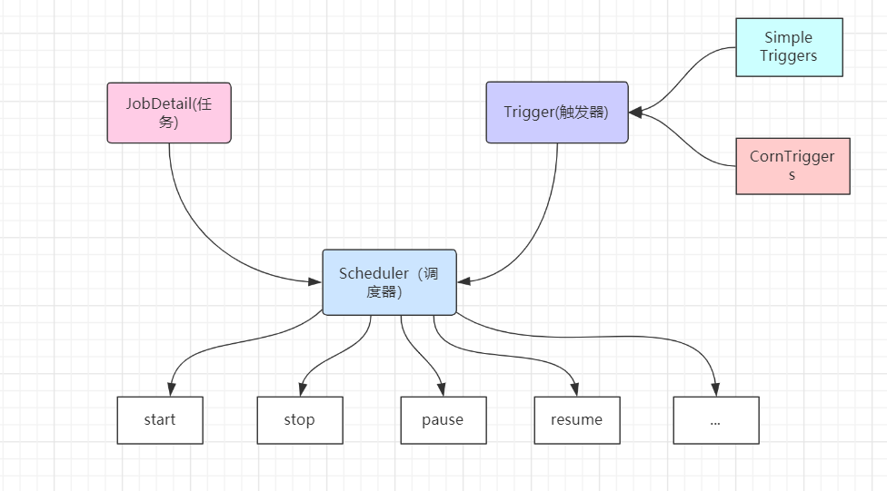

### Quartz任务调度

#### 一、Quartz概念

 Quartz是OpenSymphony开源组织在job scheduling领域又一个开源项目，它可以与J2EE与J2SE应用程序相结合也可以单独使用。

quartz是开源且具有丰富特性的“任务调度库”,能够集成 任何的java应用，小到独立的应用，大至电子商业系统。Quartz能够创建简单亦复杂的调度，以执行上十、上百、甚至上万的任务。任务job被定义为标准的java组件，能够执行任何你想要实现的功能。quartz调度框架包含许多企业级的特性，如JTA事务、集群 的支持。

#### 二、Quartz运行环境

```
Quartz可以运行嵌入在另一个独立应用程序
Quartz可以在应用程序服务器(servlet容器)内被实例化，并且参与事务
Quartz可以作为一个独立的程序运行(其自动的Java虚拟机内)，可以通过RMI使用
Quartz可以被实例化，作为独立的项目集群(负载平衡和故障转移功能)，用于作业的执行。
```


#### 三、设计模式

```
1、Builder模式
2、Factory模式
3、组件模式
4、链式编程
```

#### 四、Quartz

- 任务job

job 就是你想要实现的任务类，每一个job必须实现org.quartz.job接口，且只需要实现接口定义的execute()方法。

- 触发器Trigger   

 Trigger为你执行任务的触发器，比如你想每天定时3点发送一份统计邮件，Trigger将会设置3点进行执行该任务。

 Trigger主要包含两种SimpleTrigger和CronTrigger两种。

- 调度器Scheduler

 Scheduler为任务的调度器，它会将任务job触发器Trigger整合起来。负责基于Trigger设定的时间来执行Job。

#### 五、Quartz的体系结构





#### 六、Quartz 几个常用的API

- Scheduler用于与调度程序交互的程序接口

​       Scheduler调度程序-任务执行计划表，只有安排进执行计划的任务Job(通过scheduler.schedulerjon方法安排进 执行计划)，当它预先定义的执行时间到了的时候(任务触发器trigger)，该任务才会执行。

-  Job 我们预先定义的在未来时间能被调度程序执行的任务类，我们可以自己定义。

-  JobDetail使用JobDetail来定义定时任务的实例，JobDetail实例是通过JobBuilder类创建的。

-  JobDataMap 可以包含不限量（序列化的）数据对象，在job实例执行的时候，可以使用其中的数据；JobDataMap是Java Map接口的一个实现，额外增加了一些便于存取基本类型的数据的方法。

  

- Trigger触发器，Trigger对象是用来触发执行Job的。当调度一个job时，我们实例一个触发然后调整它的属性来满足job执行的条件。表明任务在什么时候执行。定义了一个已经被安排的任务将会在什么时候执行的时间条件。比如每两秒 就执行一次。

- JobBuilder-用于声明一个任务实例，也可以定义关于该任务的详情比如任务名、组名等，这个声明的实例将会作为一个实际执行的任务。

- TriggerBuiler触发器创建器，用于创建触发器trigger实例。

- JobListener、TriggerListener、SchedulerListener监听器，用于对组件的监听。 


#### 七、Quartz的使用

#####   1、Job和JobDetail介绍

- Job:工作任务调度的接口，任务类需要实现该接口。该接口中定义execute方法，类似JDK提供的的TimeTask类的run方法。在里面编写任务执行的业务逻辑。

- Job实例在Quartz中的生命周期：每次调度器执行Job时，它在调用execute方法前会创建一个新的Job实例，当调用完成后，关联的Job对象实例会被释放，释放的实例会被垃圾回收机制回收。

- JobDetail:JobDetail为Job实例提供了许多设置属性，以及JobDataMap成员变量属性，它用来存储特定Job实例的状态信息，调度器需要借助JobDetail对象来添加Job实例。

- JobDetail重要属性：name、group、JobClass、JobDataMap

   

#####   2、JobExecutionContext介绍

-  当Scheduler调用一个Job，就会将JobExecutionContext传递Job的execute方法；
- Job能通过JobExecutionContext对象访问到Quartz运行时候的环境以及Job本身的明细数据。

#####   3、JobDataMap介绍

​    使用map获取。

- 在进行任务调度时，JobDataMap存储在JobExecutionContext中，非常方便获取。
- JobDataMap可以用来装载任何可序列化的数据对象，当job实例对象被执行是这些参数会传递给它。
- JobDataMap实现了JDK的Map接口，并且添加了非常方便的方法用来存取基本数据类型。

```java

        JobDataMap jobDataMap = context.getJobDetail().getJobDataMap();
        String message = jobDataMap.getString("message");
        System.out.println("任务数据的参数值：" + message);

        JobDataMap triggerDataMap = context.getTrigger().getJobDataMap();
        String triggerDataMapString = triggerDataMap.getString("message");
        System.out.println("触发器数据的参数值：" + triggerDataMapString);
```


#####  4、有状态的Job和无状态的Job

  @persistJobDataAfterExecution注解的使用

 有状态的Job可以理解为多次Job调用期间可以持有一些状态信息，这些信息存储在JobDataMap中，而默认的无状态Job "每次调用时都会创建一个新的JobDataMap"。

(1)修改HelloSchedulerDemo。添加.usingJobDat("conut",0) ，表示计数器。

```
 JobDetail jobDetail = JobBuilder.newJob(HelloJob.class)
                .withIdentity("job1","group1")
                .usingJobData("message","打印日志")
                .usingJobData("count",0)
                .build();
```

(2) 修改HelloJob.java

添加count的setting和getting方法。

```java
private Integer count;
public void setCount(Integer count){
   this.count = count;
}
```

在public void execute(JobExecutionContext context)throws JobExecutionException的方法中添加。

```java
++count;
System.out.println("count数量："+ count);
context.getJobDetail().getJobDataMap.put("count",count);
```

HelloJob类没有添加 @persistJobDataAfterExecution注解,每次调用都会创建一个新的JobDataMap。不会累加；

HelloJob类添加 @persistJobDataAfterExecution注解,多次Job调用期间可以持有一些状态信息，即可以实现count的累加。


##### 5、CronTrigger触发器

如需要像日历那样按日程来触发任务，而不是像SimpleTrigger那样每隔特定的间隔时间触发，CronTriggers通常比SimpleTrigger更有用，因为它是基于日历的作业调度器。

使用CronTriggers，你可用指定诸如"每个周一中午"，或者"每个工作日的9:30"或者"从每个周一、周三、周五的上午9:00到上午10:00 之间每隔五分钟"这样日程安排来触发。甚至，像SimpleTrigger，CronTriggers也有一个startTime以指定日程从什么时候开始，也有一个(可选的)endTime亦指定何时日程不再继续。

（1）Cron Expression --Cron表达式

 Cron表达式被用来配置CronTrigger实例。Cron表达式是一个由7个子表达式组成的字符串。每个子表达式都描述了一个单独的日程细节。这些子表达式用空格分隔，分别表示：

```
1:Seconds秒
2:Minutes分钟
3:Hours 小时
4:Day-of-Month 月中的天
5:Month 月
6:Day-of-Week 周中的天
7:Year(optional field)年 (可选的域)
```

| 字段 | 是否必填 | 允许值                | 运行的特殊字符         |
| ---- | -------- | --------------------- | ---------------------- |
| 秒   | 是       | 0~59                  | ,  -  *  /             |
| 分   | 是       | 0~59                  | ,  -  *  /             |
| 小时 | 是       | 0~23                  | ,  -  *  /             |
| 日   | 是       | 0~31                  | ,  -  *  /  ?  L  W  C |
| 月   | 是       | 1-12或者JAN-DEC       | ,  -  *  /             |
| 周   | 是       | 1-7或者SUN-SAT        | ,  -  *  /  ？L  C  #  |
| 年   | 否       | 不填写，或者1970-2099 | ,  -  *  /             |

| 符号 | 含义                                                         |
| ---- | ------------------------------------------------------------ |
| *    | 代表所有可能的值。因此，"*"再Month中表示每个月，再Day-of-Month中表示每天，再Hours表示每小时 |
| -    | 表示指定范围。                                               |
| ,    | 表示列出枚举值。例如：在Minutes子表达式中，“5,20”表示在5分钟和20分钟触发。 |
| /    | 被用于指定增量。例如：在Minutes子表达式中，“0/15”表示从0分钟开始，每15分钟执行一次。"3/20"表示从第三分钟开始，每20分钟执行一次。和"3,23,43"（表示第3，23，43分钟触发）的含义一样。 |
| ?    | 用在Day-of-Month和Day-of-Week中，指“没有具体的值”。当两个子表达式其中一个被指定了值以后，为了避免冲突，需要将另外一个的值设为“?”。例如：想在每月20日触发调度，不管20号是星期几，只能用如下写法：0 0 0 20 * ?，其中最后以为只能用“?”，而不能用“*”。 |
| L    | 用在day-of-month和day-of-week字串中。它是单词“last”的缩写。它在两个子表达式中的含义是不同的。<br />在day-of-month中，“L”表示一个月的最后一天，一月31号，3月30号。<br/>在day-of-week中，“L”表示一个星期的最后一天，也就是“7”或者“SAT”<br/>如果“L”前有具体内容，它就有其他的含义了。例如：“6L”表示这个月的倒数第六天。“FRIL”表示这个月的最后一个星期五。<br/>注意：在使用“L”参数时，不要指定列表或者范围，这样会出现问题。 |
| W    | “Weekday”的缩写。只能用在day-of-month字段。用来描叙最接近指定天的工作日（周一到周五）。例如：在day-of-month字段用“15W”指“最接近这个月第15天的工作日”，即如果这个月第15天是周六，那么触发器将会在这个月第14天即周五触发；如果这个月第15天是周日，那么触发器将会在这个月第 16天即周一触发；如果这个月第15天是周二，那么就在触发器这天触发。注意一点：这个用法只会在当前月计算值，不会越过当前月。“W”字符仅能在 day-of-month指明一天，不能是一个范围或列表。也可以用“LW”来指定这个月的最后一个工作日，即最后一个星期五。 |
| #    | 只能用在day-of-week字段。用来指定这个月的第几个周几。例：在day-of-week字段用"6#3" or "FRI#3"指这个月第3个周五（6指周五，3指第3个）。如果指定的日期不存在，触发器就不会触发。 |
|      |                                                              |

例子：

```java
0 * * * * ? 每1分钟触发一次
0 0 * * * ? 每天每1小时触发一次
0 0 10 * * ? 每天10点触发一次
0 * 14 * * ? 在每天下午2点到下午2:59期间的每1分钟触发 
0 30 9 1 * ? 每月1号上午9点半
0 15 10 15 * ? 每月15日上午10:15触发

*/5 * * * * ? 每隔5秒执行一次
0 */1 * * * ? 每隔1分钟执行一次
0 0 5-15 * * ? 每天5-15点整点触发
0 0/3 * * * ? 每三分钟触发一次
0 0-5 14 * * ? 在每天下午2点到下午2:05期间的每1分钟触发 
0 0/5 14 * * ? 在每天下午2点到下午2:55期间的每5分钟触发
0 0/5 14,18 * * ? 在每天下午2点到2:55期间和下午6点到6:55期间的每5分钟触发
0 0/30 9-17 * * ? 朝九晚五工作时间内每半小时
0 0 10,14,16 * * ? 每天上午10点，下午2点，4点 

0 0 12 ? * WED 表示每个星期三中午12点
0 0 17 ? * TUES,THUR,SAT 每周二、四、六下午五点
0 10,44 14 ? 3 WED 每年三月的星期三的下午2:10和2:44触发 
0 15 10 ? * MON-FRI 周一至周五的上午10:15触发

0 0 23 L * ? 每月最后一天23点执行一次
0 15 10 L * ? 每月最后一日的上午10:15触发 
0 15 10 ? * 6L 每月的最后一个星期五上午10:15触发 

0 15 10 * * ? 2005 2005年的每天上午10:15触发 
0 15 10 ? * 6L 2002-2005 2002年至2005年的每月的最后一个星期五上午10:15触发 
0 15 10 ? * 6#3 每月的第三个星期五上午10:15触发
```


任务调度挂起，即暂停操作。

void standby() 


