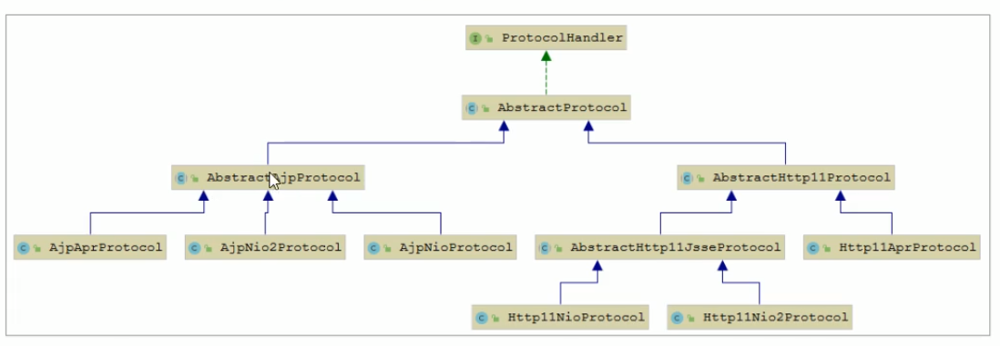

### Tomcat 核心原理解析

#### 1、tomcat基础

##### 1.1.web基础

```

 1)、软件架构
   a.C/S: 客户端/服务端
   b.B/S: 浏览器/服务端
 2)、资源分类
  a.静态资源：所有用户访问后，得到的结果都是一样的，成为静态资源，静态资源可以直接被浏览器解析
  b.动态资源：每个用户访问相同资源后，得到的结果可能不一样，成为动态资源，动态资源被访问后，需要先转换为静态资源，再返回给浏览器，通过浏览器解析
     如：servlet/jsp..
 3)、网络通信三要素
   a.Ip 电子设备(计算机)在网络中的唯一标识
   b.端口 应用程序在计算机中的唯一标识
   c.传输协议：规定了数据传输的规则。
      基础协议： 
         tcp:安全协议 ，三次握手，速度稍慢
         udp:不安全协议。速度快。
     
     
```

##### 1.2、常见的web服务器

######  1.2.1 概念

```
1)、服务器：安装了服务器软件的计算机
2)、服务器软件:接受用户的请求，处理请求，做出响应
3)、web服务器软件:接收用户的请求，处理请求，做出响应。
   web服务器在，可以不是web项目，让用户通过浏览器来访问这些项目
```

###### 1.2.2 常见的web服务器软件

```
1)、weblogic:oracle公司，大型javaEE服务器，支持所有的JAVAEE规范，收费
2)、websphere:IBM公司，大型javaEE服务器，支持所有的JAVAEE规范，收费
3)、JBoss:JBOSS公司，大型javaEE服务器，支持所有的JAVAEE规范，收费
4)、Tomcat:Apache基金，中小型的javaEE服务器，仅仅支持较少的JAVAEE规范 servlet/jsp。开源的，免费
```


##### 1.3、Tomcat源码

在Apache Tomcat官网中下载对应版本的tomcat源码

```
https://tomcat.apache.org/download-80.cgi
```

###### 1.3.1 运行tomcat 

```
1、将下载下来的zip源码包进行解压
2、进入解压目录，并创建一个目录，命名为homee,并将 conf,webapps目录移动到home目录中去
3、在当前目录下创建一个pom.xml文件，引入tomcat的依赖包

```


```
4、在源码中 java.org.apace.catalina.startup中 Bootstrap 类 中有main方法。

Tips: 任何java项目中 在进行运行的时候它的入口都是main方法，
```


```
然后配置Application
```


tomcat源码编译启动后，访问localhost:8080 出现 下面的错误，


 出现这个错误的原因是org.apache.catalina.startup.Bootstrap启动时没有加载JasperInitializer，从而无法编译JSP。解决办法是在tomcat的源码ContextConfig中 configureStart 函数中手动将jsp解析器初始化。

```
context.addServletContainerInitializer(new JasperInitializer(), null);
```


添加代码后再次启动tomcat ，可以看到访问localhost:8080 没有出错了。


#### 2、tomcat架构

##### 2.1 Http工作原理

HTTP协议是浏览器与服务器之间的数据传输协议。作为应用层协议，HTTP是基于TCP/IP协议来传递数据的(HTML文件，图片，查询结果等)，HTTP协议不涉及数据包(Packet)传输，主要规定了客户端和服务器之间的通信格式。


2.2、Http服务器请求处理

```
 有两种方式：
 1、http服务器直接调用具体业务类，它们是紧耦合的。
 2、http服务器不直接调用业务类，而是把请求交给容器来处理。容器通过servlet接口调用业务类。因此servlet接口和Servlet容器的出现，达到了Http服务器与"业务类解耦"的目的。而servlet接口和servlet容器这一套规范叫做Servlet规范。Tomcat按照Servlet规范的要求实现了Servlet容器，同时它们也具有Http服务器的功能。作为java程序员，如果我们要实现新的业务功能，只需要实现一个servlet,并把它注册到Tomcat（Servlet容器）中，剩下的事情就由Tomcat帮我们处理了。
```

2.3、Servlet容器工作流程

```
为了解耦，Http服务器不直接调用Servlet，而是把请求交给Servlet容器来处理，那么Servlet容器又是怎么工作的呢？

当客户请求某个资源时，Http服务器会用一个ServletRequest对象把客户的请求信息封装起来，然后调用Servlet容器的service方法，Servlet容器拿到请求后，根据请求的URL和Servlet的映射关系，找到相应的Servlet,如果Servlet还没有被加载，就用反射机制创建Servlet,并调用Servlet的init方法来初始化，接着调用Servlet的Service方法来处理请求，把ServletResponse对象返回给Http服务器，Htpp服务器会把响应发送给客户端。
```

2.4、Tomcat整体架构

```
1)、处理Socket链接，负责网络字节流与Request和Response对象的转化。
2)、加载和管理Servlet，以及具体处理Request请求。
 Tomcat设计了两个核心组件 连接器（Connector）和容器（Container）来分别做这两件事情。连接器负责对外交流，容器负责内部处理。
```


2.5、连接器 - CoyoTe

 2.5.1 架构介绍

   Coyote是Tomcat的连接器框架的名称，是Tomcat服务器提供的供客户端访问的外部接口。客户端通过Coyote与服务器建立链接、发送请求并接受响应。

```
Coyote 封装了底层的网络通信(Socket请求响应)，为Catalina容器提供了统一的接口，使Catalina容器与具体的请求协议及IO操作方式完全解耦。Coyote将Socket输入转换封装为Request对象，交由Catalina容器进行处理，处理请求完成后，Catalina通过Coyote提供的Response对象将结果写入输出流。

Coyote 作为独立的模块，只负责具体协议和IO的相关操作，与Servlet规范实现没有直接关系，因此即便是Request和Response对象也并未实现Servlet规范对应的接口，而是在Catalina中将他们进一步封装为ServletRequest和ServletResponse。
```


 2.5.2 IO模型与协议

 在Coyote中，Tomcat支持的多种I/O模型和应用层协议，具体包含那些IO模型和应用层协议呢?  如下所示

Tomcat支持的IO模型（自8.5/9.0 版本起，Tomcat移除了对 BIO的支持）：


| IO模型 | 描述                                                         |
| ------ | ------------------------------------------------------------ |
| NIO    | 非阻塞I/O，采用Java NIO类库实现。                            |
| NIO2   | 异步I/O，采用JDK7 最新的NIO2类库实现。                       |
| APR    | 采用Apache可移植运行库实现，是C/C++编写的本地库。如果选择该方案，需要单独按照APR库。 |

Tomcat 支持的应用层协议：

| 应用层协议 | 描述                                                         |
| ---------- | ------------------------------------------------------------ |
| HTTP/1.1   | 这是大部分web应用采用的访问协议                              |
| AJP        | 用于和Web服务器集成（如Apache）,以实现对静态资源的优化以及集群部署，当前支持AJP/1.3 |
| HTTP/2.0   | HTTP 2.0 大幅度的提升了Web性能。下一代HTTP协议，自8.5以及9.0版本之后支持。 |


在8.0之前，Tomcat默认采用的I/O方式为BIO, 之后改为NIO。 无论NIO、NIO2 还是APR, 在性能方面均优于以往的BIO。如果采用APR， 甚至可以达到Apache HTTP Server 的影响性能。

Tomcat 为了实现支持多种I/O模型和应用层协议，一个容器可能对接多个连接器，就好比一个房间有多个门。但是单独的连接器或者容器都不能对外提供服务，需要把它们组装起来才能工作，组装后这个整体叫作Service 组件。这里请你注意，Service本身没有做什么重要的事情，只是在连接器和容器外面多包了一层，把它们组装在一起。Tomcat内可能有多个Service,这样的设计也是出于灵活性的考虑。通过在Tomcat中配置多个Service, 可以实现通过不同的端口来访问同一台机器上部署的不同应用。


 2.5.3 连接器组件


   连接器中的各个组件的作用如下：

```
1）、EndPoint: Coyote通信端点，即通信监听的接口，是具体Socket接收和发送处理器，是对传输层的抽象，因此EndPoint用来实现TCP/IP协议的。
2）、Tomcat 并没有EndPoint接口，而是提供了一个抽象类AbstractEndpoint, 里面定义两个内部类：Acceptor和SocketProcessor。Acceptor用于监听Socket连接请求。SocketProcessor用于处理接收到的Socket请求，它实现Runnable接口，再Run方法里调用协议处理组件Processor进行处理。为了提供处理能力，SocketProcessor被提交到线程池来执行。而这个线程池叫作执行器（Executor）。
 processor: Coyote 协议处理接口，如果所EndPoint是用来实现TCP/IP协议的，那么Processor用来实现HTTP协议，processor接收来自EndPoint的Socket,读取字节流解析成Tomcat Request和Response对象，并通过Adapter将其提交到容器处理，Processor是对应用层协议的抽象。
 
3）、PortocolHandler: Coyote协议接口，通过Endpoint和Processor,实现针对具体协议的的处理能力。Tomcat按照协议和I/O提供了6个实现类：AjpNioPortocol, AjpAprPortocol, AjpNio2Portocol, AjpNioPortocol,
Http11Nio2Portocol, http11AprPortocol。我们再配置tomcat/conf/server.xml时，至少要指定具体的PortocolHandler, 当然也可以指定协议名称，如：HTTP/1.1 ,如果按照了APR，那么将使用Http11AprProtocol,
否则使用Http11NioPortocol。

4）、Adapter ： 由于协议不同，客户端发过来的请求信息也不尽相同，Tomcat定义了自己的Request类来"存放"这些请求信息。PortocolHandler接口负责解析请求并生成Tomcat Request类。但是这个Request对象不是标准的ServletRequest,也就意味着，不能用Tomcat Request作为参数来调用容器。Tomcat设计者的解决方案时引入CoyotoAdapter,这是适配器的经典运用，连接器调用CoyoteAdapter的Service方法，传入的是Tomcat Request对象，CoyoteAdapter负责将Tomcat Request转成 ServletRequest,再调用容器的 Service方法。
   
```


##### 2.6、容器-Catalina

  Tomcat 是一个由一系列可配置的组件构成的web容器，而Catalina是Tomcat的Servlet容器。

Catalina 是Servlet容器实现，包含之前讲到的所有的容器组件，

######  2.6.1、Catalina 地位


Tomcat 本质上就是一款Servlet容器，因此Catalina才是Tomcat的核心，其他模块都是为Catalina提供支撑的。比如：通过Coyote 模块提供连接通信，Jasper模块提供Jsp引擎，Naming提供JNDI服务，Juli提供日志服务。

 如下图：tomcat源码中结构和上图中一样。


###### 2.6.2、Catalina结构


如上图所示，Catalina负责管理Server,而Server表示整个服务器，Server下面有多个Service,每个服务都包含着多个连接器组件Connector（Coyote实现）和一个容器组件Container。在Tomcat启动的时候，会初始化一个Catalina的实例。

Catalina各个组件的职责：

| 组件      | 职责                                                         |
| --------- | ------------------------------------------------------------ |
| Catalina  | 负责解析Tomcat的配置文件，以此来创建服务器Server组件，并根据命令来对其进行管理 |
| Server    | 服务器表示整个Catalina，Servlet容器以及其它组件，负责组装并启动Servlet引擎，Tomcat连接器。Server通过实现Lifecycle接口，提供了一种优雅的启动和关闭整个系统的方式 |
| Service   | 服务是Server内部的组件，一个Server包含多个Service。它将若干个Connector组件绑定到一个Container（Engine）上 |
| Connector | 连接器，处理与客户端的通信，它负责接收客户请求，然后转给相关的容器处理，最后向客户返回响应结果 |
| Container | 容器，负责处理用户的servlet请求，并返回对象给web用户的模块   |

###### 2.6.3、Container结构

  Tomcat设计了4中容器，分别是Engine、Host、Context和Wrapper。这4种容器不是平行关系，而是父子关系。Tomcat通过一种分层架构，使得Servlet容器具有很好的灵活性。


各个组件的含义：

| 容器    | 描述                                                         |
| ------- | ------------------------------------------------------------ |
| Engine  | 表示整个Catalina的servlet引擎，用来管理多个虚拟站点，一个Service最多只能有一个Engine，但是一个引擎可包含多个Host |
| Host    | 代表一个虚拟机，或者说一个站点，可以给Tomcat配置多个虚拟主机地址，而一个虚拟机下包含多个Context |
| Context | 表示一个Web应用程序，一个Web应用可包含多个Wrapper。（一个Context包含多个Servlet） |
| Wrapper | 表示一个Servlet，Wrapper作为容器中 的最底层，不能包含子容器。 |


我们也可以通过Tomcat的Server.xml配置文件来加深对Tomcat容器的理解。Tomcat采用了组件化的设计，它的构成组件都是可配置的，其中最外层的Server,其他组件按照一定的格式要求配置在这个顶层容器中。

```xml
<Server>
  <Service>
      <Connector>
      </Connector>
      <Engine>
       <Host>
          <Context>
           </Context>
       </Host>
      </Engine>
  </Service>
</Server>
```


##### 2.7 Tomcat启动流程

######   2.7.1 流程


步骤：

```
1)启动 Tomcat, 需要调用bin/Startup.bat（在linux目录下，需要调用bin/startup.sh）,在Startup.bat脚本中，调用了catalina.bat。
2)、在catalina.bat脚本文件中，调用了BootStrap中的main方法。
3)、在BootStrap中main方法中调用了init方法，来创建Catalina 及初始化类加载。
4)、在BootStrap中main方法中调用了load方法，在其中又调用了Catalina的load方法。
5)、在Catalina的load方法中，需要进行一些初始化的工作，并需要构造Digester对象，用于解析XML。
6)、然后在调用后续组件的初始化操作。
```

加载Tomcat的配置文件，初始化容器组件，监听对应的端口号，准备接受客户端请求。

Tips: 所以的init方法都抽象的放到了 Lifecycle 接口中。

###### 2.7.2 源码解析

  2.7.2.1 Lifecycle

   由于所有的组件均存在初始化、启动、停止等生命周期方法，拥有生命周期的特性，所以Tomcat在设计的时候，基于生命周期管理抽象成了一个接口Lifecycle，而组件Server、Service、Container、Executor、Connector组件，都实现了一个生命周期的接口，从而具有了以下生命周期的核心方法：

```
1)、init()：初始化组件
1)、start()：启动组件
1)、sto()：停止化组件
1)、destory()：销毁组件
```


  2.7.2.2  各组件的默认实现

   上面我们提到的Server、Service、Engine、Host、Context都是接口，下图中罗列了这些接口的默认实现类。当前对于Endpoint组件来说，在Tomcat中没有对应的Endpoint接口，但是有一个抽象类AbstractEndpoint，其下有三个实现类：NioEndpoint、Nio2Endpoint、AprEndpoint，这三个实现类，分别对应于前面讲解链接器Coyote时，提到的链接器支持的三种IO模型：NIO，NIO2, APR，Tomcat8.5版本中，默认采用的是NioEndPoint。


ProtocolHandler:  Coyote协议接口，通过封装Endpoint和 Processor，实现针对具体协议的处理功能。Tomcat按照协议和IO提供了6各实现类。

```
AJP协议：
1)、AjpNioProtocol:采用NIO的IO模型。
2)、AjpNio2Protocol:采用NIO2的IO模型。
3)、AjpAprProtocol:采用APR的IO模型，需要依赖于APR库。
HTTP协议：
1)、Http11NioProtocol: 采用NIO的IO模型，默认使用的协议（如果服务器没有安装APR）。
2)、Http11Nio2Protocol: 采用NIO2的IO模型。
3)、Http11NioProtocol: 采用APR的IO模型，需要依赖于APR库。
```



  2.7.2.3 源码入口

```
目录：org.apache.catalina.startup

MainClass:BootStrap ----->main(String[] args)
```

```java
 /**
     * Main method and entry point when starting Tomcat via the provided
     * scripts.
     *
     * @param args Command line arguments to be processed
     */
    public static void main(String args[]) {
        System.out.println("*********************************>> BootStrap main start.......");
        synchronized (daemonLock) {
            if (daemon == null) {
                // Don't set daemon until init() has completed
                Bootstrap bootstrap = new Bootstrap();
                try {
                    bootstrap.init();
                } catch (Throwable t) {
                    handleThrowable(t);
                    t.printStackTrace();
                    return;
                }
                daemon = bootstrap;
            } else {
                // When running as a service the call to stop will be on a new
                // thread so make sure the correct class loader is used to
                // prevent a range of class not found exceptions.
                Thread.currentThread().setContextClassLoader(daemon.catalinaLoader);
            }
        }

        try {
            String command = "start";
            if (args.length > 0) {
                command = args[args.length - 1];
            }

            if (command.equals("startd")) {
                args[args.length - 1] = "start";
                daemon.load(args);
                daemon.start();
            } else if (command.equals("stopd")) {
                args[args.length - 1] = "stop";
                daemon.stop();
            } else if (command.equals("start")) {
                daemon.setAwait(true);
                daemon.load(args);
                daemon.start();
                if (null == daemon.getServer()) {
                    System.exit(1);
                }
            } else if (command.equals("stop")) {
                daemon.stopServer(args);
            } else if (command.equals("configtest")) {
                daemon.load(args);
                if (null == daemon.getServer()) {
                    System.exit(1);
                }
                System.exit(0);
            } else {
                log.warn("Bootstrap: command \"" + command + "\" does not exist.");
            }
        } catch (Throwable t) {
            // Unwrap the Exception for clearer error reporting
            if (t instanceof InvocationTargetException &&
                    t.getCause() != null) {
                t = t.getCause();
            }
            handleThrowable(t);
            t.printStackTrace();
            System.exit(1);
        }
    }
```

  2.7.3 总结

从启动流程图中以及源码中，我们可以看出Tomcat的启动过程非常标准化，统一按照生命周期管理接口Lifecycle的定义进行启动。首先调用init()方法进行组件的逐级初始化操作，然后再调用start()方法进行启动。

每一级的组件除了完成自身的处理外，还有负责调用子组件响应的生命周期管理方法，组件与组件之间是耦合的，因为我们可以很容易通过配置文件进行修改和替换。

##### 2.8 Tomcat请求处理流程

###### 2.8.1 请求流程


注意这里配置的tomcat ，然后url地址对应的 项目路径和 上面这个项目输出路径要一致。servlet_demo_war_exploded


我们到这个项目的输出地址去将这个文件 拷贝到tomcat的webapps中去 让将文件 改为servlet_demo。那么这个时候就可以直接去启动Tomcat中bin目录中start.bat 文件，让后访问 可以看到这个请求已经打印出来了。

```
http://localhost:8080/servlet_demo/te/findAll
```


那么 这个Tomcat是怎么来找到这个Servlet的呢？

设计了这么多层次的容器，Tomcat是怎么确定每一个请求应该由哪个Wrapper容器的Servlet来处理的呢？答案是，Tomcat是用Mapper组件来完成这个任务的。

Mapper组件的功能是将用户请求的URL定位到一个Servlet,它的工作原理是：Mapper组件里保存了Web应用的配置信息，其实就是容器组件与访问路径的映射关系，比如Host容器里配置的域名，Context容器里的Web应用路径，以及Wrapper容器里Servlet映射的路径，你可以想象这些配置信息就是一个多层次的 Map>

当一个请求到来是，Mapper组件通过解析请求URL里的域名和路径，再到自己保存的Map里去查找，就能定位到一个Servlet，请注意，一个请求URL最后只会定位到一个Wrapper容器，也就是一个Servlet。


从Tomcat架构层面来分析Tomcat请求流程


步骤如下：

```
1、Connector组件Endpoint中的Acceptor监听客户端套字节 连接并接收Socket。
2、将连接交给线程池Executor处理，开始执行请求响应任务。
3、Processor组件读取消息报文，解析请求行、请求体、请求头，封装成Request对象。
4、Mapper组件根据请求行的URL值和请求头的Host值匹配由哪个Host容器、Context容器、Wrapper容器处理请求。
5、CoyoteAdaptor组件负责将Connector组件和Engine容器关联起来，把生成的Request对象和响应对象Response传递到Engine容器中，调用Pipeline。
6、Engine容器的管道开始处理，管道中包含若干给Valve，每个Value负责部分处理逻辑。执行完Valve后会执行基础的Valve--StandardEnginValve，负责调用Host容器Pipeline。
7、Host容器的管道开始处理，流程类似，最后执行Context容器的Pipeline。
8、Context容器的管道开始处理，流程类似，最后执行Wrapper容器的Pipeline。
9、Wrapper容器的管道开始处理，流程类型，最后执行Wrapper容器对应的Servlet对象的处理方法。
```


从前面的Tomcat的整体架构中，可以知道Tomcat中的个组件各司其职，组件之间松耦合，确保了整体架构的可伸缩性和可扩展性，那么再组件内部，如何增强组件的灵活性和拓展性？在Tomcat中，每个Container组件采用责任链模式来完成具体的请求处理。

在Tomcat中定义了Pipeline和Valve两个接口，Pipeline用于构建责任链，后者代表责任链上的每个处理器。Pipeline中维护了一个基础的Valve，它始终位于Pipeline的末端(最后执行)，封装了具体的请求处理和输出响应的过程。当然，我们也可以调用addValue()方法，为Pipeline添加其他的Valve，后添加的Valve位于基础的Valve之前，并按照添加顺序执行。Pipiline通过获得首个Valve来启动整合链条的执行。


示例：当我们在浏览器中请求下面的地址时，这个请求过程如下面图

```
http://localhost:8080/servlet_demo/te/findAll
```

在启动tomcat源码后，相应的Server、Service 、Engine、Connector、ProtocolHander已经初始化和启动。并且底层通过Socket来监听端口。

那么在请求地址时候，首先进入NioEndpoint中去，这里会起接收这个去请求。

第一步:


第二步：调用NioEndpoint中doRun()方法，这个方法调用的process是抽象类AbstractProtocol中 内部类ConnectionHandler的方法


第三步：调用processor.process()


第四步：调用AbstractProcessorLight.process()方法，这里会调用service方法


第五步：调用的是Http11Processor中的service方法。


这个方法中会将调用适配器Adapter中的service


第六步：调用适配器CoyoteAdapter.service() ，这个适配器会将这个请求交给容器来处理。就是容器中的Engine来进行处理。


第七步：容器中的Engine组件来处理这请求


第八步：调用StandardHostValve中的invoke方法。这里会去拿去到这个请求的Context ，也就是web应用。


第九步：调用StandardWrapperValve中的invoke方法 ,在这一步中终于看到了Servlet, 这个Wrapper就是我们在自己写的webServletRequest类。


这里会起调用Wrapper的allocate()方法。所有这个Servlet赋值后 就是webServletRequest。


这里将Servlet封装到一个对象里面。这里就构造出了一个过滤器链。在过滤器链构建好了之后就要一个个的执行这个链。


执行ApplicationFilterChain中的doFilter


在这个ApplicationFilterChain类中，使用Servlet调用service方法。而这个servlet 就是我们自己定义的WebServletRequest。但是这个里面没有service方法。那么就会去调用父类的这个方法。


调用父类HttpServlet中的service方法中，会去调用一个重载的方法。


调用这个类HttpServlet中重载service方法，这里会去判断这个请求方式是什么，然后进入不同的判断。我们请求方式是get方式，所有这里调用的是doGet方法


可以看到日志打印出来的是doGet方法。


注意：使用Google浏览器请求这个地址会去请求两次，而使用Firefox不会出现这种情况。


#### 3、jasper

#####  3.1 Jasper介绍

  对于基于JSP的web应用来说，我们可以直接在JSP页面编写java代码，添加第三方的标签库，以及使用EL表达式，但是无论经过何种形式的处理，最终输出到客户端的都是标准的HTML页面(包括JS,CSS...)，并不包含任何相关的语法。也就是说，我们可以把jsp看做一致运行在服务端的脚本。那么服务器是如何将jsp页面转换为HTML页面的呢？

  Japser模块是Tomcat的JSP核心引擎，我们知道JSP本质上是一个Servlet。Tomcat使用Jasper对JSP语法进行解析，生成Servlet并生成Class字节码，用户在进行访问JSP时，会访问Servlet，最终将访问的结果直接响应在浏览器端。另外，在运行的时候，Jasper还会检测JSP文件是否修改，如果修改，则会重新编译JSP文件。

#####  3.2 JSP编译方式

 3.2.1 运行时编译

Tomcat并不会在启动web应用的时候自动编译JSP文件，而是在客户端第一次请求时，在编译需要访问的Jsp文件。

3.2.1.1 编译过程

 Tomcat在默认的web.xml中配置了一个org.apache.jasper.servlet.JspServlet，用于处理所有的.jsp或.jspx结尾的请求，该Servlet实现即是运行时编译的入口。

```
  <servlet>
       <servlet-name>jsp</servlet-name>
       <servlet-class>org.apache.jasper.servlet.JspServlet</servlet-class>
       <init-param>
          <param-name>fork</param-name>
          <param-value>false</param-value>
       </init-param>
        <init-param>
          <param-name>xpowereBy</param-name>
          <param-value>false</param-value>
       </init-param>
       <load-on-startup>3</load-on-startup>
   </servlet>
    
   <servlet-mapping>
       <servlet-name>jsp</servlet-name>
       <url-pattern>*.jsp</url-pattern>
       <url-pattern>*.jspx</url-pattern>
   </servlet-mapping> 
    
```


3.2.2 编译结果

```
1)、如果在tomcat/conf/web.xml中配置了参数scratchdir,则jsp编译后的结果，就会存在该目录下。
   <init-param>
          <param-name>scratchdir</param-name>
          <param-value>D:/tmp/jsp</param-value>
       </init-param>
2)、如果没有配置该选项，则会将编译后的结果，存储在Tomcat安装目录下的 work/Catalina(Engine名称)/localhost(Host名称)/Context名称。假设项目名称为jsp_demo-01,默认的目录为：work/Catalina/localhost/jsp_demo_01。
3)、如果使用的是IDEA开发工具集成Tomcat访问web工程的jsp,编译后的结果，存放在：
c:\user\Administrator\.IntelliJIdea2019.1\sytem\tomcat\_project_tomcat\work\Catalina\localhost\jsp_demo_01_war_exploded\org\jsp
```

3.2.3 预编译

 除了运行时编译，我们还可以直接在web应用启动时，一次性将Web应用中的所有的JSP页面一次性编译完成。在这种情况下，Web应用运行过程中，便可以不必再进行实时编译，而是直接调用JSP页面对应的Servlet完成请求处理，从而提升系统性能。

Tomcat提供了一个Shell程序JspC,用于支持jsp预编译，而且在Tomcat的安装目录下提供了一个catalina-task.xml文件声明了Tomcat支持的Ant任务，因此，我们很容易使用Ant来执行Jsp预编译。（要想使用这种方式，必须得确保在此之前已经下载并安装了Apache Ant）。

#####  3.3 JSP编译原理


#### 4、tomcat 服务器配置

Tomcat服务器的配置主要集中于tomcat/conf 下的catalina.policy、catalina.properties、context.xml、server.xml、tomcat-user.xml、web.xml文件。

##### 4.1 server.xml

server.xml 是tomcat服务器的核心配置文件，包含了Tomcat的Servlet容器(Catalina)的所有配置。由于配置的属性特别。这里主要讲解一部分重要配置

###### 4.1.1 Server

Server 是Server.xml的跟元素，用于创建一个Server实例，默认使用的实现类是 org.apache.catalina.core.StandardServer。

```
<Server port="8005" shutdown="SHUTDOWN">
  ...
</Server>
```

Server 内嵌的子元素为Listener、GlobalNamingResources、Service。默认配置的5个Listener的含义：

```shell
   <!--用于以日志形式输出服务器、操作系统、JVM的版本信息-->
  <Listener className="org.apache.catalina.startup.VersionLoggerListener" />
 
 <!--用于加载(服务器启动)和销毁（服务器停止）APR。如果找不到APR库，则会输出日志,并不影响Tomcat启动-->
  <Listener className="org.apache.catalina.core.AprLifecycleListener" SSLEngine="on" />
 <!--用于避免JRE内存泄漏问题-->
  <Listener className="org.apache.catalina.core.JreMemoryLeakPreventionListener" />
 <!--用于加载(服务器启动)和销毁（服务器停止）全局命名服务 -->
 <Listener className="org.apache.catalina.mbeans.GlobalResourcesLifecycleListener" />
 <!--用于在Context停止时重建Executor池中的线程，以避免ThreadLocal相关的内存泄露-->
 <Listener className="org.apache.catalina.core.ThreadLocalLeakPreventionListener" />
```

GlobalNamingResources 中定义了全局命名服务:

```shell
<GlobalNamingResources>
    <!-- Editable user database that can also be used by
         UserDatabaseRealm to authenticate users
    -->
    <Resource name="UserDatabase" auth="Container"
              type="org.apache.catalina.UserDatabase"
              description="User database that can be updated and saved"
              factory="org.apache.catalina.users.MemoryUserDatabaseFactory"
              pathname="conf/tomcat-users.xml" />
  </GlobalNamingResources>
```

###### 4.1.2 Service

 该元素用于创建Service实例，默认使用org.apache.catalina.core.StandardService。默认情况下，Tomcat仅指定了Service的名称，值为"Catalina"。Service可以内嵌的元素为：Listener、Executor、Connector、Engine, 其中：Listener用于为Service添加生命周期监听器，Executor用于配置Service共享线程池，Connector用于配置Service包含的链接器，Engine用于配置Service中链接器对应的Servlet容器引擎。

```shell
  <Service name="Catalina">
  </Service>
```

一个Server服务器，可以包含多个Service服务。

###### 4.1.3 Executor

默认情况下，Service并未添加共享线程池配置。如果我们想添加一个线程池，可以在<Service>下添加如下配置：

```shell
<Executor name="tomcatThreadPool"
        namePrefix="catalina-exec-"
        maxThreads="1000"
        minSpareThreads="100"
        maxIdleTime="60000"
        maxQueueSize="Integer.MAX_VALUE"
        prestartminSpareThreads="false"
        threadpriority="5"
        className="org.apache.catalina.core.StandardThreadExecutor"/>
```

| 属性                    | 含义                                                         |
| ----------------------- | ------------------------------------------------------------ |
| name                    | 线程池名称，用于Connector中指定                              |
| namePrefix              | 所创建的每个线程的名称前缀，一个单独的线程名为namePrefix+threadNumber。 |
| maxThreads              | 池中最大线程数。                                             |
| minSpareThreads         | 活跃线程数，也就是核心池线程数，这些线程不好被销毁，会一直存在。 |
| maxIdleTime             | 线程空闲时间，超过改时间后，空闲线程会被销毁，默认值为6000，单位毫秒。 |
| maxQueueSize            | 在被执行前最大线程排队数目，默为int的最大值，也就是广义的无限。除非特情况，这个值不需要更改，否则会有请求不好被处理的请求发生。 |
| prestartminSpareThreads | 启动线程池时是否启动minSpareThreads部分线程，默认值为false,即不启动。 |
| threadpriority          | 线程池线程优先级，默认值为5，值从1到10。                     |
| className               | 线程池实现类，未指定情况下，默认实现StandardThreadExecutor   |

###### 4.1.4 Connector

Connector 用于创建链接器实例。默认情况下，server.xml配置了两个链接起，一个支持Http协议，一个支持AJP协议。因此大多数情况下，我们并不需要新增链接器配置，只是根据需要对已有链接器进行优化。

```
 <Connector port="8080" protocol="HTTP/1.1" connectionTimeout="20000" redirectPort="8443" />
 <Connector protocol="AJP/1.3" port="8009" redirectPort="8443" />
```

属性说明：

```shell
1)、port:端口号，Connector 用于创建服务端Socket并进行监听，以等待客户端请求连接。如果该属性为0，Tomcat将会随机选择一个可用的端口号给当前Connector使用。
2)、protocol:当前 Connector支持的访问协议。默认为Http/1.1，并采用自动切换机制选择一个基于JAVA NIO的连接器或者基于本地APR的连接器(根据本地是否含有Tomcat的本地判定库)。
 如果不希望采用上述自动切换的机制，而是明确指定协议，可以使用以下值。
 Http协议：
  org.apache.coyote.http11.http11NioProtocol, 非阻塞式Java NIO连接器
  org.apache.coyote.http11.http11Nio2Protocol, 非阻塞式Java NIO2连接器
  org.apache.coyote.http11.http11AprProtocol, Apr连接器
 AJP协议：
  org.apache.coyote.ajp.AjpNioProtocol, 非阻塞式Java NIO连接器
  org.apache.coyote.ajp.AjpNio2Protocol, 非阻塞式Java NIO2连接器
  org.apache.coyote.ajp.AjpAprProtocol, Apr连接器 

3)、connectionTimeout: Connector接收连接后的等待超时时间，单位为毫秒。-1 表示不超时。
4)、redirectPort:当前Connector不支持SSL请求，接收到了一个请求，并且也符合security-constraint约束，需要SSL传输，Catalina自动将请求重定向到指定的端口。
5)、executor: 指定共享线程池的名称，也可以通过maxThreads、minSpareThreads等属性配置内部线程池。
6)、URLEncoding: 用于指定编码URL的字符编码,Tomcat8.x默认的编码为UTF-8, Tomcat7.x版本默认为ISO-8859-1。
```

###### 4.1.5 Engine

Engine 作为Servlet引擎的顶级元素，内部可以嵌入：cluster、Listener、Realm、Valve和Host。

```shell
 <Engine name="Catalina" defaultHost="localhost">
 </Engine>
```

###### 4.1.6 Host

Host元素用于配置一个虚拟机，它支持以下嵌入元素：Alias、Cluster、Listener、Valve、Realm、Context。如果在Engine下配置Realm,那么配置将在当前Engine下的所有Host中共享。同样，如果在Host中配置Realm，则在当前Host下的所有Context中共享。Context中的Realm优先级> Host的Realm优先级>Engine中的Realm优先级。

```shell
 <Host name="localhost"  appBase="webapps"
            unpackWARs="true" autoDeploy="true">
 </Host>
```

属性说明：

```
1)、name:当前Host通用的网络名称，必须与DNS服务器的注册信息一致。Engine中包含的Host必须存在一个名称与Engine的defaultHost设置一致。
2)、appBase:当前Host的应用基础目录，当前Host上部署的Web应用均在该目录下(可以是绝对目录，相对路径)。默认为webapps.
3)、unpackWARs：设置为true，Host在启动时会将appBase目录下war包解压为目录。设置为false，Host将直接从war文件启动。
4)、autoDeploy：控制tomcat是否在运行时定期检测并自动部署新增或变更web应用。
```

打war包，然后再点击工具栏中build，build Artifacts


4.1.7 Context

Context用于配置一个Web应用，默认的配置如下：

```
<Context docBase="myApp" path="/myApp"></Context>
```

属性描述：

```
1)docBase:Web应用目录或者War包的部署路径。可以是绝对路径，也可以是相对于Host appBase的相对路径。
2)path:Web应用的Context路径。如果我们Host名为localhost，则该web应用访问的根路径为：http://localhost:8080/myApp

它支持的内嵌元素为：CookieProcessor,Loader,Manager,Realm,Resources,WatchedResource,JarScanner,Valve。
```


#### 5、web应用配置

web.xml是web应用的描述文件，它支持的元素属性来自于Servlet规范定义。在Tomcat中，web应用的描述信息包括tomcat/conf/web.xml中默认配置以及web应用 WEB-INF/web.xml下的定制配置。

##### 5.1 context-param 标签

```shell
 <context-param>
        <param-name>project-servlet</param-name>
        <param-value>ces</param-value>
    </context-param>
```

在webServletRequest中获取初始化数据


##### 5.2 session-config标签

```shell
<session-config>
        <session-timeout>30</session-timeout>
        <cookie-config>
            <name>JESSIONID</name>
            <domain>localhost</domain>
            <path>/</path>
            <comment>Session Cookie</comment>
            <http-only>true</http-only>
            <secure>false</secure>
            <max-age>3600</max-age>
        </cookie-config>
        <tracking-mode>COOKIE</tracking-mode>
    </session-config>
```


5.3 Servlet配置

Servlet的配置主要是两部分，servlet和servlet-mapping:

```xml
 <servlet>
       <servlet-name>webServletRequest</servlet-name>
       <servlet-class>com.learn.web.te.WebServletRequest</servlet-class>
       <init-param>
           <param-name>fileName</param-name>
           <param-value>init.conf</param-value>
       </init-param>
       <load-on-startup>1</load-on-startup>
       <enabled>true</enabled>
   </servlet>
    
   <servlet-mapping>
       <servlet-name>webServletRequest</servlet-name>
       <url-pattern>/te/findAll</url-pattern>
   </servlet-mapping> 
```

配置说明：

```
1)、servlet-name:指定servlet的名称，该属性在web.xml中唯一。
2)、servlet-class:用于指定servlet类名。
3)、init-param:用于指定servlet的初始化参数，在应用中可以通过HttpServlet.getInitParameter获取。
4)、load-on-startup:用于控制在web应用启动时，servlet的加载顺序。值小于0，web应用启动时，不加载该servlet.
5)、enabled:true,false。若为false,表示servlet不处理任何请求。
```

##### 5.4 Listener配置

Listener 用于监听servlet中的事件，例如context、request、session对象的创建、修改、删除，并触发响应事件。Listener是观察者模式的实现，在Servlet中主要用于对context、request、session对象的生命周期进行监控。在servlet2.5规范中共定义了8给Listener。在启动时，ServletContextListener的执行顺序与web.xml中的配置顺序一致，停止时执行顺序相反。

```
<listener>
  <listener-class>org.springframework.web.context.contextLoaderListener</listener-class>
</listener >
```

##### 5.5 Filter配置

filter用于配置web应用过滤器，用来过滤资源请求以及响应。经常用于认证，日志，加密，数据转换等操作。

##### 5.6 欢迎页面

welcome-file-list 用于指定web应用的欢迎文件列表。

##### 5.7 错误页面配置

error-page 用于配置web应用访问异常时定向到的页面，支持Http响应码和异常类两种形式。


#### 6、tomcat管理配置

6.1 host-manager

Tomcat启动之后，可以通过http://localhost:8080/host-manager/html访问该web应用。host-manager默认添加访问权限控制，当打开网址时，需要输入用户名和密码(conf/tomcat-user.xml中配置)。所以要想访问该页面，需要在conf/tomcat-user.xml中配置，并分配对应的角色：

```
1)、admin-gui:用于控制页面访问权限
2)、amdin-script:用于控制以简单文本的形式进行访问
```

6.2 manager

  manager的访问地址为 http://localhost:8080/manager，同样，manager也添加了页面访问控制，因此我们需要为登录用户分配角色为

```
<role rolename="manager-gui">
<role rolename="manager-script">
<role username="test" password="test" roles="admin-script,admin-gui,manager-gui,manager-script" rolename="manager-script">
```


进入hostmanager后的页面


服务状态


#### 7、jvm配置

7.2 jvm配置选项

 windows 平台(catalina.bat):

```shell
set JAVA_OPTS=-server -Xms2048m -Xmx2048m -XX:MetaspaceSize=265m -XX:MaxMetaspaceSize=256m -XX:SurvivorRatio=8
```

linux平台(catalina.sh):

```shell
JAVA_OPTS="server -Xms1024m -Xmx2048m -XX:MetaspaceSize=265m -XX:MaxMetaspaceSize=512m -XX:SurvivorRatio=8"
```

| 序号 | 参数                                                         | 含义                                                         |
| ---- | ------------------------------------------------------------ | ------------------------------------------------------------ |
| 1    | -Xms                                                         | 堆内存的初始大小                                             |
| 2    | -Xmx                                                         | 堆内存的最大大小                                             |
| 3    | -Xmn                                                         | 新生代的内存大小，官方建议是整个堆得3/8                      |
| 4    | -XX:MetaspaceSize                                            | 元空间内存初大小，在JDK1.8版本之前配置为 -XX:PermSize（永久代） |
| 5    | -XX:MaxMetaspaceSize                                         | 元空间内存最大大小，在JDK1.8版本之前配置为 -XX:MaxPermSize（永久代） |
| 6    | -XX:InitialCodeCacheSize  <br /> - <br />XX:ReservedCodeCacheeSize | 代码缓存区大小                                               |
| 7    | -XX:NewRatio                                                 | 设置新生代和老年代的相对大小比例。这种方式的优点是新生代大小会随着整个堆大小动态扩展。如-XX:NewRatio=3 指定老年代/新生代为3/1。老年代占堆大小的3/4，新生代占用1/4。 |
| 8    | -XX:SurvivorRation                                           | 指定伊甸园区(Eden)与幸存区大小比例。如-XX:SurvivorRation=10 表示伊甸园区(Eden)是幸存区To大小的10倍（也是幸存区From的10倍）。所以伊甸园（Eden）占新生代大小的10/12，幸存区From和幸存区To每个占新生代的1/12。注意，两个幸存区永远是一样大的。 |

测试设置jvm参数


测试结果：这个Eden 区和 幸存区比值是8:1:1  这里 Eden占的比例是 (546.50+68+68)=682.5  , （682.5/10）*8 =  546 。 所以 Eden所占的比例是8.


#### 8、tomcat集群

##### 8.1 简介

   由于单台Tomcat的承载能力是有限的，当我们的业务系统用户比较大，请求压力比较大时，单台Tomcat是扛不住的，这个时候，就需要搭建Tomcat的集群，而目前比较流行的做法就是通过Nginx来实现Tomcat集群的负载均衡。

##### 8.2 环境准备

###### 8.2.1 准备Tomcat

在服务器上，安装两台tomcat,然后分别改Tomcat服务的端口号：

```
8005------>8015------>8025
8080------>8888------>9999
8009------>8019------>8029
```

###### 8.2.1 安装配置Nginx

安装Nginx,然后配置Nginx，修改nginx.conf:

```
	 upstream serverpool{
	     server localhost:8888;
         server localhost:9999;		 
	 }
	
	 server {
	    listen       99;
        server_name  localhost;
		# 这里拦截的 是根目录
		location /{
		# 反向代理路径，这个模块是upstream ,所有要配置upstream
		   proxy_pass http://serverpool/;
		}
	 }
```

那么在访问的时候，就访问localhost:99就会访问到tomcat集群。将其请求通过Nginx 分步在集群上

##### 8.3 负载均衡策略

1）轮询

最基本的配置方法，它是upstream模块默认的负载均衡默认策略。每个请求会按时间顺序逐一分配到不同的后端服务器。

```
 upstream serverpool{
	     server localhost:8888;
         server localhost:9999;		 
	 }
```

参数说明：

| 参数         | 描述                                                         |
| ------------ | ------------------------------------------------------------ |
| fail_timeout | 与max_fails结合使用                                          |
| max_fails    | 设置在fail_timeout参数设置的时间内最大失败次数，如果在这个时间内，所有针对该服务的请求都失败了，那么认为该服务器会被任务是停机了 |
| fail_time    | 服务器会被任务停机的时间长度，默认为10s                      |
| backup       | 标记该服务器为备用服务器。当主服务器停止时，请求会被发生送到它这里 |
| down         | 标记服务器永久停机了                                         |
|              |                                                              |

2、weight权重

权重方式，在轮询策略的基础上指定轮询的几率。

```
 upstream serverpool{
	     server localhost:8888 wegiht=2;
         server localhost:9999 wegiht=1; 
	 }
```

weight参数用于指定轮询几率，wegiht的默认值为1；wegiht的数值与访问比率成正比，比如133服务器的服务被访问的几率为137服务器的三倍。

此策略比较适合服务器的硬件配置差别比较大的情况。

3）ip_hash

指定负载均衡器按照基于客户端IP的分配方式，这个方法确保了相同的客户端的请求一直发送到相同的服务器，以保证session会话。这样每个访客都固定访问一个后端服务器，可以解决session不能跨服务器的问题。

```
upstream serverpool{
    ip_hash;
	server 172.16.0.15:8888 wegiht=2;
    server 172.16.0.18:9999 wegiht=1; 
 }
```

##### 8.4 Session共享方案

在Tomcat集群中，如果应用需要用户进行登录，那么这个时候，用于tomcat做了负载均衡，则用户登录并访问应用系统时，就会出现问题。


解决上述问题，有以下几种方案：

###### 8.4.1 ip_hash策略

一个用户发起的请求，只会请求到tomcat1上进行操作，另一个用户发起的请求只会在tomcat2上进行操作，那么这个时候，同一个用户发起的请求，都会通过nginx的ip_hash策略，将请求转发到其中的一台Tomcat上。


###### 8.4.2 Session复制

在servlet_demo01工程中，制作session.jsp页面，分别将工程存放在两台tomcat的webapps/目录下

这个方案适用于比较小的集群环境(节点数不超过4个)，如果集群的节点数比较多的话，通过这种广播的形式来完成session的复制，会销毁大量的网络带宽，影响服务的性能。

###### 8.4.3 sso-单点登录

单点登录(single sign on)，简称为sso，是目前比较流行的企业业务整合的解决方案之一。sso的定义在多个应用系统中，用户只需要登录一次就可以访问所有相互信任的应用系统，也是用来解决集群环境session共享的方案之一。


#### 9、tomcat安全

##### 9.1配置安全

1）删除webapps目录下的所有文件，禁用tomcat管理界面；

2）注释或删除tomcat-users.xml文件内的所有用户权限；

3）更改关闭tomcat指令或禁用；

​    tomcat的server.xml中定义了可以直接管理Tomcat实例的管理端口（默认8005）。可以通过telnet连接上该端口之后，输入SHUTDOWN（此为默认 关闭指令）即可关闭Tomcat实例（注意，此时虽然实列关闭了，但是进程还是存在的）。由于默认关闭Tomcat的端口和指令都很简单，默认端口为8005，指令为SHUTDOWN。

方案一：

```
更改端口号和指令：
<Server port="8456" shutdown="text">
```

方案二：

```
禁用8005端口：
<Server port="-1" shutdown="SHUTDOWN">
```

4) 定义错误页面

在webapps/Root目录下定义错误页面 404.html, 500.html


##### 9.2应用安全

在大部分的web应用中，特别是一些后台应用系统，都会实现自己的安全管理模块（权限模块），用于控制应用系统的安全访问，基本包含两个部分：认证（登录/单点登录）和授权（功能权限、数据权限）两个部分。对于当前的业务系统，可以自己做一套适用于自己业务系统的权限模块，也有很多的应用系统直接使用一些功能完善的安全框架，将其集成到为我们的web应用中，如果：springSecurity、Apache Shiro等。

##### 9.3传输安全

###### 9.3.1HTTPS介绍

HTTPS的全程是超文本传输安全协议(Hypertext Transfer Protocol Secure)，是一种网络安全传输协议。在HTTP的基础上加入SSL/TLS来进行数据加密，保护交换数据不被泄露、窃取。

SSL和TLS是用于网络通信安全的加密协议，它允许客户端和服务器之间通过安全连接通信。SSL协议的3个特性：

1）保密：通过SSL链接传输的数据时加密的。

2）鉴别：通信双方的身份鉴别，通常时可选的，单知识有一方需要验证。

3）完整性：传输数据的完整性检查。

从性能角度考虑，加解密是一项计算昂贵的处理，因为尽量不要将整个web应用采用SSL链接，实际部署过程中，选择有必要进行安全加密的页面(存在敏感信息传输的页面)采用SSL通信。


HTTPS和HTTP的区别主要区别有以下几点：

1）HTTPS协议需要到证书颁发机构CA申请SSL证书，然后与域名进行绑定，HTTP不用申请证书；

2）HTTP是超文本传输协议，属于应用层信息传输，HTTPS则是具有SSL加密传安全性传输协议，对数据的传输进行加密，相当于HTTPS的升级版。

3）HTTP和HTTPS使用的是完全不同的连接放式，用的端口不一样，前者是8080，后者是8443。

4）HTTP的连接很简单，是无状态的；HTTPS协议是由SSL+HTTP协议构建的可进行加密传输、身份认证的网络协议、比HTTP协议安全。	

HTTPS 协议优势：

1）提供网站排名，有利于SEO。谷歌以及公开声明两个网站在搜索结果方面相同，如果一个网站启用了SSL，它可能会获得略高于没有SSL网站的等级，而且被也表名对安装了SSL的网站表示友好。因此，网站上的内容中启用SSL都有明显的SEO优势。

2）隐私信息加密，防止流量劫持。特别是涉及到隐私信息的网站，互联网大型的数据写明的事件频发，网站进行信息加密势在必行。

3）浏览器受信任，自从各大主流浏览器大力支持HTTPS协议之后，访问HTTP的网站都会提示"不安全"的警告信息。


#### 10、Tomcat性能调优

##### 10.1 Tomcat性能测试

  对于系统性能，用户最直观的感受就是系统的加载和操作时间，即用户执行某项操作的耗时。从更为专业的角度上讲，性能测试可以从以下两个指标量化。

1）响应时间：如上所述，为执行某个操作的耗时。大多数情况下，我们需要针对同一操作测试多次，以获取操作的平均响应时间。

2）吞吐量：即在给定的时间内，系统支持的事务数量，计算单位为TPS。

通常情况下，我们需要借助于一些自动化工具来进行性能测试，因为手动模拟大量用户的并发访问几乎是不可行的，而且现在市面上也有很多的性能测试工具可以使用，如：ApacheBench、ApacheJMeter、WACT、WebPolygraph、LoadRunner。

##### 10.2 Tomcat性能优化

10.2.1 JVM参数调优

Tomcat是一款java应用，那么jvm的配置便与运行性能密切相关，而JVM优化的重点则集中在内存分配和GC策略的调整上，因为内存会直接影响服务的运行效率和吞吐量，JVM垃圾回收机制则会不同程度地导致程序运行中断。可以根据应用程序的特点，选择不同的垃圾回收策略，调整JVM垃圾回收策略，可以极大减少垃圾回收次数，提升垃圾回收效率，改善程序运行性能。

2）GC策略

JVM垃圾回收性能有以下两个主要的指标：

 吞吐量：工作时间(排除GC时间)占总时间的百分比，工作时间并不仅是程序运行的时间，还包含内存分配时间。

暂停时间：测试时间段内，由垃圾回收导致的应用程序停止响应次数/时间。

在Sun公司推出的HotSpotJVM中，包含以下几种不同类型的垃圾收集器：

| 垃圾收集器                                     | 含义说明                                                     |
| ---------------------------------------------- | ------------------------------------------------------------ |
| 串行收集器（Serial Collector）                 | 采用单线程执行所有的垃圾回收工作，适用于单核cpu服务器，无法利用多核硬件的优势 |
| 冰雪收集器(Parallel Collector)                 | 又称为吞吐量收集器，以并行的方式执行年轻代的垃圾回收，该方式可以显著降低垃圾回收的开销（值多条垃圾收集线程并行工作，但此时用户线程仍然处于等待状态）。适用于多处理器或多线程硬件上运行的数据量较大的应用 |
| 并发收集器（Concurrent Collector）             | 以并发的放式执行大部分垃圾回收工作，以缩短垃圾回收的暂停时间。适用于那些响应时间优于吞吐量的应用，因为该收集器虽然最小化了暂停时间（指用户线程与垃圾收集线程同时执行，但不一定是并行的，可能会交替进行），但是会降低应用程序的性能 |
| CMS收集器（Concurrent Mark Sweep Collector）   | 并发标记清楚收集器，适用于那些更愿意缩短垃圾回收暂停时间并且负担的起与垃圾回收共享处理器资源的应用 |
| G1 收集器（Garbage-Fristt G）Garbage Collector | 适用于大容量内存的多核服务器，可以在满足垃圾回收暂停时间目标的同时，以最大可能性实现高吞吐量（JDK1.7之后） |
|                                                |                                                              |


查看Tomcat中的默认的垃圾收集器：

1）在tomcat/bin/catatlina.sh的配置中，加入如下配置

```
JAVA_OPTS="-Djava.rmi.server.hostname=192.168.2.2.167 -Dcom.sun.managerment.jmxremote.prot=8999 -Dcom.sun.managerment.jmxremote.rmi.port=8999 
-Dcom.sun.managerment.jmxremote.ssl=false -Dcom.sun.managerment.jmxremote.authenticate=false"
```

2) 打开jconsole,查看远程的tomcat的概要信息

GC参数：

| 参数                    | 描述                                                         |
| ----------------------- | ------------------------------------------------------------ |
| -XX:+UseSerialGC        | 启用串行收集器                                               |
| -XX:+UseParallelGC      | 启用并行收集器，配置该选项，那么-XX:+UseParallelOldGC默认启用 |
| -XX:+UseParallelOldGC   | FullGC采用并行收集，默认禁用。如果设置了-XX:+UseParallelGC则自动启用 |
| -XX:+UseParNewGC        | 年轻代采用并行收集器，如果设置了-XX:UseConcMarkSweepGC选项，自动启用 |
| -XX:+ParallelGCThreads  | 年轻代及老年代垃圾回收使用的线程数。默认值依赖于JVM使用的CPU个数 |
| -XX:+UseConcMarkSweepGC | 对于老年代，启用CMS垃圾收集器。当并行收集器无法满足应用的延迟需求时，推荐使用CMS或G1收集器。  启用该选项后，-XX:+UseParNewGC 自动启用 |
| -XX:+UseG1G1            | 启用G1收集器。G1是服务器类型的收集器，用于多核、大内存的机器。他在保持高吞吐量的情况下，高概率满足GC暂停时间的目标。 |
|                         |                                                              |

在测试的时候，将JVM参数调整之后，将GC的信息打印出来，便于为我们进行参数调整提供依据：

| 选项                                 | 描述                                                   |
| ------------------------------------ | ------------------------------------------------------ |
| -XX:PrintGC                          | 打印每次GC的信息                                       |
| -XX:PrintGCApplicationConcurrentTime | 打印最后一次暂停之后所经过的时间，即响应并发执行的时间 |
| -XX:PrintGCApplicationStoppedTime    | 打印GC时应用暂停时间                                   |
| -XX:PrintGCDateStamps                | 打印每次GC的日期戳                                     |
| -XX:PrintGCDetails                   | 打印每次GC的纤细信息                                   |
| -XX:PrintGCTaskTimeStamps            | 打印每个GC工作线程任务的时间戳                         |
| -XX:PrintGCTimeStamps                | 打印每次GC的时间戳                                     |


#### 11、tomcat附加功能

##### 11.1 WebSocket介绍

 WebSocket是HTML5新增的协议，它的目的是在浏览器和服务器之间建立一个不受限的双向通信的通道，比如说，服务器可以在任意时刻发送消息给浏览器。

为什么传统的HTTP协议不能做到WebSocket实现的功能？这是因为HTTP协议是一个请求-响应协议，请求必须先由浏览器发给服务器，服务器才能响应这个请求，再把数据发送给浏览器。换句话说，浏览器不主动请求，服务器是没法主动发数据给浏览器的。

这样一来，要在浏览器中搞一个实时聊天，或者在线多人有些的话就没法实现了，只能借助Flash这些插件。也有人说，HTTP协议其实也能实现啊，比如用轮询或者Comt。轮询是值浏览器通过JavaScript启动一个定时器，然后以固定的间隔给服务器发请求，询问服务器有没有新消息。这个机制的缺点一是实时性不够，而是频繁的请求会给服务器带来极大的压力。

 Comet本质上也是轮询，但是在没有消息的情况下，服务器先托一段时间，等到有消息了再回复。这个机制暂时地解决了实时性问题，但是他带来了新的问题：以多线程模式运行的服务器会让大部分线程 大部分时间处于挂起状态，极大地浪费服务器资源。另外，一个HTTP连接在长时间没有数据传输的情况下，链路上的任何一个网关都可能关闭这个连接，而网关是我们不可控的，这就要求Comet连接必须定期发一些ping数据表示连接"正常工作"。


以上两种机制都治标不治本，所以，HTML5推出了webSocket标准，让浏览器和服务器之间可以建立无限制的全双工通信，任何一方都可以主动发消息给对方。WebSocket并不是全新的协议，而是利用了HTTP协议来建立连接。下面来看看WebSocket连接是如何创建的。


首先，WebSocket连接必须由浏览器发器，因为请求协议是一个标准的HTTP请求，格式如下：


该请求和普通的HTTP请求由几点不同：

1、GET请求的地址不是类似http://, 而是以ws://开头的地址;

2、请求头Connection: Upgrade和请求头Upgrade: websocket 表示这个连接将要被转换未webSocket连接；

3、Sec-WebSocket-Key 是用于标识这个连接，是一个BASE64编码的密文，要求服务端响应一个对应加密的Sec-WebSocket-Accept头信息作为应答；

4、Sec-WebSocket-Version指定了WebSocket的协议版本；

5、HTTP101 状态码表明服务端已经识别并切换为WebSocket协议，Sec-webSocket-Accept是服务端与客户端一致的秘钥计算出来的信息。


##### 11.2 Tomcat的WebSocket

Tomcat的7.0.5 版本开始支持WebSocket，并且实现了Java WebSocket规范（JSR356）,而在7.0.5版本之前（7.0.2之后）则采用自定义API，即WebSocketServlet实现。

Java WebSocket 应用由一系列的WebSocketEndpoint组成。Endpoint是一个java对象，代表WebSocket链接的一端，对语服务端，我们可以视为出来具体WebSocket消息的接口，就像Servlet 与之http请求一样。

可以通过两种放式定义Endpoint:

1)、第一种是编程式，即继承javax.websocket.Endpoint并实现其方法。

2)、第二种是注解式，即定义一个pojo,并添加@ServerEndpoint相关注解。

Endpoint实例在WebSocket握手时创建，并在客户端与服务端链接过程中有效，最后在链接关闭时结束。在Endpoint接口中明确定义了与其声明周期相关的方法，规范实现者确保生命周期的各个阶段调用实例的相关方法。生命周期方法如下:

| 方法    | 含义描述                                                     | 注解     |
| ------- | ------------------------------------------------------------ | -------- |
| onOpen  | 当开启一个新的会话时调用，该方法是客户端与服务端握手才成功后调用的方法 | @onOpen  |
| onClose | 当会话关闭时调用                                             | @onClose |
| onError | 当连接过程中异常时调用                                       | @onError |

通过为Session添加MessageHandler消息处理器来接收消息，当采用注解方式定义Endpoint时，我们还可以通过@OnMessage注解指定接收消息的方式。发送消息则由RemoteEndpoint完成，其实例由Session维护，根据使用情况，我们可以通过Session.getBasicRemote获取同步消息发送的实例，然后调用其sendXxx()方法就可以发送消息，可以通过Session.getAsyncRemote获取异步消息发送实例。


