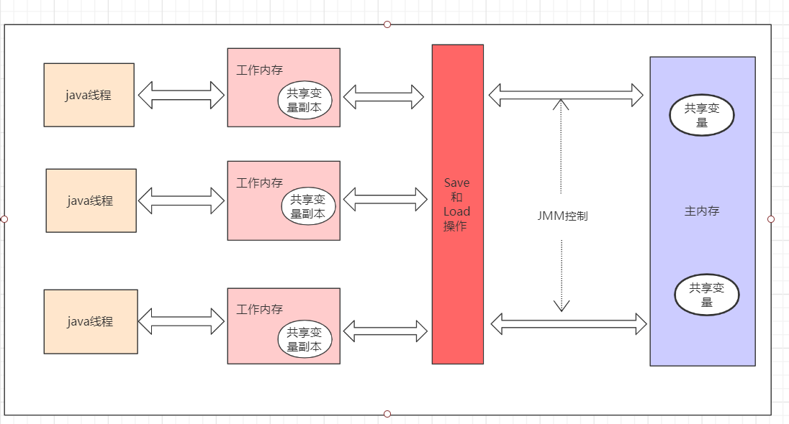
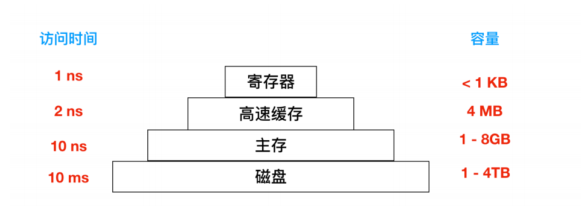
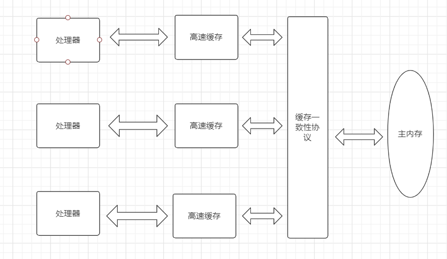

### JAVA高频面试

#### 1、基础

 ```shell
什么是多线程编程: 比如在我们使用电脑时，我们可以看视频，写文档等等这些操作都是线程来执行的，而多线程就是对以线程为基础单位的一种编程方式。

什么是进程:比使用QQ或者微信时它们各自工作互不影响。线程是操作系统进行资源的分配和调度的基本概念。

什么是线程:线程也叫轻量级进程，它是一个基本的CPU执行单元，是比进程更小的能独立运行的基本单元。

并发：
 ```

1.1 JUC 多线程以及并发包

​    1、对volatile的理解

   ```
volatile是Java提供的一种非常轻量级的同步机制：volatile有三比较重要的点，第一可以保证可见性、第二不能保证原子性、第三禁止指令的重排序。
   ```

 那么volatile的可见性是如何体现的呢？ 这个要从Java的内存模型来理解。

 JMM(JAVA内存模型JAVA Memory model)本身是一种抽象的概念并不真实存在，它描述的是一种规则或规范，通过这组规范定义了程序中各个变量的访问方式。

JMM规定变量的操作：

```
1、所以的变量都存储在主内存中
2、每个线程还有自己的工作内存，线程的工作内存中保存了被改线程使用的变量的主内存副本。
3、线程对变量的所有操作都必须在工作内存中进行，而不能直接读写主内存中的数据。不同的线程之间也无法之间访问对方工作内存中的变量。线程间变量的传递均需要通过主内存来完成。
```

JMM同步的规定

```
1、线程解锁前，必须把共享变量的值刷新回主内存
2、线程加锁前，必须读取主内存的最新值到自己的工作内存
3、加锁解锁是同一把锁
```

线程之间的通信



这里还有缓存一致性，因为在计算机中的数据传输效率是 ：磁盘< 内存 < cache < 寄存器

```
存储器的顶层是CPU的寄存器，它们用和CPU一样的材料制成，所有和CPU一样快。程序必须在软件中自行管理这些寄存器。
CPU是寄存器的集合体。
```



由于计算机的存储设备和处理器的运算速度有几个数量级的差距，所以现代计算机系统不得不加入一层读写速度尽可能接近处理器运算速度的高速缓存来作为内存与处理器之间的缓冲，将运算需要的数据复制到缓存中，让运算能快速进行，当运算结束后再从缓存同步回内存中，这样处理器就不用等待缓慢的内存读写了。

不同的处理器都有自己的高速缓存，当多个处理的运算任务都涉及同一个主内存时，将导致各自的缓存数据不一致。那么在同步数据到主内存时以谁的缓存数据为准呢？为了解决缓存一致性问题，需要各个处理器都遵循缓存一致性协议，这些协议有MSI、MESI、MOSI、Synapse、FireFly、Dragon Protocol等。


 除了加入了高速缓存外，为了使得处理器内部的运算单元能尽量被充分利用，处理器可能会对输入代码进行乱序执行优化，处理器会在计算之后将乱序执行的结果重组，保证该结果与顺序执行的结果是一致的，但并不保证程序中各个语句计算的先后顺序与输入代码的顺序一致。


处理器、高速缓存、主内存间的关系。




a、volatile是如何保证可见性的？

 ```
通过JMM(java内存模式)来解决了可见性问题，因为所有的变量都存储在内存中共享，而线程不能对主内存数据进行读写操作，而是通过将主内存的变量拷贝一份到自己的工作内存中(共享变量的副本)，这样每一个线程都有这个变量的副本。如果一个线程都这个副本进行了修改，那么就将这个修改了的值刷新到主内存中去。并且通知其它线程来读取，这样变量修改之后的值其它线程也就知道了。从而使前一个操作的结果对后续操作是可见的。这样就保证了volatile的可见性
 ```

验证volatile的可见性


b、volatile不支持原子性？


###### 字节码指令表

为了方便阅读JVM字节码文件，从网上找了一份字节码指令表

引用：https://segmentfault.com/a/1190000008722128

| 字节码 | 助记符          | 指令含义                                                     |
| ------ | --------------- | ------------------------------------------------------------ |
| 0x00   | nop             | None                                                         |
| 0x01   | aconst_null     | 将null推送至栈顶                                             |
| 0x02   | iconst_m1       | 将int型-1推送至栈顶                                          |
| 0x03   | iconst_0        | 将int型0推送至栈顶                                           |
| 0x04   | iconst_1        | 将int型1推送至栈顶                                           |
| 0x05   | iconst_2        | 将int型2推送至栈顶                                           |
| 0x06   | iconst_3        | 将int型3推送至栈顶                                           |
| 0x07   | iconst_4        | 将int型4推送至栈顶                                           |
| 0x08   | iconst_5        | 将int型5推送至栈顶                                           |
| 0x09   | lconst_0        | 将long型0推送至栈顶                                          |
| 0x0a   | lconst_1        | 将long型1推送至栈顶                                          |
| 0x0b   | fconst_0        | 将float型0推送至栈顶                                         |
| 0x0c   | fconst_1        | 将float型1推送至栈顶                                         |
| 0x0d   | fconst_2        | 将float型2推送至栈顶                                         |
| 0x0e   | dconst_0        | 将double型0推送至栈顶                                        |
| 0x0f   | dconst_1        | 将double型1推送至栈顶                                        |
| 0x10   | bipush          | 将单字节的常量值(-128~127)推送至栈顶                         |
| 0x11   | sipush          | 将一个短整型常量(-32768~32767)推送至栈顶                     |
| 0x12   | ldc             | 将int,float或String型常量值从常量池中推送至栈顶              |
| 0x13   | ldc_w           | 将int,float或String型常量值从常量池中推送至栈顶(宽索引)      |
| 0x14   | ldc2_w          | 将long或double型常量值从常量池中推送至栈顶(宽索引)           |
| 0x15   | iload           | 将指定的int型本地变量推送至栈顶                              |
| 0x16   | lload           | 将指定的long型本地变量推送至栈顶                             |
| 0x17   | fload           | 将指定的float型本地变量推送至栈顶                            |
| 0x18   | dload           | 将指定的double型本地变量推送至栈顶                           |
| 0x19   | aload           | 将指定的引用类型本地变量推送至栈顶                           |
| 0x1a   | iload_0         | 将第一个int型本地变量推送至栈顶                              |
| 0x1b   | iload_1         | 将第二个int型本地变量推送至栈顶                              |
| 0x1c   | iload_2         | 将第三个int型本地变量推送至栈顶                              |
| 0x1d   | iload_3         | 将第四个int型本地变量推送至栈顶                              |
| 0x1e   | lload_0         | 将第一个long型本地变量推送至栈顶                             |
| 0x1f   | lload_1         | 将第二个long型本地变量推送至栈顶                             |
| 0x20   | lload_2         | 将第三个long型本地变量推送至栈顶                             |
| 0x21   | lload_3         | 将第四个long型本地变量推送至栈顶                             |
| 0x22   | fload_0         | 将第一个float型本地变量推送至栈顶                            |
| 0x23   | fload_1         | 将第二个float型本地变量推送至栈顶                            |
| 0x24   | fload_2         | 将第三个float型本地变量推送至栈顶                            |
| 0x25   | fload_3         | 将第四个float型本地变量推送至栈顶                            |
| 0x26   | dload_0         | 将第一个double型本地变量推送至栈顶                           |
| 0x27   | dload_1         | 将第二个double型本地变量推送至栈顶                           |
| 0x28   | dload_2         | 将第三个double型本地变量推送至栈顶                           |
| 0x29   | dload_3         | 将第四个double型本地变量推送至栈顶                           |
| 0x2a   | aload_0         | 将第一个引用类型本地变量推送至栈顶                           |
| 0x2b   | aload_1         | 将第二个引用类型本地变量推送至栈顶                           |
| 0x2c   | aload_2         | 将第三个引用类型本地变量推送至栈顶                           |
| 0x2d   | aload_3         | 将第四个引用类型本地变量推送至栈顶                           |
| 0x2e   | iaload          | 将int型数组指定索引的值推送至栈顶                            |
| 0x2f   | laload          | 将long型数组指定索引的值推送至栈顶                           |
| 0x30   | faload          | 将float型数组指定索引的值推送至栈顶                          |
| 0x31   | daload          | 将double型数组指定索引的值推送至栈顶                         |
| 0x32   | aaload          | 将引用类型数组指定索引的值推送至栈顶                         |
| 0x33   | baload          | 将boolean或byte型数组指定索引的值推送至栈顶                  |
| 0x34   | caload          | 将char型数组指定索引的值推送至栈顶                           |
| 0x35   | saload          | 将short型数组指定索引的值推送至栈顶                          |
| 0x36   | istore          | 将栈顶int型数值存入指定本地变量                              |
| 0x37   | lstore          | 将栈顶long型数值存入指定本地变量                             |
| 0x38   | fstore          | 将栈顶float型数值存入指定本地变量                            |
| 0x39   | dstore          | 将栈顶double型数值存入指定本地变量                           |
| 0x3a   | astore          | 将栈顶引用类型数值存入指定本地变量                           |
| 0x3b   | istore_0        | 将栈顶int型数值存入第一个本地变量                            |
| 0x3c   | istore_1        | 将栈顶int型数值存入第二个本地变量                            |
| 0x3d   | istore_2        | 将栈顶int型数值存入第三个本地变量                            |
| 0x3e   | istore_3        | 将栈顶int型数值存入第四个本地变量                            |
| 0x3f   | lstore_0        | 将栈顶long型数值存入第一个本地变量                           |
| 0x40   | lstore_1        | 将栈顶long型数值存入第二个本地变量                           |
| 0x41   | lstore_2        | 将栈顶long型数值存入第三个本地变量                           |
| 0x42   | lstore_3        | 将栈顶long型数值存入第四个本地变量                           |
| 0x43   | fstore_0        | 将栈顶float型数值存入第一个本地变量                          |
| 0x44   | fstore_1        | 将栈顶float型数值存入第二个本地变量                          |
| 0x45   | fstore_2        | 将栈顶float型数值存入第三个本地变量                          |
| 0x46   | fstore_3        | 将栈顶float型数值存入第四个本地变量                          |
| 0x47   | dstore_0        | 将栈顶double型数值存入第一个本地变量                         |
| 0x48   | dstore_1        | 将栈顶double型数值存入第二个本地变量                         |
| 0x49   | dstore_2        | 将栈顶double型数值存入第三个本地变量                         |
| 0x4a   | dstore_3        | 将栈顶double型数值存入第四个本地变量                         |
| 0x4b   | astore_0        | 将栈顶引用型数值存入第一个本地变量                           |
| 0x4c   | astore_1        | 将栈顶引用型数值存入第二个本地变量                           |
| 0x4d   | astore_2        | 将栈顶引用型数值存入第三个本地变量                           |
| 0x4e   | astore_3        | 将栈顶引用型数值存入第四个本地变量                           |
| 0x4f   | iastore         | 将栈顶int型数值存入指定数组的指定索引位置                    |
| 0x50   | lastore         | 将栈顶long型数值存入指定数组的指定索引位置                   |
| 0x51   | fastore         | 将栈顶float型数值存入指定数组的指定索引位置                  |
| 0x52   | dastore         | 将栈顶double型数值存入指定数组的指定索引位置                 |
| 0x53   | aastore         | 将栈顶引用型数值存入指定数组的指定索引位置                   |
| 0x54   | bastore         | 将栈顶boolean或byte型数值存入指定数组的指定索引位置          |
| 0x55   | castore         | 将栈顶char型数值存入指定数组的指定索引位置                   |
| 0x56   | sastore         | 将栈顶short型数值存入指定数组的指定索引位置                  |
| 0x57   | pop             | 将栈顶数值弹出(数值不能是long或double类型的)                 |
| 0x58   | pop2            | 将栈顶的一个(对于非long或double类型)或两个数值(对于非long或double的其他类型)弹出 |
| 0x59   | dup             | 复制栈顶数值并将复制值压入栈顶                               |
| 0x5a   | dup_x1          | 复制栈顶数值并将两个复制值压入栈顶                           |
| 0x5b   | dup_x2          | 复制栈顶数值并将三个(或两个)复制值压入栈顶                   |
| 0x5c   | dup2            | 复制栈顶一个(对于long或double类型)或两个(对于非long或double的其他类型)数值并将复制值压入栈顶 |
| 0x5d   | dup2_x1         | dup_x1指令的双倍版本                                         |
| 0x5e   | dup2_x2         | dup_x2指令的双倍版本                                         |
| 0x5f   | swap            | 将栈顶最顶端的两个数值互换(数值不能是long或double类型)       |
| 0x60   | iadd            | 将栈顶两int型数值相加并将结果压入栈顶                        |
| 0x61   | ladd            | 将栈顶两long型数值相加并将结果压入栈顶                       |
| 0x62   | fadd            | 将栈顶两float型数值相加并将结果压入栈顶                      |
| 0x63   | dadd            | 将栈顶两double型数值相加并将结果压入栈顶                     |
| 0x64   | isub            | 将栈顶两int型数值相减并将结果压入栈顶                        |
| 0x65   | lsub            | 将栈顶两long型数值相减并将结果压入栈顶                       |
| 0x66   | fsub            | 将栈顶两float型数值相减并将结果压入栈顶                      |
| 0x67   | dsub            | 将栈顶两double型数值相减并将结果压入栈顶                     |
| 0x68   | imul            | 将栈顶两int型数值相乘并将结果压入栈顶                        |
| 0x69   | lmul            | 将栈顶两long型数值相乘并将结果压入栈顶                       |
| 0x6a   | fmul            | 将栈顶两float型数值相乘并将结果压入栈顶                      |
| 0x6b   | dmul            | 将栈顶两double型数值相乘并将结果压入栈顶                     |
| 0x6c   | idiv            | 将栈顶两int型数值相除并将结果压入栈顶                        |
| 0x6d   | ldiv            | 将栈顶两long型数值相除并将结果压入栈顶                       |
| 0x6e   | fdiv            | 将栈顶两float型数值相除并将结果压入栈顶                      |
| 0x6f   | ddiv            | 将栈顶两double型数值相除并将结果压入栈顶                     |
| 0x70   | irem            | 将栈顶两int型数值作取模运算并将结果压入栈顶                  |
| 0x71   | lrem            | 将栈顶两long型数值作取模运算并将结果压入栈顶                 |
| 0x72   | frem            | 将栈顶两float型数值作取模运算并将结果压入栈顶                |
| 0x73   | drem            | 将栈顶两double型数值作取模运算并将结果压入栈顶               |
| 0x74   | ineg            | 将栈顶int型数值取负并将结果压入栈顶                          |
| 0x75   | lneg            | 将栈顶long型数值取负并将结果压入栈顶                         |
| 0x76   | fneg            | 将栈顶float型数值取负并将结果压入栈顶                        |
| 0x77   | dneg            | 将栈顶double型数值取负并将结果压入栈顶                       |
| 0x78   | ishl            | 将int型数值左移指定位数并将结果压入栈顶                      |
| 0x79   | lshl            | 将long型数值左移指定位数并将结果压入栈顶                     |
| 0x7a   | ishr            | 将int型数值右(带符号)移指定位数并将结果压入栈顶              |
| 0x7b   | lshr            | 将long型数值右(带符号)移指定位数并将结果压入栈顶             |
| 0x7c   | iushr           | 将int型数值右(无符号)移指定位数并将结果压入栈顶              |
| 0x7d   | lushr           | 将long型数值右(无符号)移指定位数并将结果压入栈顶             |
| 0x7e   | iand            | 将栈顶两int型数值"按位与"并将结果压入栈顶                    |
| 0x7f   | land            | 将栈顶两long型数值"按位与"并将结果压入栈顶                   |
| 0x80   | ior             | 将栈顶两int型数值"按位或"并将结果压入栈顶                    |
| 0x81   | lor             | 将栈顶两long型数值"按位或"并将结果压入栈顶                   |
| 0x82   | ixor            | 将栈顶两int型数值"按位异或"并将结果压入栈顶                  |
| 0x83   | lxor            | 将栈顶两long型数值"按位异或"并将结果压入栈顶                 |
| 0x84   | iinc            | 将指定int型变量增加指定值(如i++, i--, i+=2等)                |
| 0x85   | i2l             | 将栈顶int型数值强制转换为long型数值并将结果压入栈顶          |
| 0x86   | i2f             | 将栈顶int型数值强制转换为float型数值并将结果压入栈顶         |
| 0x87   | i2d             | 将栈顶int型数值强制转换为double型数值并将结果压入栈顶        |
| 0x88   | l2i             | 将栈顶long型数值强制转换为int型数值并将结果压入栈顶          |
| 0x89   | l2f             | 将栈顶long型数值强制转换为float型数值并将结果压入栈顶        |
| 0x8a   | l2d             | 将栈顶long型数值强制转换为double型数值并将结果压入栈顶       |
| 0x8b   | f2i             | 将栈顶float型数值强制转换为int型数值并将结果压入栈顶         |
| 0x8c   | f2l             | 将栈顶float型数值强制转换为long型数值并将结果压入栈顶        |
| 0x8d   | f2d             | 将栈顶float型数值强制转换为double型数值并将结果压入栈顶      |
| 0x8e   | d2i             | 将栈顶double型数值强制转换为int型数值并将结果压入栈顶        |
| 0x8f   | d2l             | 将栈顶double型数值强制转换为long型数值并将结果压入栈顶       |
| 0x90   | d2f             | 将栈顶double型数值强制转换为float型数值并将结果压入栈顶      |
| 0x91   | i2b             | 将栈顶int型数值强制转换为byte型数值并将结果压入栈顶          |
| 0x92   | i2c             | 将栈顶int型数值强制转换为char型数值并将结果压入栈顶          |
| 0x93   | i2s             | 将栈顶int型数值强制转换为short型数值并将结果压入栈顶         |
| 0x94   | lcmp            | 比较栈顶两long型数值大小, 并将结果(1, 0或-1)压入栈顶         |
| 0x95   | fcmpl           | 比较栈顶两float型数值大小, 并将结果(1, 0或-1)压入栈顶; 当其中一个数值为`NaN`时, 将-1压入栈顶 |
| 0x96   | fcmpg           | 比较栈顶两float型数值大小, 并将结果(1, 0或-1)压入栈顶; 当其中一个数值为`NaN`时, 将1压入栈顶 |
| 0x97   | dcmpl           | 比较栈顶两double型数值大小, 并将结果(1, 0或-1)压入栈顶; 当其中一个数值为`NaN`时, 将-1压入栈顶 |
| 0x98   | dcmpg           | 比较栈顶两double型数值大小, 并将结果(1, 0或-1)压入栈顶; 当其中一个数值为`NaN`时, 将1压入栈顶 |
| 0x99   | ifeq            | 当栈顶int型数值等于0时跳转                                   |
| 0x9a   | ifne            | 当栈顶int型数值不等于0时跳转                                 |
| 0x9b   | iflt            | 当栈顶int型数值小于0时跳转                                   |
| 0x9c   | ifge            | 当栈顶int型数值大于等于0时跳转                               |
| 0x9d   | ifgt            | 当栈顶int型数值大于0时跳转                                   |
| 0x9e   | ifle            | 当栈顶int型数值小于等于0时跳转                               |
| 0x9f   | if_icmpeq       | 比较栈顶两int型数值大小, 当结果等于0时跳转                   |
| 0xa0   | if_icmpne       | 比较栈顶两int型数值大小, 当结果不等于0时跳转                 |
| 0xa1   | if_icmplt       | 比较栈顶两int型数值大小, 当结果小于0时跳转                   |
| 0xa2   | if_icmpge       | 比较栈顶两int型数值大小, 当结果大于等于0时跳转               |
| 0xa3   | if_icmpgt       | 比较栈顶两int型数值大小, 当结果大于0时跳转                   |
| 0xa4   | if_icmple       | 比较栈顶两int型数值大小, 当结果小于等于0时跳转               |
| 0xa5   | if_acmpeq       | 比较栈顶两引用型数值, 当结果相等时跳转                       |
| 0xa6   | if_acmpne       | 比较栈顶两引用型数值, 当结果不相等时跳转                     |
| 0xa7   | goto            | 无条件跳转                                                   |
| 0xa8   | jsr             | 跳转至指定的16位offset位置, 并将jsr的下一条指令地址压入栈顶  |
| 0xa9   | ret             | 返回至本地变量指定的index的指令位置(一般与jsr或jsr_w联合使用) |
| 0xaa   | tableswitch     | 用于switch条件跳转, case值连续(可变长度指令)                 |
| 0xab   | lookupswitch    | 用于switch条件跳转, case值不连续(可变长度指令)               |
| 0xac   | ireturn         | 从当前方法返回int                                            |
| 0xad   | lreturn         | 从当前方法返回long                                           |
| 0xae   | freturn         | 从当前方法返回float                                          |
| 0xaf   | dreturn         | 从当前方法返回double                                         |
| 0xb0   | areturn         | 从当前方法返回对象引用                                       |
| 0xb1   | return          | 从当前方法返回void                                           |
| 0xb2   | getstatic       | 获取指定类的静态域, 并将其压入栈顶                           |
| 0xb3   | putstatic       | 为指定类的静态域赋值                                         |
| 0xb4   | getfield        | 获取指定类的实例域, 并将其压入栈顶                           |
| 0xb5   | putfield        | 为指定类的实例域赋值                                         |
| 0xb6   | invokevirtual   | 调用实例方法                                                 |
| 0xb7   | invokespecial   | 调用超类构建方法, 实例初始化方法, 私有方法                   |
| 0xb8   | invokestatic    | 调用静态方法                                                 |
| 0xb9   | invokeinterface | 调用接口方法                                                 |
| 0xba   | invokedynamic   | 调用动态方法                                                 |
| 0xbb   | new             | 创建一个对象, 并将其引用引用值压入栈顶                       |
| 0xbc   | newarray        | 创建一个指定的原始类型(如int, float, char等)的数组, 并将其引用值压入栈顶 |
| 0xbd   | anewarray       | 创建一个引用型(如类, 接口, 数组)的数组, 并将其引用值压入栈顶 |
| 0xbe   | arraylength     | 获取数组的长度值并压入栈顶                                   |
| 0xbf   | athrow          | 将栈顶的异常抛出                                             |
| 0xc0   | checkcast       | 检验类型转换, 检验未通过将抛出 ClassCastException            |
| 0xc1   | instanceof      | 检验对象是否是指定类的实际, 如果是将1压入栈顶, 否则将0压入栈顶 |
| 0xc2   | monitorenter    | 获得对象的锁, 用于同步方法或同步块                           |
| 0xc3   | monitorexit     | 释放对象的锁, 用于同步方法或同步块                           |
| 0xc4   | wide            | 扩展本地变量的宽度                                           |
| 0xc5   | multianewarray  | 创建指定类型和指定维度的多维数组(执行该指令时, 操作栈中必须包含各维度的长度值), 并将其引用压入栈顶 |
| 0xc6   | ifnull          | 为null时跳转                                                 |
| 0xc7   | ifnonnull       | 不为null时跳转                                               |
| 0xc8   | goto_w          | 无条件跳转(宽索引)                                           |
| 0xc9   | jsr_w           | 跳转至指定的32位offset位置, 并将jsr_w的下一条指令地址压入栈顶 |


| 参数                    | 新生代垃圾收集器         | 新生代算法                             | 老年代垃圾收集器                                             | 老年代算法 |
| ----------------------- | ------------------------ | -------------------------------------- | ------------------------------------------------------------ | ---------- |
| -XX:+UseSerialGC        | SerialGC                 | 复制                                   | SerialOldGC                                                  | 标记整理   |
| -XX:+UseParNewGC        | ParNew                   | 复制                                   | SerialOldGC                                                  | 标记整理   |
| -XX:+UseParallelGC      | Parallel [Scavenge]      | 复制                                   | Parallel Old                                                 | 标记整理   |
| -XX:+UseConcMarkSweepGC | ParNew                   | 复制                                   | CMS + Serial Old的收集器组合，Serial Old作为CMS出错的后备收集器 | 标记清除   |
| -XX:+UseG1GC            | G1整体上采用标记整理算法 | 局部是通过复制算法，不会产生内存碎片。 |                                                              |            |

