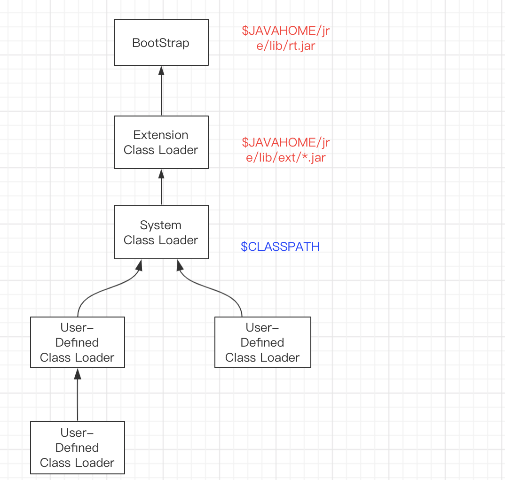
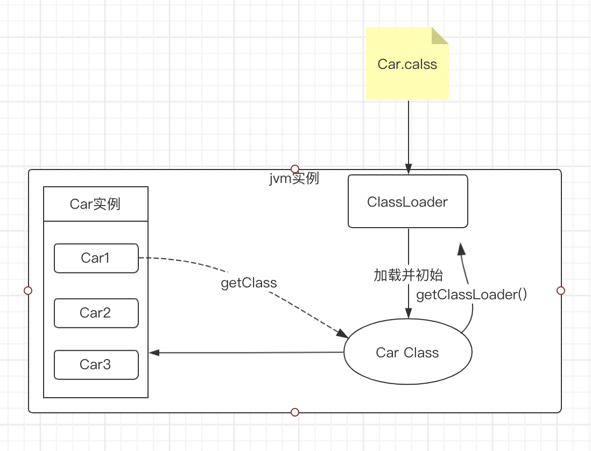
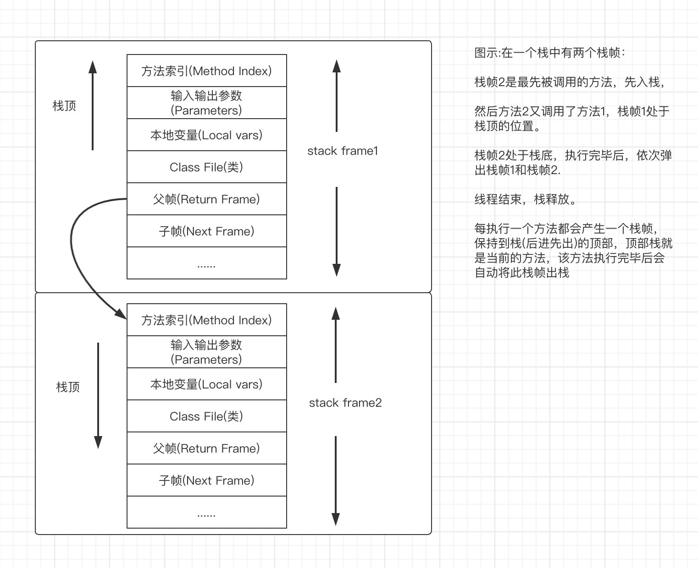
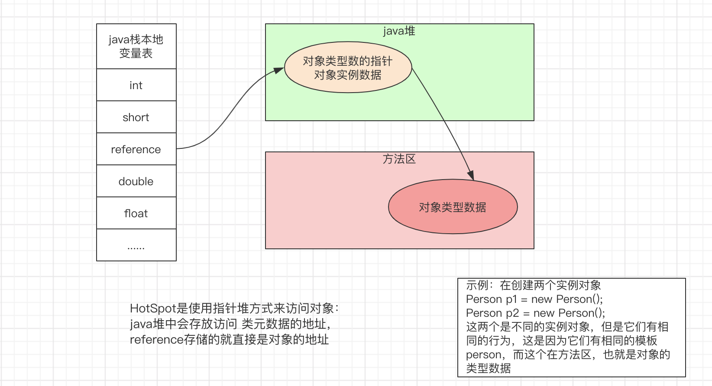
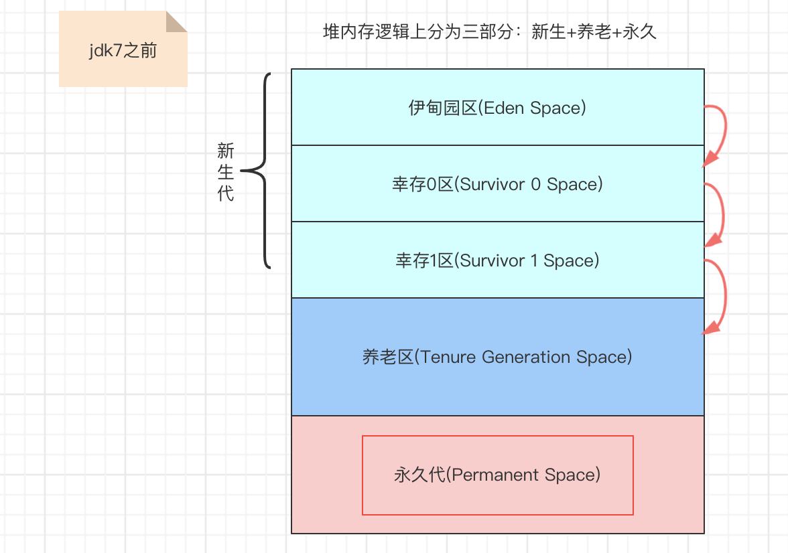
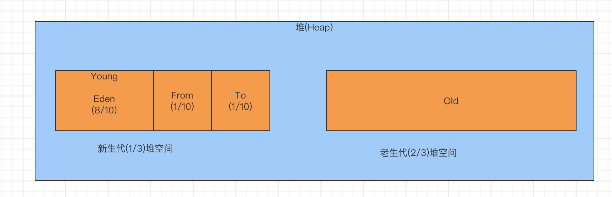
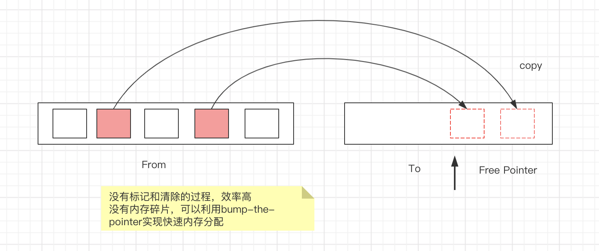
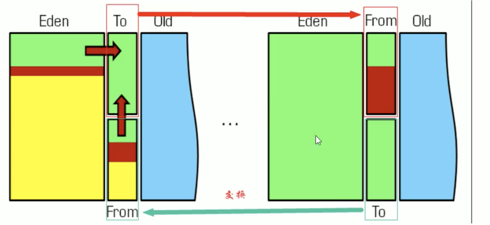

## JVM体系结构

### 1、类装载器ClassLoader

```
负责加载class文件，class文件在文件开头有特定的文件标示，将class文件字节码内容加载到内存中，并将这些内容转换成方法区中的运行时数据结构并且ClassLoader只负责class文件的加载，至于它是否可以运行则由Execution E ngine决定。
```

类装载器分为:

 虚拟机自动的加载器

```
1、启动类加载器(Bootstrap) c++
2、扩展类加载器(Execution) java
3、应用程序类加载器(AppClassLoader) 
java也叫系统类加载器，加载当前用的classpath的所有类
```

用户自定义加载器

```
java.lang.ClassLoader的字类，用户可以定制类的加载方式
```




为什么能够直接使用Object类喃？这是因为默认的jdk自带，并且通过BootStrap 根加载器将 rt.jar 包 加载进jvm中。

rt.jar中

```
sum.misc.Launcher$ 这个是java 虚拟机的入口引用类
```

1.1 双亲委派机制

```
1、当一个类收到了类加载请求，它首先不好尝试自己去加载这个类，而是把这个请求委派给父类去完成，每一个层次类加载器都是如此，因此所有的加载请求都应该传送到启动类加载
```


Car.class(小 class) 文件在硬盘中 还没有加载到jvm中，当该文件被加载到jvm中后 就变成了Car Class(大 class)。 这个就是类的结构信息。




### 2、Native Interface(本地方法接口)

```
 本地接口的作用是融合不同的编程语言为Java所用，它的初衷是融合C/C++程序，java诞生的时候C/C++横行的时候，要想立足，必须有调用C/C++程序，于是就在内部专门开辟了一块区域处理标记为native的代码，它的具体做法是Native Method Stack登记 native方法，在Execution Engine执行时加载native libraies。
   目前该方法使用的越来越少，除非是与硬件有关的应用，比如通过java程序驱动打印机或者java系统管理生产设备，在企业级应用中已经比较少见。因为现在的异构领域间的通信很发达，比如可以使用Socket通信，也可以使用Web service 等等。
```

 Native Method Stack

```
它的具体做法是Native Method Stack中登记native方法，在Execution Engine执行时加载本地地方库。
```


注意：$\textcolor{Red}{在java中类中可以 有方法的声明没有实现 ，比如Thread类中的 start0()定义的 native方法}$。$\textcolor{Red}{如果一个方法标记了native方法后，那么就表示调用底层操作系统或者第三方C语言函数库}$。 $\textcolor{Red}{这个方法的实现时交给了底层操作系统或者第三函数库。}$

一般我们写的普通方法放在java栈里面，只要是native标志的 放在native方法栈里面。

```
native是一个关键字。
如果native关键字标记的方法，那么是有声明，没实现。凡事有native关键字标示的，就是说java的范围到这里就结束了。接下来的实现，靠的是c语言实现的第三方函数库
```


### 3、pc寄存器

​	每个线程都有一个程序计数器，是线程私有的，就是一个指针，指向方法区中的方法字节码(用来存储指向下一条指令的地址，也即将要执行的指令代码)，由执行引擎取下一条指令，是一个非常小的内存空间，几乎可以忽略不计。

  这块内存区域很小，它是当前线程所执行的字节码的行号指示器，字节码解释器通过改变这个计数器的值来选取下一条需要执行的字节码指令。

  如果执行的是一个Native方法(Native不归java管)，那么计数器是空的。 

 用以完成分支、循环、跳转、异常处理、线程恢复等基础功能。不会发生内存溢出(OutOfMemory=OOM)错误。    


### 4、方法区(Method Area)

  线程共享的运行时内存区域。$\textcolor{Red}{它存储了每一个类的结构信息}$,例如运行时常量池(Runtime Constant Pool)、字段和方法数据，构造函数和普通方法的字节码内容。 方法区规范，在不同的虚拟机中实现时不一样的，比如典型的就是永久代(PermGen space)和元空间(Metaspace).  

  ```
实例变量在堆内存中，和方法区无关
  ```

 方法区就好比 一个接口，而永久代和元空间就是其 不同的实现方式。


### 5、栈

栈也叫做栈内存，主管Java程序的运行，是在线程创建时创建，它的生命期是跟随线程的生命周期，线程结束 栈内存也就释放，对于栈来说不存在辣椒回收问题，只要线程一结束该栈就Over，生命周期和线程一致，是线程私有的。$\textcolor{Red}{8种基本类型的变量+对象的引用变量+实例方法}$ 都是在函数的栈内存中分配。

```
栈管运行，堆管存储
```

5.1、栈存储什么

```
栈帧中主要保持3类数据：
1、本地变量：输入参数和输出参数以及方法内的变量
2、栈操作：记录出栈、入栈的操作。
3、栈帧数据：包括类文件、方法等
```

在栈里面，java方法=栈帧 ，整个方法都会放在装载到栈中，那么这个方法包含的 输入参数和输出参数也会随着 方法放入到栈帧中。

5.2、栈运行原理：

   栈中到数据都是以栈帧(Stack Frame)到格式存在，栈帧是一个内存区块，是一个数据集，是一个有关方法(Method)和运行期数据到数据集，当一个方法A被调用时就产生一个栈帧F1,并被压入到栈中。

```
A方法又调用了B方法，于是产生栈帧F2也被压入栈，B方法又调用了C方法，于是产生栈帧F3也被压入栈
执行完毕之后，先弹出F3栈帧，再弹出F2栈帧，再弹出F栈帧.....
遵循"先进后出/后进先出"原则。

每个方法执行的同时都会创建一个栈帧，用于存储局部变量表、操作数栈、动态连接、方法出口等信息，每一个方法从调用直至执行完毕的过程，就对应着一个栈帧在虚拟机中入栈到出栈道过程。栈的大小和具体jvm的实现有关，通常在256k-756k之间，约等于1Mb左右。
```





栈和堆以及方法区的交换关系




### 6、Heap(堆)

   java7之前：

​    一个jvm实例只存在一个堆内存，堆内存的大小是可以调节的。类加载器读取了类文件后，需要把类、方法、常变量放到堆内存中，保存所有引用类型的真实信息，以便执行器执行，堆内存分为三部分：

```
Young Generation Space 新生区    Young/New
Tenure Generation Space 养老区  Old/Tenure
Permanent Space         永久代。  Perm
```





6.1、新生代

   新生区是类的诞生、成长、消亡的区域，一个类在这里产生，应用，最后被垃圾回收器收集，结束生命。新生区分为两部分：伊甸区(Eden space)和幸存者区(Survivor space),所有的类都是在伊甸区被new出来的。幸存区有两个：0区(Survivor 0 space)和1区(Survivor 1 space)。当伊甸园的空间用完时，程序又需要创建对象，jvm的垃圾回收器将对伊甸区进行垃圾回收(Minor GC)，将伊甸园区中的不再被其它对象所引用的对象进行销毁，然后将伊甸园中的剩余对象移动到幸存区0区，若幸存0区也满了，再对该区进行垃圾回收，然后移动到1区，那么1区也满足了。就移动到养老区，若养老区满了，那么这个时候将会产生MajorGC(FullGC),进行养老区的内存清理，若养老区执行了Full GG之后发现依然无法进行对象的保持，就会产生OOM错误信息 “OutOfMemoryError”

  如果出现了java.lang.OutOfMemoryError:java heap space异常，说明java虚拟机的堆内存不够。

原因有两点：

```
1、java虚拟机的堆内存设置不够，可以通过参数-Xms、-Xmx来调整
2、代码中创建了大量大对象，并且长时间不能被垃圾收集器收集(存在被引用)。
```


注意：这里 一般说 新生代和 老年代 比例是1:2 但是， 这个说法不准确，有时候 会调整新生代的内存大小 ，调整后的大小 会大于 老年代，要看实际情况。



MinorGC的过程(复制----清空----交换)

```
1、eden、SurvivorFrom复制到SurvivorTo，年龄+1
 首先，当Eden区满的时候会触发第一次GG，把还活着的对象拷贝到SurvivorFrom区，当Eden区再次触发GC的时候会扫描Eden区和From区域，对这两个区域进行垃圾回收，经过这次回收后还存活的对象，则直接复制到To区域(如果对象的年龄已经达到了老年的标准，则赋值到老年代区)，同时把这些对象的年龄+1

2、清空eden、SurvivorFrom
 然后，清空eden、SurvivorFrom中的对象，也即复制之后有交换，谁空谁是To

3、SurvivorTo和SurvivorFrom交换
  最后，SurvivorTo和SurvivorFrom 互换，原SurvivorTo成为下一次GC时的SurvivorFrom区。部分对象会在From和To区域中来回复制，如此交换15次(由JVM参数MaxTenuringThreshold决定，这个参数默认是15)，最终如果还是存活，就存入到老年代。
```


### 7、方法区

 方法区和堆一样，是各个线程共享的内存区域，它用于存储虚拟机加载的：类信息+普通常量+静态常量+编译器编译后的代码等，虽然jvm规范将方法区描述为 堆的一个逻辑部分，但它却还有一个别名叫做Non-Heap(非堆)，目的就是要和堆分开。

  对于hotSpot虚拟机，很多开发者习惯将方法区称之为“永久代”，但是严格上来说两者不同，或者说使用永久代来实现方法区而已，永久代是方法区(相当于一个接口interface)的一个实现，jdk1.7的版本中，已经将原本放在永久代的字符串常量池移走。

  java虚拟机规范对方法对限制非常宽松，除了和java堆一样不需要连续的内存和可以选择固定大小或者可扩展外，还可以选择不实现垃圾收集。 相对而言，垃圾收集行为在这个区域是比较少出现的。$\textcolor{Red}{但并非数据进入了方法就入永久代的名字一样“永久”存在了}$。 这个区域的内存回收目标主要是针对常量池的回收和对类型的卸载。

 这个区域在内存不能满足分配需求时，也会发生OutOfMemoryError异常。

 注意：$\textcolor{Red}{在jdk1.8时，将常量池和静态变量放到了java堆里，而永久代这个被元空间取代了}$ ，并且这个元空间放到了本地内存中。

###  8、永久代

  永久存储区是一个常驻内存区域，用于存放jdk自身携带的Class，Interface的元数据，也就是说它存储的是运行环境必须的类信息。被转载进此区域的数据是不好被垃圾回收器回收掉的，关闭jvm才会释放此区域所占用的内存。


在java8中，永久代已经被移除，被一个称为元空间的区域所取代。 

 元空间与永久代之间最大的区别在于：

```
永久带使用的jvm的堆内存，但是java8以后的元空间并不在虚拟机中而是使用本机物理内存。
```

因此，默认情况下，元空间的大小仅受本地内存限制。类的元数据放入native memory，字符串池和类的静态变量放入java堆中，这样可以加载类的元数据就不在由MaxPermsize控制，而由系统的时间可用空间来控制


### 9、参数调节

 

| -Xms                | 设置初始分配大小，默认为物理内存的"1/64" |
| ------------------- | ---------------------------------------- |
| -Xmx                | 最大分配内存，默认为物理内存的“1/4”      |
| -XX:+PrintGCDetails | 输出详细的GC处理日志                     |

```shell
 ##分配失败 发生GC
 # GC之前新生代占用内存 1189K ， GC之后新生代占用内容512K，Young区总大小：2560K
 # GC前堆内存大小 1189k , GC后堆内存大小810K
[GC (Allocation Failure) [PSYoungGen: 1189K->512K(2560K)] 1189K->810K(9728K), 0.0011756 secs] [Times: user=0.00 sys=0.00, real=0.00 secs] 

#GC类型
[Full GC (Allocation Failure) 
[PSYoungGen: 512K->0K(2560K)]
#FullGC 就会有old区
#YoungGC 前堆内存占用882k， YoungGC后堆内存占用731k
[ParOldGen: 370K->731K(7168K)] 882K->731K(9728K), 
# 元空间
[Metaspace: 2650K->2650K(1056768K)], 0.0040603 secs] [Times: user=0.00 sys=0.00, real=0.00 secs] 
```

注意: 在设置堆内存大小时， -Xms, -Xmx, -Xmn， 堆内存大小包含了 新生代和老年代 。 如果设置了新生代内存大小-Xmn，那么老年代 大小就是 通过设置堆内存大小 减去 新生代内存大小，剩下的就是老年代大小。

### 10、GC收集算法

####  1、GC按照回收的区域分为两种类型

```
一种是普通GC(minor GC),一种是全局GC(major GC or Full GC)。

Minor GC 和Full GC的区别：
普通GC(minor GC)：只针对新生代区域的GC，指发生在新生代的垃圾收集动作，因为大多数java对象存活率不高，所以minor GC 非常频繁，一般回收速度比较快。
全局GC(major GC or Full GC)：指发生在老年代的垃圾收集动作，出现了Major GC,经常会伴随至少一次的Minor GC(但不是觉得的)。Major GC的速度一般要比 Minor GC慢上10以上(因为老年代占用2/3，进行全局扫描需要耗时)。
```

 注意：GC时候“不是”  年轻代、老年代、元空间 一起回收。 先在年轻代进行GC。


####   2、jvm中的GC和 system.gc 

```
jvm中的gc是自动进行垃圾回收，而system.gc是通过手动来进行垃圾回收，并且不是立刻进行垃圾回收。
一般情况下禁用system.gc。现在的虚拟机中 什么时候去GC 会自行去计算。而不是通过手动去处理
```


####   3、复制算法

  年轻代中使用的是Minor GC，这种GC算法采用的是复制算法

 ```
 Minor GC会把Eden中的所有活的对象都转移到Survivor区域中，如果Survivor区中放不下，那么剩下的活的对象就被转移到Old generation中，也即一旦收集后，Eden就变成空的了。
 当对象在Eden(包括一个Survivo区域，这里假设from区域)出生后，在经过一次MinorGC后，如果对象还存活，并且能被另外一块Survivor区域所容纳(上面已经假设from区域，这里应为to区域，即to区域有足够的内存空间来存在Eden和from区中存活的对象)，则使用复制算法将这些仍然还存活的对象复制到另外一块Survivor区域(即to区域)中，然后清理所使用过的Eden以及Survivor区域(即from区域)，并且将这些对象的年龄设置为1，以后对象在Survivor区每熬过一次minorGC，就将对象的年龄+1，当对象的年龄达到某个值时(默认是15，通过-XX:MaxTenuringThreshold来设定参数)，这些对象就会成为老年代。
 -XX:MaxTenuringThreshold --设置对象在新生代中存活的次数。
 ```

复制算法原理

```
从根集合(GC Root)开始，通过Tracing 从From中找到存活对象，拷贝到To中；
From、To交换身份，下次内存分配从To开始。
```





在GC开始的时候，对象只会存在于Eden区和名为“From”的Survivor区，Survivor区“To”是空的，紧接着进行GC, Eden区中所有存活的对象都会被复制到"To"，而在“From”区中，仍存活的对象会根据他们的年龄值来将决定去向，年龄达到一定值(年龄阈值，可以通过-XX:MaxTenuringThreshold来设置)的对象会被移动到老年代中，没有达到阈值的对象会被复制到“To”区域。经过这次GC后，Eden区和From区已经被清空。这个时候，“From”和“To”会交换他们的角色，也就是新的“To”就是上次GC前的“From”，新的“From”就是上次GC前的“To”。不管怎样，都会爆炸名为To的Survivor区域是空的。MinorGC会一直重复这样的过程，直到”To“区被填满，“To”区被填满之后，会将所有对象移动到年老代中。


 


​    因为Eden区对象一般存活率较低，一般的，使用两块10%的内存作为空闲和活动区域，而另外80%的内存，则用来给新对象分配内存的。一旦发生GC，将10%的from活动区间与另外80%中存活的eden对象转移到10%的to空闲区间，接下来，将之前90%的内存全部释放，以此类推。


#### 4、标记清除(Mark-Sweep)

​     $\textcolor{red}{老年代 一般由标记清除或者 是标记清除与标记整理的混合实现。}$

当程序运行期间，若可以使用当内存被耗尽的时候，GC线程就会被触发并将程序暂停，随后将要回收的对象标记一遍，最终统一回收这些对象，完成标记清理工作接下来便让应用程序恢复运行。

其缺点有

```
1、效率比较低(递归与全堆对象遍历)，而且在进行GC的时候，需要停止应用程序，这会导致用户体验非常差劲
2、其次，主要的缺点则是这种方式清理出来的空间不是连续的。在内存中死亡的对象都是随即的出现在内存的各个角落，现在把它们清除之后，内存的布局自然就会变得乱七八遭的，而为了应付这一点，jvm就不得不维持一个内存的空虚列表，这又是一种开销。而且在分配数组对象的时候，寻找连续的内存空间不太好找。
```

#### 5、标记整理(Mark-Compact)

  $\textcolor{red}{老年代 一般由标记清除或者 是标记清除与标记整理的混合实现。}$

```
1.标记(mark)，与标记清除一样
2.压缩整理(compact)。再次扫描，并往一端滑动存活对象。 在整理压缩阶段，不再对标记的对象做回收，而是通过所有存活对象都向一端移动，然后直接清除边界以外的内存。
```

缺点

```
耗时严重，效率不高， 不仅要标记所有存活对象，还要整理所有存活对象的引用地址。
```


这几种垃圾回收算法的优缺点

```
内存效率：复制算法>标记算法>标记整理算法(此处的效率只是简单的对比时间复杂度，实际情况不一定如此)
内存整齐度：复制算法=标记整理算法>标记清除
内存利用率：标记整理算法=标记清除算法>复制算法
```

### 11、JMM(Java Memeory Model, java内存模型) 

  java内存模型 本身是一种抽象的概念并不真实存在，它描述的是一组规则或规范，通过这组规范定义了程序中个各个变量(包含实例字段，静态字段和构成数组对象的元素)的访问方式。

  java内存模型的主要目标是定义程序中各个变量的访问规则，即在虚拟机中将变量存储到内存和从内存中取出变量这样的底层细节。$\textcolor{red}{此处的变量(Variables)与Java编程中所说的变量有所区 别，它包括了实例字段、静态字段和构成数组对象的元素}$，$\textcolor{red}{但是不包括局部变量与方法参数}$，$\textcolor{red}{因为后者是线程私有的，不会被共享，自然就不会存在竞争问题}$。为了获得更好的执行效能，Java内存模 型并没有限制执行引擎使用处理器的特定寄存器或缓存来和主内存进行交互，也没有限制即时编译器 是否要进行调整代码执行顺序这类优化措施。

$\textcolor{red}{Java内存模型规定了所有的变量都存储在主内存(Main Memory)中}$(此处的主内存与介绍物理 硬件时提到的主内存名字一样，两者也可以类比，但物理上它仅是虚拟机内存的一部分)。$\textcolor{red}{每条线程 还有自己的工作内存(Working M emory ，可与前面讲的处理器高速缓存类比)}$，$\textcolor{red}{线程的工作内存中保存了被该线程使用的变量的主内存副本}$，$\textcolor{red}{线程对变量的所有操作(读取、赋值等)都必须在工作内存中进行，而不能直接读写主内存中的数据}$。不同的线程之间也无法直接访问对方工作内存中的变量，$\textcolor{red}{线程间变量值的传递均需要通过主内存来完成。}$

JMM关于同步的规定

```
1、线程解锁前，必须包共享变量的值刷新回主内存
2、线程加锁前，必须读取主内存的最新值到自己的工作内存
3、加锁解锁是同一把锁
```


```
1、原子性、可见性、有序性
```


### 12、一个Java对象到底占用多大内存？

#### 12.1、Java 对象内存结构

在 JVM 中，Java 对象都是在堆内存上分配的，想要分析出 Java 对象内存占用，首先要了解 Java 对象内存结构，一个 Java 对象内存占用由三部分组成：`对象头（Header）`,`实例数据（Instance Data）`和`对齐填充（Padding）`。

#### 对象头（Header）

虚拟机的对象头包括两部分信息，第一部分用于存储$\textcolor{red}{`对象自身的运行时数据`}$，如 $\textcolor{red}{`hashCode` }$、$\textcolor{red}{`GC分代年龄`}$、$\textcolor{red}{`锁状态标志`}$、$\textcolor{red}{`线程持有的锁`}$、$\textcolor{red}{`偏向线程ID`}$、$\textcolor{red}{`偏向时间戳`}$等。这部分数据的长度在 32 位和 64 位的虚拟机（未开启指针压缩）中分别为 4B 和 8B ，官方称之为 `”Mark Word”`。

对象的另一部分是$\textcolor{red}{`类型指针（kclass）`}$，即对象指向它的类元数据的指针，虚拟机通过这个指针来确定这个对象是那个类的实例。另外如果对象是一个 Java 数组，那在对象头中还必须有一块用于记录数组长度的数据，因为虚拟机可以通过普通 Java 对象的元数据信息确定 Java 对象的大小，但是从数组的元数据中却无法确定数组的大小。同样，这部分数据的长度在 32 位和 64 的虚拟机（未开启指针压缩）中分别为 4B 和 8B。


#### 指针压缩

从 JDK 1.6 update14 开始，64 bit JVM 正式支持了 `-XX:+UseCompressedOops` 这个可以压缩指针，起到节约内存占用的新参数。

如果$\textcolor{red}{ `UseCompressedOops`}$ 是打开的，则以下对象的指针会被压缩

```
所有对象的 klass 属性
所有对象指针实例的属性
所有对象指针数组的元素（objArray）
```

由此我们可以计算出对象头大小：

```
32位虚拟机对象头大小= Mark Word（4B）+ kclass(4B) = 8B   
64位虚拟机对象头大小= Mark Word（8B）+ kclass(4B) = 12B
```


#### 实例数据

一个 Java 对象中的实例数据可能包括两种，一是 8 种基本类型，二是实例数据也是一个对象，说到这里很多人可能有个误区：

```
基本类型？基本类型不是在栈上分配内存的吗？怎么要计算到分配在堆内存上对象的大小里面去？
```

基本类型在栈上分配内存？其实并不是，所谓“栈内存保存基本类型以及对象的引用(reference)，堆内存保存对象” 只是一句不严谨的话，实际仔细研究起来，栈内存（更专业的术语叫做堆栈）作为虚拟机作为方法调用和方法执行的数据结构，可能保存五种信息：

```
局部变量表
操作数栈
动态链接
方法返回地址
附加信息
```

其中局部变量表中存储了方法中的局部变量，可能为 8 种基本类型或者 reference

也就是说，栈内存中保存的基本类型，都是方法中的局部变量，而如果基本类型作为对象的实例变量，是在堆上分配空间的，此外，$\textcolor{red}{如果实例变量被final修饰}$，$\textcolor{red}{则既不在栈也不在堆上分配空间}$，$\textcolor{red}{而是分配到常量池里面}$。

8 种基本类型和 reference 大小在虚拟机上都是固定的

```
Primitive Type  Memory Required(bytes)
boolean          1
byte             1
short            2
char             2
int              4
float            4
long             8
double           8
Reference        4
```

#### 对齐填充（Padding）

由于虚拟机内存管理体系要求 Java 对象内存起始地址必须为 8 的整数倍，换句话说，Java 对象大小必须为 8 的整数倍，当对象头+实例数据大小不为 8 的整数倍时，将会使用Padding机制进行填充，譬如， 64 位虚拟机上 new Object() 实际大小为:

Mark Word（8B）+ kclass(4B)[开启指针压缩] = 12B

但由于Padding机制，实际占用空间为： Mark Word（8B）+ kclass(4B)[开启指针压缩]+Padding(4B) = 16B

#### 数组的大小

Java 中数组也是一种对象，数组的大小与普通 Java 对象相比多了数组长度的信息（4B），即一个数组对象大小为 Mark Word（8B）+ kclass(4B)[开启指针压缩] + 数组长度(4B) = 16B


