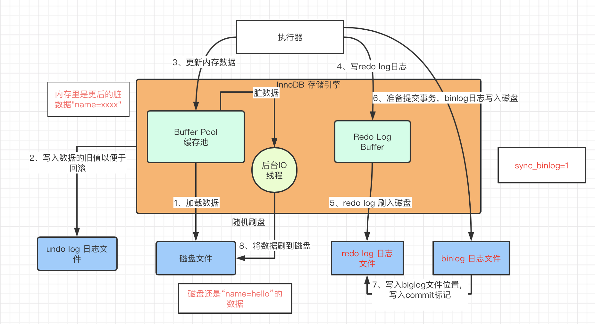
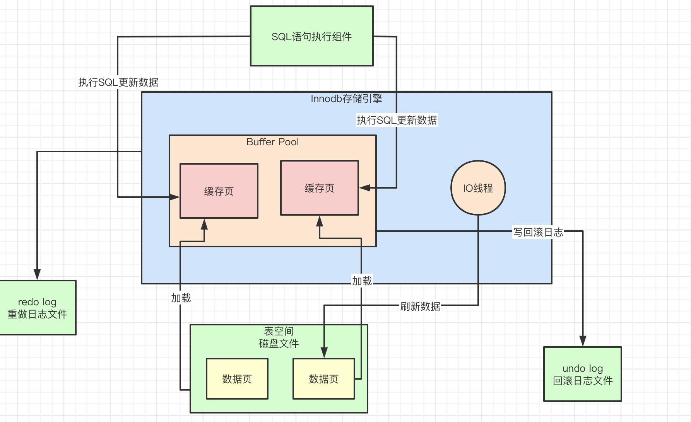
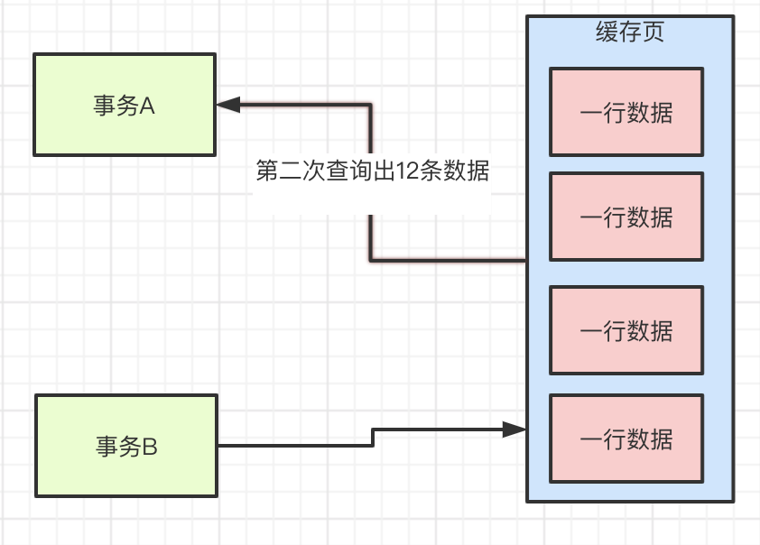
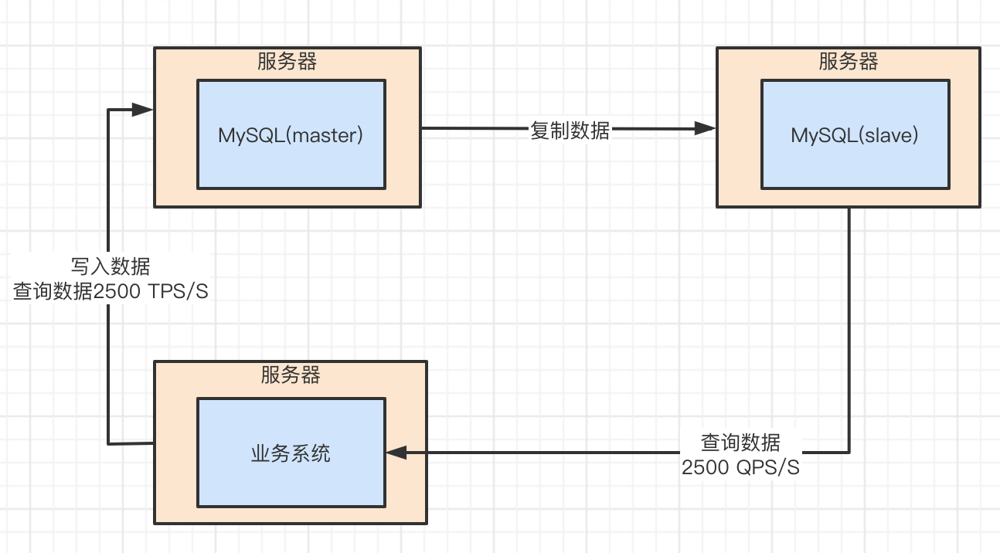

Mysql 学习笔记

## 1.1、系统是如何与mysql进行交互的

  访问数据库必须有mysql驱动，又了驱动才能和mysql数据库建立连接。那么有驱动之后 还必须建立 系统和mysql数据库的网络连接，只有建立了网络连接之后 才能进行各种增删改查。


### 1.2、java系统 难道只跟数据库建立一个连接吗？

   一般我们开发的web系统都是部署在Tomcat中，而Tomcat有多个线程来并发的处理多个请求。如果多个请求都来争抢一个连接 去访问数据库，那么其效率是必会很低的。 如果Tomcat中每个线程在每次访问数据库的时候，都基于驱动去创建一个数据库连接，然后执行SQL语句，执行完后销毁数据库连接。但是当Tomcat有上百的线程并发去频繁的创建连接，这样合适吗？可定不合适 ，因为我们都知道 数据库连接都是非常耗时，好不容易建立了连接，在执行完成sql语句后，把数据库连接销毁后，再次重新建立连接，其效率非常低下。所以 使用数据库连接池来确保，数据库的连接。这个池子维护着多个数据库连接，让多个线程使用里面不同数据库连接去执行SQL语句，执行SQL后 不销毁这些连接，而是把连接放回到池子里面，后续继续使用。


### 1.3、数据库连接池作用

  数据库连接池是 维护了系统和多个数据库的连接。除此之外，系统每次和MySQL建立连接的时候，还会根据传递过来的账号和密码，进行账号密码的验证，库表权限的验证。


### 1.4、网络连接应该交给线程去处理

  在数据库服务器的连接池的某个连接接收到网络请求后，谁负责去这个连接中去监听网络请求？谁负责从网络连接中把请求数据读取出来呢？  这个网络请求就必须分配一个线程去处理了。通过线程去监听请求和读取数据。

### 1.5、谁处理接收到的SQL语句

 当MySQL内部的工作线程从 一个网络连接中读取出来一个SQL语句之后，此时改如果执行这些SQL呢？ 这些MySQL提供了一个 组件，就是SQL接口(SQL Interface)，它是一套执行SQL语句的接口，专门用于执行我们发送给MySQL的 增删改查的SQL语句


### 1.6、如何让MySQL看到SQL语句

  对于了解SQL语法的人，可以看懂SQL语句，但是机器不认识。那么就需要 将SQL语句解析后，然后机器能看懂。所以MySQL 内部提供了一个查询解析器(parser)，它就是专门负责解析SQL语句的。


### 1.7、查询优化器

 在解析SQL语句后，MySQL内部的查询优化器(Optimizer) 会选择一个最优的查询路径。也就是按照一定的操作步骤去处理。


### 1.8、调用存储引擎接口，真正执行SQL 语句

 把查询优化器选择的最优查询路径，按照一定的顺序和步骤去执行这个SQL语句的计划，把这个计划交给底层的存储引擎去真正的执行。


### 1.9、谁调用存储引擎

 存储引擎可以访问内存以及磁盘上面的数据，那么谁来调用存储引擎的接口呢？ 这就需要执行器 根据优化器选择的执行方案，去钓鱼存储引擎的接口按照一定的顺序和步骤 把SQL语句的逻辑给执行了。

  执行器根据优化器生成的一套执行计划，然后不停的调用存储引擎的各种接口去完成SQL语句的执行计划。


## 2、存储引擎的内存结构

###  2.1、 InnoDB存储引擎内存结构：缓存池

​    InnoDB存储引擎一个非常重要的放在内存里的组件，就是缓存池(Buffer Pool)，这里会缓存很多的数据，以便以后在查询的时候，内存缓存池有数据，就不用去查磁盘了。


当存储引擎执行更新语句当时候，它会先在缓存池看看是否有数据，如果不在的话 那么会直接从磁盘里加载到缓存池里来，而且接着还会对这行记录加独占锁。


### 2.2、undo log日志文件，让更新后的数据可以回滚

   在进行数据的更新是，比如将id=2 这行数据的name 原来的值“hello”，更新为“hi” ,那么此时要先将更新原来的值"hello"和“id=2”的这些信息，写入到undo 日志中去。

​    如果在执行一个更新语句是，他们是在一个事务里的话，那么事务提交之前我们都可以对数据进行回滚操作，把要更新为"hi"的值回滚到之前到“hello”去。


  


### 2.3、更新buffer pool的缓存数据

  当把要更新的数据从磁盘文件加载到缓存池，同时对他加锁之后，而且还把更新前对旧值写入到undo 日志文件中，这是就可以正式开始更新这行记录了。 更新的时候，先是更新缓存池中的记录，这个数据此时是脏数据。

   这个更新内存缓存池中的数据，就是把 id=2 这行数据的name 原来的值“hello”，更新为“hi”。 此时内存缓存池中的数据是脏数据，是因为 磁盘上 “id=2” 这行数据的name 的值还是“hello”，但是内存中这行数据已经被修改了，所以叫做“脏数据“；


### 2.4、redo log buffer

 当上我们将内存里的数据修改后，但磁盘上数据还没有修改，那么此时若mysql 所在的机器宕机里，必然会导致内存里修改的数据丢失，这怎么办呢？

  这个时候，就必须把内存所做的修改写入到一个Redo Log Buffer里去，这也是内存里的一个缓冲区，是用来存放redo日志的。 

  Redo 日志，就是记录下来 你对数据做了什么 修改，比如 对“id=2” 这行数据的name 的值修改为“hi”， 这就是一个日志。


此时丢失的数据 不要紧，因为一条更新语句，没有提交事务，就代表它没有执行成功，此时MySQL宕机虽然导致内存里的数据丢失，但是 磁盘上的数据还是原来的。

### 2.5、提交事务 redo日志写入磁盘

 当更新数据后，提交了一个事务，此时会根据一定策略把redo日志 从redo log buffer里 刷入到磁盘文件中去。

   这个策略是通过innodb_flush_log_at_trx_commit来配置，如果这个参数的值为0，那么你提交事务的时候，是不会把redo log buffer里的数据刷入磁盘文件的。若此时已经提交了事务，结果mysql宕机，那么此时内存里的数据全部丢失。


当这个参数innodb_flush_log_at_trx_commit的值为1，那么在提交事务的时候，就必须把redo log从内存刷入到磁盘文件里去，只要事务提交成功，那么redo log 就必然在磁盘里。


只要提交事务成功之后，redo日志就会在磁盘文件里，这个redo日志 记录了修改了哪些数据，如 将数据“id=2, name字段修改为 xxx“等。

 在提交事务后，若mysql突然崩溃了，此时数据不会丢失，虽然内存里的修改成了name=xxx的数据丢失了，但是redo日志里记录了，你对某条数据的修改。 那么mysql在重启之后，它可以根据redo日志去恢复之前做过的修改。


当这个参数innodb_flush_log_at_trx_commit的值为2，它表示的意思是 提交事务的时候，把redo日志写入磁盘文件对应的os cache缓存里去，而不是直接进入磁盘文件，可能在1秒后才会把os cache里的数据写入磁盘里去。 

  这种模式下，在提交事务之后，redo log可能仅仅停留在os cache内存 缓存里，没有实际进入到磁盘文件，如果此时机器宕机，那么os cache里的 redo log就会丢失，数据也会丢失。


## 3、MySQL binlog 日志文件

###  3.1、mysql binglog 是什么

​    在上面说的redo log 它是属于innodb存储引擎特有的一个东西。 而binglog叫做归档日志，它里面记录的是偏向于逻辑性的日志，类似“对 user表中的id=2的一行数据做了更新操作，更新以后的值是什么”。binlog不是InnoDB存储引擎特有的日志文件，而是属于mysql server自己的日志文件。

###  3.2、提交事务时候，同时写入binlog

​    上面有说到在提交事务的时候，会把redo log日志写入到磁盘文件中去，其实在提交事务的时候，它同时还会把这次更新对应的binlog日志写入到磁盘文件中去。


这个图里加入执行器，这个组件负责根存储引擎配合完成一个SQL语句在磁盘与内存层面的全部数据更新操作。

### 3.3、binlog日志的策略分析

 对于binlog日志，其实也有不同的刷盘策略，有个sync_binlog参数可以控制binlog的刷盘策略，它的默认值是0，此时把binlog写入磁盘的时候，其实不是直接写入磁盘文件，而是进入os cache内存缓存。 这种策略方式就会存在问题，当还没有将os cache的数据刷入磁盘时，如果发生了机器宕机，那么os cache里的binlog日志就会丢失。

 如果将sync_binlog参数设置为1的话，那么此时会强制在提交时候的时候，把binlog直接写入到磁盘文件里去，那么这样提交事务之后，如果出现宕机，磁盘上的binlog也不会丢失的。


### 3.4、基于binlog和redo log完成事务的提交

 当我们把binlog写入磁盘后，接着会完成最终的事务提交，此时会把本次更新对应的binlog文件名称和这次更新的binlog日志在文件中的位置，都写入到 redo log日志文件中去，同时redo log日志文件里写入一个commit标记。这件事情完成之后，才算最终完成了事务的提交。


### 3.5、在redo日志中写入commit标记的意义上什么

  在redo日志中写入commit标记的作用是保持 redo log日志与binlog日志一致。上图中的5、6、7步骤是属于事务提交阶段。必须是三个步骤都执行完毕，才算是提交了事务。

   在刚刚完成步骤5时，也就是redo log刚刷入磁盘文件的时候，mysql宕机了，这个时候因为没有最终的事务commit标记在redo日志里，所以这种事务可以判定不成功。 

如果完成步骤6的时候，也就是binlog写入磁盘，此时mysql宕机了，同理，因为没有redo log中的最终commit标记，因此此时事务提交也是失败的。 必须是在redo log 中写入了最终的事务commit标记了，然后此时事务提交成功，而且redo log里面有本次更新对应的日志，binlog里也有本次更新对应的日志，redo log和binlog是完全一致的。


### 3.6、后台IO线程随机将内存更新后的脏数据刷回磁盘

   现在假设已经提交了事务，此时一次更新，已经把内存里的buffer pool中的缓存数据更新了，同时磁盘里有redo日志和binlog日志，都记录了我们指定的“id=2”的这行数据修改了 “name=xxx”.  但是这个时候磁盘上的数据文件里的 “id=2”这行数据的name字段还是等于 “hello” 这个旧的值。 

   所以MySQL有一个后台的IO线程，它的作用就是在某个时间里，随机的把内存buffer pool中的修改后的脏数据刷回磁盘上数据文件里去。




小结：InnoDB存储引擎主要包含了一些buffer pool、redo log buffer 等内存里的缓存数据，同时还包含了一些undo日志文件，redo 日志文件，还有mysql server自己的binlog日志。  在执行更新的时候，每条SQL语句，都会对应修改buffer pool里的缓存数据，写undo 日志、写redo log buffer几个步骤。

  但是在提交事务的时候，一定会把redo log刷入磁盘，binlog刷入磁盘，完成redo log中的事务commit标记。最后通过后台IO线程随机把buffer pool的脏数据刷入到磁盘里去。


## 4、buffer pool

###  4.1、buffer pool是什么

​     Buffer pool 是数据库内存的一个核心组件，因为增删改操作首先就是针对这个内存的buffer pool里的数据执行的。 这个组件里面缓存了磁盘上的真实数据，然后我们的java系统对数据库执行的增删改操作，其实主要就是对这个内存数据结构中的缓存数据执行的。

###  4.2、buffer pool的结构

  这个buffer pool是数据库的一个内存组件，可以理解为它是一片内存数据结构，所以这个内存结构肯定有一定的大小，不可能是无限大的。 buffer pool默认情况下是128M , 通过参数innodb_buffer_pool_size来设置。

### 4.3、数据页 MySQL中抽象出来的数据单位

数据库的核心数据模型是表+字段+行的概念，数据库里有一个一个的表，一个表有很多字段，然后一个表里有很多行数据，每行数据都有自己的字段值。但是我们的是数据不是一行一行的放在buffer pool里面的。   

Buffer pool里面存放的是缓存页，而缓存页是和磁盘中的数据页一一对应的，数据页是抽象出来的概念，也就是说磁盘文件中有很多的数据页。每一页数据里放了很多行数据。


那么在我们更新一行数据，此时数据库会找到这行数据所在的数据页，然后从磁盘文件里把这行数据所在的数据页直接加载到buffer pool里去。


### 4.4、磁盘上的数据页和Buffer Pool中的缓存页对应关系。

 在默认情况，磁盘中存放的数据页的大小是16kb，也就是说，一页数据包含了16kb的内容。而Buffer Pool中存放的一个一个数据页，我们通常叫做缓存页，因为buffer pool是一个缓冲池，里面的数据都是从磁盘缓存到内存去的。  而Buffer Pool 中默认情况下，一个缓冲页的大小和磁盘上的一个数据页的大小是 一一对应起来的，都是16kb。

### 4.5、缓存页对应的描述信息是什么

 对于每个缓存页，它实际上都会有一个描述信息，这个描述信息是用来描述这个缓存页的。 

 比如包含：这个数据页所属的表空间、数据页的编号、这个缓存页在Buffer Pool中的地址等。每个缓存页都会对应一个描述信息，这个描述信息本身也是一块数据，在Buffer Pool,每个缓存页的描述数据放在最前面，然后各个缓存页放在后面。 大概如下图所示


 注意：buffer pool中 的描述数据大概相当于缓存页大小的5%左右，也就是每个描述数据大概是800字节左右的大小，然后假设你设置的buffer pool大小是128mb，实际上buffer pool真正的最终大小会超出一些，可能有个130多MB的样子，因为它里面还要存放每个缓存页的描述数据。


### 4.6、数据库启动时候，是如何初始化Buffer Pool的

​    数据库一启动，那么就会按照设置的Buffer Pool大小，去操作系统申请一块内存区域，申请的区域要比设置的Buffer Pool要大，因为还要存放描述数据等。 当内存区域申请完成之后，数据库会按照默认的缓存页的16kb大小以及对应的800字节左右的描述数据的大小，在Buffer Pool中划分出来一个一个的缓存页和一个一个的他们对应的描述数据。


### 4.7、如何知道哪些缓存页是空闲的。

 在数据库运行起来之后，当你不停的执行增删改查的操作，此时就需要不同的从磁盘上读取一个个的数据页放入到buffer pool中对应的缓存页里去，把数据缓存起来，那么以后就可以对这个数据在内存里执行增删改查了。 但是有一个问题，它是如何知道哪些缓存是空闲的？ 

  所以数据库会为Buffer Pool设计了一个free链表，它是一个双向链表数据结构，这个free链表里，每个节点就是一个空闲的缓存页的描述数据块的地址，也就是说，只要你一个缓存页数空闲的，那么它的描述数据块就会被放入这个free链表中。 

  数据库刚启动时时候，可能所有的缓存页都是空闲的，因为此时可能一个空闲的数据库，一条数据都没有，所以此时所有缓存页的描述数据块，都会被放入这个free链表中。 这个链表的简单图如下 


从这个图可以知道，free链表里面就是各个缓存页的描述数据块，$\textcolor{RED}{只要缓存页是空闲的}$，$\textcolor{RED}{那么它们对应的描述数据块就会加入到free链表中}$，每个节点都会双向链接自己的前后节点，组成一个双向链表。

这个free链表还一个基础节点，它会引用链表的头节点和尾节点，里面还存储了链表中有多少个描述数据块的节点，也就是有多少个空闲的缓存页。

### 4.8、free链表占用多少内存空间

​    free链表它本身其实就是Buffer Pool里是描述数据块组成的，可以认为每一个描述数据块里都有两个指针，一个是free_pre,一个是free_next，分别指向自己的上一个free链表的节点，以及下一个free链表的节点。 

通过buffer Pool中的描述数据块的free_pre和free_next指针，就可以把所有的描述数据串成一个free链表，上面图是为了方便展示，所有将 描述数据单独画了一份出来，表示他们直接的指针引用关系。

  对于free链表而言，只有一个基础节点是不属于buffer pool的，它是一个40字节大小的一个节点，里面存放了free链表的头节点的地址，尾节点的地址，还有free链表里当前有多少个节点。

### 4.9、如果将磁盘上的页读取到Buffer Pool的缓存页中去？

  通过free链表可以很好的解决。首先从free链表中获取一个描述数据块，然后就可以对应的获取到这个描述数据块对应的空闲缓存页。


接下来我们就可以把磁盘上的数据读取到对应的缓存页里去，同时把相关的一些描述数据写入到缓存页的描述数据块里去，比如这个数据页所属的表空间之类的信息，最后把 那个描述数据块从free链表中移除就可以了。


### 4.10、怎么知道数据页有没有被缓存。

  在执行增删改查的时候，首先要看看这个数据页有没有被缓存，如果没有缓存 那么就从free中找到一个空闲的缓存页，从磁盘上读取数据页写入缓存页，写入描述数据，然后从free链表中移除这个描述数据块。若数据页以及被缓存，那么就是直接使用。

  所以数据库中还有一个哈希表数据结构，它用表空间号+数据页号，作为一个key，然后缓存页的地址作为value。当是一个数据页的时候，通过“表空间号+数据页号” 作为key去 这个哈希表里查询，如果没有读取数据页，如果有说明数据页已经被缓存了。


### 4.11、脏数据页是怎么来得。

 在执行增删改到时候，如果发现数据页没有缓存，那么必然会基于free链表找到一个空闲的缓存页，然后将数据读取到这个空闲缓存页上去，若已经缓存了那么下次必然会直接使用缓存页。 要更新得数据页在buffer pool的缓存页里，供你去直接执行增删改到操作。当要更新buffer pool的缓存页数据后，那么缓存页的数据就和磁盘页上的数据就不一致了，这个时候就说缓存页数脏数据，脏页。

### 4.12、怎么知道哪些缓存页是脏页呢

  数据库引入了一个跟free链表类似的 flush链表，这个flush链表的本质是通过缓存页的描述数据块中的两个指针，让**被修改过**的缓存页的**描述数据块**，组成一个双向链表。 凡事被修改过的缓存页，都会把它的描述数据块加入到flush表中去,flush链表里的这些都是脏页，后续都要flush刷新到磁盘上去。


### 4.13、如果Buffer Pool 的缓存页不够怎么办？

   当我们执行CRUD操作的时候，无论是查询数据，还是修改数据，实际上都会把磁盘上的数据页加载到缓存页里来。 而加载数据页到缓存页的时候，必然是要加载到空闲的缓存页里去，所以必须要从free链表中找一个空闲的缓存页，然后把磁盘上的缓存页加载到那个空闲的缓存页里去。 

那么随着不停到把磁盘上的数据页加载到空闲的缓存页里去，free链表中的空闲缓存页就会越来越少。free链表中不停的移除空闲缓存页，次早会有那么一瞬间会发现free链表中已经没有空闲缓存页了。 若这个时候 还要加载数据页到一个空闲的缓存页的时候，该怎么处理呢？ 

 对于这个问题我们思考一下，若所有的缓存页都被塞入了数据了，此时无法从磁盘上加载新的数据页到缓存页里去，那此时只有一个办法了，就是**淘汰一下缓存页**。

  淘汰缓存页就是说 你 **必须把一个缓存页里修改的数据**，给它刷到磁盘上的数据里去，然后将这缓存页清空就可以了让它重新变成一个空闲的缓存页。 接着再把磁盘上需要的数据页加载到这个刚刚腾出来的 空闲缓存页中去。 

  那么要把一个缓存页里的数据刷入到磁盘，腾出一个空闲缓存页，那么应该把哪个缓存页的数据刷入到磁盘呢？ 解决这个问题就需要引入缓存命中率的概念。

### 4.14、缓存命中率来解决缓存页里数据刷入磁盘问题

   假如现在有两个缓存页，一个缓存页的数据，经常会被修改和查询，比如在100次请求中，有30次都是在查询和修改这个缓存页里的数据，那么此时可以说这种情况下，缓存命中率很高。 因为在100次请求中，30才都可以操作缓存，不需要从磁盘加载数据，那么这个缓存命中率就比较高了。 

若另外一个缓存页里的数据，从磁盘加载到缓存页之后，被修改和查询1次，之后100次请求中没有一次是修改和查询这个缓存页的数据，那么此时就是这个缓存命中率低。因为其大部分请求可能还需要走磁盘查询数据，它要操作的数据不在缓存中。

 那么对于这个两个缓存页，要选择一个将其中的缓存页的数据刷入到磁盘中，以此腾出一个空闲的缓存。一般选择第二个缓存页，因为基本上没有人来使用它里面的数据，并且它还占据了一个缓存页。

### 4.15、引入LRU链表来判断哪些缓存页数不常用的。

  LRU链表(Least Recently Used),最近最少使用的意思。通过这个链表就可以知道最近最少使用的缓存页。当需要缓存页腾出一个刷入磁盘的时候，就可以选择LRU链表中最近最少使用的缓存页。

   假设从磁盘加载一个数据页到缓存页的时候，就把这个缓存页的描述数据块放到LRU链表头部，那么只要有数据的缓存页，都会在LRU里，而且最近被加载数据的缓存页，都会放到LRU链表的头部。


假设某个缓存页的描述数据块在LRU链表的尾部，后续只要查询或者修改了这个缓存页的数据，那么就要把这个缓存页挪动道LRU链表的头部去，也就是说最近被访问过缓存页，一定在LRU链表的头部。 这样的话，当你的缓存页没有一个空的时候，那就需要查找最近最少被访问的缓存页将其刷入磁盘。从LRU链表的尾部找一个缓存页，它一定是最近最少访问的那个缓存页，这样就可以腾出空闲的缓存页了。

### 4.16、LRU机制实际运行过程中存在的巨大隐患。

   首先是MySQL的预读机制，所谓的预读机制，就是当你从磁盘上加载一个数据页的时候，可能会连带着吧这个数据页相邻的其他数据页，也加载到缓存里去。 举个例子，假设现在有两个空闲缓存页，然后加载一个数据页的时候，会连带着把这个相邻的数据页页加载到缓存里去，正好每个数据页放入一个空闲缓存页。

   但是实际只有一个缓存页是被访问的，另一个是通过预读机制加载到缓存页，其实没有人访问。此时两个缓存页都在LRU链表的前面，如图。


 从图我们可以执行，前两个缓存页都是刚加载进来的，但是此时第二个缓存页是通过预读机制一起加载进来的，它也放到了链表的前面，但实际上没有人去访问它。 除了第二个缓存页之外，第一个缓存页，以及后面的两个缓存页，都是一直有人访问的缓存页。 这里只不过上图代表的是刚刚把头部两个缓存页加载进来的时候的一个LRU链表当时的情况。

  假设现在没有空闲缓存页，那么此时要加载新的数据页了，是不是就要LRU链表的尾部把所谓的“最近最少使用的一个缓存页”给拿出来，刷入到磁盘，然后腾出来一个空闲缓存页了？  这种情况下，如果把上图中LRU尾部的那个缓存页刷入到磁盘后清空，这样合理吗？肯定不合理，它是一直被频繁访问的，只不过在这一个瞬间，被新加载进来的灵感缓存页给占据了LRU链表前面的位置，尤其是第二个缓存页 它还是通过预读机制加载进来的，根本就不会有人访问。 所以这种情况把LRU链表尾部的缓存页刷入到磁盘，是不合理的。它应该把上图LRU链表中第二个通过预读机制加载进来的缓存页给刷入磁盘和清空。

#### 4.16.1、哪些情况会触发MySQL预读机制

```
（1）有⼀个参数是innodb_read_ahead_threshold，他的默认值是56，意思就是如果顺序的访问了⼀个区⾥的多个数据页，访问的数据页的数量超过了这个阈值，此时就会触发预读机制，把下⼀个相邻区中的所有数据页都加载到缓存
⾥去
（2）如果Buffer Pool⾥缓存了⼀个区⾥的13个连续的数据页，⽽且这些数据页都是⽐较频繁会被访问的，此时就会直
接触发预读机制，把这个区⾥的其他的数据页都加载到缓存⾥去
这个机制是通过参数innodb_random_read_ahead来控制的，他默认是OFF，也就是这个规则是关闭的
所以默认情况下，主要是第⼀个规则可能会触发预读机制，⼀下⼦把很多相邻区⾥的数据页加载到缓存⾥去，这些缓
存页如果⼀下⼦都放在LRU链表的前⾯，⽽且他们其实并没什么⼈会访问的话，那就会如上图，导致本来就在缓存⾥
的⼀些频繁被访问的缓存页在LRU链表的尾部。
```

#### 4.16.2、可能导致频繁被访问的缓存页被淘汰的场景

   可能导致频繁访问的缓存页被淘汰的场景就是全表扫描，所谓的全部，就是类似如下的SQL语句：SElECT * FROM URSRS ，此时没有添加任何where条件，会导致它直接把这个表里所有的数据页从磁盘加载到Buffer Pool里去。 这个可能会一下子就把这个表的所有数据页都一一装入各个缓存页里去，此时可能LRU链表中排在前面的一大串缓存页，都是全表扫描加载进来的缓存页，那么如果这次全表扫描之后，后续几乎没有用到这个表里的数据。而LRU链表尾部，可能全部都是之前一直被频繁访问的那些缓存页。

  然后当你要淘汰掉⼀些缓存页腾出空间的时候，就会把LRU链表尾部⼀直被频繁访问的缓存页给淘汰掉了，⽽留下了 之前全表扫描加载进来的⼤量的不经常访问的缓存页！


 MySQL设计预读机制的原因是为了提升性能，假如读取了数据页01到缓存页里去，接下来又可能会接着顺序读取数据页01相邻的数据页02到缓存页里去，这个时候再读取数据页02点时候要再次发起一次磁盘IO。 所以为了提升性能，MySQL就设计了预读机制，也就是说如果在一个区内，你顺序读取了好多数据页，比如数据页1-10都被依次读取了，MySQL会判断你可能接着会继续顺序读取后面的数据页。

 把这些读取到Buffer Pool里去，那么后续再读取数据页的时候，就可以直接从Buffer Pool里拿到数据了。

### 4.17、基于冷热数据分离的思想设计LRU链表

   在上面的问题中所有的缓存页都混在一个LRU链表里，而真正的LRU链表设计是，一部分是热数据，一部分是冷数据，这个冷热数据的比例是由“innodb_old_blocks_pct”参数控制的，默认是37，也就是冷热数据占比37%。 LRU链表简单图示如下


 在运行期间，冷热两个区域是如何使用的。 首先数据页第一次被加载到缓存的时候，这个缓存页会被放在LRU链表冷数据区域的链表头部。 也就是说第一次把数据页加载到缓存页之后，这个缓存页实际上就是放在冷数据区域的链表头部位置。


#### 4.17.1、冷数据区域的缓存页什么时候放到热数据区域

​     假设刚加载一个数据页到缓存页之后，它在冷数据区域的链表头部，然后立马(在lms以内)就访问了一下这个缓存页，之后就再也不访问，这种情况下那个缓存页就不应该放到热数据区域的头部。

   所以MySQL设置了一个规则，通过innodb_old_blocks_time参数来控制，默认值是1000毫秒。也就是说，必须是一个数据页被加载到缓存页之后，$\textcolor{red}{在1s之后}$，$\textcolor{red}{你访问这个缓存页，它才会被挪动到数据区域的链表头部去。}$ 因为假设你加载一个数据页到缓存中去，然后通过1s之后你还访问这个缓存页，说明了后续可能会经常要访问它。这个时间限制就是1s，因此只有1s后你访问了这个缓存页，它才会给你把这个缓存页放到热数据区域的链表头部去。

   

 所以这里要注意，如果数据加载到缓存页之后1s,你再访问这个缓存页，它就会被放入到数据区域的链表头部，如果数据刚加载到缓存页，在1s内你就访问缓存页，此时它是不会把这个缓存页放入到热数据区域的头部的。

#### 4.17.2、预读机制和全表扫描加载进来的很多缓存页

   在LRU链表方案下，预读机制以及全表示扫描加载进来的一大堆缓存页，它会放在LRU链表的冷数据去的前面。而这个时候热数据区域已经有很多被频繁访问的缓存页，那么热数据区域还是存放被频繁访问的缓存页，只要热数据区域有被缓存页访问，那么它还是会被移动到热数据区域的链表头部去。 而通过预读机制和全表扫描加载进来的一大堆缓存页，此时都在冷数据区域里，跟热数据区域里的频繁访问的缓存页，是没有关系的。

#### 4.17.3、预读机制和全表扫描加载进来的缓存页，能进入热数据区域吗？

  如果仅仅一个全表扫描的查询，此时肯定在1s内把一大堆缓存页加载进来，然后访问了这些缓存页一下，通常这些操作1s内就结束了。 那么基于这种机制，这些缓存页是不会从冷数据区域转移到热数据区域的。除非在冷数据区域的缓存页 在1s之后还有被访问，那么就可以判断未来有可能会被频繁访问缓存页，然后移动到热数据区域的链表的头部去。

#### 4.17.4、如果缓存页不够，需要淘汰缓存页，该怎么处理

 那么就会找到LRU链表的冷数据区域的尾部的缓存页，它他们是之前被加载进来的，而且加载进来1过后都没有人访问过，说明这个缓存页根本没有人去访问，它就是冷数据。


#### 4.17.5、小结

 通过LRU链表的设计机制，刚加载数据的缓存页都是放在冷数据区域的头部，1s过后被访问了才会放到热数据区域的头部，热数据区域的缓存页被访问了，就会自动放到头部去。 这样的话，实际上冷数据区域放的都是加载进来的缓存页，最多1s内被访问过，之后就再也没有访问的冷数据缓存页。 

   而加载进来之后在1s过后还经常被访问的缓存页，都放在冷人数据区域了，他们进行了冷热数据的隔离。那么

在淘汰缓存的时候，一定是优先淘汰冷数据区域几乎不怎么被访问的缓存页。

### 4.18、LRU链表热数据区域的优化。

  LRU链表的热数据区域的性能优化，就是在热数据区域，如果访问了一个缓存页，是不是应该把它立刻移动到热数据区域的链表头去呢？ 其实这种情况不应该频繁的移动，因为频繁的移动其性能并不好。 

  所以LRU链表的热数据区域的访问规则被优化了一下，即只有在热数据区域的3/4部分的缓存页被访问了，才会给你移动到链表头部去。 若你是热数据区域前面1/4的缓存页被访问了，它是不会移动到链表头部去的。

   举个例子，假设也数据区域的链表有100个缓存页，那么排在前面的25个缓存页，它即使被访问了，它也不会移动到链表头部去的，但是对于排在后的75个缓存页，它只要被访问就会被移动到链表头部去。

 这样就可以减少链表中节点到移动。

### 4.19、定时把LRU尾部的部分缓存刷入到磁盘

 在将缓存刷入磁盘时，不是等到缓存页满的时候，才会挑选LRU冷数据区域尾部的几个缓存页刷入磁盘，而是有一个后台线程，他会运行一个定时任务，这个定时任务每隔一段时间就会把LRU链表的冷数据区域的尾部的一下缓存页，刷入磁盘中去，清空这个缓存页，把它加入到free链表去。


#### 4.19.1、把flush链表中的一些缓存页定时刷入磁盘

 如果仅仅把LRU链表中的冷数据区域的缓存页刷入到磁盘，这是明显不够的，因为LRU链表的热数据区域里的很多缓存页可能也会被频繁的修改，难道他们永远都不刷入磁盘？ 所以这个后台线程同时也会在MySQL不繁忙的时候，把flush链表中的缓存页都刷入磁盘中，这样被修改的数据迟早都会刷入磁盘中。 

  只要flush链表中的缓存页被刷入磁盘，那么这些缓存页也会从flush链表和lru链表中移除，然后加入到free链表中去。 所以可以理解为，它一边不停的加载数据到缓存页里去，不停到查询和修改缓存数据，然后free链表中的缓存页不停的在减少，flush链表中的缓存页在不停的增加，lru链表中的缓存页不停的在增加和移动。另外一边，后台线程不停的把lru链表的冷数据区域的缓存页以及flush链表的缓存页，刷入磁盘中来清空缓存页，然后flush链表和lru链表中的缓存页在减少，free链表中的缓存页在增加。

#### 4.19.2、如果没有了空闲缓存页怎么办

 如果没有空闲缓存页，那么此时要从磁盘加载数据页到一个空闲缓存页中，就会从LRU链表的冷数据区域的尾部找到一个缓存页，它一定是最不经常使用的缓存页，然后把它刷入磁盘和清空，然后把数据页加载到这个腾出来的空闲缓存页里去。

## 5、多个Buffer Pool来提升数据库的并发性能

### 5.1、多个线程同时访问buffer pool

 Buffer pool其本质是一大块内存数据结构，由一大堆的缓存页和描述数据块组成，然后加上各种链表(free、f lush、lru)来辅助它的运行。 那么当MySQL同事接收到了多个请求，那么它自然用多个线程来处理多个请求。

 然后多个线程同时去访问buffer pool，就是同时去操作缓存页，同时操作一个free链表、flush链表、lru链表。如图多线程并发访问buffer pool 


当多个线程并发访问这个Buffer Pool,此时他们都是在访问内存里的一些共享的数据结构，比如说缓存页、各种链表之类的，那么此时必然要进行加锁。 所以在并发访问一个Buffer Pool，必然要加锁，然后让一个线程先完成一系列的操作。

### 5.2、多线程并发访问加锁，数据库的性能还会好吗？

  在大部分情况下，每个线程都是查询或者更新缓存页里的数据，这个操作是发生在内存里的，基本上都是微秒级的，非常快，包括更新free、flush、lru这些链表，他们都是基于链表进行一些指针操作，性能也是极高的。所以即使每个线程排队加锁，然后执行一系列操作，数据库的性能还行。但是就算这样，每个线程加锁后排队一个个操作这也不是特别好。比如在线程拿到锁之后，它可能要从磁盘读取数据页加载到缓存页里去，这还发生了一次磁盘IO，所以要进行磁盘IO的话，耗时就会多一些，那么后面排队等待的线程就要多等待一会了。

### 5.3、多个Buffer Pool来提升并发能力

 ⼀般来说，MySQL默认的规则是，如果你给Buffer Pool分配的内存⼩于1GB，那么最多就只会给你⼀个Buffer Pool。 但是如果你的机器内存很⼤，那么你必然会给Buffer Pool分配较⼤的内存，

⽐如给他个8G内存，那么此时你是同时可 以设置多个Buffer Pool的，⽐如说下⾯的MySQL服务器端的配置。 

```
[server] 
innodb_buffer_pool_size = 8589934592
innodb_buffer_pool_instances = 4 
我们给buffer pool设置了8GB的总内存，然后设置了他应该有4个Buffer Pool，此时就是说，每个buffer pool的⼤⼩就 是2GB
```

这个时候，MySQL在运⾏的时候就会有4个Buffer Pool了！每个Buffer Pool负责管理⼀部分的缓存页和描述数据块，有 ⾃⼰独⽴的free、flush、lru等链表。 这个时候，就可以分散压力了。


### 5.4、buffer pool能在 运行期间调整大小？

  就目前的的原理来说，buffer pool是绝对不能支持运行期间动态调整大小。

#### 5.4.1、更加chunck机制将buffer pool拆小？

 Buffer Pool 是由多个chunk组成的，它的大小是innodb_buffer_pool_chunk_size参数控制的，默认128mb.

⽐如现在我们给buffer pool设置⼀个总⼤⼩是8GB，然后有4个buffer pool，那么 每个buffer pool就是2GB，此时每个buffer pool是由⼀系列的128MB的chunk组成的，也就是说每个buffer pool会有16 个chunk。

  然后每个buffer pool⾥的每个chunk⾥就是⼀系列的描述数据块和缓存页，每个buffer pool⾥的多个chunk共享⼀套 free、flush、lru这些链表，此时的话，看起来可能⼤致如下图所⽰。


这样每个buffer pool里有多个chunk，每个chunck就是一系列的描述数据块和缓存页。这样的话就是把buffer pool按照chunk为单位拆分为一系列的小数据块，但是每个buffer pool是共用一套free、flush、lru的链表的。


#### 5.4.2、基于chunck机制在运行期间，动态调整buffer pool大小。

根据chunck机制就可以动态的调整buffer pool大小了， 比如现在我们buffer pool现在总大小是8GB，现在要动态加载到16GB，那么此时只要申请一系列的128MB大小的chunck就可以了，只要每个chunck是连续的128MB内存就行了，然后把这些申请的chunk内存分配到buffer pool就行。 有了这个chunck机制，此时并不需要额外申请16GB的联系内存空闲，然后还要把已有的数据进行拷贝。

#### 5.4.3、该如何给buffer pool设置内存

  在给buffer pool设置内存是时候，不能随便设置要根据合理的比例，一般buffer pool设置为机器的内存的50%～60%左右。 不能说机器类内是多大你就设置多大，因为机器上还有其它的东西在运行，它也需要内存。

 

#### 5.44、buffer pool总大小=(chunk大小 * buffer pool数量)的 2倍

  在确定buffer pool的总大小后，就要考设置多少个buffer pool和chunk的大小了， 这里又个公式就是：

buffer pool总大小=(chunk大小* buffer pool数量)的倍数， 比如默认的chunk大小上128MB，那么此时如果你机器上32GB，那么给buffer pool总大小在20GB左右，那么buffer pool的数量应该是16个。

 此时 chunk大小*buffer pool的数量=16*  * 128MB =2048MB,然后 buffer pool总大小上20GB, 此时buffer pool总大小就是2048的10倍，这就符合规则了。


## 6、为什么不直接更新磁盘上的数据

 因为一个请求直接对磁盘文件进行随机读写，然后更新后磁盘文件里 数据，虽然技术上可以做到，但是必然导致执行请求对性能极差。 因为磁盘随机读写的性能最差，所以直接更新磁盘文件，必然导致我们的数据库完全无法抗下任何稍微高一点的并发场景

 所以MySQL设计了如此复杂的一套机制，通过内存里更新数据，然后写redo log以及事务提交，后台线程不定时刷新内存里的数据到磁盘文件里。 通过这种方式保证每个更新请求，尽量更新内存然后顺序写入日志文件。


### 6.1、MySQL为什么引入数据页概念

 假设没有数据页，那么要把磁盘上的数据加载到内存里来，然后对内存里的数据进行更新，同时写redo log到磁盘上去。但是这里有一个问题，难道我们每次都是把磁盘里的一条数据加载到内存里去进行更新，然后下次要更新别的数据，再从磁盘里加载另外一条数据到内存曲。 这样一条数据到加载到内存里去更新，这种效率非常低。

 所以引入数据页的概念，把数据组织成一页一页的概念，每一页有16kb，然后每次加载磁盘的数据到内存里，到时候，是至少加载一页数据进去，甚至是多页数据进去。 而在内存里面就是数据到更新其效率 比从磁盘一条一条的读取高多了。

### 6.2、一行数据在磁盘上是如何进行存储的。

 对数据页中的每一行数据，它在磁盘上是怎么存储的？  这里就涉及到一个概念，就是行格式，它可以对一个表指定它的行存储的格式是怎么样的，比如这里用一个COMPACT格式。

```
CREATE TABLE table_name(columns)ROW_FORMAT=COMPACT
AlTER TBALE table_name ROW_FORMAT=COMPACT
```

 在建立表的时候，就指定一个行存储的格式，这里指定里一个COMPACT行存储格式，在 这种格式下，每一行数据它实际存储的时候，大概格式类似下面

```
变长字段的长度列表，null值列表，暑数据头，column01的值，column02的值....
```

对于每一行数据，其它存储的时候都会有一些头字段对这行数据进行一定的描述，然后再放上它这一行数据每一列的具体的值，这就是所谓的行格式。除此之外还有其它的几种存储格式。

### 6.3、变长字段在磁盘中是怎么存储的。

  在MySQL里面有一些字段的长度是变长的，不是固定的，比如VARCHAR(10)之类的这种类型的字段，实际上它在里面存放的字符串的长度是不固定的，有可能是“hello”这么一个字符串，也有可能是“a”这么一个字符串。

来假设⼀下，现在有⼀⾏数据，他的⼏个字段的类型为VRACHAR(10)，CHAR(1)，CHAR(1)，那么 他第⼀个字段是VARCHAR(10)，这个长度是可能变化的，所以这⼀⾏数据可能就是类似于：hello a a，这样⼦，第⼀ 个字段的值是“hello”，后⾯两个字段的值都是⼀个字符，就是⼀个a 

   然后另外⼀⾏数据，同样也是这⼏个字段，他的第⼀个字段的值可能是“hi”，后⾯两个字段也是“a”，所以这⼀⾏数据可 能是类似于：hi a a。⼀共三个字段，第⼀个字段的长度是是不固定的，后⾯两个字段的长度都是固定的1个字符。 

 那么现在，假设把上述两条数据写⼊了⼀个磁盘⽂件⾥，两⾏数据是挨在⼀起的，那么这个时候在⼀个磁盘 ⽂件⾥可能有下⾯的两⾏数据： 

```
hello a a hi a a
```

两行数据在底层磁盘文件里是挨着存储的，

### 6.4、存储在磁盘文件里的变长字段为什么难以读取？

  现在假设要从磁盘上读取出 hello a a 这一行数据，但是读取不容易，在读取这一行数据，我们不知道哪些内容是一行数据。 因为这个表里的第一个字段是varchar(10)类型的，第一个字段长度是多少我们是不知道的。所以读取出来“hello a a hi” 是一行数据，也有可能读取出来“hello a”是一行数据，在不知道一行数据的每个字段长度的情况下，去读取数据是不现实的。

#### 6.4.1、引入变长字段的长度列表，解决一行数据的读取问题

   在存储每一行数据的时候，都保持下它的变长字段的长度列表，这样才能解决一行数据的读取问题。

也就是说，你在存储“hello a a”这⾏数据的时候，要带上⼀些额外的附加信息，⽐如第⼀块就是他⾥⾯的变长字段的长度列表

 也就是说，这个hello是VARCHAR(10)类型的变长字段的值，那么这个“hello”字段值的长度到底是多少？ 我们看到“hello”的长度是5，⼗六进制就是0x05，所以此时会在“hello a a”前⾯补充⼀些额外信息，⾸先就是变长字段 的长度列表，你会看到这⾏数据在磁盘⽂件⾥存储的时候，其实是类似如下的格式：0x05 null值列表 数据头 hello a a。 你这⾏数据存储的时候应该是如上所⽰的！ 这个时候假设你有两⾏数据，还有⼀⾏数据可能就是：0x02 null值列表 数据头 hi a a，两⾏数据放在⼀起存储在磁盘 ⽂件⾥，

看起来是如下所⽰的： 0x05 null值列表 数据头 hello a a 0x02 null值列表 数据头 hi a a

#### 6.4.2、引入变长字段的长度列表后，如何解决变长字段的读取问题

假设此时你要读取“hello a a”这⾏数据，你⾸先会知道这个表⾥的三个字段的类型是VARCHAR(10) CHAR(1) CHAR(1)，那么此时你先要读取第⼀个字段的值，那么第⼀个字段是变长的，到底他的实际长度是多少呢？

 此时会发现第⼀⾏数据的“开头”有⼀个变长字段的长度列表，$\textcolor{red}{⾥⾯会读取到⼀个0x05这个⼗六进制的数字}$，发现第⼀ 个变长字段的长度是5，于是按照长度为5，读取出来第⼀个字段的值，就是“hello” 接着你知道后续两个字段都是CHAR(1)，长度都是固定的1个字符，于是此时就依次按照长度为1读取出来后续两个字 段的值，分别是“a”“a”，于是最终你会读取出来“hello a a”这⼀⾏数据！ 

接着假设你要读取第⼆⾏数据，你先看⼀下第⼆⾏数据后的变长字段长度列表，发现他第⼀个变长字段的长度是 0x02，于是就读取长度为2的字段值，就是“hi”，再读取两个长度固定为1的字符值，都是“a”，此时读取出来“hi a a”这 ⾏数据。

#### 6.4.3、如果有多个变长字段，如何存放他们的长度(注意多个变长字段存储)

⽐如⼀⾏数据有VARCHAR(10) VARCHAR(5) VARCHAR(20) CHAR(1) CHAR(1)，⼀共5个字段，其中三个是变长字 段，此时假设⼀⾏数据是这样的：hello hi hao a a 

此时在磁盘中存储的，$\textcolor{red}{必须在他开头的变长字段长度列表中存储⼏个变长字段的长度}$，⼀定要注意⼀点，他这⾥是$\textcolor{red}{逆序}$存储的！

 也就是说先存放VARCHAR(20)这个字段的长度，然后存放VARCHAR(5)这个字段的长度，最后存放VARCHAR(10)这 个字段的长度。 

现在hello hi hao三个字段的长度分别是0x05 0x02 0x03，但是实际存放在变长字段长度列表的时候，是逆序放的，那么⼀⾏数据实际存储可能是下⾯这样的： 0x03 0x02 0x05 null值列表 头字段 hello hi hao a a


一行数据的大致格式

```
变成字段长度列表， null值列表，数据头，数据数据
```


### 6.5、一行数据中多个NULL字段值在磁盘上怎么存储

####  6.5.1、一行数据里的NULL值不能直接存储

 一行数据中有一个特殊的数据区域，就是NULL值列表，这个就是说一行数据里可能有的字段是NULL，比如有个name字段，它允许为NULL,那在实际存储的时候，如果没有给他赋值，这个字段的值就是NULL。

  如果这个字段的NULL值我们在磁盘上存储的时候，是按照“NULL“这么一个字符串来存储的，是不是很浪费存储空间。它本来就是一个NULL，说明什么值都没有，为什么还给它存个“NULL”字符串。 所以在实际磁盘上存储数据的时候，一行数据里的NULL值肯定不会直接按照字符串的方式存放在磁盘上浪费空间的。

####  6.5.2、NULL值是以二进制bit位来存储的

对所有的NULL值，不通过字符串在磁盘上存储，⽽是通过⼆进制的bit位来存储，⼀⾏数据⾥假设有多个字段 的值都是NULL，那么这多个字段的NULL，就会以bit位的形式存放在NULL值列表中。

```
现在举个例⼦，假设你有⼀张表，他的建表语句如下所⽰：
CREATE TABLE customer (
name VARCHAR(10) NOT NULL,
address VARCHAR(20),
gender CHAR(1),
job VARCHAR(30),
school VARCHAR(50)
) ROW_FORMAT=COMPACT;
上⾯那个表就是⼀个假想出来的客户表，⾥⾯有5个字段，分别为name、address、genderjob、school，就代表了客
户的姓名、地址、性别、⼯作以及学校。
其中有4个变长字段，还有⼀个定长字段，然后第⼀个name字段是声明了NOT NULL的，就是不能为NULL，其他4个
字段都可能是NULL的。
那么现在我们来假设这个表⾥有如下⼀⾏数据，现在来看看，他在磁盘上是怎么来存储的：“jack NULL m NULL
xx_school”，他的5个字段⾥有两个字段都是NULL
```

对于这个案例中的数据，它在磁盘上的存储。 一行数据在磁盘上的存储格式应该是如下的

```
变长字段长度列表 NULL值列表 头信息 column1=value1 column2=value2.....columnN=value1N
```

但是这里要有区别，如果这个变长字段的值上NULL,那么就不用在变长字段长度列表里存放它的值长度里，所以上面的那行数据，只有name和school两个变长字段是有值的，把它的长度按照逆序放在变长字段长度列表中就可以

```
0x09 0x04 NULL值列表 头信息 column1=value1 column2=value2.....columnN=value1N
```

接着来看NULL值列表，这个NULL值列表是这样存放的，你所有允许值为NULL的字段，注意，是允许值为NULL，不 是说⼀定值就是NULL了，只要是允许你为NULL的字段，在这⾥每个字段都有⼀个⼆进制bit位的值，如果bit值是1说明 是NULL，如果bit值是0说明不是NULL。 

⽐如上⾯4个字段都允许为NULL，每个⼈都会有⼀个bit位，这⼀⾏数据的值是“jack NULL m NULL xx_school”，然后 其中2个字段是null，2个字段不是null，所以4个bit位应该是：1010

但是实际放在NULL值列表的时候，他是按逆序放的，所以在NULL值列表⾥，放的是：0101，整体这⼀⾏数据看着是 下⾯这样的 

```
0x09 0x04 0101 头信息 column1=value1 column2=value2 ... columnN=valueN 
```

另外就是他实际NULL值列表存放的时候，不会说仅仅是4个bit位，他⼀般起码是8个bit位的倍数，如果不⾜8个bit位就 ⾼位补0，所以实际存放看起来是如下的： 

```
0x09 0x04 00000101 头信息 column1=value1 column2=value2 ... columnN=valueN
```


## 7、表空间以及划分多个数据页的数据区

###  7.1、什么是表空间

 我们平时创建的那些表，其实都有一个表空间的概念，在$\textcolor{red}{磁盘上对应着“表名.ibd” 这样的磁盘文件}$，所以在物理层面表空间就是对应的一些磁盘的数据文件。  在表空间的磁盘文件里，其实有很多的数据页，一个数据页是16kb，不可能一个数据页就是一个磁盘文件。 所以一个表空间的磁盘文件里，其实有很多的数据页。

   但是有一个问题，就是一个表空间里包含的数据页太多了，不便于管理，所以在$\textcolor{red}{表空间里引入了一个数据区的概念}$，就是extent。  $\textcolor{red}{一个数据区对应着连续的65个数据页，每个数据页是16kb}$，$\textcolor{red}{所以一个数据区就是1mb，然后256个数据区被划分为一组。}$

   对于表空间而言，它的第一组数据区的第一个数据区的前3个数据页，都是固定的，里面存放了一些描述性的数据。比如FSP_HDR这个数据页，它里面存放了表空间和这一组数据区的一些属性。

  然后这个表空间里的其它各组数据区，每一组数据区的第一个数据区的头两个数据页，都是存放特殊信息的，比如XDES数据页就是用来存放这一组数据区的一些相关属性的，其实就是很多描述这组数据区的东西。


## 8、MySQL跟Linux存储系统交互的原理

###   8.1、Linux操作系统的存储系统

 MySQL数据库子啊执行底层磁盘读写IO操作的原理，这个涉及到Linux操作系统的磁盘IO原理，不管是MySQL执行磁盘随机读写还是磁盘顺序读写，其实都在底层的Linux层面，原理几乎都一致。

 简单来说，Linux的存储系统分为VFS层、⽂件系统层、Page Cache缓存层、通⽤Block层、IO调度层、Block设备驱动 层、Block设备层，如下图：


当mysql发起一次数据页当随机读写，或者是一次redo log日志文件的顺序读写的时候，实际上会把磁盘IO请求交给Linux操作系统的VFS层。 这一层的作用就是根据 你是对那个目录中的文件执行的磁盘IO操作，把IO请求交给具体的文件系统。 

  往下文件系统会先在Page Cache 这个基于内存的缓存里找 你要的数据在不在里面，如果有就基于内存缓存来执行读写，如果没有就继续往下一层走，此时这个请求会交给通用Block层，在这一层吧文件的IO 请求转换为Block IO请求。


接着IO请求转换为Block IO请求之后，把这个Block IO请求交给IO调度层，这一层默认采用CFQ公平调度算法，也就是说，假设此时数据库发起了多个SQL语句同时执行IO操作， 有一个SQL语句很简单，比如

```
update xxx set xxx1=xxx2 where id=1
```

它其实可能就只要更新磁盘上的block里的数据就可以了，但是有的SQL语句，比如select * from xx where xx1 lik"%xx%" 可能要IO读取磁盘上的大量数据。

 那么此时如果基于公平调度算法，就会导致它线程执行第二SQL语句读取大量数据的IO操作，耗时很久，然后第一个仅仅更新少量数据的SQL语句的IO操作，就一直等待，得不到执行的机会。  所以一般建议MySQL的生产缓存，需要调整为dealline IO调度算法，它的核心思想就是，任何一个IO操作不能一直不停的等待，在指定的时间范围内，都必须让他去执行。 所以基于dealline IO调度算法，第一个SQL的更新少量数据的IO操作可能等待一会儿后，就会得到执行的机会。

IO请求被转移到IO调度层


在IO完成调度之后，就会决定哪个IO请求先执行，哪个IO请求后执行，此时可以执行的IO请求就会交给Block设备驱动层，最后经过驱动把IO请求发送给真正的存储硬件，也就是Block设备层。


再硬件设备完成了IO读写操作之后，最后就会把响应经过上面的层级反向依次返回，最终MySQL可以得到本次IO读写操作的结果，  这就是MySQL和Linux存储系统交互的一个原理。


## 9、redo log 机制

### 9.1、redo log 日志的重要性

  如果没有redo log 那么在一个事务里有增删改SQL更新了缓存页，然后事务提交了，但是还没有来得及让后台IO线程把缓存页刷新到磁盘文件里，此时MySQL宕机了，然后内存数据丢失了，事务更新到数据就丢失了。

 所以才会引入redo log机制，这个机制就是在你提交事务的时候，绝对保证把你对缓存页做的修改以日志的形式，写入到redo log日志文件里去。

  只要你事务提交的时候保证 你做的修改以日志形式写入redo log日志，那么此时宕机也没有关系。 因为MySQL重启之后，会把之前事务更新做过的修改根据redo log在 Buffer Pool里重新做一遍就可以了，就可以恢复出来当时事务对缓存页做的修改，然后在随机把缓存页刷入到磁盘文体里去。   

### 9.2、redo log 日志是怎么样的

  Redo log 里本质记录的就是对某个表空间的某个数据页的某个偏移量的地方修改了几个字节的值，它里面需要记录的就是 

```
表空间号+数据页号+偏移量+修改几个字节的值+具体的值
```

 所以根据你修改了数据页⾥的⼏个字节的值，redo log就划分为了不同的类型，MLOG_1BYTE类型的⽇志指的就是修 改了1个字节的值，MLOG_2BYTE类型的⽇志指的就是修改了2个字节的值，以此类推，还有修改了4个字节的值的⽇ 志类型，修改了8个字节的值的⽇志类型。 当然，若是修改了⼀⼤串的值，类型就是MLOG_WRITE_STRING，就是代表你⼀下⼦在那个数据页的 某个偏移量的位置插⼊或者修改了⼀⼤串的值。

所以⼀条redo log看起来⼤致的结构如下所⽰： 

```
⽇志类型（就是类似MLOG_1BYTE之类的），表空间ID，数据页号，数据页中的偏移量，具体修改的数据 
```

⼤致就是⼀条redo log中依次排列上述的⼀些东西，这条redo log表达的语义就很明确了，他的类型是什么，类型就告 诉了你他这次增删改操作修改了多少字节的数据； 然后在哪个表空间⾥操作的，这个就是跟你SQL在哪个表⾥执⾏的是对应的；接着就是在这个表空间的哪个数据页⾥ 执⾏的，在数据页的哪个偏移量开始执⾏的，

### 9.3、redo log 是如何写入文件的

 上面说的redo log大致的记录是下面的方式，但是它不是一条一条的直接写入到磁盘的上日志文件里的

```
表空间号+数据页号+偏移量+修改几个字节的值+实际修改的值
```

在MySQL中有另外一个数据结构，叫做redo log block , 用它来存放多个单行日志。 一个redo log block 是512字节，这个redo log block 的512字节分为3个部分，一个是12字节的header块头，一个是496字节的body块体，一个是4字节的trailer块尾。


在12字节的header头中又分为4个部分

```
1. 包括4个字节的block no，就是块唯⼀编号；
2. 2个字节的data length，就是block⾥写⼊了多少字节数据；
3. 2个字节的first record group。这个是说每个事务都会有多个redo log，是⼀个redo log group，即⼀组redo log。那
么在这个block⾥的第⼀组redo log的偏移量，就是这2个字节存储的；
4. 4个字节的checkpoint on
```

 对header的进一步划分


从上面的图可以知道，对于redo log而言，它确实是不停的追加写入到redo log磁盘文件里去，但是其实每一个redo log都是写入到文件里的一个redo log block 里去的，一个block最多放496字节的redo log日志。


## 10、undo log 机制

###  10.1、事务回滚

​    如果要回滚事务，那么就必须把已经在buffer pool的缓存页执行的增删改操作给回滚了，这些操作都已经多了，那么怎么回滚呢？  就需要undo log 回滚日志。 比如你在缓存页里执行了一个insert语句，那么此时你在undo log日志里对这个操作记录的回滚日志就 必须有一个主键和一个对应的delete操作， 要能让把这次inset操作给回退回去。

​    比如要执行的是delete语句，那么要把你删除的那条数据记录下来，如果要回滚，就执行一个insert操作把那条数据插入回去。

   如果你要是执⾏的是update语句，那么起码你要把你更新之前的那个值记录下来，回滚的时候重新update⼀下，把你 之前更新前的旧值给他更新回去。

   如果你要是执⾏的是select语句呢？这个select语句压根⼉没有在buffer pool⾥执⾏任何修改，所以根本不需要 undo log！




## 11、多个事务并发更新和查询数据

### 11.1、多事务并发更新和查询，为什么有脏写和脏读读问题

   对于业务系统去访问数据库而言，它往往都是多个线程并发执行多个事务的，对于数据库而言，它会有多个事务同时执行，可能这多个事务还会同时更新和查询同一条数据，所以这里会有一系列问题 数据库来解决


 每个事务都会执⾏各种增删改查的语句，把磁盘上的数据页加载到buffer pool的缓存页⾥来，然后更新缓存页，记录 redo log和undo log，最终提交事务或者是回滚事务，多个事务会并发做上述⼀系列事情。

 这里会涉及到脏写、脏读、不可重复读、幻读四种问题。

#### (1)、第一种脏写

有两个事务，事务A和事务B同时在更新⼀条数据，事务A先把他更新为A值，事务B紧 接着就把他更新为B值


此时事务B是后更新那一行数据，所以此时那行数据的值是B值， 而且此时事务A更新之后会记录⼀条undo log⽇志。这里事务A是先更新的，他在更新之前， 这⾏数据的值为NULL。 所以此时事务A的undo log⽇志⼤概就是：更新之前这⾏数据的值为NULL，主键为XX ，那么此时事务B更新完了数据的值为B，结果此时事务A突然回滚了，那么就会⽤他的undo log⽇志去回滚。

此时事务A⼀回滚，直接就会把那⾏数据的值更新回之前的NULL值！所以此时事务A回滚了，可能看起来这⾏数据的 值就是NULL了，


 然后事务B一看，它更新的值没有了，这就是因为事务A反悔了后把数据回滚称NULL了，把事务B更新的值回滚掉了。所以对于事务B看到的场景，就是明明更新了，结果值却没了，这就是脏写！ 所谓脏写，就是我刚才明明写了⼀个数据值，结果过了⼀会⼉却没了！

 他的本质就是事务B去修改了事务A修改过的值，但是此时事务A还没提交，所以事务A随时会回滚，导致事务B修改 的值也没了，这就是脏写的定义。

#### (2)、脏读

   假如现在事务A更新了一行数据的值为A值，此时事务B去查询一下这行数据的值，看到值是A值。

 

  这个事务B拿着查询到到A值 然后去做其他的业务，因为每个事务都是从业务系统发出来的，所以业务系统里的事务B 此时会拿到刚查询出来的A值做一些业务出来。 但是这时 事务A发生了问题，进行事务回滚操作，就会将那行数据的值回滚味NULL值， 

 然后事务B紧接着此时再次查询那行数据的值，发现居然此时是NULL值。

 

这就是所谓的脏读，它的本质就是事务B去查询了事务A修改过的数据，但是此时事务A还没有提交，所以事务A随时都会回滚 导致事务B再次查询就读取不到 刚才事务A修改的数据了！

 对于脏写和脏读，都是因为一个事务去更新或者查询了另外一个还没有提交的事务更新的数据， 以为另外一个事务还没有提交，所以它随时可以回滚，那么就会导致  你更新或者查询的数据没有了，这就是脏读和脏写的场景。

#### (3)、不可重复读

   假设有个事务A开启了，在这个事务A里多次对一条数据进行查询，然后呢，另外有两个事务，⼀个是事务B，⼀个是事务C，他们俩都是对⼀条数据进⾏更新的。

  然后我们假设说事务B更新数据之后，还没提交，那么事务A是读不到的，必须要事务B提交之后，他修改的值才能被事务A给读取到，这种情况下，就是我们⾸先避免了脏读的发⽣。

此时会有另外⼀个问题，叫做不可重复读 ， 比如在缓存页中有一条数据原来的值是A值，此时事务A开启之后，第一次查询这条数据，读取到的就是A值。


接着事务B更新了那⾏数据的值为B值，同时事务B⽴马提交了，然后事务A此时可是还没提交！ 

注意，此时事务A是没提交的，他在事务执⾏期间第⼆次查询数据，此时查到的是事务B修改过的值，B值，因为 事务B已经提交了，所以事务A可以读到的了，此时如下图所⽰。


紧接着事务C再次更新数据为C值，并提交了事务，此时事务A在没有提交的情况，第三次查询数据，查询的值为C值


这里有一个问题，就是事务A可能第一次查询到的是A值，那么它可能嘻嘻在事务执行期间，如果多次查询数据，都是同样的一个A值，它希望这个A值是它重返读取的时候一直可以读到的， 希望这行数据的值是可重复读读。 但是这里 明显A值 不是可重复读取的，因为事务B和事务C一旦更新了值并且提交了，事务A会读取到别的值，所以此时这一行数据的值是不可以重复读的。

#### (4)、幻读

   假设一个事务A,发生一条SQL语句，里面有一个条件，要查询一批数据出来， 比如 “select * from table where id >10 " 类似这样的SQL。一开始查询出10条数据


这个时候，事务B往表里插入了几条数据，而且事务B 还提交了。


 接着这个时候事务A再次查询，按照之前的SQL语句来查询，由于其他事事务插入了几条数据，导致这次查询出来12条数据。



此时事务A就会怀疑是不是出什么问题了，为什么一样的SQL语句，第一次查询是10条数据，第二次查询的是12条数据，难道刚才出现了幻觉，导致刚才幻读了？这就是幻读的由来。

 幻读指的是你的一个事务用一样的SQL多次查询，结果每次查询都会发生查到了一下之前没有看到过的数据。

注意，幻读就是查询到之前查询没有看到过的数据，此时就说产生了幻读。


数据库并发执行多个事务，多个事务可能会并发的对缓存页里的同一批数据进行增删改成操作，那么这个并发增删改查同一批数据的问题，就可能会导致 脏写、脏读、不可重复读、幻读这些问题。  所以这些问题的本质是数据库的多事务并发问题，为了解决多事务并发问题，数据库设计了事务隔离机制、MVCC多版本隔离机制、锁机制 这一整套机制来解决事务并发问题。


### 11.2、SQL标准规定的4种隔离级别。

 4种级别包括：：read uncommitted（读未提交），read committed（读已提交），repeatable read（可重复 读），serializable（串⾏化） 不同的隔离级别是可以避免不同的事务并发问题的。

#### (1)、read uncommitted(读未提交)隔离级别，是不允许发⽣脏写的

也就是说，不可能两个事务在没提交的情况下去更新同⼀⾏数据的值，但是在这种隔离级别下，可能发⽣脏读，不可重复读，幻读。   

因为脏读的话，就是⼈家事务在没提交情况下修改的值，居然 被你读到了，它随时可能会回滚的！⽽且你执⾏期间多次查询⼀⾏数据，可能读到的值都不同，因为别的事务随时会修改值再提交， 这个值是不可重复读的！幻读更不⽤说了，肯定会发⽣。

 一般来说，不会去设置这个事务隔离级别的。

#### (2)、read committed(读已提交)这个隔离级别下，不会发生脏写和脏读

   这个就是说在 其它事务没有提交的情况下，你是绝对读取不到的！ 但是，这个可能会发生**不可重复**和**幻读**问题。 因为其它事务修改了值后提交了，你的事务会读取到的，可能多次读取到的值是不同的。

  这个事务隔离级别简写就是RC 。


#### (3)、repeatable read(可重复读)隔离级别 。mysql默认隔离级别

  这个隔离级别下不会发生 脏写、脏读和不可重复读问题，  比如一个事务A多次查询一个数据的值，哪怕其它事务B修改了这个值还提交了，这个时候你是不会读取到事务B修改过后提交的值。 事务A一旦开始，那么多次查询，会一直读取到同一个值。   这个事务的简写就是“RR”。

 一个事务A,第一次查询一行的数据值是A值。


接着事务B修改了这行数据的值为B, 还提交了

 

接着事务A再次查询这行数据的值，读取到的还是A值，因为他在事务执行期间，多次读一行数据，读到的都是一样的值，它是允许可重复读的。


这个就是repeatable read 隔离级别，简写就是RR级别，这个隔离级别保证你不会读取到其它已经提交的事务修改的值，但是它还是会发生幻读。


#### (4)、serializable(串行化)隔离级别，这种级别 根本不允许多个事务并发执行

  这个隔离级别只能串行起来执行，先执行事务A提交，然后执行事务B提交，接着再执行事务B提交， 此时就根本不可能有幻读的问题，因为事务都不并发执行。  

  但是这种隔离级别 根本不会去设置，因为多个事务串行，那么数据库的一秒并发会非常低。

#### (5)、总结

* READ UNCOMMITTED(读未提交) 隔离级别下，可能会发生$\textcolor{red}{**脏读**}$、$\textcolor{red}{**不可重复读**}$、$\textcolor{red}{**幻读**}$。

* READ COMMITTED(读已提交) 隔离级别下，可能会发生$\textcolor{red}{**不可重复读**}$、$\textcolor{red}{**幻读**}$，但是不会发生$\textcolor{red}{**脏读**}$。
* REPEATABLE READ(可重复读) 隔离级别下，可能会发生$\textcolor{red}{**幻读**}$，但不会发生$\textcolor{red}{**脏读**}$、$\textcolor{red}{**不可重复读**}$。
* SERIALIZABLE(串行化) 隔离级别下，不允许多个事务并发执行。
* 注意：这四种隔离级别是SQL 的标准定义，不同的数据库会有不同的实现，特别需要注意是$\textcolor{red}{**MySQL在REPEATABLE  ｜READ 隔离级别下，是可以禁止幻读问题的发生**}$


### 11.3、理解undo log 版本链，在看MVCC机制

#### (1)、记录头信息

   除了变长字段长度列表、NULL值列表之外，还有一个用于描述记录的记录头信息，它是有固定的5个字节组成。5个字节也就是40个二进制位，不同的位代表不同的意思

```
｜ 名称 |  大小（单位：bit）｜描述
｜-----｜----------------|-------|
预留位1｜ 1 | 没有使用
预留位2｜ 1 | 没有使用
delete_mask|1 |标记该记录是否被删除
min_rec_mask|1 |B+树的每层非叶子节点中的最小记录都会添加该标记
n_owned|4 |表示当前记录拥有的记录数
heap_no|3 |表示当前记录在记录堆堆位置信息
record_type|3 |表示当前记录的类型，0表示普通记录，1表示B+数据非叶子节点记录，2表示最小记录，3表示最大记录
next_record|16 |表示下一条记录的相对位置


```


**记录的真实数据**

记得的真实数据除了我们定义的列的数据以外，还会有三个隐藏列：

```
｜ 列名 |  是否必须｜占用空间｜描述
｜-----｜--------｜-------|-------|
row_id｜否｜6字节｜行ID，唯一标识一条记录
trx_id｜是｜6字节｜事务ID
roll_pointer｜是｜7字节｜回滚指针
```


####  (2)、undo log 版本链

​     每条数据都有三个隐藏列 ，一个是row_id , 一个是trx_id，一个是roll_pointer，

trx_id就是最近一次更新这条数据的事务id，roll_pointer就是指向 你更新这个事务之前生成的undo log.

   举个例子：现在假设有⼀个事务A（id=50），插⼊了⼀条数据，那么此时这条数据的隐藏字段以及指向的 undo log如下图所⽰，插⼊的这条数据的值是值A，因为事务A的id是50，所以这条数据的txr_id就是50，roll_pointer指 向⼀个空的undo log，因为之前这条数据是没有的。


接着假设有⼀个事务B跑来修改了⼀下这条数据，把值改成了值B，事务B的id是62，那么此时更新之前会⽣成⼀个 undo log记录之前的值，然后会让roll_pointer指向这个实际的undo log回滚⽇志，如下图所⽰。


   从上面可以知道，事务B修改了值为值B，此时表里的哪一行数据的值就是值B了，那行数据的trx_id就是事务B的Id，也就是62，roll_pointer指向了undo log,这个 undo log就是记录 了你更新之前的那条数据的值。

   所以可以看到roll_pointer指向了的undo log，里面的值是A, txr_id是50,因为undo log里记录的这个值是事务A插入的，所以这个undo log 的trx_id就是50。

   接着下面事务C也来修改了一下这个值为值C,它的事务Id是69，此时会把数据行里的trx_id改为69，然后生成一条undo_log，记录之前事务B修改的那个值。


可以在上图看到，数据行里的值变成了值C，trx_id上事务C的id，也就是69，然后roll_pointer指向了本次修改之前生成的undo log,也就是记录了事务B修改的值，包括事务B的id，同时事务B修改的那个undo log还串联了最早事务A插入的undo log。

  所以多个事务串行执行的时候，每个人修改了一行数据，都会更新隐藏字段txr_id和roll_pointer，同时之前多个数据快照对应的undo log，会通过roll_pointer指针串联起来，形成一个重要的版本链。 这就是undo log版本链。

####  (3)、基于undo log 多版本链实现的ReadView机制

 ReadView 就是执行一个事务的时候，给你生成一个ReadView，里面比较关键的4个标识。

```
⼀个是m_ids，这个就是说此时有哪些事务在MySQL⾥执⾏还没提交的；
⼀个是min_trx_id，就是m_ids⾥最⼩的值；
⼀个是max_trx_id，这是说mysql下⼀个要⽣成的事务id，就是最⼤事务id；
⼀个是creator_trx_id，就是当前你这个事务的id
```

假设原来数据库⾥就有⼀⾏数据，很早以前就有事务插⼊过了，事务id是32，他的值就是初始值，如下图所⽰。


接着，此时有两个事务并发过来执行了， 一个事务A(id=45),  一个事务B(id=59),事务B要去更新这行数据，事务A要去读取这行数据的值。


现在$\textcolor{red}{事务A直接开启⼀个ReadView}$，这个$\textcolor{red}{ReadView⾥的}$ m_ids$\textcolor{red}{就包含了事务A和事务B的两个id}$，45和59，然后 min_trx_id就是45，max_trx_id就是60，creator_trx_id就是45，是事务A⾃⼰。

 这个时候$\textcolor{red}{事务A第⼀次查询这⾏数据}$，会⾛⼀个判断，就是$\textcolor{red}{判断⼀下当前这⾏数据}$的txr_id是否⼩于ReadView中的 min_trx_id，此时发现txr_id=32，是⼩于ReadView⾥的min_trx_id就是45的，说明你事务开启之前，修改这⾏数据的 事务早就提交了，所以此时可以查到这⾏数据，


接着事务B开始了，它把这行数据的值修改为值B，然后这行数据的trx_id设置为自己的id，也就是59 同时roll_pointer指向了修改之前生成的一个undo log，接着这个事务B就提交了。


这个时候$\textcolor{red}{事务A再次查询}$，此时查询的时候，会发现⼀个问题，就是此时数据⾏⾥的trx_id=59，那么这个trx_id是$\textcolor{red}{⼤于ReadView}$⾥的min_trx_id(45)，同时⼩于ReadView⾥的max_trx_id（60）的，说明更新这条数据的事务，很可能就 跟⾃⼰差不多同时开启的，于是会看⼀下这个trx_id=59，$\textcolor{red}{是否在ReadView的m_ids列表⾥}$？ 

果然，在ReadView的m_ids列表⾥，有45和59两个事务id，直接证实了，$\textcolor{red}{这个修改数据的事务是跟⾃⼰同⼀时段并发 执⾏然后提交的}$，所以对这⾏数据是不能查询的！如下图所⽰。


这行数据不能查询，那么就会顺着这条数据的roll_pointer 顺着undo log日志链往下找，就会找到最得一条undo log,trx_id是32，此时发现trx_id=32,是小于 ReadView里的min_trx_id=45的， 说明这个undo log 版本比必然是在事务A开启之前就执行且提交了的。

 那么就查询最近的那个undo log里的值好了，这个就是undo log多版本链条的作用，它可以保存一个快照链条，让你可以读取到之前到快照值。


到这里 就知道 多个事务并发执行的时候，事务B更新的值，通过这套ReadView+ undo log日志链条的机制，就可以保证事务A不会读到并发执行的事务B更新的值，只会读取之前最早的值。

 现在假设事务A自己更新了这行数据的值，改成值A，trx_id修改为45，同时保存之前事务B修改的值的快照。如下图所示。


此时事务A来查询这条数据的值，会发现这个trx_id=45，和自己的ReadView里的creator_trx_id =45是一样的，这说明这行数据是自己修改的，自己修改的数据当然可以看到。


若在事务A执行的过程中，突然开启了一个事务C，这个事务的id是78，然后它更新那一行数据的值为值C，并且提交了，如下图所示。


那么这时事务A再去查询，会发现当前数据的trx_id=78, 大于了自己ReadView值 max_trx_id(60), 此时说明了这个事务A开启之后，然后有另外一个事务更新了数据，那么自己当然不能看到的了。


 此时就好顺着undo log多版本链条 往下找，自然先找到值A自己之前修改过的那个版本，因为trx_id=45和自己ReadView里的creadtor_trx_id是一样的，所以此时直接读取自己之前修改过的那个版本


从上面的示例我们可以了解到ReadView的运行机制， 通过undo log多版本链条，加上你开启事务时候产生的一个ReadView，然后再有一个查询的时候，根据ReadView进行判断的机制，这样就知道应该读取那个版本的数据。 它可以保证你只能读取到你事务开启之前，别到提交事务更新的值，还有就是自己事务更新的值。 

  假如说你的事务开启之前，就有别的事务正在进行，然后你的事务开启之后，别的事务更新了值，你是读取不到的，或者你的事务开启之后，比你晚开启的事务更新了值，你也是读取不到的。

  通过这套机制就可以实现多个事务并发执行时候的数据隔离。


#### (3)、Read Committed隔离级别基于ReadView机制的实现

  这个隔离级别 就是说在你的事务运行期间，只要别的事务修改数据提交了，那么你就可以读取到 别的事务修改的数据，所以会发生不可重复读和幻读问题。

   当一个事务设置它是RC隔离级别的时候，$\textcolor{red}{它每次发起查询，都会重新生成一个ReadView}$。

   先假设数据库里有一行数据，是事务id=50点 一个事务之前插入进入的，现在 有两个活跃的事务，一个事务A(id=60), 一个事务B(id=70)。


然后现在，事务B发起了一次update操作，更新了这条数据，把这条数据的值修改为 值B，所以此时数据trx_id会变为事务B的id=70，同时会生成一个undo log ,由roll_pointer来指向。


这个时候，事务A要发起一次查询操作，此时它一发起查询操作，就会生成一个ReadView,此时ReadView里的

min_trx_id=60 , max_trx_id=71, ceator_trx_id=60, 如下图


这个时候事务A发起查询，发现当前这条数据的trx_id是70。也就是说，$\textcolor{red}{在ReadView的事务id范围之间}$，$\textcolor{red}{说明是他⽣成 ReadView之前就有这个活跃的事务}$，是这个事务修改了这条数据的值，但是此时这个$\textcolor{red}{事务B还没提交}$，所以$\textcolor{red}{ReadView的}$ m_ids活跃事 务列表⾥，是有[60, 70]两个id的，所以此时根据ReadView的机制，$\textcolor{red}{此时事务A是⽆法查到事务B修改的值B的}$。 

接着就顺着undo log版本链条往下查找，就会找到⼀个原始值，发现他的trx_id是50，⼩于当前ReadView⾥的 min_trx_id，说明是他⽣成ReadView之前，就有⼀个事务插⼊了这个值并且早就提交了，因此可以查到这个原始值。


然后 假设事务B此时提交了，那么提交了说明这个事务B就不会在活跃于数据库了。 在事务B提交之后，按照RC隔离级别的定义，事务A下次再查询，就可以读取到事务B修改过的值了。

 那么它是怎么让事务A能够读取到提交的事务B修改过的值呢？

 $\textcolor{red}{就是让事务A下次查询时 再次生成一个ReadView}$，而再次生成的ReadView 数据库内活跃的事务只有事务A了， 因为min_trx_id是60， max_trx_id是71，**但是m_ids这个活跃事务列表里**，只会有一个60了，**事务B的id=70 不会出现在m_ids活跃列表里了**。


此时事务A 再次基于这个ReadView去查询，会发现这条数据的trx_id=70，虽然在ReadView的min_trx_id和max_trx_id 范围之间，但是此时并不在m_ids列表内，**说明事务B在⽣成本次ReadView之前就已经提交了**。

  既然在**⽣成本次ReadView之前，事务B就已经提交了**，就说明这次你查询就可以查到事务B修改过的这个值了，此 时事务A就会查到值B，如下图所⽰。

 

到这里，我们就可以理解RC隔离机制是如何实现的了，它的关键点就是每次查询都会生成新的ReadView,  如果在这个查询之前，有事务修改了数据还提交了，那么这次查询生成的ReadView里 m_ids列表 不会保护这个已经提交的事务了，既然不饱含已经提交的事务了，那就可以读取到 它修改过的值了。

 这个就是基于ReadView 实现的RC隔离级别的原理。

#### (4)、Repeatable read 隔离级别 基于ReadView机制的实现

 在RR级别下，一个事务读一条数据，无论多少次都是一个值，别的事务修改数据之后同时提交了 那么它也是看不到别人修改的值，这就避免了不可重复读读问题。同时 如若别的事务插入了一些新的数据，你也是读不到的，这样可以避免幻读的问题。

 而对于RR是如何实现的呢。

首先假设假设有一条数据是事务id=50的 一个事务插入的，同时此时有事务A和事务B同时在运行，事务A的id=60,事务B的id=70。 


这个时候，事务A发起了一个查询，它就是第一次查询就会生成一个ReadView,此时ReadView里的creator_trx_id是60, min_trx_id=60 , max_trx_id=71,  m_ids是[60,70],此时ReadView 如下图所示


这个时候事务A基于这个ReadView去查这条数据，会发现这条数据的trx_id为50，是⼩于ReadView⾥的min_trx_id 的，说明他发起查询之前，早就有事务插⼊这条数据还提交了，所以此时可以查到这条原始值的，如下图。


接着事务B此时更新了这条数据的值为值B，此时会修改trx_id为70，同时⽣成⼀个undo log，⽽且关键是事务B此 时他还提交了，也就是说此时事务B已经结束了，如下图所⽰。


$\textcolor{red}{此时ReadView中的m_ids 还是[60,70], 因为 ReadView 一旦生成里就不会改变了}$，这个时候虽然事务B已经结束了，但是事务A的ReadView里 还是会有60和70两个事务Id。

 它的意思就是，在事务A开启查询的时候，事务B当时是在运行的。 那么接着此时事务A去查询这条数据的值，它会发现此时数据的trx_id是70了，而起这个70是在ReadView的 min_trx_id和max_trx_id的范围区间，同时还在m_ids列表中。 

  这就说明了 在事务A开启查询的时候，id为70的这个事务还是在运行的，然后 由这个事务B更新了这条数据，所以此时 事务A是不能查询到 事务B更新到这个值， 因此这个时候 继续顺着指针往历史版本链条上去找


 然后事务A沿着指针找到下面一天数据，trx_id=50,是小于ReadView到min_trx_id， 说明他是开启查询之前，就已经提交了这个事务，所以事务A是可以查询到这个值的。


这样就可以避免了不可重复读读问题，在事务A多次读取同一个数据，每次读到都是一样的值，除非它自己修改了值，否则读到的一直会是一样的值。

不管别的事务如何修改数据，事务A的ReadView始终不变，它基于这个ReadView始终看到的值是一样的。


#### (5)、基于ReadView机制如何解决幻读

 假设现在事务A 使用 select * from a where id>10来查询，此时可能查到就是一条数据，而且读到的是这条数据的原始值的版本。


现在有一个事务C插入了一条数据，然后提交了。


然后此时事务A再次查询，会发现符合条件的有两条数据，一条是原始值的那个数据，一条是事务C插入的那条数据，但是事务C插入的那条数据的trx_id=80,这个80是大于 自己ReadView的max_trx_id，说明是自己发起查找之后，这个事务才启动的，所以此时这条数据是不能查询到。

  因此事务A本次查询 还是只能查询到原始值一条数据


所以从这里看到，在这里事务A根本不会发生幻读，它根据条件范围查询到时候，每次读到的数据都是一样的，不会读别的事务插入进去的数据 这就是基于ReadView机制实现的。

#### (6)、总结

**脏写**：就是两个事务都更新⼀个数据，结果有⼀个⼈回滚了把另外⼀个⼈更新的数据也回滚没了。

**脏读**：就是⼀个事务读到了另外⼀个事务没提交的时候修改的数据，结果另外⼀个事务回滚了，下次读就读不到了。

**不可重复读**：就是多次读⼀条数据，别的事务⽼是修改数据值还提交了，多次读到的值不同。

**幻读**：就是范围查询，每次查到的数据不同，有时候别的事务插⼊了新的值，就会读到更多的数据。 

针对这些问题，所以才有RU、RC、RR和串⾏四个隔离级别 

**RU隔离级别**：就是可以读到其它没提交的事务修改的数据，只能避免脏写问题；

**RC隔离级别**：可以读到⼈家提交的事务修改过的数据，可以避免脏写和脏读问题。

**RR是不会读到别的已经提交事务修改的数据**，可以避免脏读、脏写和不可重复读的问题； 

串⾏是让事务都串⾏执⾏，可以避免所有问题。

然后MySQL实现MVCC机制，是基于undo log多版本链+ReadView机制来做的，默认的RR隔离级别。


### 11.4、MySQL锁机制，共享锁和独占锁


####  1、行锁

   ```
LOCK_REC_NOT_GAP:单个行记录上的锁
LOCK_GAP:间隙锁，锁定一个范围，但不包括记录本身，GAP锁的目的，是为了防止同一事务的两次当前读，出现幻读情况。
LOCK_ORDINARY：锁定一个范围，并且锁定记录本身。对于行的查询，都是采用该方法，主要目的是解决幻读的问题。
   ```

### 11.5、binlog日志

binlog日志中 只会记录 增删改 操作， 不会记录查询操作。

```

mysql> show binary logs;
# 如果有节点 那么在中间加入 节点名称  比如 master 节点。mysql> show master status;
mysql> show master status;


mysql> show binlog events in "binlog名称


mysql> show binlog events in "binlog.000069";
+---------------+-----+----------------+-----------+-------------+-----------------------------------+
| Log_name      | Pos | Event_type     | Server_id | End_log_pos | Info                              |
+---------------+-----+----------------+-----------+-------------+-----------------------------------+
| binlog.000069 |   4 | Format_desc    |         1 |         124 | Server ver: 8.0.12, Binlog ver: 4 |
| binlog.000069 | 124 | Previous_gtids |         1 |         155 |                                   |
+---------------+-----+----------------+-----------+-------------+-----------------------------------+
2 rows in set (0.00 sec)

```


## 12、磁盘中数据页 的存储结构

### 12.1、数据存放在磁盘中。

   在探索索引直接先看看磁盘上的数据文件中的数据页的物理存储结构，因为这个索引的物理存储结构和使用原理跟数据页的物理存储结构有很大关联。

   一般数据库最终所有的数据都是要存放在磁盘上的文件里的，然后文件里存放的物理格式就是数据页，而大量的数据页就是按照顺序一页一页的存放的，然后两两相邻的数据页之间会采用采用双向链表的格式相互引用。大致如下图。

  

在数据页中包含两个指针，一个指针是指向自己上一个数据页的物理地址，一个指针是指向自己下一个数据页的物理地址。

并且在一个数据页内部会存储一行一行的数据，也就是我们一般在表里插入的一行一行的数据，这些数据就会存储在数据页了，然后数据页里的每一行数据都会按照主键大小进行排序存储，同时每一行数据都有指向下一行数据的位置，组成单向链表


对应每个数据页都会有一个页目录，里面根据**数据行的主键**存放了一个目录，同时数据行被分散存储到不同槽位置里去，所以每个数据页的目录里，就是这个页每个主键跟所在槽位的映射关系。


现在假设要根据主键查找一条数据，并且此时数据库没有几条数据，总共就一个数据页，那么先到数据页的页目录中根据主键进行二分查找，通过二分查找快速定位主键对应的数据在哪个槽位里，然后到槽位里去，遍历槽位里每一行数据，这样就能快速找到主键对应的数据。每个槽位都有一组数据行，只需要在里面遍历查找就可以了。

 

 假设有很多数据页，往往一个表有大量数据，可能有很多个数据页，而这些数据页就放在物理磁盘文件上，如果没有索引，那么在查询的时候，因为数据页数组成的是双向链表，所以就从第一个数据页开始查找遍历 所以数据页。把这些数据页从磁盘加载到内存buffer pool的缓存页里。  若按照上述方法查找，假设根据主键查找，那么在数据页的页目录里二分查找，若要根据其它字段查找的时候，只能根据数据页内部的单向链表遍历来查找。如果在数据页没有找到，那么就根据双向链表到下一个数据页中查找，若需要的一直没有找到，那么就会一直往下查找，这样就好造成全表扫描。 所以引入了**索引**来提升数据库的查询效率和性能


### 12.2、不断在表中插入数据，这个物理存储如何进行页分裂？

 当我们不停的往表中插入数据的时候，会涉及到一个$\textcolor{red}{页分裂的过程}$， 在正常情况下往一个表里插入数据后，他们都会进入到一个数据页里去，在数据页内部，他们会组成一个单向链表，这个数据内部的单向链表 大致如下所示。


  这个里面是一行一行的数据，刚开始第一行是起始行，它的类型是2，就是最小的行，然后有一个指针指向了下一行数据，每一行数据都有自己每个字段是指，然后每一行通过一个指针不停的指向下一行数据，普通的数据行的类型就是0，最后一行类型是3，表示最大的一行。 

  对应页分裂，就是在往表里不停的插入数据，往一个数据页里不停的插入数据，当数据越来越大，越来越多是，就会在增加一个数据页了。  而对于索引的核心要求就是一个数据页的主键值都大于 前面一个数据页的主键值，如果其主键是自增的，那么还可以保证，因为新插入后 一数据页 的主键值一定大于前一个数据页的主键值。 不过有时候其主键并不是自增长的，所以肯能会出现后面的数据页中的主键值里，有的主键是小于前一个数据页的主键值的，比如下面这种情况。


如上所示，第一个数据页中有1、5、6三条数据，第二个数据页有2、3、4三条数据，明显的第二个数据页里的数据的主键值比第一个数据页里的5和6主键都小，这样是不行的。 所以这时就会出现 页分裂的情况。 就是把新数据页的两条数据挪动到上一个数据页，第一个数据页里挪动两条数据到新数据页中去。 如下图


这就是页分裂的过程，其核心就是保证下一个数据页里的主键值都比上一个数据页里的主键值要大。


### 12.3、基于主键的索引设计以及如何根据主键索引查询

   假设现在有多个数据页，想要根据主键来查询数据，那么直接查询也是不行的，因为不知道主键到底在哪里。比如要查询id=2的数据你不知道 在哪个数据页里面，没有任何信息告诉我们它到底在哪个数据页里。

  索引 针对主键设计了一个索引，针对主键的索引实际上就是主键目录，这个主键目录就是把每个数据页的页号，还有就是数据页里最小的主键值放在一起，组成一个索引的目录。 如下图所示


有了上面图中的主键目录就比较方便了，直接可以到主键目录里去搜索，比如要，⽐如你要找id=3的数据，此时就会跟每个 数据页的最⼩主键来⽐，⾸先id=3⼤于了数据页2⾥的最⼩主键值1，接着⼩于了数据页8⾥的最⼩主键值4。 既然如此，直接就可以定位到id=3的数据⼀定是在数据页2⾥的！

   假设有很多的数据页，在主键目录里就会有很多的数据页和最小主键值，此时可以根据二分查找的方式来查找需要的数据在哪个数据页中。  这个查询效率比较高，这个主键目录可以认为是 主键索引。


### 12.4、索引的页存储结构是如何通过B+树来实现的？

  在上面的我们说到有主键索引的目录结构，这个主键索引里包含每个数据页和它的最小值，它就可以组成一个索引目录，后续查询主键值的时候，就可以在目录里根据二分查询的方式定位到要查找的数据在哪个数据页中。

   但是现在有个问题，当表里的数据特别多，可以能好几个亿数据，那么就会有很多数据页，这样主键目录就要存储大量的数据和最小主键值，这样肯定是不行的。  

   所以就是采用了一种把$\textcolor{red}{索引数据存储在数据页里的方式来做}$，也就是说，$\textcolor{red}{表的实际数据是存放在数据页里}$，然后$\textcolor{red}{表的索引其实也是存放在页里的}$，此时索引放在页里之后，就会有索引页，当有很多的数据页时，此时就会有很多的索引页。


不过这种情况下，当有很多索引页时，此时你需要知道，应该到哪个索引页里去查找这个主键数据，是索引页20，还是其它的，这个都不知道。  

  所以这样又可以吧索引页再提出一个层级来，在更高的索引层级里，保存了每个索引页和索引里的最小主键值。

 

  这样在查找的时候，比如要查找Id=6的 ，先从最顶层的索引页35里去查找，直接通过二分法查找可以定位到下一步应该到索引页20里去查找，接着到索引页20里去在通过二分查找定位，可以很快的定位到数据应该在数据页8里，然后进入数据页8里查找，就可以找到id=6的那一行数据了。

   当最顶层的索引页里存放的下层索引页的页号太多了怎么办呢，此时可以再次分裂，再加一层索引页。

比如这样。


这样索引页之间组成了多个层级，就有点想一颗树了。而MySQL的索引是用B+树来组成的。

 当为一个表的主键建立索引之后，这个主键的索引就是一颗B+树，然后当要根据主键来查询时，直接就从B+树当顶层开始二分查找，一层一层的往下查找，最终定位到一个数据页里，在数据页内部的目录里二分查找，找到那条数据。


### 12.5、聚簇索引是什么？

  假设我们要搜索一个主键id对应的行，此时应该先从顶层的索引页里查找，通过二分查找的方式，可以很容易的定位到应该去那一层里面去继续查找。 比如现在要定位到下层的索引页35里去继续查找，此时在索引页35里有一些索引条目，分别都是下层各个索引页(20,21,61)和他们里面最小的主键值，此时在索引页35点索引页条目里继续二分查找，就可以很快的定位到。


 在最下层的索引页中存放里部分数据页的页号(比如数据页和数据页8)和数据页里最小的主键值，然后通过二分查找，就可以定位到应该在哪个数据页里去查找。 在进入了数据页后，里面有一个页目录，里面存放着各行数据的主键值和行实际物理位置。  此时这里直接进行二分查找 就可以快速定位到你搜索到主键值对应的物理位置，然后在数据页中找到那条数据。

   这个就是基于索引数据结构去查找主键的一个过程，我们可以发现，这个最下层的索引页，它都会有指针引用数据页的，所以实际上索引页之间跟数据页之间是有指针连接起来的。


另外在索引页内部，对于一个层级的索引页，相互之间都是基于指针组成双向链表的。


从这里我们把上面的图连起来，把索引页和数据页综合起来，它们是连接在一起的，看起来就如同一颗完成的B+树，从根索引页开始，到所有的数据页，组成了一颗巨大的B+树。 在这颗B+数里，最底层的一层就是数据页，数据页就是B+树里的叶子节点。 

​    $\textcolor{red}{如果一颗大的B+树索引数据结构里，叶子节点就是数据页本身，那么我们就称这颗B+树索引为聚簇索引。}$

 在InnoDB存储引擎里，如对数据增删改的时候，就直接把你的数据页放在聚簇索引里，数据就在聚簇索引里，聚簇索引就包含了数据，比如在插入数据，那么就是在数据页里插入数据。

  如果你的数据页开始进行分裂了，它此时会调整数据页内部的行数据，保证数据页内的主键值都是有顺序的，下一个数据页的所有主键值大于上一个数据页的所有主键值。同时也会维护上层索引数据结构，上层索引页里维护你的索引条目，不同的数据页和最小主键值。 

   当数据页越来越多是，一个索引页放不下，此时就会再拉出新的索引页，同时增加一个上层的索引页， $\textcolor{red}{上层索引页里存放的是索引条目 就是下层索引页 页号和最小主键值。}$


### 12.6、针对主键之外的字段建立的二级索引，是如何运作的。

   在上面说的聚簇索引，这个聚簇索引就是Innodb存储引擎默认给我们创建的一套基于主键的索引结构，而且我们表里的数据就是直接放在聚簇索引里，作为叶子节点的数据页。 对于基于主键的数据搜索 就是从聚簇索引的根节点开始进行二分查找，一直找到对于的数据页里，基于页目录就直接定位到主键对应的数据就可以了。

  但是我们想要对其它的字段建立索引，甚至多个字段建立联合索引，此时这个索引结构上怎么样的呢？

假设你要是针对其他字段建⽴索引，⽐如name、age之类的字段，这都是⼀样的原理，简单来说，⽐如你插⼊数 据的时候，$\textcolor{red}{⼀⽅⾯会把完整数据插⼊到聚簇索引的叶⼦节点的数据页⾥去}$，同时维护好聚簇索引，$\textcolor{red}{另⼀⽅⾯会为你其 他字段建⽴的索引，重新再建⽴⼀颗B+树}$。 ⽐如你基于name字段建⽴了⼀个索引，那么此时你插⼊数据的时候，就会重新搞⼀颗B+树，B+树的叶⼦节点也是数 据页，$\textcolor{red}{但是这个数据页⾥仅仅放主键字段和name字段}$，看下⾯的⽰意图。


  注意，这个是在独立于聚餐索引之外的另一个索引B+树了，严格来说就是 name字段的索引B+树，所以在这个索引B+树里，叶子节点的数据页里仅仅放主键和name字段的值，其它排序规则不变。  也就是说，name字段的索引B+树⾥，叶⼦节点的数据页中的name值都是按⼤⼩排序的，同时下⼀个数据页⾥的name 字段值都⼤于上⼀个数据页⾥的name字段值，这个整体的排序规则都跟聚簇索引按照主键的排序规则是⼀样的。 然后，name字段的索引B+树也会构建多层级的索引页，这个索引页⾥存放的就是下⼀层的页号和最⼩name字段 值，整体规则都是⼀样的，只不过存放的都是name字段的值，根据name字段值排序罢了。

 

 在要根据name字段来搜索数据时，就是从name字段的索引B+树里的根节点开始，一层一层的往下找，一直找到叶子节点的数据页里，定位到name字段值对应的主键值。  

​    在进行“select * from table where name= xxx” 这样的语句时，先根据name字段值在name字段的索引B树里找，找到叶子节也仅仅是找到对应的主键值，而找不到这行数据完整的所有字段。

  所以这时还需要进行  $\textcolor{red}{回表}$操作，这个回表的意思就是 说 还需要根据主键值，再到$\textcolor{red}{聚簇索引}$从根节点开始， 一路找到叶子节点，定位到主键对应的完整数据行，此时才能把 select * 需要查询的全部字段都拿出来。 因为是根据name字段的索引B+树找到主键之后，还要根据主键去聚餐索引里找，所以一般把name字段这种普通字段的索引 称之为$\textcolor{red}{二级索引}$,  一级索引就是聚簇索引。 

​    还可以建立联合索引, 比如name +age，其原理也是一样，只不过它是建立一颗独立的B+树，叶子节点的数据页里存放了 id+ name + age，默认按照 name排序，name一样 就按照age排序。 在这个name+age的联合索引的B+树索引页里，放的就是下层节点的页号和 最小的name+age值。 当要根据name+age搜索时，先要走这个“name+age”的联合索引的这颗B+树了，找到主键，再根据主键到聚簇索引里去搜索。


#### 注意：在InnoDB中一颗B+树存放数据估算 但不严谨

```
 在InnoDB存储引擎的最小存储单元是页，页可以存放数据也可以存放键值+指针，在 B+ 树中叶子节点存放数据，非叶子节点存放键值 + 指针。

先假设 B+ 树高为 2，即存在一个根节点和若干个叶子节点，那么这棵 B+ 树的存放总记录数为：
根节点指针数 * 单个叶子节点记录行数。

单个叶子节点（页）中的记录数 =16K/1K=16。（这里假设一行记录的数据大小为 1k，实际上现在很多互联网业务数据记录大小通常就是 1K 左右）

然后计算存放指针的大小，假设主键 ID 为 bigint 类型，长度为 8 字节，而指针大小在 InnoDB 源码中设置为 6 字节，这样一共 14 字节，我们一个页中能存放多少这样的单元，其实就代表有多少指针，即 16384/14=1170。

那么可以算出一棵高度为 2 的 B+ 树，能存放 1170*16=18720 条这样的数据记录
```


### 12.7、回表查询的危害以及覆盖索引

   一般的我们根据索引树按照条件找到需要的数据，这也仅仅是索引里的几个字段的值和主键值，但是如果 是一个 select * from table 的查找 它还需要很多其它的字段，那么就会进行一个回表操作，根据主键跑到主键的聚簇索引里去找，聚簇索引的叶子节点是数据页，找到数据页里才能把一行数据的所有字段值都提取出来。

  有时候在执行  select * from table  order by xxx1,xxx2等语句时，相当于时把联合索引和聚簇索引，两个索引的所有数据都扫描一遍，那这还不如不走联合索引，直接全部扫描得了。这样还只是扫描一个索引而已。

  对于覆盖索引，它不是一种索引 它只是基于索引查询的方式罢了，就是针对类似下面的语句

```
 select xx1,xx2,xx3 from table order by xx1,xx2,xx3
```

 在这种情况下，$\textcolor{red}{仅仅需要联合索引里的几个字段的值}$，它其实就只要扫描联合索引的索引树就可以了，不需要回表去聚簇索引里去找其它字段了。 所以这个时候，需要的字段值直接在索引树里就能提取出来，不需要回表到聚簇索引，这种方式就是覆盖索引。


### 12.8、mysql5.7 版本的区别

在mysql5.7中使用 非主键索引，建立的索引是 abc 那么在查询的时候 ,若有下面的查询

```sql
# 1
explain select * from t1 where a=1 and c=1; 

# 2
explain select * from t1 where a=1 and e=1;
```

第一个查询在5.7 版本之前 查询到a的值  直接进行 回表，这就会 进行多次回表，因为在确认到a=1后 可能后到c=1没有 找到 所以要进入 主键索引进行查询。

而在5.7版本后 如果查询时先找到了a=1和c=1多条数据，因为在这里有这个两个字段的值，所以就先不进行回表操作，这时先过滤数据 然后再去回表查询。   这个就是explain 分析后 extra 是索引条件下推。


### 12.9、注意MySQL中 字符串

```sql
SELECT  'a'=0; -- 这个的结果是1  ,出现这个的原因是在mysql会将'a'转换成 0 ，并且这个不只是针对 主键，其他的字段也是。  如果在我们添加数据的数据不小心添加了 '' 字符串形式 那么就比较难处理。 并且这个不能作为索引 ，因为在进行索引时 会将这个字母转为 数字0 ，那么就在进行比较时就不能比较了

SELECT  '1'=1;
```


### 12.10、B-Tree

```
.度(Degree)-节点的数据存储个数
.叶节点具有相同的深度
.叶节点的指针为空
.节点中的数据key从左到右递增排列
.在B-Tree中 数据可以存储非叶子节点上
```

### 12.11、B+Tree

```
.非叶子节点不存储data，只存储key
.叶子节点不存储指针
.顺序访问指针，提高区间访问的性能
```

MyISAM存储引擎

```
以frm结尾的文件上 ，表的结构
以MYD结尾的文件上 ，存储的是数据表里的所有数据
以MYI结尾的文件上 ，存储的是表的索引
```

InnoDB存储引擎

```
以frm结尾的文件上 ，存储的是表的结构文件
以idb结尾的文件上 ，存储的是索引和数据文件
```


## 16、MySQL主从复制架构

###  16.1、为什么需要主从复制架构

​     在一般的单机版的MySQL架构中，如果MySQL数据宕机或者崩溃了，那么就不能对外提供服务了，所以在生产环境中必须要打架一套主从复制的架构 同时结合一下工具实现高可用架构。 另外当有需求时，还有基于一下中间件实现读写分离架构，还有就是如果数据量很大还必须 实现分库分表架构。

​    而主从复制架构，需要两台服务器一个MySQL 是master(主节点)，另一个MySQL是slave(从节点)。


 不过主从进行数据复制时，从节点通常会落后， 数据会造成不一致问题，那么在主节点宕机后 需要进行自动的切换节点 来对外提供服务，这就需要一些中间价的支持来实现。

 **读写分离架构** 这个就是依赖于主从复制架构。 它的意思就是业务系统往主节点写入数据，但是去从节点查询数据，把读写做一个分离，分离到不同的MySQL服务器上去。

 

进行读写分离是因为假设1台MySQL服务器每秒最多能接受4000读写请求，但是现在超过了这个请求，所以服务扛不住，因此将请求进行分流，让写请求和读请求分开 落到不同的服务器上，这样就可以扛住这个请求了。



不过随着业务系统发展，读写请求也会越来越多，那么这时一个从节点服务器也扛不下来，所以此时再一台服务器上部署一个从节点，这样多个从节点就可以扛下更多的请求。


#### (1)、 MySQL实现主从复制的工作原理

 MySQL在执行增删改的时候会记录binlog日志，这个binlog日志里记录了所以数据增删改的操作。


然后从库有一个IO线程，这个IO线程会和主库建立一个TCP连接，接着请求主库传输binlog日志给自己，这个时候主库上有一个IO dump线程，这个就会复制通过这个TCP连接把binlog日志传输给从库的IO线程。


接着从库的IO线程会把读取到的binlog日志数据写入到自己本地的relay日志文件中，然后从库上另外有一个SQL线程会读取relay日志里的内容，进行日志重做，把所有在主库执行过的增删改操作，在从库上做一遍，已达到还原数据。


所以只要给主节点挂上一个从节点，那么从节点的IO线程就会跟主节点建立网络连接，然后请求主节点传输binlog日志，主节点的IO dump线程就负责传输binlog日志给从节点，从节点接收到日志之后可以回放增删改操作来恢复数据。

#### (2)、MySQL 主从复制架构 默认是 异步复制方式

 异步复制方式 就是 主库把 日志写入binlog文件，接着自己就提交事务返回了，它不管从库是否收到日志没有。 那这样要是此时从库的binlog还没有同步到从库，结果宕机了，此时数据就会丢失。因此一般搭建主从复制，都是采用半同步到复制方式。  半同步就是说 煮开在写入数据，日志进入binlog之后，确保binlog日志复制到从库了，再告诉客户端本次写入事务成功。 


## 17、MySQL 分库分表

### 17.1、什么事分库分表

  把一个数据库的数据分散放到多个数据库中，通过这样的方式来提高每个数据库的吞吐量。  

 分库分表更多的是对关系型数据库存储和访问机制的一种补充，而不是颠覆。

  

### 17.2、垂直拆分

 垂直拆分是 将一个表 拆分成多个表， 比如一个user表， 可以将这个表拆分成 user_base表 和user_info表。

比如用户登录 只需要用户名和密码就可以了 不需要其他的信息 所以可以将user表拆分成 user_base表。这个里只保持用户ID、用户名和密码。 而另一个user_info表 则保持用户的地址、年龄、性别等。 这个两个表通过用户ID进行关联。


#### 垂直拆分的特点：

```
1、每个库(表)的结构都不一样
2、每个库(表)的数据都(至少有一列，也就是关联字段)一样
3、每个库(表)的并集是全量数据
```

垂直拆的优缺点：

```
优点:
1、拆分后业务清晰(专库专用按业务拆分)
2、数据维护简单、按业务不同业务放到不同机器上

缺点:
1、如果单表的数据量大、写读压力大
2、受某种业务决定、或者被限制。也就是说一个业务往往会影响到数据库的瓶颈(性能问题)
3、部分业务无法关联join,只能通过java程序接口去调用，提高了开发复杂度。(比如 商品库、订单库、会员信息库，这个三个表，先查询会员信息，然后再通过java程序写到订单库去)
```


### 17.3、水平拆分

  水平拆库，比如一个users表 根据算法(比如取模算法)将user表中的 id进行计算 ，计算后若结果是1 那么就把这条数据放到1库，若结果是2 那么就把这条数据放在2库  依次类推。 这就是水平拆库的基本原理。

 水平拆表，比如还是users表，这个表里面有两条数据，如果还是按照取模的方式来拆分表，若取余的结果是01的就放在users1表，若取余的结果是02的就放在users2表。这个就是水平拆表的逻辑。


#### 水平拆分的特点： 水平拆分也叫做拆分内容

```
1、每个库(表)的结构都一样
2、每个库(表)的数据都不一样
3、每个库(表)的并集是全量数据
```


水平拆的优缺点：

```
优点：
1、单库(表)单数据保持在一定的量，有助于性能提高
2、提高了系统的稳定性和负载能力
3、拆分的表的结构相同、程序改造较少。

缺点：
1、数据的扩容有很大难度 并且维护量大(比如当两个数据库无法放下数据时就需要增加新的数据库，而这时原来的算法规则就不适合了 需要调整，在算法调整了之后，计算的数据可能不会按照原来的方式存放，所以这时需要将原来数据库中的数据进行迁移了，这样就会增加维护成本和难度)
2、扩容规则很难抽象出来
3、分片事务的一致性的问题部分业务无法关联 join，只能通过java程序接口去调用

```

分库分表带来的问题: 

```
1、涉及到分布式事务问题
2、增加维护成本
3、涉及到跨裤查询问题
4、分布式全局唯一ID
```


## 18、索引


## 19、binlog 和 redolog日志的区别

###  1、bin log 和redo log 

​     Bin log归档日志(逻辑日志) ， redo log 重做日志(物理日志)

###   2、Bin log 理解

     ```
1、二进制日志
2、Binlog 在mysql的server层实现(引擎共用)
3、Binlog 为逻辑日志，记录的是一条语句的原始逻辑
4、Binlog 不限大小，追加写入，不会覆盖以前的日志
     ```


### 3、查看binlog 、清空数据和恢复

查看 内容

```
/usr/local/mysql/bin/mysqlbinlog --no-defaults /usr/local/mysql/data/mysql.bin.00001
```

清空

```
tuncate test(表);
```

恢复

```
/usr/local/mysql/bin/mysqlbinlog --no-defaults /usr/local/mysql/data/mysql.bin.00001 | mysql -u root -p lin(数据库名)
```

 指定位置恢复

```
/usr/local/mysql/bin/mysqlbinlog --no-defaults --stop-position="100" --start-position="50" /usr/local/mysql/data/mysql.bin.00001 | mysql -u root -p lin(数据库名)
```


### 4、Redo log 理解

```
.记录InnoDB存储引擎的事务日志， 
.MySQL的WAL机制(Write-Ahead-logging)，先写日志再写磁盘
.文件名：ib_logfil*
```


