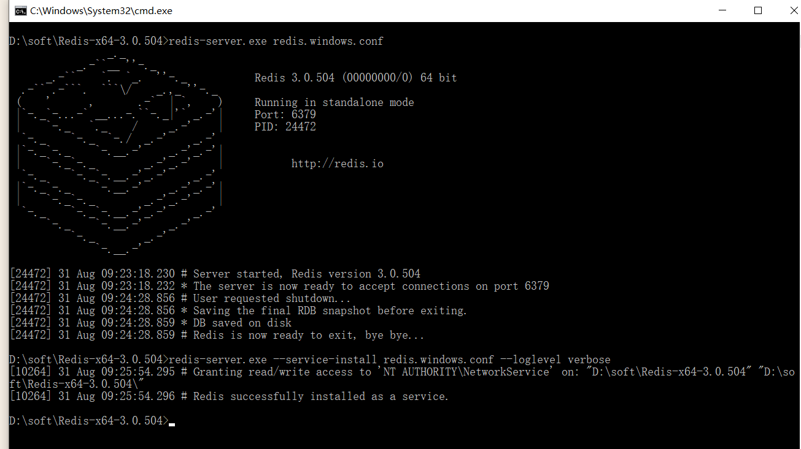
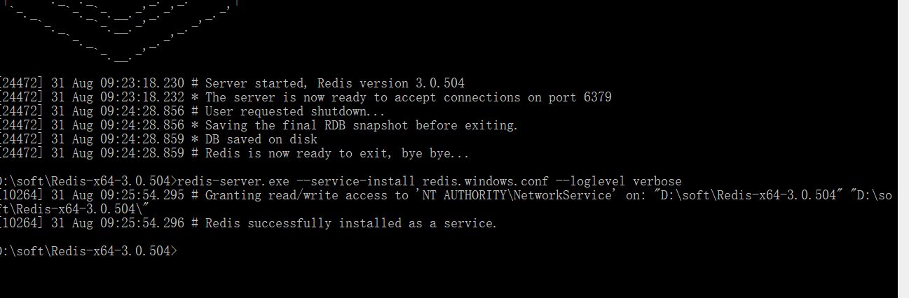
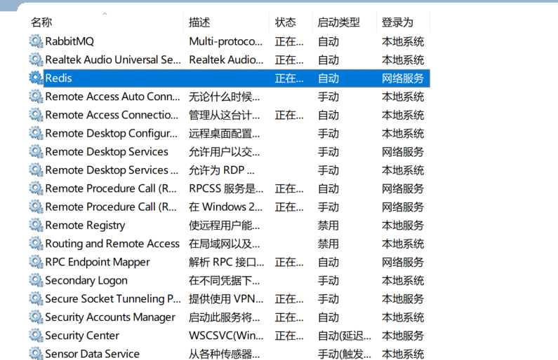

#### windows上使用redis

##### 1、下载

https://github.com/MicrosoftArchive/redis/releases在github上下载windows版本的redis

##### 2、解压启动

下载解压redis ,进入redis目录 使用 redis-server.exe redis.windows.conf 来启动redis

###### 2.1、开启redis服务

在redis目录下运行命令 redis-server.exe redis.windows.conf 之后，redis服务启动，可以直接进行连接测试，但是如果，关闭了这个窗口那么服务就将关闭。(这里补充一个小技巧，在文件目录下按住 `shift` + 鼠标右键,弹出的菜单选项中就会包含 在此处打开命令窗口，命令行直接就在当前目录)




2.2 将redis设置为windows服务，先将redis加入到系统环境变量path中去。redis目录D:\soft\Redis-x64-3.0.504

2.3 在解压的 Redis 文件目录下新建命令行，输入命令 `redis-server.exe --service-install redis.windows.conf --loglevel verbose` 



查看windows服务，服务已经存在了




```
https://www.cnblogs.com/yueguanguanyun/p/10785060.html
```


### linux中安装 redis

1、下载redis，将下载好的redis压缩包上传至redis，然后解压

```shell
tar -zxvf redis-5.0.3.tar.gz
```

2、安装gcc环境， redis是由C语言编写的，它的运行需要C环境，所以编译前需安装 gcc

```shell
[root@localhost cc1]# yum install gcc-c++
# 查看版本
[root@localhost cc1]# gcc -v
```

3、进入redis解压后的目录, 执行make命令 进行编译

```shell
[root@cc1 redis-5.0.3]# make 

```

4、编译完成后进入 src 目录后执行安装命令 make install（很快）

```shell
[root@cc1 src]# make install
    CC Makefile.dep

Hint: It's a good idea to run 'make test' ;)

    INSTALL install
    INSTALL install
    INSTALL install
    INSTALL install
    INSTALL install

```

5、在redis目录中创建 bin 和etc 两个文件夹

```shell
bin：用于存放主要命令，你可以理解为springboot的主启动类
etc：用于存放 redis 的核心配置文件 redis.conf
```


6、移动文件

  a、先将 redis-5.0.5 里的主配置文件 redis.conf 移动到刚创建的 etc 文件夹， 然后copy一份文件

```she
[root@cc1 redis-5.0.3]# mv redis.conf  /usr/local/redis-5.0.3/etc/
```

  b、再将 src 目录里带有绿色标识的文件全都移动到刚创建的 bin 文件夹

```
[root@cc1 redis-5.0.3]#mv mkreleasehdr.sh redis-benchmark redis-check-aof redis-check-rdb redis-cli redis-sentinel  redis-server redis-trib.rb /usr/local/redis-5.0.3/bin/
```

7、修改主配置文件redis-6379.conf 

```
1、注释掉 bind 127.0.0.1 这一行（解决只能特定网段连接的限制；正式服务器部署如阿里云，为项目安全严格可以保留注释，自己用的话就注释掉）
2、将 protected-mode 属性改为 no （关闭保护模式，不然会阻止远程访问；同上，正式服务器项目上线可不修改）
3、将 daemonize 属性改为 yes （这样启动时就在后台启动）
4、设置密码（可选，个人建议还是设个密码） requirepass 123
5、创建logfile 对应的文件
6、在目录创建data目录，然后修改redis-6379.conf 配置文件红 dir 指定的路径
```

8、启动redis

```shell
[root@cc1 redis-5.0.3]# ./bin/redis-server /usr/local/redis-5.0.3/etc/redis-6379.conf
24461:C 01 Sep 2020 15:50:44.770 # oO0OoO0OoO0Oo Redis is starting oO0OoO0OoO0Oo
24461:C 01 Sep 2020 15:50:44.770 # Redis version=5.0.3, bits=64, commit=00000000, modified=0, pid=24461, just started
24461:C 01 Sep 2020 15:50:44.770 # Configuration loaded
[root@cc1 redis-5.0.3]# ps -ef|grep redis

```

9、进入redis, 如果设置了密码，那么进入之后要验证

```shell
[root@cc1 redis-5.0.3]# ./bin/redis-cli 
127.0.0.1:6379> set lin 123
(error) NOAUTH Authentication required.
127.0.0.1:6379> 123
(error) ERR unknown command `123`, with args beginning with: 
127.0.0.1:6379> auth 123
OK

```


10、在vim 搜索时使用 

```shell
/requirepass  然后回车 按n键查找
```

在查看redis.conf文件时有很多注释，并且文件太长了，那么使用下面命令过滤。过滤注释和空白 然后 将其写到

redis-6379.conf 新的文件中

```shell
[root@cc1 redis-5.0.3]# cat redis.conf | grep -v "#" | grep -v "^$" > redis-6379.conf 
```


11、设置开机启动

```shell
[root@localhost redis-5.0.3]# vim /etc/rc.d/rc.local
```

在后面加上： /usr/local/redis-5.0.3/bin/redis-server /usr/local/redis-5.0.3/etc/redis0-6379.conf


参考：

```
https://blog.csdn.net/qq_36737803/article/details/90578860?utm_medium=distribute.pc_relevant_t0.none-task-blog-BlogCommendFromMachineLearnPai2-1.nonecase&depth_1-utm_source=distribute.pc_relevant_t0.none-task-blog-BlogCommendFromMachineLearnPai2-1.nonecase
```

