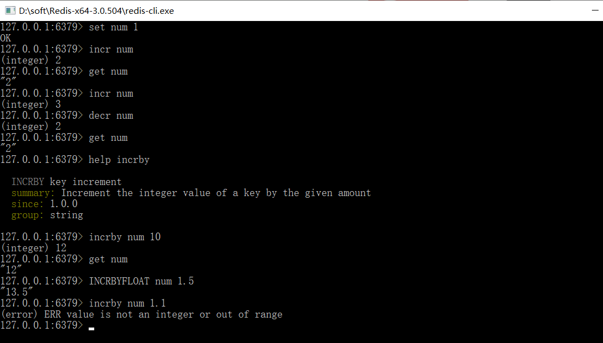

### Redis 学习记录

#### 1、数据存储类型介绍

#####  作为缓存使用

1.1、原始业务功能设计

```
秒杀、618活动、双11活动、排队购票
```

1.2 运营平台监控到的突发高频访问数据

 ```
突发时政要闻，被强势关注围观
 ```

1.3 高频、复杂的统计数据

 ```
在线人数
 ```

##### 业务数据的特殊性

附件功能：系统功能优化或升级

```
单服务升级集群
session管理
token管理
```

#### 2、redis数据类型(5种常用)

```
String、hash、list、set、sorted_set 和java中几种基本数据类型很相似
java中基本数据类型
String HashMap, LinkList,HashSet, TreeSet

```

##### 2.1 redis数据存储格式

```
redis自身是一个map,其中所有的数据都是采用key:value的形式存储
数据类型指的是存储的数据的类型，也就是value部分的类型，key部分永远都是字符串
```


##### 2.2string类型

```
存储的数据：单个数据，最简单的数据存储类型，也是最常用的数据存储类型
存储数据的格式：一个存储空间保存一个数据
存储内容：通常使用字符串，如果字符串以整数的形式展示，可以作为数字操作使用
//=========================================
```

测试操作

```shell
1、添加/修改数据: set key value
2、获取数据: get key 
3、删除数据: del key
4、添加/修改数据: mset key1 value1 key2 value2...
5、获取多个数据: mget key1 key2...
6、获取数据字符个数(字符串长度): strlen key
7、追加信息到原始信息后部(如果原始信息存在就追加，否则新建) :append key value

```


注意在redis中get 如果是（integer）1表示成功，（integer）0表示失败。


##### 2.3 单数据操作与多数据操作的选择之感

```
单指令1条指令的执行过程：set指令发送给redis服务器是要消耗时间的，也就是发送指令消耗时间，然后到达指令之后执行也要消耗时间，执行之后返回也要消耗时间。那么这有三个时间消耗
现在有3条指令，如果是单指的操作那么：如果我们假定 发送到服务器的时间和返回的时间一样那么 就是 6次发送加上3次执行的时间。 
6*time+3*time ;

但是如果使用多指令来发送呢？多指令发送3条指令：2次发送指令的时间+3次执行指令的时间 
2*time+3*time

```

##### 2.4 string类型数据的扩展操作

业务场景

```
大型企业级应用中，分表操作是基本操作，使用多张表存储同类型数据，但是对应的主键id必须保证统一性，不能重复。
Oracle数据库具有sequence设定，可以解决该问题，但是mysql数据库并不具有类似的机制，那么如何解决？
```

解决方案

```
1、设置数值数据增加指定范围的指
 incr key
 incrby key increment
 incrbyfloat key increment
2、设置数值数据减少指定范围的值
  decr key
  decrby key increment
```




string 作为数值操作

```
1、string在redis内部存储默认就是一个字符串，当遇到增减类操作incr，decr时会转成数值型进行计算。
2、redis所有的操作都是原子性的，采用单线程处理所有业务，命令是一个一个执行的，应为无需考虑并发带来的数据影响。
注意：按数值进行操作的数据，如果原始数据不能转成数值，或超越了redis数值上限范围，将报错。
    9223372036854775807（java中long型数据最大值，Long.MAX_VALUE）
```


string设置数据具有指定的生命周期

```
setex key seconds value
psetex key milliseconds value
```

Tips: redis控制数据的生命周期，通过数据是否失效控制业务行为，适用于所有具有时效性限定控制的操作。


string设置数据操作的注意实现

```
数据操作不成功的反馈与数据正常操作之间的差异
  1、表示运行结果是否成功
    （integer）0--->false 失败
    （integer）1--->true 成功
  2、表示运行结果值
    （integer）3--->3 3个
    （integer）1--->1 1个
  3、数据未获取到
      nil 等同于null
  4、数据最大存储量
      512MB
  5、数值计算最大范围
  9223372036854775807（java中long型数据最大值，Long.MAX_VALUE）
```

string类型应用场景

```
在redis中为大v用户设定用户信息，以用户主键和属性值作为key,后台设定定时刷新策略即可
 eg:  user:id:2222:fanss   123456
 eg:  user:id:2222:blogs   123
 eg:  user:id:2222:focus   12
 
 在redis在以json格式存储大v用户信息，定时刷新(也可以使用hash类型)
  eg: user:id:546654  --->  {id:343553,name:gggg,fans:342,blogs:457}
```

Tips3：redis应用于各种结构型和非结构型高热度数据访问加速

key的设置约定：数据库中的热点数据key命名惯例

````
       表名: 主键名： 主键值：字段名
eg1： order:  id :  23232 : name
````


#### 3、hash类型


```
1、新的存储需求：对一系列存储的数据进行编组，方便管理，典型应用存储对象信息
2、需要的存储结构：一个存储空间保存多个键值对数据
3、hash类型：底层使用哈希表结构实现数据存储

hash存储结构优化
 1、如果field数量较少，存储结构优化为类数值结构
 2、如果field数量较多，存储结构使用HashMap结构
```


##### 3.1、hash类型数据的基本操作

```
1、添加\修改数据: hset key field value
2、获取数据:hget key field , hgetall key
3、删除数据: hdel key field1 [field2]
4、添加\修改多个数据: hmset key field1 value1 field2 value2
5、获取多个数据：hmget key field1 field2
6、获取哈希表中字段的数量：hlen key
7、获取哈希表中是否存在指定的字段： hexists key field
```


##### 3.2 hash类型数据扩展操作

```
1、获取哈希表中所有的字段名或字段值
   hkeys key
   hvals key
2、设置指定字段的数值数据增加指定范围的值
   hincrby key field increment
   hincrbyfloat key field increment
```

##### 3.3、hash类型数据操作的注意事项

```shell
1、hash类型下的value只能存储字符串，不允许存储其他数据类型，不存在嵌套想象。如果数据未获取到，对应的值为（nil）
2、每个hash可以存储2^32-1 个键值对
3、hash类型十分贴近对象的数据存储形式，并且可以灵活添加删除对象属性。但是hash设计初衷不是为了存储大量对象而设计的，切记不可滥用，更不可以将hash作为对象列表使用
4、hgetall操作可以获取全部属性，如果内部field过多，遍历整体数据效率就会很低，有可能成功数据访问瓶颈。
```

hash类型应用场景

 业务场景: 电商网站购物车设计与实现

```
业务分析：
 1、仅分析购物车的redis存储模型：添加、浏览、更改数量、删除、清空
 2、购物车于数据持久化同步
 3、购物车于订单间关系：
    提交购物车：读取数据生成订单
    商家临时价格调整:隶属于订单级别
 4、未登录用户购物车信息存储
     cookie存储
```

解决方案：

```shell
1、以客户id作为key，每位客户创建一个hash存储结构对应的购物车信息
2、将商品编号作为field，购买数量作为value进行存储
3、添加商品：追加全新的field与value
4、浏览：遍历hash
5、更改数量：自增/自减，设置value值
6、删除商品：删除field
7、清空：删除key
```

当前设计是否加速了购物车的呈现？

```
当前仅仅是将数据存储到了redis中，并没有起到加速的作用，商品信息还需要二次查询数据库
1、每条购物车中的商品记录保存成两条field
2、field1专用于保存购买数量
    命名格式：商品id:numbs
    保存数据：数值
3、field专用于保存购物车中显示的信息，包含文字描述，图片地址，所属商家信息等
     命名格式：商品id:info
     保存数据：json
 
 hsetnx key field value
```

Tips: redis应用于购物车数据库存储设计， 还可以应用于抢购，限购类、限量发放优惠卷，激活码等业务的数据存储设计。


#### 4、list类型

   ```shell
1、数据存储需求：存储多个数据，并对数据进入存储空间的顺序进行区分
2、需要的存储结构：一个存储空间保存多个数据，且通过数据可以体现进入顺序
3、list类型：保存多个数据，底层使用双向链表存储结构实现
   ```

 


##### 4.1、list类型数据的基本操作

```
1、添加\修改数据: lpush key value1 [value2] ...
                rpush key value1 [value2] ...
2、获取数据:lrange key start stop
          lindex key index
          llen key
3、获取并移除数据:lpop key 
                rpop key
4、添加\修改多个数据: hmset key field1 value1 field2 value2
5、获取多个数据：hmget key field1 field2
6、获取哈希表中字段的数量：hlen key
7、获取哈希表中是否存在指定的字段： hexists key field
```

如果当不知道有多少个元素时使用 -1来表示最后一个


##### 4.2 、list类型数据扩展操作

```
规定时间内获取并移除数据
1、blpop key1 [key2] timeout
2、brpop key1 [key2] timeout
```

业务场景：微信朋友圈点赞，要求按照点赞顺序显示点赞好友信息，如果取消点赞，异常对应好友信息

```
移除指定数据：
 lrem key count value
```

Tips: redis应用于具有操作先后顺序的数据控制 


##### 4.3、list类型数据操作注意事项

```
1、list中保存的数据都是string类型的，数据总容量是有限的，最多2^32 -1 个元素
2、list具有索引的概念，但是操作数据时通常以队列的形式进行入队出队操作，或以栈的形式进行入栈出栈操作
3、获取全部数据操作结束索引设置为-1
4、list可以对数据进行分页操作，通常第一页的信息来自于list，第2页以及更多的信息通过数据库的形式加载	
```

##### 4.4、list类型应用场景

```
.twitter、新浪微博、腾讯微博中个人用户的关注列表需要按照用户的关注顺序进行展示，粉丝列表需要将最近关注
的粉丝列在前面
.新闻、资讯类网站如何将最新的新闻或资讯按照发生的时间顺序展示？
.企业运营过程中，系统将产生出大量的运营，如何保障多台服务器操作日志的统一顺序输出？
```

解决方案

```
.依赖list的数据具有顺序的特征对信息进行管理
.使用队列模型解决多了信息汇总合并的问题
.使用栈模型解决最新消息的问题
```

Tips: redis应用于最新消息展示


#### 5、set 类型

```
.新的存储需求：存储大量的数据，在查询方面提供更高的效率
.需要的存储结构：能够保存大量的数据，高效的内部存储机制，便于查询
.set类型：与hash存储结构完全相同，仅存储键，不存储值(nil)，并且值是不允许重复的
```


##### 5.1、set类型数据的基本操作

```
1、添加\修改数据: sadd key member1 [member2]
2、获取数据:smembers key
3、删除数据: srem key member [member2]
4、获取集合数据总量：scard key
7、判断集合中是否包含指定数据： sismemeber key member
```


##### 5.2、set类型数据的扩展操作

业务场景：每位用户首次使用今日头条时会设置3项爱好的内容，但是后期为了增加用户的活跃度，兴趣点，必须让用户对其它信息类别逐渐产生兴趣，增加客户留存度，如何实现?

业务分析：

```
.系统分析出各个分类的最新或最热点信息条目并组织成set集合
.随机挑选其中部分信息
.配合用户关注信息分类中的热点信息组织成展示的全信息集合
```

解决方案：

```
1、随机获取集合中指定数量的数据
   srandember key [count]
2、随机获取集合中的某个数据并将该数据移出集合
  spop key
```


Tips8:  redis应用于随机推荐类信息检索，例如热点歌单推荐，热点新闻推荐，热卖旅游线路，应用APP推荐，大V推荐等。


set类型数据的扩展操作

解决方案

```
.求两个集合的交、并、差集
  sinter key1 [key2]
  sunion key1 [key2]
  sdiff  key1 [key2]
. 求两个集合的交、并、差集并存储到指定集合中
  sinterstore destination key1 [key2]
  sunionstore destination key1 [key2]
  sdiffstore  destination key1 [key2]
. 将指定数据从原始集合中移动到目标集合中
   smove source destination member 

```

Tips9：

```
.redis应用于同类信息下关联搜索，二度关联搜索，深度关联搜索
.显示共同关注(一度)
.显示共同好友
.由用户A出发，获取到好友用户B的好友信息列表(一度)
.由用户A出发，获取到好友用户B的购物清单列表(二度)
.由用户A出发，获取到好友用户B的游戏充值列表(二度)
```


##### 5.3、set类型数据操作的注意事项

```
set类型不允许数据重复，如果添加的数据在set中已经存在，将只保留一份
set虽然与hash的存储结构相同，但是无法启用hash中存储的空间。
```

##### set类型应用场景

业务场景：集团公司工具有1200名员工，内部OA系统中具有700个角色，3000个业务操作，23000多种数据，

每位员工具有一个或多个角色，如何快速进行业务操作的权限校验？

解决方案：

```
. 依赖set集合数据不重复的特征，依赖set集合hash存储结构特征完成数据过滤与快速查询
. 根据用户id获取用户所有角色
. 根据用户所有角色获取用户所有操作权限放入set集合
. 根据用户所有角色获取用户所有数据权限放入set集合
```

校验工作：redis提供基础数据还是提供校验结果？ 推荐提供基础数据，不要融合

Tips10: 

```
redis 应用于同类型不重复数据的合并操作
```

业务场景：公司对旗下新的网站做推广，统计网站的PV（访问量），UV(独立访客)，IP(独立IP)

```
PV:网站被访问次数，可通过刷新新页面提高访问量
UV:网站被不同用户访问的次数，可通过cookie统计访问量，相同用户切换IP地址，UV不变
IP:网站被不同IP地址访问的总次数，可通过IP地址统计访问量，相同IP不同用户访问，IP不变。
```

解决方案：

```
.利用set集合的数据去重特征，记录各种访问数据
.建立string类型数据，利用inct统计日访问量
.建立set模型，记录不同cookie数量
.建立set模型，记录不同IP数量
```

Tips11: redis应用于同类型数据的快速去重


#### 6、sorted_set类型

```
.新的存储需求：数据排序有利于数据的有效展示，需要提供一种可以根据自身特征进行排序的方式
.需求的存储结构：新的存储类型，可以保存可排序的数据
.sorted_set类型：在set的存储结构基础上添加可排序字段
```


##### 6.1、sorted_set类型数据的基本操作

```shell
1、添加数据: zadd key score1 member1 [score2 member2]
2、获取全部数据: zrange key start stop  [WITHSCORES] 
               zrevrange key start stop [WITHSCORES] 
3、删除数据: zrem key member [member]

```


```shell
1、按条件获取数据: zrangebyscore key max [WITHSCORES] [LIMIT]
                zrevrangebyscore key max min [WITHSCORES]
                
2、条件删除数据:  zremrangebyrank key stop
                zremrangebyscore key min max

```

注意：

```
min与max用于限定搜索查询的条件
start与stop 用于限定查询范围，作用于索引，表示开始和结束索引
offset与count用于限定查询范围，作用于查询结果，表示开始位置和数据总量
```

```
1、获取集合数据总量：zcard key
                  zcount key min max
2、集合交、并操作： zinterstore destination numkeys key [key ...]
                 zunionstore destination numkeys key [key...] 
```


##### 6.2、sorted_set类型数据的扩展操作

业务场景

```
票选广东十大杰出青年，各类综艺选秀海选投票，各类资源网站TOP10(电影，歌曲，文档，电商，游戏等)，聊天室活跃度统计，游戏好友亲密度
```

业务分析

```
为所有参与排名的资源建立排序依据
```

解决方案

```
.获取数据对应的索引(排名): zrank key member
                       zrevrank key member
.score值获取与修改： zscore key member
                   zincrby key increment member
```

Tips13: redis应用于计数器组合排序功能对应的排名


sorted_set类型数据的注意事项

```
.score保存的数据存储空间是64位，如果是整数范围是-9007199254740992~9007199254740992
.score保存的数据也可以是一个双精度的double值，基于双精度浮点数的特征，可能会丢失精度，使用时要慎重
.sorted_set 底层存储还是基于set结构的，因此数据不能重复，如果重复添加相同的数据，score值将被反复覆盖，
保留最后一次修改的结果。
```

##### 6.4、sorted_set 类型应用场景

业务场景

```
 基础服务+增值服务类网站会设定各位会员的试用，让用户充分体验会员优势。例如观影使用VIP、游戏VIP体验，
 云盘下载体验VIP、数据查看VIP。当VIP体验到期后，如果有效管理此类信息。即便对于正式VIP用户也存在对应的管理方式。
  网站会定期开启投票、讨论、随时进行，逾期作废。如何有效管理此类过期信息。
```

解决方案

```
.对应基于时间线限定的任务处理，将处理时间记录为score值，利用排序功能区分处理的先后顺序
.记录下一个要处理的时间，当到期后处理对应任务，移除redis中的记录，并记录下一个要处理的时间
.当新任务加入时，判断并更新当前下一个要处理的任务时间
.为提升sorted_set的性能，通过将任务根据特征存储成若干个sorted_set。例如1个小时内，1天内，周内，月内，
季内，年度等，操作时逐级提升，将即将操作的若干个任务纳入到1小时内处理的队列中
```

获取当前时间系统

```
time
```

Tips14: redis应用于定时任务执行顺序管理或任务过期管理


业务场景2

```
任务/消息权重设定应用:
  当任务或者消息待处理，形成了任务队列或消息队列时，对于高优先级的任务要保障对其优先处理，如何实现任务权重管理。
```

解决方案：

```
.对于带有权重的任务，优先处理权重高的任务，采用score记录权重即可
```

多条件任务权重设定：如果权重条件过多时，需要对排序score值进行处理，保障score值能够兼容2条件或者多条件，例如外贸订单优先于国内订单，总裁订单由于员工订单，经理订单由于员工订单

```
. 因score长度受限，需要对数据进行阶段处理，尤其是时间设置为1小时或分钟级即可(折算后)
. 先设定订单类别，后设定订单发起角色类别，整体score长度必须是统一的，不足位补0，第一排序规则首位不得是0
  
   .例如外贸101，国内102，经理004，员工008
   .员工下的外贸单score值为101008(优先)
```

Tips 15: redis应用于即时任务/消息队列执行管理， 

Tips 16: 还可以用于限时按次结算的服务控制。


业务场景3

```
使用微信的过程中，当微信接收消息后，会默认将最近接收的消息置顶，当多个好友及关注的订阅号同时发送消息时，改排序会不停的进行交替。同时还可以将重要的会话设置为置顶。一旦用户离线后，再次打开微信时，消息该按照什么样的顺序显示？
```

解决方案

```
.依赖list的数据具有顺序的特征对消息进行管理，将list结构作为栈使用
.对置顶与普通会话分别创建独立的list分别管理
.当某个list中接收到用户消息后，将消息发送方的id从list的一侧加入list(此处设定左侧)
.多个相同id发出的消息反复入栈会出现问题，在入栈之前无论是否具有当前id对应的消息，先删除对应id
.推送消息时先推送置顶会话list，在推送普通会话list，推送完成的list清除所有数据
.消息的数量，也就是微信用户对话数量采用计算器的思想另行记录，伴随list操作同步更新。
```


Tips17: redis应用于基于时间顺序的数据操作，而不关注具体时间

解决方案列表：


#### 7、通用指令-----key基本操作

  ```
.删除指定key: del key
.获取key是否存在： exists key
.获取key的类型： type key
  ```


key扩展操作(时效性控制)

```
.为指定key设置有效期：expire key seconds, pexpire key milliseconds, expireat key timestamp
pexpireat key milliseconds-timestamp

.获取key的有效时间： ttl key, pttl key 

. 切换key从时效性转换为永久性：persist key
   
```

key扩展操作(查询模式)

```
.查询key
  keys pattern 
```

key其它操作

```
.为key改名： rename key newkey, renamenx key newkey
.对所有key排序：sort
. 其它key通用操作： help @generic
```

#### 9、数据库通用操作

   db基本操作

```
.切换数据库: select index
.其它操作: quit, ping , echo message
.数据移动: move key db
.数据清除: dbsize、 flushdb、 flushall
```


#### 10、redis 持久化

  什么是持久化：利用永久性存储介质将数据进行保存，在特定的事件将保存的数据进行恢复的工作机制称为持久化。 

 持久化过程保存什么：redis中数据存储是二进制，然后每过一分钟保存一次，这种相当于是拍一个照片，如果数据有丢失也只是丢失了一点数据。 这种保存的方式就是快照形式。在保存数据的时候快速拍照，然后在需要恢复的时候用这个快照来恢复。 

```
.将当前数据状态进行保存，快照形式，存储数据结果，存储格式简单，关注点在数据。（RDB）
.将数据的操作过程进行保存，日志形式，存储操作过程，存储格式复杂，关注点在数据的操作过程。(AOF)
```


##### 10.1 持久化-save指令

```shell
命令：save 
作用：每保存一次它会去生成一个 .rdb文件，用来保存当前的快照信息。
```

RDB启动方式------save指令相关配置

```
.dbfilename dump.rdb 
      说明：设置本地数据库文件名，默认值为dump.rdb
      经验：通常设置为dump-端口号.rdb
.dir
      说明：设置存储.rdb文件的路径
      经验：通常设置成存储空间较大的目录中，目录名称data
.rdbcompression yes
      说明：设置存储至本地数据库时是否压缩数据，默认为 yes，采用 LZF 压缩
      经验：通常默认为开启状态，如果设置为no，可以节省 CPU 运行时间，但会使存储的文件变大（巨大）
.rdbchecksum yes
      说明：设置是否进行RDB文件格式校验，该校验过程在写文件和读文件过程均进行
      经验：通常默认为开启状态，如果设置为no，可以节约读写性过程约10%时间消耗，但是存储一定的数据损坏风险        
```


##### 10.2 RDB启动方式----save指令 工作原理

 比如在数据量过多的时候redis单线程执行多个任务的时候，redis是一个一个的执行。如果一个执行的时候出现命令没有执行完，那么后面的命令就会被阻塞。

注意：save指令的执行会阻塞当前redis服务器，直到当前RDB过程完成为止，有可能会造成长时间阻塞，线上环境不建议使用。


10.3、RDB启动方式---bgsave指令与工作原理

  在数据量过大情况下，单线程执行方式造成效率过低如何处理?

```
后台执行：
.谁:redis操作者(用户)发起指令；redis服务器控制指令执行
.什么事件：即时(发起),合理的时间(执行)
.干什么事情：保存数据
```

bgsave指令

```
命令：bgsave
指令：手动启动后台保存操作，但不是立即执行
```

原理：

```
当执行bgsave命令时候，
1:发送一条指令到redis，然后返回一个消息（这个时候没有真正执行），在返回消息的时候
2:合适的时间去 调用linux的 fork函数生成一个子进程。
3:创建一个rdb文件 
```


##### 10.3 RDB启动方式-------save配置

```
.配置
  save seconde changes
.作用：满足限定时间范围内key的变化数量达到指定数量即进行持久化
.参数： seconde 监控时间范围， changes 监控key的变化量
.位置： 在conf文件中进行设置

```


rdb特殊启动形式

```
.全量复制
.服务器允许过程中重启： debug reload
.关闭服务器时指定保存数据：shutdown save

默认情况下执行shutdown命令时，自动执行bgsave(如果没有开启AOF持久化功能)
```


##### 10.4 RDB优缺点

```
优点：
 .RDB是一个紧凑压缩的二进制文件，存储效率较高
 .RDB内部存储的是redis在某个时间点的数据快照，非常适合用于数据备份，全量复制等场景
 .RDB恢复数据的速度要比AOF快很多
 .应用：服务器每x个小时执行bgsave备份，并将RDB文件拷贝到远程机器中，用于灾难恢复。
 
缺点：
 .RDB方式无论是执行指令还是利用配置，无法做到实时持久化，具有较大的可能性丢失数据
 .bgsave指令每次允许要fork操作创建子进程，要牺牲掉一些性能
 .Redis的众多版本中未进行RDB文件格式的版本统一，有可能出现个版本服务之间数据格式无法兼容现象
```

#### 11、持久化--AOF

 RDB存储的弊端

```
.存储数据量较大，效率较低 
    基于快照思想，每次读写都是全部数据，当数据量巨大时，效率非常低
.大数据量下的IO性能较低
.基于fork创建子进程，内存产生额外消耗
.宕机带来的数据丢失风险
```

解决思路

```
.不写全数据，仅记录部分数据
.改记录数据为记录操作过程
.对所有操作均进行记录，排除丢失数据的风险
```

##### 11.1 、AOF概念

```
.AOF(append only file)持久化：以独立日志的记录每次写命令，重启时再重新执行AOF文件中命令达到恢复数据的目的。与RDB相比可以简单描述为 改记录数据为记录数据产生的过程。
.AOF的主要作用是解决了数据持久性的实时性，目前已经是Redis持久化的主流方式
```

##### 11.2、AOF写数据过程

   当我们的客户端发出一条指令个服务器，服务器接收到了这条指令后 并没有马上记录，而是将它放到一个临时的区域中，这个区域是AOF写命令刷新缓存区。 如果还有指令过来还是写到这个缓冲区。 那么这些指令是干嘛用的呢？最终是为了生成aof的存储文件用的。到了一定阶段以后将这些命令全部同步到 .aof文件中就行了。

AOF写数据三种策略(appendfsync)

```
.alway(每次): 每次写入操作同步到AOF文件中，数据零误差，性能较低，不建议使用
.everysec(每次)：每秒将缓冲区中的指令同步到AOF文件中，数据准确性较高，性能较高，建议使用，也是默认配置
               在系统突然宕机的情况下丢失1秒内的数据
.no(系统控制): 由操作系统控制每次同步到AOF文件的周期，整体过程不可控

```

AOF功能开启

```
.配置: appendonly  yes|no
.作用：是否开启AOF持久化功能，默认为不开启状态

.配置：appendfsync always|everysec|no
.作用：AOF写数据策略
```


查看appendonly.aof 文件


AOF写数据遇到的问题，如果AOF在执行连续的指令该如何处理

#####  11.3 AOF 重写：

```
随着命令不断写入AOF，文件会越来越大，为了解决这个问题，Redis引入了AOF重写机制压缩文件体积。AOF文件重 写是将Redis进程内的数据转化为写命令同步到新AOF文件的过程。简单说就是将对同一个数据的若干个条命令执行结 果转化成最终结果数据对应的指令进行记录。
```

AOF 重写作用：

```
.降低磁盘占用量，提高磁盘利用率
.提供持久化效率，降低持久化写时间，提供IO性能
.降低数据恢复用时，提供数据恢复效率
```

AOF重写规则

```
.进程内已超时的数据不再写入文件
.忽略无效指令，重写时使用进程内数据直接生成，这样新的AOF文件只保留最终数据的写入命令
  如del key1、 hdel key2、srem key3、set key4 111、set key4 222等
  
.对同一数据的多条写命令合并为一条命令
如lpush list1 a、lpush list1 b、 lpush list1 c 可以转化为：lpush list1 a b c。
为防止数据量过大造成客户端缓冲区溢出，对list、set、hash、zset等类型，每条指令最多写入64个元素  
```

AOF重写方式

```
.手动重写:bgrewriteaof
.自动重写
   auto-aof-rewrite-min-size size
   auto-aof-rewrite-percentage percentage
```

AOF自动重写方式

```
.自动重写触发条件设置:
   auto-aof-rewrite-min-size size
   auto-aof-rewrite-percentage percent
.自动重写触发比对参数（ 运行指令info Persistence获取具体信息 ）
      aof_current_size
     aof_base_size
.自动重写触发条件

```

RDB和AOF对比


RDB与AOF的选择之惑

```
1、对数据非常敏感，建议使用默认的AOF持久化方案
 a、AOF持久化策略使用everysecond，每秒钟fsync一次。该策略redis仍可以保持很好的处理性能，当出现问题时，最多丢失0-1秒内的数据。
 b、注意：由于AOF文件存储体积较大，且恢复速度较慢

2、数据呈现阶段有效性，建议使用RDB持久化方案
  a、 数据可以良好的做到阶段内无丢失（该阶段是开发者或运维人员手工维护的），且恢复速度较快，阶段
点数据恢复通常采用RDB方案
  b、注意：利用RDB实现紧凑的数据持久化会使Redis降的很低，慎重总结：
  
3、综合比对
  a、RDB与AOF的选择实际上是在做一种权衡，每种都有利有弊
  b、如不能承受数分钟以内的数据丢失，对业务数据非常敏感，选用AOF
  c、如能承受数分钟以内的数据丢失，且追求大数据集的恢复速度，选用RDB
  d、灾难恢复选用RDB
  e、双保险策略，同时开启 RDB 和 AOF，重启后，Redis优先使用 AOF 来恢复数据，降低丢失数据的量
```


#### 12、redis事务

  

  什么是事务：redis事务就是一个命令执行的队列，将一系列预定义命令包装成一个整体（一个队列）。当执行时，一次性 按照添加顺序依次执行，中间不会被"打断"或者"干扰"。

  一个队列中，一次性、顺序性、排他性的执行一系列命令 

 


12.1、事务的基本操作

```
.开启事务：multi
.作用: 设定事务的开始位置，此指令执行后，后续的所有指令均加入到事务中

.执行事务：exec
.作用：设定事务的结束位置，同时执行事务。与multi成对出现，成对使用
```

注意：加入事务的命令暂时进入到任务队列中，并没有立即执行，只有执行exec命令才开始执行

事务定义过程中发现出了问题，怎么办？

```
.取消事务：discard
.作用：终止当前是为的定义，发生在multi之后，exec之前
```


##### 12.2、事务的工作流程

   事务执行的时候，会根据指令执行不同的操作


12.3、事务的注意事项

​      定义事务的过程中，命令格式输入错误怎么办？

```
语法错误：值 命令书写格式错误
处理结果：如果定义的事务中包含的命令存在语法错误，整体事务中所有命令均不会执行。包括那些语法正确的命令。
```

​    定义事务的过程中，命令执行出现错误怎么办？

```
.运行错误:指命令格式正确，但是无法正确的执行。例如对list进行incr操作
.处理结果:能够正确运行的命令会执行，运行错误的命令不会被执行
```

注意：已经执行完毕的命令对应的数据不会自动回滚，需要程序员自己在代码中实现回滚


手动进行事务回滚

```
.记录操作过程中被影响的数据之前的状态
     单数据：string
     多数据：hash、list、set、zset
. 设置指令恢复所有的被修改的项
     单数据：直接set（注意周边属性，例如时效
    多数据：修改对应值或整体克隆复制
```


#### 13、锁

##### 13.1、基于特定条件的事务执行-锁

基于特定条件的事务执行

1）业务场景：天猫双11热卖过程中，对已经售罄的货物追加补货，4个业务员都有权限进行补货。补货的操作可能是一系 列的操作，牵扯到多个连续操作，如何保障不会重复操作？

2）业务分析：多个客户端有可能同时操作同一组数据，并且该数据一旦被操作修改后，将不适用于继续操作， 在操作之前锁定要操作的数据，一旦发生变化，终止当前操作

##### 

 3）解决方案：

```
.对 key 添加监视锁，在执行exec前如果key发生了变化，终止事务执行: watch key1 [key2……]
.取消对所有 key 的监视：unwatch
```

Tips: redis应用于状态控制的批量任务执行。


##### 13.2 基于特定条件的事务执行-分布式锁

 1) 业务场景2：天猫双11热卖过程中，对已经售罄的货物追加补货，且补货完成。客户购买热情高涨，3秒内将所有商品购 买完毕。本次补货已经将库存全部清空，如何避免最后一件商品不被多人同时购买？【超卖问题】

 2) 业务分析2：使用watch监控一个key有没有改变已经不能解决问题，此处要监控的是具体数据， 虽然redis是单线程的，但是多个客户端对同一数据同时进行操作时，如何避免不被同时修改？

3)解决方案：

``` 
.使用 setnx 设置一个公共锁
 利用setnx命令的返回值特征，有值则返回设置失败，无值则返回设置成功
      对于返回设置成功的，拥有控制权，进行下一步的具体业务操作
      对于返回设置失败的，
 操作完毕通过del操作释放锁     
```

注意：上述解决方案是一种设计概念，依赖规范保障，具有风险性

如果开启了两个客户端就行操作，在一个客户端中设置数据，然后用setnx设置了一个分布式锁


Tips19: redis应用于分布式锁对应的场景控制


##### 13.3 基于特定条件的事务执行

​    业务场景：依赖分布式锁的机制，某个用户操作时对应客户端宕机，且此时已经获取到锁。如何解决？

​    业务分析：由于锁操作由用户控制加锁解锁，必定会存在加锁后未解锁的风险 ， 需要解锁操作不能仅依赖用户控制，系统级别要给出对应的保底处理方案

​    解决方案：

```
.使用 expire 为锁key添加时间限定，到时不释放，放弃锁
    expire lock-key second
    pexpire lock-key milliseconds
```

由于操作通常都是微秒或毫秒级，因此该锁定时间不宜设置过大。具体时间需要业务测试后确认

```
.例如：持有锁的操作最长执行时间127ms，最短执行时间7ms。
.测试百万次最长执行时间对应命令的最大耗时，测试百万次网络延迟平均耗时
.锁时间设定推荐：最大耗时*120%+平均网络延迟*110%
.如果业务最大耗时<<网络平均延迟，通常为2个数量级，取其中单个耗时较长即可
```

测试


#### 14、删除策略---过期数据

​     redis中的数据特征

 ```
.RedisRedis是一种内存级数据库，所有数据均存放在内存中，内存中的数据可以通过TTL指令获取其状态
   . XX ：具有时效性的数据
   . -1 ：永久有效的数据
   . -2 ：已经过期的数据 或 被删除的数据 或 未定义的数据
 ```


##### 14.1、数据删除策略

```
.定时删除
.惰性删除
.定期删除
```


##### 14.2、时效性数据的存储结构


##### 14.3、定时删除

```
.创建一个定时器，当key设置有过期时间，且过期时间达到时，由定时器任务立即执行对键的删除操作

.优点：节约内存，到时就删除，快速释放掉不必要的内存占用
.缺点：cpu压力很大，无论CPU此时负载量多高，均占用CPU,会影响redis服务器响应时间和指令吞吐量

.总结：用处理器性能换取存储空间(拿时间换空间)
```

##### 14.4、惰性删除

```
.数据达到过期时间，不做处理。等下次访问该数据时
    .如果未过期，返回数据
    .发现已过期，删除，返回不存在

.优点：节约CPU性能，发现必须删除的时候才删除
.缺点：内存压力很大，出现长期占用内存的数据

.总结：用存储空间换取处理器性能(拿时间换空间)

中间会使用一个函数 expireIfNeeded()
```

##### 14.5、定期删除

​      上述两种方案都比较极端，那么比较好的折中方案是定期删除策略。

```
在redis中通过 info命令来查看server.hz的设值， 这个设置表示每秒钟执行 若干次 serverCron()操作，
在这个操作中会去对所有的数据库 databasesCron()轮询访问，在访问的时候会对每一个库里面的key进行 activeExpireCycle()轮询，访问的策略是随机挑选若干个key，而这个key是由redis中的一个配置w=ACTIVE_EXPIRE_CYCLE_LOOKUPS_PER_LOOP属性值来决定的。在挑出来后 要判断这里有过期的key 就要把它删除掉，同时看删除的量占整体的量是多还是少。如果多那么就再来一轮，如果少就去下一个库查找同时用current_db记录
找到哪里了。 按照这种形式一轮一轮的查找。

```


```
.周期性轮询redis库中的时效性数据，采用随机抽取的策略，利用过期数据占比的方式控制删除频度
.特点1：CPU性能占用设置有峰值，检测频度可自定义设置
.特点2：内存压力不是很大，长期占用内存的冷数据会被持续清理

.总结：周期性抽查存储空间expireIfNeeded()（随机抽查，重点抽查）
```


##### 14.6 逐出算法

   当新数据进入redis时，如果内存不足怎么办？

```
. Redis使用内存存储数据，在执行每一个命令前，会调用freeMemoryIfNeeded()检测内存是否充足。如
果内存不满足新加入数据的最低存储要求，redis要临时删除一些数据为当前指令清理存储空间。清理数据
的策略称为逐出算法。
. 注意：逐出数据的过程不是100%能够清理出足够的可使用的内存空间，如果不成功则反复执行。当对所
有数据尝试完毕后，如果不能达到内存清理的要求，将出现错误信息。
(error) OOM command not allowed when used memory >'maxmemory'
```

 影响数据逐出的相关配置

```
.最大可使用内存：maxmemory 占用物理内存的比例，默认值为0，表示不限制。生产环境中根据需求设定，通常设置在50%以上。

.每次选取待删除数据的个数：maxmemory-samples 选取数据时并不会全库扫描，导致严重的性能消耗，降低读写性能。因此采用随机获取数据的方式作为待检测删除数据

.删除策略：maxmemory-policy 达到最大内存后的，对被挑选出来的数据进行删除的策略
```


```
. 检测易失数据（可能会过期的数据集server.db[i].expires ）
① volatile-lru：挑选最近最少使用的数据淘汰
② volatile-lfu：挑选最近使用次数最少的数据淘汰
③ volatile-ttl：挑选将要过期的数据淘汰
④ volatile-random：任意选择数据淘汰

. 检测全库数据（所有数据集server.db[i].dict ）
⑤ allkeys-lru：挑选最近最少使用的数据淘汰
⑥ allkeys-lfu：挑选最近使用次数最少的数据淘汰
⑦ allkeys-random：任意选择数据淘汰

. 放弃数据驱逐
⑧ no-enviction（驱逐）：禁止驱逐数据（redis4.0中默认策略），会引发错误OOM（Out Of Memory）
```


#### 15、高级数据类型---Bitmaps

使用bit来表示

Bitmaps类型的基础操作

```
.获取指定key对应偏移量上的bit值: getbit key offset
.设置指定key对应偏移量上的bit值，value只能是1或0 : setbit key offset value
```

Bitmaps类型的扩展操作

```
.对指定key按位进行交、并、非、异或操作，并将结果保存到destKey中
  bitop op destKey key1 [key2...], op操作有下面的4中
    1)and：交
    2)or：并
    3)not：非
    4)xor：异或
  
.统计指定key中1的数量
  bitcount key [start end]
```

Tips21:  redis应用于信息状态统计


15.1、高级数据类型---HyperLogLog

 统计独立UV

```
.原始方案：set
  1)存储每个用户的id（字符串）
.改进方案：Bitmaps
  1)存储每个用户状态（bit）
.全新的方案：Hyperloglog
```

基数

```
.基数是数据集去重后元素个数
.HyperLogLog 是用来做基数统计的，运用了LogLog的算法
```

HyperLogLog类型的基本操作

```
.添加数据:pfadd key element [element ...]
.统计数据:pfcount key [key ...]
.合并数据:pfmerge destkey sourcekey [sourcekey...]
```

Tips 22： redis 应用于独立信息统计

相关说明

```
. 用于进行基数统计，不是集合，不保存数据，只记录数量而不是具体数据
. 核心是基数估算算法，最终数值存在一定误差
. 误差范围：基数估计的结果是一个带有 0.81% 标准错误的近似值
. 耗空间极小，每个hyperloglog key占用了12K的内存用于标记基数
. pfadd命令不是一次性分配12K内存使用，会随着基数的增加内存逐渐增大
. Pfmerge命令合并后占用的存储空间为12K，无论合并之前数据量多少
```


15.2、高级数据类型---GEO 

GEO类型的基本操作

```
.添加坐标点
  geoadd key longitude latitude member [longitude latitude member ...]
.获取坐标点
  geopos key member [member ...]
.计算坐标点距离
  geodist key member1 member2 [unit]
```

```
.根据坐标求范围内的数据 ：georadius key longitude latitude radius m|km|ft|mi [withcoord] [withdist] [withhash] [count count]

. 根据点求范围内数据：georadiusbymember key member radius m|km|ft|mi [withcoord] [withdist] [withhash] [count count]

. 获取指定点对应的坐标hash值：geohash key member [member ...]

```

Tips 23：redis 应用于地理位置计算

#### 16、redis集群

  互联网"三高架构"： 高并发、高性能、高可用


##### 16.1、多台服务器连接方案

```
.提供数据方：master
   主服务器，主节点，主库， 主客户端
.接收数据方：slave 
    从服务器，从节点，从库
.需要解决问题：数据同步
.核心工作：master的数据复制到slave
```

##### 16.2、主从复制

主从复制即将master中的数据即时、有效的复制到slave中

特征：一个master可以拥有多个slave，一个slave只对应一个master

##### 16.3、主从复制的作用

```
.读写分离：master写、slave读，提高服务器的读写负载能力
.负载均衡：基于主从结构，配合读写分离，由slave分担master负载，并根据需求的变化，改变slave的数
  量，通过多个从节点分担数据读取负载，大大提高Redis服务器并发量与数据吞吐量
  
.故障恢复：当master出现问题时，由slave提供服务，实现快速的故障恢复

.数据冗余：实现数据热备份，是持久化之外的一种数据冗余方式

.高可用基石：基于主从复制，构建哨兵模式与集群，实现Redis的高可用方案
```

##### 16.4、主从复制工作流程

```
.主从复制过程大体可以分为3个阶段
   1):建立连接阶段（即准备阶段）
   2):数据同步阶段
   3):命令传播阶段
```


##### 16.5、主从复制工作流程-----建立连接阶段


主从连接(slave连接到master)

```
.方式一：客户端发送命令:slaveof <masterip> <masterport>
.方式二：启动服务器参数:redis-server -slaveof <masterip> <masterport>
.方式三：服务器配置: slaveof <masterip> <masterport>

```

##### 16.6、主从复制工作流程-----数据同步阶段

下面图中全量复制和部分复制两个部分属于 数据同步阶段.

```
全量复制：获取发指令的那一刻开始原来的所有数据。
部分复制：恢复RBD过程中对应的所有数据。
```


数据同步阶段master说明

```
1.如果master数据量巨大，数据同步阶段应避开流量高峰期，避免造成master阻塞，影响业务正常执行

2.复制缓冲区大小设定不合理，会导致数据溢出。如进行全量复制周期太长，进行部分复制时发现数据已 经存在丢失的情况，必须进行第二次全量复制，致使slave陷入死循环状态。
repl-backlog-size 1mb

3.master单机内存占用主机内存的比例不应过大，建议使用50%-70%的内存，留下30%-50%的内存用于执 行bgsave命令和创建复制缓冲区
```


数据同步阶段slave说明

```
1.为避免slave进行全量复制、部分复制时服务器响应阻塞或数据不同步，建议关闭此期间的对外服务
 slave-serve-stale-data yes|no
2.数据同步阶段，master发送给slave信息可以理解master是slave的一个客户端，主动向slave发送
命令
3.多个slave同时对master请求数据同步，master发送的RDB文件增多，会对带宽造成巨大冲击，如果
master带宽不足，因此数据同步需要根据业务需求，适量错峰

4.slave过多时，建议调整拓扑结构，由一主多从结构变为树状结构，中间的节点既是master，也是
slave。注意使用树状结构时，由于层级深度，导致深度越高的slave与最顶层master间数据同步延迟
较大，数据一致性变差，应谨慎选择
```

##### 16.7、主从复制工作流程-----命令传播阶段

```
.当master数据库状态被修改后，导致主从服务器数据库状态不一致，此时需要让主从数据同步到一致的
状态，同步的动作称为命令传播
.master将接收到的数据变更命令发送给slave，slave接收命令后执行命令
```

##### 16.8、主从复制过程大体可以分为3个阶段

```
.建立连接阶段（即准备阶段）
.数据同步阶段
.命令传播阶段
```

命令传播阶段的部分复制

```
1.命令传播阶段出现了断网现象
    a.网络闪断闪连     忽略
    b.短时间网络中断    部分复制
    c.长时间网络中断    全量复制
2.部分复制的三个核心要素
    a.服务器的运行 id（run id）
    b.主服务器的复制积压缓冲区
    c.主从服务器的复制偏移量
```

###### a、部分复制-服务器运行ID（runid）

```
1.概念：服务器运行ID是每一台服务器每次运行的身份识别码，一台服务器多次运行可以生成多个运行id
2.组成：运行id由40位字符组成，是一个随机的十六进制字符
   例如：fdc9ff13b9bbaab28db42b3d50f852bb5e3fcdce
3.作用：运行id被用于在服务器间进行传输，识别身份
   如果想两次操作均对同一台服务器进行，必须每次操作携带对应的运行id，用于对方识别
4.实现方式：运行id在每台服务器启动时自动生成的，master在首次连接slave时，会将自己的运行ID发
   送给slave，slave保存此ID，通过info Server命令，可以查看节点的runid
```

###### b、部分复制-复制缓冲区

```
.概念：复制缓冲区，又名复制积压缓冲区，是一个先进先出（FIFO）的队列，用于存储服务器执行过的命
令，每次传播命令，master都会将传播的命令记录下来，并存储在复制缓冲区
```

复制缓冲区内部工作原理

```
.组成: 偏移量，字节值
.工作原理：通过offset区分不同的slave当前数据传播的差异，
          master记录已发送的信息对应的offset
          slave记录已接收的信息对应的offset
```


复制缓冲区总结：

```
1.概念：复制缓冲区，又名复制积压缓冲区，是一个先进先出（FIFO）的队列，用于存储服务器执行过的命令，
    每次传播 命令，master都会将传播的命令记录下来，并存储在复制缓冲区
   a.复制缓冲区默认数据存储空间大小是1M，由于存储空间大小是固定的，当入队元素的数量大于队
列长度时，最先入队的元素会被弹出，而新元素会被放入队列
2.由来：每台服务器启动时，如果开启有AOF或被连接成为master节点，即创建复制缓冲区
3.作用：用于保存master收到的所有指令（仅影响数据变更的指令，例如set，select）
4.数据来源：当master接收到主客户端的指令时，除了将指令执行，会将该指令存储到缓冲区中
```

###### c、部分复制-主从服务器复制偏移量（offset）

```
1.概念：一个数字，描述复制缓冲区中的指令字节位置

2.分类：master复制偏移量：记录发送给所有slave的指令字节对应的位置（多个）
       slave复制偏移量：记录slave接收master发送过来的指令字节对应的位置（一个）
       
3.数据来源：master端：发送一次记录一次
           slave端：接收一次记录一次
4.作用：同步信息，比对master与slave的差异，当slave断线后，恢复数据使用       
```

###### 数据同步+命令传播阶段工作流程

```
slae 发生指令到master时，第一次时是没有runid和 offset的。所以发生的是？ -1。
```


###### 主从复制----心跳机制与命令传播机制工作流程

心跳机制

```
1.进入命令传播阶段候，master与slave间需要进行信息交换，使用心跳机制进行维护，实现双方连接保持在线
2.master心跳：
    .指令：PING
    .周期：由repl-ping-slave-period决定，默认10秒
    .作用：判断slave是否在线
    .查询：INFO replication 获取slave最后一次连接时间间隔，lag项维持在0或1视为正常
        
3.slave心跳任务
    .指令：REPLCONF ACK {offset}
    .周期：1秒
    .作用1：汇报slave自己的复制偏移量，获取最新的数据变更指令
    .作用2：判断master是否在线
```

心跳阶段注意事项

```
1.当slave多数掉线，或延迟过高时，master为保障数据稳定性，将拒绝所有信息同步操作
  min-slaves-to-write 2
  min-slaves-max-lag 8
   slave数量少于2个，或者所有slave的延迟都大于等于10秒时，强制关闭master写功能，停止数据同步

2.slave数量由slave发送REPLCONF ACK命令做确认
3.slave延迟由slave发送REPLCONF ACK命令做确认
   
```

###### 主从复制工作流程(完整)


##### 16.9、主从复制常见问题---频繁的全量复制1

伴随着系统的运行，master的数据量会越来越大，一旦master重启，runid将发生变化，会导致全部slave的 全量复制操作

```
内部优化调整方案：
1. master内部创建master_replid变量，使用runid相同的策略生成，长度41位，并发送给所有slave
2. 在master关闭时执行命令 shutdown save，进行RDB持久化,将runid与offset保存到RDB文件中
        .repl-id repl-offset
        .通过redis-check-rdb命令可以查看该信息
3. master重启后加载RDB文件，恢复数据重启后，将RDB文件中保存的repl-id与repl-offset加载到内存中
        .master_repl_id = repl master_repl_offset = repl-offset
        .通过info命令可以查看该信息
作用：
 本机保存上次runid，重启后恢复该值，使所有slave认为还是之前的master
```

###### 频繁的全量复制2

```
1.问题现象:网络环境不佳，出现网络中断，slave不提供服务
2.问题原因:复制缓冲区过小，断网后slave的offset越界，触发全量复制
3.最终结果:slave反复进行全量复制
4.解决方案:修改复制缓冲区大小  
         repl-backlog-size
5建议设置如下：
       a. 测算从master到slave的重连平均时长second
       b. 获取master平均每秒产生写命令数据总量write_size_per_second
       c. 最优复制缓冲区空间 = 2 * second * write_size_per_second
```


##### 16.10、主从复制常见问题---频繁的网络中断1

```
1.问题现象:master的CPU占用过高 或 slave频繁断开连接
2.问题原因:  
           .slave每1秒发送REPLCONF ACK命令到master
           .当slave接到了慢查询时（keys * ，hgetall等），会大量占用CPU性能
           .master每1秒调用复制定时函数replicationCron()，比对slave发现长时间没有进行响应
            
3.最终结果: master各种资源（输出缓冲区、带宽、连接等）被严重占用
4.解决方案: 通过设置合理的超时时间，确认是否释放slave
            repl-timeout
            该参数定义了超时时间的阈值（默认60秒），超过该值，释放slave
```

###### 频繁的网络中断2

```
1.问题现象:slave与master连接断开
2.问题原因: master发送ping指令频度较低
           master设定超时时间较短
           ping指令在网络中存在丢包
3.解决方案: 提高ping指令发送的频度
       repl-ping-slave-period
       超时时间repl-time的时间至少是ping指令频度的5到10倍，否则slave很容易判定超时
```


16.10、主从复制常见问题---数据不一致

```
1.问题现象:多个slave获取相同数据不同步
2.问题原因:网络信息不同步，数据发送有延迟
3:解决方案:
       .优化主从间的网络环境，通常放置在同一个机房部署，如使用阿里云等云服务器时要注意此现象
       .监控主从节点延迟（通过offset）判断，如果slave延迟过大，暂时屏蔽程序对该slave的数据访问
            slave-serve-stale-data yes|no
        开启后仅响应info、slaveof等少数命令（慎用，除非对数据一致性要求很高）

```


#### 17、哨兵模式

哨兵(sentinel) 是一个分布式系统，用于对主从结构中的每台服务器进行监控，当出现故障时通过投票机制选择新的 master并将所有slave连接到新的master。

哨兵的作用：

```
1.监控：不断的检查master和slave是否正常运行。
       master存活检测、master与slave运行情况检测
2.通知（提醒）:当被监控的服务器出现问题时，向其他（哨兵间，客户端）发送通知
3.自动故障转移:断开master与slave连接，选取一个slave作为master，将其他slave连接到新的master，并告知客户端新的服务器地址
       
```

注意： 哨兵也是一台redis服务器，只是不提供数据服务 通常哨兵配置数量为单数

在redis目录中修改配置。下面的的命令可以快速拷贝一份，将其改为指定的命令

```
sed 's/6380/6381/g' redis-6380.conf > redis-6381.conf
```


##### 17.1 哨兵的工作原理

  主从的切换

  ```
.哨兵在进行主从切换过程中经历三个阶段：监控、通知、故障转移

  ```

##### 17.2  阶段1：监控阶段


##### 17.2  阶段2：通知阶段

```
.比如在3个sentinel组成的群体它们之间进行信息的互通，而那些提供数据服务的master和slave正常工作，sentinel会时时刻刻会通过建立的命令连接去获取 master和slave工作状态，不管是那个sentinel获取到这些信息都会把这些信息回传。在sentinel拿到信息后会在 sentinel形成的群体之间进行信息的互通告诉其它sentinel 工作正常。
```

17.2  阶段3：故障转移阶段

```
在sentinel发送消息给 master,如果在一定阶段内没有回应那么 就说明master服务掉了。然后标记一个状态flags:SRI_S_DOWN , 然后将这些信息回传至sentinel群体，让其它sentinel服务知道 master服务出问题了，然后其它sentinel发送消息去连接master去确认 master是否真正出问题连接不上了。 如果当半数的sentinel都确认master服务出问题并将状态标记为flags:SRI_O_DOWN 。
```


在发现问题时，会在sentinel集群中 通过竞选次数和自己的runnid等来 选择出一个领头的sentinel来进行master服务的选举。

```
1.服务器列表中挑选备选master
    .在线的
    .响应慢的
    .与原master断开时间久的
    a.优先原则
        .优先级
        .offset
        .runid
2.发送指令（ sentinel ）
    .向新的master发送slaveof no one
    .向其他slave发送slaveof 新masterIP端口
```


总结

```
1.监控:同步信息
2.通知:保持联通
3.故障转移:a.发现问题、
          b.竞选负责人、
          c.优选新的master、新master上任，其它slave切换master，原来master作为slave故障恢复后连接
```


#### 18、集群

集群架构

```
集群就是使用网络将若干台计算机联通起来，并提供统一的管理方式，使其对外呈现单机的服务效果
```

集群作用

```
分散单台服务器的访问压力，实现负载均衡
分散单台服务器的存储压力，实现可扩展性
降低单台服务器宕机带来的业务灾难
```

数据存储设计

```
1.通过算法设计，计算出key应该保存的位置
2.将所有的存储空间计划切割成16384份，每台主机保存一部分
       每份代表的是一个存储空间，不是一个key的保存空间
3.将key按照计算出的结果放到对应的存储空间

```

集群内部通讯设计

```
1.各个数据库相互通信，保存各个库中槽的编号数据
2.一次命中，直接返回
3.一次未命中，告知具体位置
```

总结：

```
1.槽用来区分数据的存储空间
2.当请求key过来做加密以后 确定它的存储位置
3.key过来以后 一次命中或两次命中就可以找到数据。
```


Cluster配置

```
1.添加节点:cluster-enabled yes|no

2.cluster配置文件名，该文件属于自动生成，仅用于快速查找文件并查询文件内容
      cluster-config-file <filename>

3.节点服务响应超时时间，用于判定该节点是否下线或切换为从节点
      cluster-node-timeout <milliseconds>
      
4.master连接的slave最小数量
      cluster-migration-barrier <count>
```

Cluster节点操作命令

```
1.查看集群节点信息:cluster nodes
2.进入一个从节点 redis，切换其主节点:cluster replicate <master-id>
3.发现一个新节点，新增主节点: cluster meet ip:port
4.忽略一个没有solt的节点:cluster forget <id>
5.手动故障转移:cluster failover
```

redis-trib命令

```
1.添加节点:redis-trib.rb add-node
2.删除节点:redis-trib.rb del-node
3.重新分片:redis-trib.rb reshard
```

#### 19、企业级解决方案-缓存预热

 问题：

```
1. 请求数量较高
2. 主从之间数据吞吐量较大，数据同步操作频度较高
```

解决方案

```
前置准备工作：
1. 日常例行统计数据访问记录，统计访问频度较高的热点数据
2. 利用LRU数据删除策略，构建数据留存队列
例如：storm与kafka配合
准备工作：
1. 将统计结果中的数据分类，根据级别，redis优先加载级别较高的热点数据
2. 利用分布式多服务器同时进行数据读取，提速数据加载过程
3. 热点数据主从同时预热
实施：
1. 使用脚本程序固定触发数据预热过程
2. 如果条件允许，使用了CDN（内容分发网络），效果会更好
```


总结：缓存预热就是系统启动前，提前将相关的缓存数据直接加载到缓存系统。避免在用户请求的时候，先查询数据库，然后再将数据缓 存的问题！用户直接查询事先被预热的缓存数据！

##### 19.1、缓存雪崩

数据库服务器崩溃（1）

```
1. 系统平稳运行过程中，忽然数据库连接量激增
2. 应用服务器无法及时处理请求
3. 大量408，500错误页面出现
4. 客户反复刷新页面获取数据
5. 数据库崩溃
6. 应用服务器崩溃
7. 重启应用服务器无效
8. Redis服务器崩溃
9. Redis集群崩溃
10. 重启数据库后再次被瞬间流量放倒
```

问题排查

```
1. 在一个较短的时间内，缓存中较多的key集中过期
2. 此周期内请求访问过期的数据，redis未命中，redis向数据库获取数据
3. 数据库同时接收到大量的请求无法及时处理
4. Redis大量请求被积压，开始出现超时现象
5. 数据库流量激增，数据库崩溃
6. 重启后仍然面对缓存中无数据可用
7. Redis服务器资源被严重占用，Redis服务器崩溃
8. Redis集群呈现崩塌，集群瓦解
9. 应用服务器无法及时得到数据响应请求，来自客户端的请求数量越来越多，应用服务器崩溃
10. 应用服务器，redis，数据库全部重启，效果不理想
```

解决方案（道）

```
1. 更多的页面静态化处理
2. 构建多级缓存架构
         Nginx缓存+redis缓存+ehcache缓存
3. 检测Mysql严重耗时业务进行优化
对数据库的瓶颈排查：例如超时查询、耗时较高事务等
4. 灾难预警机制
      监控redis服务器性能指标
        .CPU占用、CPU使用率
        .内存容量
        .查询平均响应时间
        .线程数
5. 限流、降级
短时间范围内牺牲一些客户体验，限制一部分请求访问，降低应用服务器压力，待业务低速运转后再逐步放开访问
```

解决方案（术）

```
1. LRU与LFU切换
2. 数据有效期策略调整
       .根据业务数据有效期进行分类错峰，A类90分钟，B类80分钟，C类70分钟
       .过期时间使用固定时间+随机值的形式，稀释集中到期的key的数量
3. 超热数据使用永久key
4. 定期维护（自动+人工）
       对即将过期数据做访问量分析，确认是否延时，配合访问量统计，做热点数据的延时
5. 加锁
慎用！
```

总结：缓存雪崩就是瞬间过期数据量太大，导致对数据库服务器造成压力。如能够有效避免过期时间集中，可以有效解决雪崩现象的出现 （约40%），配合其他策略一起使用，并监控服务器的运行数据，根据运行记录做快速调整。

19.2、缓存击穿

数据库服务器崩溃（2）

```
1. 系统平稳运行过程中
2. 数据库连接量瞬间激增
3. Redis服务器无大量key过期
4. Redis内存平稳，无波动
5. Redis服务器CPU正常
6. 数据库崩溃
```

问题排查

```
1. Redis中某个key过期，该key访问量巨大
2. 多个数据请求从服务器直接压到Redis后，均未命中
3. Redis在短时间内发起了大量对数据库中同一数据的访问
```

问题分析

```
单个key高热数据
 key过期
```


