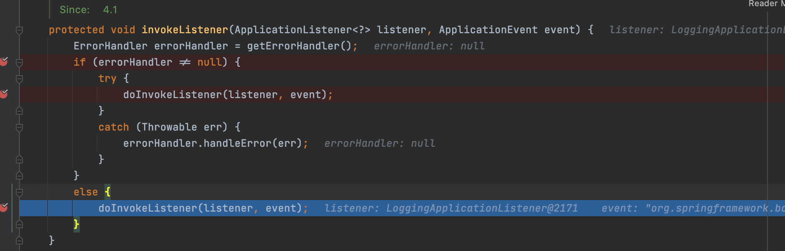
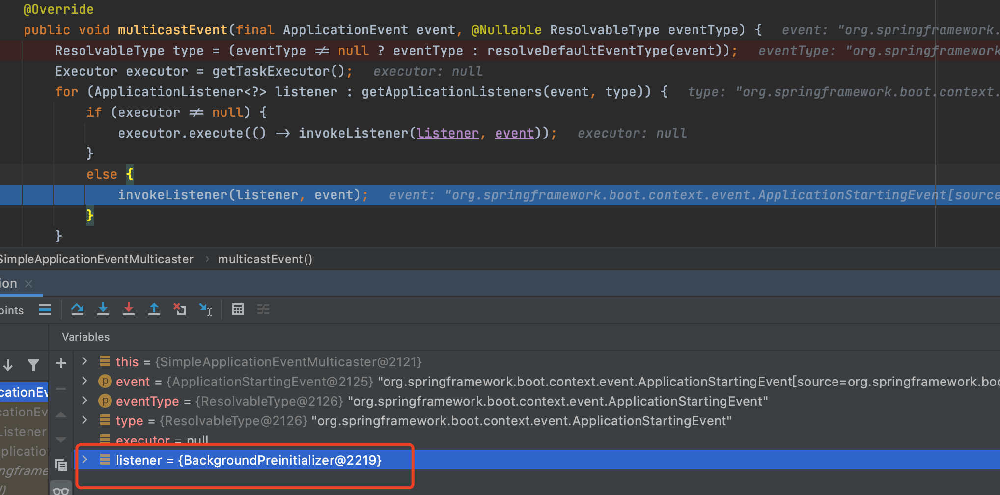

## Springboot 启动流程

### 1、启动springboot项目


进入下一步我们先看这个类是什么意思， 这个类上面的注释要仔细看，因为上面有创建的过程等。

```
这个类可以用于引导main方法和启动spring 应用程序的类，默认的将执行以下步骤来创建应用程序。
1、创建一个适当的实例(依赖你的路径)
2、注册一个参数解析器然后暴露参数做为spring的属性值
3、刷新应用程序上下文，加载所有单例bean
4、触发所有命
```


然后进入run方法


注意：在看源码的时候，有些方法我们可以跳过，但是有些构造方法不能跳过，因为一些参数等初始化后在构造方法中进行初始化。

#### 1.1、构造器


 先创建实例对象SpringApplication,  应用程序上下文 从指定来源加载bean。这里的指定参数就是在启动时候指定的类。 这个方法中wepApplicationType 是指定web 应用程序类型。


指定web应用程序类型,默认是servlet类型。


 继续往下执行，当执行到setInitializers()等方法时，着两个方法就比较重要了。

##### a、 设置setInitializers()方法

先执行getSpringFactoriesInstances()方法。

当在设置集合时候 回调用SpringFactoriesLoader.loadFactoryNames(type, classLoader) 这个是做什么的呢？


我们进入这个方法看看作用是什么, 这个方法是加载 能匹配当前类型的class 名称 从"META-INF/spring.factories" 这个路径下。


获取名称，可以看到这个名字是ApplicationContextInitializer 和前面传入的参数一样。当取到这个值后调用loadSpringFactories方法


进入该方法 去加载"META-INF/spring.factories"这个文件，当加载完成后把它加到当前result中去。


最后返回result，从这个结果最后可以看到有16个对应的值。


我们来看AutoConfigurationImportListener这个key 在文件spring.factories中可以找到,并且它还对应了一个值是ConditionEvaluationReportAutoConfigurationImportListener。从这里我们知道 这个集合里面的key-value的形式。它把配置文件中的信息全部加载到了这个result结果集里面来。


那么下一步就从这个result结果集中获取数据,根据传入的类进行匹配


获取到值,可以看到这个结果集中的数据 和配置文件中的信息 对应共7个。 然后将刚刚获取到的值分别进行实例化创建


可以看到创建的实例个数,  然后返回创建的实例集合。


##### b、设置监听器setListeners()方法

先执行getSpringFactoriesInstances(ApplicationListener.class)方法， 同样执行逻辑和上面的一样，这个方法是一个公用的方法。从执行结果看到这里的监听器已经从配置文件中加载到这个集合中来了，然后进行实例化操作


实例化对象


#### 1.2、执行run方法

上面只是做了一个初始化工作，执行run方法。这个方法中在执行到refreshContext前都是做一些准备工作


继续执行到getRunListeners方法时, 可以看这个方法有去调用那个公用方法，然后根据参数获取数据


##### 1.2.1、执行starting方法

根据SpringApplicationRunListener来获取到监听器，可以看到获取到EventPublishingRunListener。


这个类时是来发布 一些springApplicationEvents 事件的。


并且在初始化的时候会把监听器加入到 广播器中去


在上面获取到监听器后，就调用starting方法来启动


继续执行会调用EventPublishingRunListener中的starting方法。


在前面设置的监听器后，这里开始执行事件 ApplicationStartingEvent事件。


执行multicastEvent方法, 会去查找这个方法的实现类。这里执行同步invokeListener方法。


进入invokeListener方法,然后调用doInvokeListener方法。



执行方法doInvokeListener ，然后调用这个listener接口的实现类方法onApplicationEvent


调用实现类中的方法onApplicationEvent, 然后判断事件类型是那种类型，这里是ApplicationEvent类型。所以调用onApplicationStartingEvent方法。 


这里调用onApplicationStartingEvent方法，可以看到这里进行日志系统的初始化操作。当这些执行完后再 循环执行 multicastEvent方法。


循环执行 获取下一个监听器。BackgroundPreinitializer 监听器是一个 后台的预初始化的处理器。



同样最终会调用到BackgroundPreinitializer这个实现类中的onApplicationEvent方法


然后调用方法perFormPreinitialization，这里创建了一个线程，然后再事件开始之前进行 一些组件的初始化操作。


 在循环中把后续其他的监听器都进行遍历处理，在遍历完成后把要做的一些基本操作都做一下，这是在刚开始之前要做的一些事情。

所以在执行这里代码时 主要 通过一些监听器的事件来触发对应某些初始化的一些 基本操作。

```
SpringApplicationRunListeners listeners = getRunListeners(args);
listeners.starting(bootstrapContext, this.mainApplicationClass);
```

##### 1.2.2、执行prepareEnvironment方法

首先会去获取或者创建一个环境对象


调用getOrCreateEnvironment方法 创建基本的环境对象。


将相关系统属性值加载进来


当环境准备好了之后 绑定到应用程序中去,然后返回当前环境。


##### 1.2.3、创建一个应用程序上下文createApplicationContext


进入createApplicationContext方法，这个方法时通过一个函数式接口工厂来调用create方法的


进入这个类,可以看到这里会根据类型去创建一个实例对象。


创建完成后可以看到这个应用程序上下文是AnnotationConfigServletWebServerApplicationContext


##### 1.2.4、准备上下文所需要的依赖prepareContext


这个方法里进行一些基本属性的设置,  先设置上下文环境和上下文初始化， 下一步获取BeanFactory 这个类是DefaultListableBeanFactory, 然后向当前工厂注册单例对象。注册完成之后也是完成一系列的初始化操作，最后执行listeners 


##### 1.2.5、调用refreshContext

一旦调用refreshContext方法后，就会回到了spring中 refresh方法的调用了


继续往下执行


最终会调用到AbstractApplicationContext类中的refresh方法。这里就回到了spring的执行环节了。


#### 总结：在执行这个方法之前的所有操作都是在做一些基本的准备工作。

##### 1.2.6、调用listeners.started(context); 

在完成这些基本工作之后是该进行bean对象的基本创建了,在对象创建好了之后 当前应用程序就可以启动了。这个方法是去启动监听器。可以看到控制台中打印出来相关的信息。


##### 1.2.7、callRunners方法表示进行实际的执行

这个方法执行完成之后表示程序就启动好了。


这个方法执行完后控制台没有新的信息打印了


