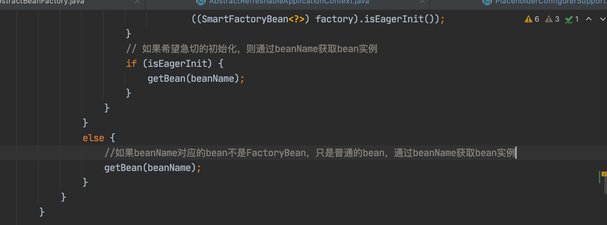
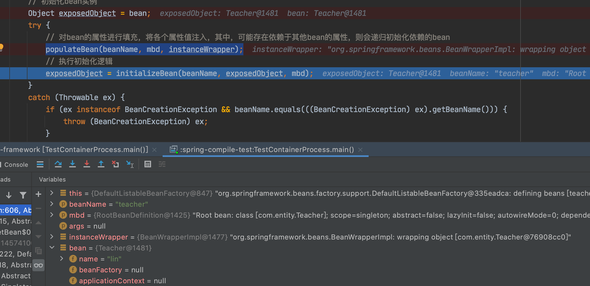
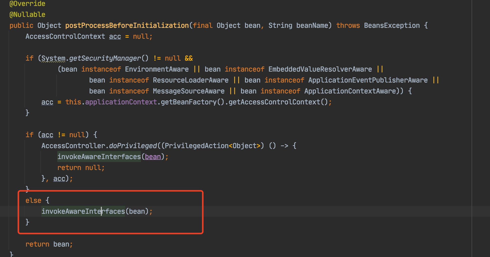
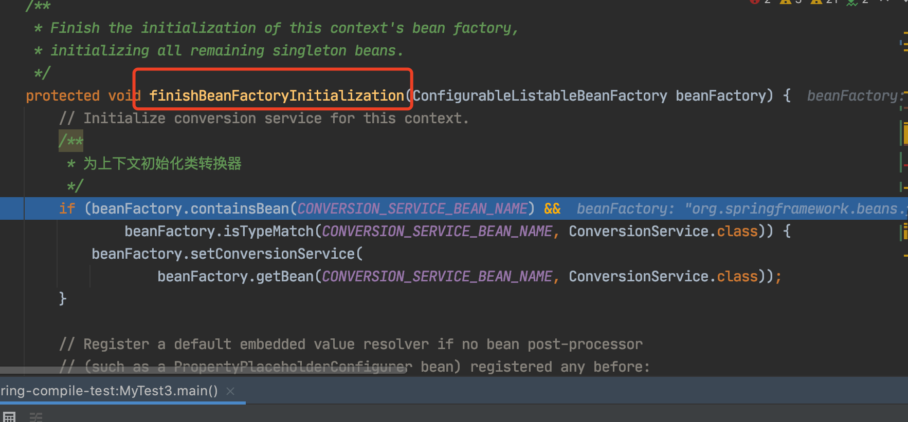
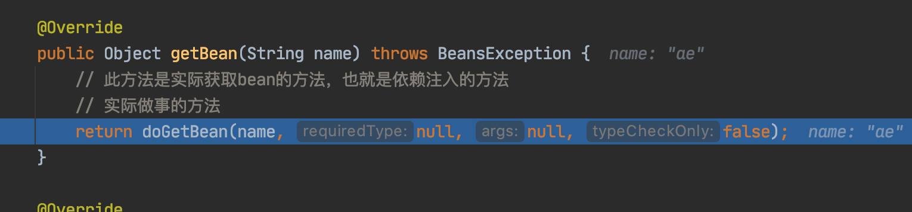
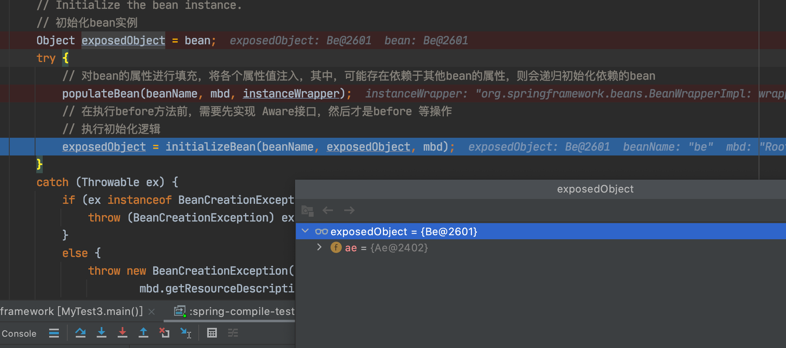

### 1、MVC模式的由来

####  1、Model1模型 

 model1模型是很早以前项目开发的一种常见模型，项目主要由jsp和javabean两部分组成。

它的优点是:结构简单，开发小型项目时效率高

 它的缺点是明显:

```
1、JSP的职责兼顾于展示数据和处理数据(也就是干了控制器和视图的事)
2、所有逻辑代码都写在jsp中，导致代码重用性很低
3、由于展示数据的代码和部分的业务代码交织在一起，维护非常不方便
所以，结论是此种设计模型以及淘汰没有人使用
```

在Model1模式下，整个Web应用几乎全部由jsp页面组成，jsp页面接收处理客户端请求，对请求处理后直接作出响应，用少量的javaBean来处理数据库连接、数据库访问等操作。

#### 1.2、Model2模型

Model2 模型是在Model1的基础上进行改良，它是MVC模型等一个经典应用，它把处理请求和展示数据分离，让每个部分各司其职。此时的jsp已经上纯粹的展示数据了，而处理请求的事情交由控制器来完成，使每个组件充分独立，提高了代码可用性和易维护性。


model2是基于mvc架构的设计模式，在model2架构中，servlet作为前端控制器，负责接收客户端发送的请求，在servlet中包含控制逻辑和简单的前端处理；后端javabean来完成实际的逻辑处理；最后，转发到相应的jsp页面处理显示逻辑， model2具有组件化的特点，，更适用于大规模应用的开发。


### 2、基于MVC模型框架：springmvc

#### 2.1、springMVC的执行过程分析


实现控制器有三种方式

```
1、通过实现controller接口(最原始的方法)，然后配置xml文件，在文件中声明
2、使用注解方式
3、通过
```


#### 第一种通过 实现controller接口来实现

```java
package com.lin.springmvc;

import org.springframework.web.servlet.ModelAndView;
import org.springframework.web.servlet.mvc.Controller;

import javax.servlet.http.HttpServletRequest;
import javax.servlet.http.HttpServletResponse;

/**
 * @ClassName mvcdemo3
 * @Description 描述
 * @Author lin
 * @Version 1.0
 */
public class HelloController  implements Controller {

    @Override
    public ModelAndView handleRequest(HttpServletRequest request, HttpServletResponse response) throws Exception {
        ModelAndView mv = new ModelAndView();
        mv.setViewName("success");
        mv.addObject("hello", "哈哈哈哈");
        return mv;
    }
}

```


配置springmvc.xml

```xml
<?xml version="1.0" encoding="UTF-8"?>
<beans xmlns="http://www.springframework.org/schema/beans"
       xmlns:mvc="http://www.springframework.org/schema/mvc"
       xmlns:aop="http://www.springframework.org/schema/aop"
       xmlns:xsi="http://www.w3.org/2001/XMLSchema-instance"
       xmlns:p="http://www.springframework.org/schema/p"
       xmlns:context="http://www.springframework.org/schema/context"
       xsi:schemaLocation="http://www.springframework.org/schema/beans
            http://www.springframework.org/schema/beans/spring-beans-4.1.xsd
            http://www.springframework.org/schema/context
            http://www.springframework.org/schema/context/spring-context-4.1.xsd
            http://www.springframework.org/schema/mvc
            http://www.springframework.org/schema/mvc/spring-mvc-4.1.xsd
            http://www.springframework.org/schema/aop
			http://www.springframework.org/schema/aop/spring-aop-4.1.xsd
        ">
    
    <!-- 1： 声明处理器映射
     目的：选择哪一个处理器来处理当前请求-->
    <bean class="org.springframework.web.servlet.handler.BeanNameUrlHandlerMapping"/>

    <!-- 2： 声明处理器适配器
         目的：调用处理器的处理请求的方法-->
    <bean class="org.springframework.web.servlet.mvc.SimpleControllerHandlerAdapter"/>

    <!-- 3：配置视图解析器
      目的：处理视图信息-->
    <bean class="org.springframework.web.servlet.view.InternalResourceViewResolver">
        <property name="prefix" value="/WEB-INF/views/" />
        <property name="suffix" value=".jsp" />
    </bean>

    <!-- 4：声明处理器
    -->
    <bean name="/helloworld" class="com.lin.springmvc.HelloController"/>

</beans>
```

web.xml

```xml
<!DOCTYPE web-app PUBLIC
 "-//Sun Microsystems, Inc.//DTD Web Application 2.3//EN"
 "http://java.sun.com/dtd/web-app_2_3.dtd" >

<web-app>
  <display-name>Archetype Created Web Application</display-name>

  <servlet>
    <servlet-name>springDispatcherServlet</servlet-name>
    <servlet-class>org.springframework.web.servlet.DispatcherServlet</servlet-class>
    <init-param>
      <param-name>contextConfigLocation</param-name>
      <param-value>classpath:springmvc.xml</param-value>
    </init-param>
    <load-on-startup>1</load-on-startup>
  </servlet>
  <servlet-mapping>
    <servlet-name>springDispatcherServlet</servlet-name>
    <url-pattern>/</url-pattern>
  </servlet-mapping>
</web-app>

```


通过调试来看其执行流程,首先启动代码后执行的是访问的前端控制层 DispatcherServlet，然后访问定义好的的/helloworld地址， 就会进入这个类的doService方法。


继续执行会调用doDispatch(request, response);方法


进入doDispatch方法中 ,然后在getHandler方法时 这里是去获取HandlerExecutionChain，也就是上面流程图中的2步通过HandlerMapping 处理器映射器 去帮我们返回一个处理器的执行链，它包含了handler，和拦截器。


继续执行到HandlerAdapter ha = getHandlerAdapter(mappedHandler.getHandler());   将执行链中的handler取出来传入到改方法中去，然后选择一个合适的适配器。 因为springmvc中有很多不同的控制器的实现方式，所以不同实现方式需要不同的适配器去调用。所以它需要 将这个handler传入进去 然后去匹配不同的适配器。


这个方法返回到是handlerAdapter适配器。可以看到这个适配器是SimpleControllerHandlerAdapter。


继续往下执行 也就是流程图4步后到第5步，在拿到了合适的处理器适配器后,由这个适配器去调用handler，调用完成后返回ModelAndView。


它调用的是进入了HandlerAdapter接口，然后通过这个接口去调用具体的实现。


在上面我们已经确定了是用那个适配器，所以进入SimpleControllerHandlerAdapter类的实现方法,进入这个方法后首先将这个handler转换为Controller,因为我们的自己定义的HelloController实现了Controller接口。 转换之后调用handlerRequest方法，它就会调用我们自己实现Controller接口然后重写handlerRequest()的方法。


调整进入我们定义的HelloController, 返回ModelAndView 然后 由回到了前端控制器DispatcherServlet


那么第8步就是调用视图解析器，进行解析。调用processDispatchResult 方法 它的作用是处理DispatchResult的结果信息


进入改方法，然后调用render方法它是做视图解析的操作。


进入此方法，可以看到返回的视图名称是"success", 以及返回的值。这里最终通过视图解析器处理之后返回的是View对象。


进入resolveViewName方法, 进行数据的渲染，最后返回View对象。


返回view对象后 ，进行第10步把Model中的数据填充到View对象中，渲染视图。


进行往下进入 抽象类AbstractView类中的 render方法


再进入renderMergedOutputModel方法类调用，进入到实现类 InternalResourceView视图解析器中。


获取到一个转发器RequestDispatcher ，调用forward方法 就会将数据返回给客户端。


#### 2.2、通过注解的方式来实现控制器

```java
package com.lin.web;

import org.springframework.stereotype.Controller;
import org.springframework.web.bind.annotation.RequestMapping;

/**
 * @ClassName mvcdemo3
 * @Description 描述
 * @Author lin
 * @Version 1.0
 */
@Controller
public class HelloController{


    @RequestMapping("/hello1")
    public String  hello(String name){
        System.out.println("Demo1控制器执行了。。。。。name" + name);
        return  "success";
    }

}

```


#### 2.2、通过实现HttpRequestHandler接口来实现控制器

```java
package com.lin.web;

import org.springframework.web.HttpRequestHandler;

import javax.servlet.ServletException;
import javax.servlet.http.HttpServletRequest;
import javax.servlet.http.HttpServletResponse;
import java.io.IOException;

/**
 * 第三中实现控制器的方式
 * @ClassName mvcdemo3
 * @Description 描述
 * @Author lin
 * @Version 1.0
 */
public class ControllerDemo1  implements HttpRequestHandler {

    @Override
    public void handleRequest(HttpServletRequest request, HttpServletResponse response) throws ServletException, IOException {
        System.out.println("====进入ControllerDemo1====handlerRequest方法====");
        request.getRequestDispatcher("/WEB-INF/pages/success.jsp").forward(request,response);
    }
}

```


2.3、注意

springmvc容器(controller)可以去调用调用service, 也就是调用spring容器的数据可以。但是spring容器想去调用controller这是不可以的。 因为这个好比是一个位全局的一个位局部的。

springmvc只去加载Controller注解或者ControllerAdvice的类，而对于spring容器 加载的时候排除 Controller和ControllerAdvice注解的类。 因为这两种注解的是交给springmvc容器维护的。


### 3、注解

 @Override 告诉编译器这个方法是覆盖分类的方法

 @WebServlet("/te") 表示某个类是一个Servlet，Web容器就会识别这个注解，在运行的时候调用它

 @Controller("/te") 表示某个类是一个控制器，告诉Spring框架类是一个控制器，注解和注释是完全不同的两个东西，看起来有点类似，其实完全不同，注解会影响程序的运行。

 注释是给开发人员看的，不会影响程序的编译和运行。注解并不是给开发人员看到，是给程序看的，会影响程序的编译和运行，编译器，Tomcat,框架。

#### 3.1、注解的作用范围

自定义开发一个web容器，基本功能是加载Servlet，需要管理它的生命周期，所以必须先识别程序中的哪些类是Servlet。

程序启动的时候，扫描所有的类，找出添加了@WebServlet注解的类，进行加载。@WebServlet是给编译器看的，编译器工作的时候识别出包含了@Override注解的方法，就去检查上层父类的相应方法，存在则通过，否则报错。

@Override是编译时候起作用，java就把它的作用范围规定为SOURCE

#### 3.2、@Target 指定注解针对的地方

  ElementType

```
ElementType.Type                     针对类、接口
ElementType.FIELD                    针对成员变量
ElementType.METHOD                   针对成员方法
ElementType.PARAMETER                针对方法参数
ElementType.CONSTRUCTOR              针对构造器
ElementType.LOCAL_VARIABLE           针对局部变量
ElementType.ANNOTATION_TYPE          针对注解
ElementType.PACKAGE                  针对包
ElementType.TYPE_PARAMETER           针对类型参数声明(1.8)
ElementType.TYPE_USE                 针对使用类型(1.8)
```

#### 3.3、@Retention 指定注解的保留域

RetentionPolicy

```
RetentionPolicy.SOURCE      源代码级别，由编译器处理，处理之后就不再保留
RetentionPolicy.CLASS       注解信息保留到类对应的class文件中
RetentionPolicy.RUNTIME      由JVM读取，运行时使用
```


### 4、spring中bean的生命周期

对应bean的生命周期，我们在源码BeanFactory接口中可知, 其注释有解释这个 生命周期的标准顺序。

aware接口存在的意义，方便通过spring中的bean对象来获取对应容器中的相关属性。

```java
<p>Bean factory implementations should support the standard bean lifecycle interfaces
 * as far as possible. The full set of initialization methods and their standard order is:  第一步实现Aware 
 * <ol>
 * <li>BeanNameAware's {@code setBeanName}
 * <li>BeanClassLoaderAware's {@code setBeanClassLoader}
 * <li>BeanFactoryAware's {@code setBeanFactory}
 * <li>EnvironmentAware's {@code setEnvironment}
 * <li>EmbeddedValueResolverAware's {@code setEmbeddedValueResolver}
 * <li>ResourceLoaderAware's {@code setResourceLoader}
 * (only applicable when running in an application context)
 * <li>ApplicationEventPublisherAware's {@code setApplicationEventPublisher}
 * (only applicable when running in an application context)
 * <li>MessageSourceAware's {@code setMessageSource}
 * (only applicable when running in an application context)
 * <li>ApplicationContextAware's {@code setApplicationContext}
 * (only applicable when running in an application context)
 * <li>ServletContextAware's {@code setServletContext}
 * (only applicable when running in a web application context)
   第二个 执行BeanPostProcessors 中的postProcessBeforeInitialization 方法
 * <li>{@code postProcessBeforeInitialization} methods of BeanPostProcessors
   第三个 执行InitializingBean 
 * <li>InitializingBean's {@code afterPropertiesSet}
 * <li>a custom init-method definition
   第四个 执行postProcessAfterInitialization
 * <li>{@code postProcessAfterInitialization} methods of BeanPostProcessors
 * </ol>
 *
 public interface BeanFactory {
}
```

这里的执行流程和下面的图中的执行一致


#### 4.1、容器和对象的创建流程

```

1、先创建容器，为什么说是先创建容器呢？因为如果先读取配置文件，但是读取后这些数据没有地方存放，所以是先创建容器，用来存放读取配置的信息。
2、加载配置文件，封装成BeanDefinition
3、调用执行BeanFactoryPostProcessor(为什么要添加这么多的processor? 因为spring作为一个框架，首先要考虑的就是扩张性！可以自定义processor来完成整个bean的实例化过程，增强某些功能)
 
 准备工作：
    准备监听器，事件，广播器
4、实例化
5、初始化
6、获取到完整对象
```


```
图中执行的顺序： 
第一步：是创建beanFactory,(refreshBeanFactory 方法创建)
第二步：创建工厂后，去加载配置文件和解析工作，
第三步：将bean对象转换成beanDefinition
第四步：执行调用BeanFactoryPostProcessor
第五步：实例化前准备工作。 但是在实例化之前 。
  a、需要在后面用到的BeanPostProcessor 都准备好。
  b、并且若要在spring的生命周期的不同阶段做不同的处理工作？就需要监听器、监听事件、广播器 这些东西都需要 提前准备好，后面才能进行调用工作。
  
第六步：这里才是实例化(实例化只是创建了一个对象，但是没有进行赋值操作)
第七步：在实例化后，这些对象中属性都是初始化值，所以下一步是填充属性。
第八步：调用Aware接口 方法
第九步：执行BeanPostProcessor:before方法
第十步：调用init方法
第十一步：执行BeanPostProcessor:after方法


在源码中org.springframework.beans.factory.support.AbstractAutowireCapableBeanFactory#initializeBean 这个方法其执行流程和上图中 实例化过程一致。
```


在图中实例化到完整对象过程中 有前置通知和后置通知，这个的作用是AOP，我们可以进入BeanPostProcessor这个接口类中看起实现类 由一个类是AbstractAutoProxyCreator 是自动代理的创建器


然后进入这个抽象类找一个creatProxy方法


在这个方法最后会调用proxyFactory.getProxy(getProxyClassLoader()); 方法


最后进入实现类DefaultAopProxyFactory中，可以知道这个的实现方式 是jdk动态代理和cglib动态代理。


通过代码来验证这个流程

```java
package com.entity;

import org.springframework.beans.factory.BeanFactory;
import org.springframework.beans.factory.BeanFactoryAware;
import org.springframework.context.ApplicationContext;
import org.springframework.context.ApplicationContextAware;

/**
 * 测试容器和对象的创建过程
 * @ClassName spring
 * @Description 描述
 * @Date 2021/3/26 4:23 下午
 * @Author lin
 * @Version 1.0
 */
public class Teacher  implements BeanFactoryAware, ApplicationContextAware {

	private String name ;
	/**
	 * 这个是通过容器去处理的
	 */
	private BeanFactory beanFactory;

	private ApplicationContext applicationContext;

	public String getName() {
		return name;
	}

	public void setName(String name) {
		this.name = name;
	}

	public BeanFactory getBeanFactory() {
		return beanFactory;
	}

	@Override
	public void setBeanFactory(BeanFactory beanFactory) {
		this.beanFactory = beanFactory;
	}

	public ApplicationContext getApplicationContext() {
		return applicationContext;
	}

	@Override
	public void setApplicationContext(ApplicationContext applicationContext) {
		this.applicationContext = applicationContext;
	}
}

```

配置文件

```xml
<?xml version="1.0" encoding="UTF-8" ?>
<beans xmlns="http://www.springframework.org/schema/beans"
	   xmlns:xsi="http://www.w3.org/2001/XMLSchema-instance"
	   xsi:schemaLocation="http://www.springframework.org/schema/beans
            http://www.springframework.org/schema/beans/spring-beans-4.1.xsd
">

 <bean id="teacher" class="com.entity.Teacher">
	 <!--只要1个属性值-->
	 <property name="name" value="lin"></property>
 </bean>

</beans>
```

测试代码

```java
package com;

import com.entity.Teacher;
import org.springframework.context.ApplicationContext;
import org.springframework.context.support.ClassPathXmlApplicationContext;

/**
 * @ClassName spring
 * @Description 描述
 * @Date 2021/3/26 4:24 下午
 * @Author lin
 * @Version 1.0
 */
public class TestContainerProcess {

	public static void main(String[] args) {
		ApplicationContext ac = new ClassPathXmlApplicationContext("text.xml");
		Teacher teacher = ac.getBean(Teacher.class);
		System.out.println(teacher.getName());
		System.out.println(teacher.getApplicationContext());
	}
}

```

根据debug进入ClassPathXmlApplicationContext类，后最终会调用refresh方法。进入refresh方法后根据上面容器和对象的创建流程可知。

```java
@Override
	public void refresh() throws BeansException, IllegalStateException {
		synchronized (this.startupShutdownMonitor) {
			// Prepare this context for refreshing.
			/**
			 * 做容器刷新前的准备工作
			 * 1、设置容器启动时间
			 * 2、设置活跃状态为true
			 * 3、设置关闭状态为false
			 * 4、获取Environment对象，并加载当前系统的属性值到Environment对象中
			 * 5、准备监听容器和事件的集合对象，默认为空的集合
			 */
			prepareRefresh();

			// Tell the subclass to refresh the internal bean factory.
			/**
			 * 创建容器对象：DefaultListableBeanFactory
			 * 加载xml配置文件到当前工厂中，最重要的是BeanDefinition
			 */
			ConfigurableListableBeanFactory beanFactory = obtainFreshBeanFactory();

			// Prepare the bean factory for use in this context.
			/**
			 *  beanFactory的准备工作，对各种属性进行填充
			    前面创建的 beanFactory 里面的属性都是默认值，还没有做任何的属性复制操作
			    所有这里对beanFactory 设置具体的属性值。
			 */
			prepareBeanFactory(beanFactory);

			try {

				// Allows post-processing of the bean factory in context subclasses.
				/**
				 * 留给子类做扩展 操作
 				 */
				postProcessBeanFactory(beanFactory);

				// Invoke factory processors registered as beans in the context.
				/**
				 * 调用各种beanFactory处理器
				 */
				invokeBeanFactoryPostProcessors(beanFactory);

				// Register bean processors that intercept bean creation.
				/**
				注册bean处理器，这里只是注册功能，真正调用的是getBean方法
				 */
				registerBeanPostProcessors(beanFactory);

				// Initialize message source for this context.
				/**
				 * 为上下文初始化Message源，即不同语言的消息体，国际化处理
				 */
				initMessageSource();

				// Initialize event multicaster for this context.
				/**
				 * 初始化事件监听多路广播器
				 */
				initApplicationEventMulticaster();

				// Initialize other special beans in specific context subclasses.
				/**
				 *  留给子类未初始化其他的bean
				 */
				onRefresh();

				// Check for listener beans and register them.
				/**
				 * 在所有注册的bean中查找listener bean，注册到消息广播器中
				 */
				registerListeners();

				// Instantiate all remaining (non-lazy-init) singletons.
				/**
				 * 初始化剩下的单实例(非懒加载的)
				 */
				finishBeanFactoryInitialization(beanFactory);

				// Last step: publish corresponding event.
				finishRefresh();
			}

			catch (BeansException ex) {
				if (logger.isWarnEnabled()) {
					logger.warn("Exception encountered during context initialization - " +
							"cancelling refresh attempt: " + ex);
				}

				// Destroy already created singletons to avoid dangling resources.
				destroyBeans();

				// Reset 'active' flag.
				cancelRefresh(ex);

				// Propagate exception to caller.
				throw ex;
			}

			finally {
				// Reset common introspection caches in Spring's core, since we
				// might not ever need metadata for singleton beans anymore...
				resetCommonCaches();
			}
		}
	}
```

##### 第一步是创建容器


在这个方法里去创建 BeanFactory


从debug看到 执行到这行代码时，其beanDefinitionMap和bbeanDefinitionNames都是0。这里就已经执行了第一步创建容器。


##### 第二步是加载配置文件，封装成Beandifinition。

可以看到beanDefinitionMap数量是1，这个过程完成了配置文件的加载。


然后回到refresh方法。在前面只是完成了对象的创建，并没有给它设置属性。所以prepareBeanFactory是完成对属性对象的设置工作。


##### 第三步，调用执行BeanFactoryPostProcessor, 


在调用BeanFactoryPostProcessor后 需要去做一些准备工作来为实例化做准备。


##### 第四步 进行实例化finishBeanFactoryInitialization(beanFactory);

 进入该方法中 可以看到重要的是

```
beanFactory.preInstantiateSingletons(); 方法
```


进入该方法的 又一个getBean方法



此方法是实际获取bean的方法，也是触发依赖注入的方法


进入doGetBean方法,在这个时候容器中还没有测试的对象，因为还没有调用反射来创建对象。那么就需要创建对象


继续往下这里有一个方法creatBean方法来创建对象


进入creatBean方法有一个 doGetBean方法来实际创建bean的方法。


进入doGetBean方法 ，如果没有创建实例那么就去创建。


可以看到ctor为空，那么就会进入instantiateBean方法。


继续调试， getInstantiationStrategy().instantiate(mbd, beanName, parent);这个方法是 获取实例策略并进行实例化操作


进入这个方法的实现后, 可以看到这里 使用了反射clazz.getDeclaredConstructor(); 来获取无参的构造器，通过反射生成具体的实例对象。


在实例化对象后，返回代码AbstractAutowireCapableBeanFactory类中的 doCreateBean方法，可以看到对象已经创建好了，但是属性值还没有。


当执行到populateBean(beanName, mbd, instanceWrapper);方法时可以看到 这个方法是去填充属性，它只会填充一个属性值，其他beanFactory和 applicationContext属性 它们都是通过aware接口设置进来的。这个过程不是用户来设置的。



继续往下进入initializeBean 方法, 可以看到会调用aware方法 invokeAwareMethods(), 这个方法只会设置beanFactory, 而不会设置applicationContext。


这个方法中只会去处理BeanFactoryAware。 不会处理ApplicationContext。


继续往下执行，在执行完applyBeanPostProcessorsBeforeInitialization方法后 ，其bean中的属性值就设置完了。





继续往下执行 applyBeanPostProcessorsAfterInitialization方法后，返回一个实例对象。这个时候对象就完整了。


#### 为什么使用Aware 接口来处理。

为什么aware 要分不同的来处理BeanFactory和ApplicationContext。 这是因为BeanFactory和ApplicationContext是两个不同的分支，所以在实现对应的aware接口时分为两套来实现。

#### #、小结

```
一个框架首先考虑的一定是扩展性，spring提供了什么扩展性？
1、在对象创建之前添加某些功能
2、在容器初始化之前添加某些功能
3、在不同的阶段发出不同的事件，完成一些功能
4、抽象出一堆的接口来帮助扩展
5、面向接口编程
```


#### 4.2、spring中循环依赖

##### 1、三级缓存中分别保存的是什么

```

  a. 完整对象
  b. 半成品对象
  c. lambda表达式（AbstractBeanFactory.doGetBean 中有一个getSingleton(beanName, ()->{})）

```

##### 2、如果只使用1级缓存可以吗？

```
  不可以，因为完整对象和班成品对象会放到一起，在进行获取的时候有可能获取到半成品对象，这样的对象是没法使用的,不能直接进行相关的处理，因此要把半成品和成品的存放空间分割开来。
```


##### 3、如果只有二级缓存可以吗？

```
  如果能保证所有的bean对象都不去调用getEarlyBeanReference此方法，那么使用二级缓存就可以。
   getSingleton、doCreateBean 只有二级缓存的时候可以解决循环依赖问题，不过在添加aop的实现之后，会报错。This means that said other beans do not use the final version of the bean ,没有使用最终版本的对象。
```


#####  4、三级缓存存在到底做了什么事？

  ```
如果一个对象需要被代理，生成代理对象，那么这个对象需要预先 生成非代理对象吗？ 需要

 三级缓存到底做了什么？
   ()->getEarlyBeanReference() 这个方法重要，因为这个里面的逻辑就是解释三级缓存的作用。
   在当前方法之后，有可能会用代理对象替换 非代理对象，如果没有三级缓存，那么就无法得到代理对象，换句话说 在整个容器中，包含了同名对象的代理对象和非代理对象，这样是不可以的。 容器中，对象都是单例的 这意味着根据名称只能获取一个对象的值，此时同时存在两个对象的话，那就不知道应该使用哪一个了，无法判断。
   同时也不能确认什么时候调用当前对象，是在其它对象的执行过程进行调用的，而不是人为指定的，所以必须保证容器中任何时候都只有一个对象供外部调用，所以三级缓存，完整了一件代理对象替换非代理对象的工作，确定返回的是唯一的对象

   三级缓存是为了解决aop代理过程产生的循环依赖问题，如果没有aop的话，二级缓存可以解决循环依赖问题。 其实相当于一个回调机制，当我们需要使用当前对象的时候，会判断此对象是否需要被代理实现，如果是直接替换，否则直接返回非代理对象即可。
  ```


```
ObjectFactory是一个函数式接口，仅有一个方法，可以传入lambda表达式，可以是匿名内部类，通过调用getObject方法来执行具体的逻辑。
```

##### 5、缓存获取逻辑

获取缓存逻辑, 首先是从 一级缓存中缓存数据，如果 一级缓存中没有 并且改beanName对应的单例bean正在创建，那么就从二级缓存中去获取， 若二级缓存中没有并且允许创建早期单例对象引用，并且允许创建创建早期单例对象引用，那么就从 三级缓存中取数据，并且把数据设置到二级缓存中，最后在三级缓存中把对应的beanName移除。

```java
/**
	 * Return the (raw) singleton object registered under the given name.
	 * <p>Checks already instantiated singletons and also allows for an early
	 * reference to a currently created singleton (resolving a circular reference).
	 * @param beanName the name of the bean to look for
	 * @param allowEarlyReference whether early references should be created or not
	 * @return the registered singleton object, or {@code null} if none found
	 */
	@Nullable
	protected Object getSingleton(String beanName, boolean allowEarlyReference) {
		//从单利对象缓存中获取beanName对应的单例对象
		Object singletonObject = this.singletonObjects.get(beanName);
		// 如果单例对象缓存中没有，并且该beanName对应的单例bean正在创建中
		if (singletonObject == null && isSingletonCurrentlyInCreation(beanName)) {
			synchronized (this.singletonObjects) {
				// 从早期单利对象缓存中获取单例对象(之所以称为早期单例对象，是因为earlySingletonObjects 里
				// 的对象 都是通过提前曝光的ObjectFactory创建出来的，还未进行属性填充等操作)
				singletonObject = this.earlySingletonObjects.get(beanName);
				// 如果早期单例对象缓存中也没有，并且允许创建早期单例对象引用
				if (singletonObject == null && allowEarlyReference) {
					ObjectFactory<?> singletonFactory = this.singletonFactories.get(beanName);
					if (singletonFactory != null) {
						singletonObject = singletonFactory.getObject();
						this.earlySingletonObjects.put(beanName, singletonObject);
						this.singletonFactories.remove(beanName);
					}
				}
			}
		}
		return singletonObject;
	}

```


##### 6、如果某个bean需要代理对象，那么会不会创建普通的bean对象？

 会，必须会。 也就是说一个类是代理类了，这个类还需要实例化吗？会。 下面的代码解释了这个，在if条件中会根据条件判断 可能会执行也可能不会执行。 如果会执行那么这个exposedObject对象就会被执行，如果不会那么就返回bean对象。 所以普通对象的可能要创建的。

```java
	protected Object getEarlyBeanReference(String beanName, RootBeanDefinition mbd, Object bean) {
		// 默认最终公开的对象是bean，通过createBeanInstance创建处理的普通对象
		Object exposedObject = bean;
    // 下面是代理过程
		// mbd的synthetic属性，设置此bean定义是否是 synthetic，一般是指只有AOP相关的pointCut配置或者Advice配置才会将synthetic设置为true
        // 如果mbd不是 synthetic且此工厂拥有InstantiationAwareBeanPostProcessors
		if (!mbd.isSynthetic() && hasInstantiationAwareBeanPostProcessors()) {
			// 遍历工厂内的所有后处理器
			for (BeanPostProcessor bp : getBeanPostProcessors()) {
				// 如果bp 是 SmartInstantiationAwareBeanPostProcessor
				if (bp instanceof SmartInstantiationAwareBeanPostProcessor) {
					SmartInstantiationAwareBeanPostProcessor ibp = (SmartInstantiationAwareBeanPostProcessor) bp;
					// 让 exposedObject 进过每个SmartInstantiationAwareBeanPostProcessor的包装
					exposedObject = ibp.getEarlyBeanReference(exposedObject, beanName);
				}
			}
		}
		//返回最终经过层次包装后的对象
		return exposedObject;
	}
```

##### 7、为什么使用了三级缓存就可以解决这个问题？

```
当一个对象需要被代理的时候，在整个创建过程中包含两个对象。一个普通对象，一个代理生成的对象，bean默认都是单例，那么在整个生命周期的处理环节中，一个beanName能对象两个对象吗？不能，既然不能的话，那保证在使用的时候加一层判断，判断一下是否需要进行代理的处理。
```

##### 8、怎么知道什么时候使用呢？

```
因为不知道什么时候回调，所以通过一个匿名内部类的方式，在使用的时候直接对普通对象进行覆盖操作，保证全局唯一。

1、一级缓存存放成品对象
2、二级缓存放半成品对象
3、三级缓存放lambda表达式，来完成代理对象的覆盖过程
```


#### 4.3、循环依赖测试案例

建立两个类Ae, Be

```java
package com.entity;
/**
 * 测试循环依赖
 * @ClassName spring
 * @Description 描述
 * @Date 2021/3/31 2:13 下午
 * @Author lin
 * @Version 1.0
 */
public class Ae {
	private Be be;

	public Be getBe() {
		return be;
	}

	public void setBe(Be be) {
		this.be = be;
	}
}

```

Be

```java
package com.entity;

/**
 * 测试循环依赖
 * @ClassName spring
 * @Description 描述
 * @Date 2021/3/31 2:14 下午
 * @Author lin
 * @Version 1.0
 */
public class Be {
	private Ae ae;

	public Ae getAe() {
		return ae;
	}

	public void setAe(Ae ae) {
		this.ae = ae;
	}

	public void show(){
		System.out.println("B......show");
	}
}

```

tec.xml 配置文件

```
<?xml version="1.0" encoding="UTF-8" ?>
<beans xmlns="http://www.springframework.org/schema/beans"
	   xmlns:mvc="http://www.springframework.org/schema/mvc"
	   xmlns:aop="http://www.springframework.org/schema/aop"
	   xmlns:xsi="http://www.w3.org/2001/XMLSchema-instance"
	   xmlns:p="http://www.springframework.org/schema/p"
	   xmlns:context="http://www.springframework.org/schema/context"
	   xsi:schemaLocation="http://www.springframework.org/schema/beans
            http://www.springframework.org/schema/beans/spring-beans-4.1.xsd
            http://www.springframework.org/schema/context
            http://www.springframework.org/schema/context/spring-context-4.1.xsd
            http://www.springframework.org/schema/mvc
            http://www.springframework.org/schema/mvc/spring-mvc-4.1.xsd
            http://www.springframework.org/schema/aop
			http://www.springframework.org/schema/aop/spring-aop-4.1.xsd
        ">

	<!--循环依赖-->
 <bean id="ae" class="com.entity.Ae">
	 <property name="be" ref="be"/>
 </bean>
<bean id="be" class="com.entity.Be">
	 <property name="ae" ref="ae"/>
</bean>

</beans>
```

测试代码

```java
import org.springframework.context.ApplicationContext;
import org.springframework.context.support.ClassPathXmlApplicationContext;

/**
 * -循环依赖
 * @ClassName spring
 * @Description 描述
 * @Date 2021/3/31 2:49 下午
 * @Author lin
 * @Version 1.0
 */
public class MyTest3 {
	public static void main(String[] args) {
		ApplicationContext context = new ClassPathXmlApplicationContext("tec.xml");
		Object ae = context.getBean("ae");
		Object be = context.getBean("be");
		System.out.println(ae);
		System.out.println(be);
	}
}

```


进入refresh方法中的finishBeanFactoryInitialization() 方法



然后在进入preInstantiateSingletons 这个方法


调用getBean方法, 可以看到这个beanName =ae


继续往下走



进入调用的这个方法


进入getSingleton方法, 在这里可以看到这个一级缓存中的数据。因为这个beanName在一级缓存中没有，所以

singletonObject 为null， 并且这里的isSingletonCurrentlyInCreation(beanName) = false 所以不进入下面的判断，直接返回null


回到前面调用的部分, 可以看到sharedInstance = null, 这里是验证缓存中是否有对象。


继续往下, 会再次调用一个getSingleton方法，但是这里会传入一个lambda表达式， 并调用creatBean方法


进入createBean方法后，会去调用一个doCreateBean方法, 这个方法才是实际创建bean的方法


进入此方法，先进行判断 是否创建实例，如果没有创建那么就先创建实例


在createBeanInstance 方法中最后调用 instantiateBean() 方法


 进入此方法中，可以看到这个方法中调用反射来创建实例对象 。 constructorToUse = clazz.getDeclaredConstructor(); 调用构造器


实例化对象 并返回。


返回创建对象,  Ae@2885. 这个只是创建一个实例但是其中属性值 还没有 赋值。


回到doCreateBean 方法,  这里判断提前曝光。earlySingletonExposure=true


  进入 方法addSingletonFactory 方法中, 先判断 一级缓存中是存在这个beanName, 如果不存在 那么就将这个实例 存放到三级缓存中，并且删除二级缓存中的数据。


三级缓存数据。


上面设置完后  在回到doCreateBean方法中, 因为上面的实现对象创建后 还没有进行属性填充。 但是这个属性是指向be的引用，这个属性值为null, 那么它就会先 去进行实例化处理。


 属性填充，也就是进行属性be的填充,  会进入doGetBean方法中调用getSingleton方法

 可以看到 这里beanName=be  ， 并且这个实例在一级缓存中不存在。


进行往下 , 它会 再次调用createBean 进行实例对象的创建


在be 实例创建完成之后 ，


然后又进行属性的填充。 进入属性填充方法populateBean，然后执行调用applyPropertyValues 方法 来应用给定的属性值，解决对该bean工厂中其他bean的任何运行时引用。 在这个方法调用resolveValueIfNecessary


这个方法判断value的类型


这个方法是在工厂中解决 对另外一个bean的引用


在调用getBean方法后, 又会去调用 doGetBean方法


再次调用这个方法中，它同样也会去先去缓存中取数据，如果没有那么就要 先实例化对象，这样 就回到创建实例对象Ae的步骤来。


在Be创建实例对象之后， 又去调用populateBean进行属性填充， 最终又会去调用doGetBean方法。


这个时候去调用getSingleton 方法，这里条件成立，因为在填充属性be是，ae的实例化对象已经创建了，这个条件就满足了，所以进入下面的代码逻辑。 然后判断二级缓存中是否有这个beanName ,如果 没有并且允许创建早期单例对象 那么就会进入 下面的判断。 这里会从三级缓存中取出 前面实例化 ae对象的数据.  并将其设置到 二级缓存中 同时从三级缓存中移除该 实例对象。 最后返回该实例对象


在be对象创建实例对象 并设置属性完成后，那么就进行 下一阶段的工作, 进行初始化工作。



不过在初始化之前会调用Aware接口  , BeanPostProcessors 相关等方法 ，调用完成后返回一个完成的对象。


可以看到这个初始化后的Be对象，其属性已经填充好了，接下来该将be 对象设置到 Ae实例对象的属性中去。


在be对象初始化完成后返回， 将这个完整的Be对象 赋值给Ae对象中的 be属性。


在属性填充后，进行Ae对象的初始化操作。最后返回完整的对象


#### 4.4、FactoryBean 

  FactoryBean这个接口的作用是做扩展。和BeanFactory不同的是 这个接口它通过getObject方法 来自行实现不同的逻辑，最终在调用返回的时候是根据这个逻辑产生的对象，而不是通过BeanFactory工厂方法创建的一些标准对象。

 FactoryBean 可以按照自己的需求进行一些独特的控制。 在springcloud 中Feign就是通过FactoryBean来进行注入的。


### 5、AOP


