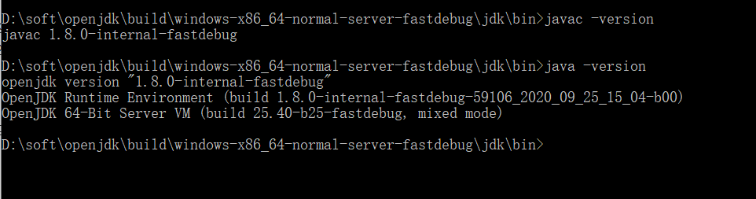

## windows下编译openjdk8

### 1、环境准备

####  1.1 Windows10 64操作系统 安装jdk1.7版本以上。

####  1.2 cygwin 安装程序 http://www.cygwin.com/

####  1.3 freeType 2.7  https://download.savannah.gnu.org/releases/freetype/

####  1.4 Microsoft Visual Studio 2010 Professional  https://msdn.itellyou.cn/

####  1.5 openjdk1.8 下载 https://www.cnblogs.com/lighten/p/5906359.html 这个博客里面可以下载

### 2、安装工具

####  2.1、cygwin安装 先下载 http://www.cygwin.com/

 

cygwin模拟Linux环境的软件，相当于一个虚拟机，主要编译工作在这里进行。cygwin软件很多，这里只选择需要的软件安装即可

在安装cygwin时，使用阿里云的镜像来安装


选择需要的进行安装，比如gcc,  如果没有安装必须的软件，那么在进行配置的时候就会报错


Tip:如果已经安装完了Cygwin软件后，想要继续安装其他的软件包，可以再次运行Cygwin的安装程序，在过程中确保其选中了本地的Cygwin安装目录，一直点击下一步后会出现选择安装包的界面。


### 3、安装FreeType-2.7 

在下载FreeType之后，在其目录中创建一共lib文件 ，然后运行Visual Studio 2010，依次点击 File -> Open -> Project/Solution


然后选择打开 freetype-2.7\builds\windows\vc2010\freetype.sln 文件


然后右键属性，将其配置修改为下面的。


第一次先修改为如下的配置保存，让其生成lib文件


第二次，再次右击项目，点击 Properties按钮，弹出窗口。将其修改为如下配置。


第三步右击项目，点击 Build 按钮后成功编译出dll文件。
将 freetype-2.7\objs\vc2010\x64\ 目录下的 freetype.lib 和 freetype.dll 两个文件拷贝到lib目录下


### 4、开始编译

####  1).生成编译配置脚本


输入以下命令,注意安装的vs不能有空格，不然会报错。

```
./configure -with-freetype=/cygdrive/d/soft/freetype-2.7/ -enable-debug -with-target-bits=64 with_toolsdir="/cygdrive/d/soft/VS2010/VC/bin" --disable-ccache
```

成功后如下


#### 2).编译JDK

Cygwin切换到JDK根目录下,执行如下命令

``` 
make all
```

命令执行后会开始编译，编译过程可能比较久，具体看机器性能


如果出现jdk版本问题，那么就将打开 文件D:\soft\openjdk\common\autoconf\generated-configure.sh

将下面的进行注释


如果出现下面错误


那么修改 openjdk\jdk\make 下的CreateJars.gmk 文件，打开文件


两个 ‘class$$’ 中间加入回车符号（按下Ctrl + M），将上面的修改为下面的


编译成功显示如下


#### 3).验证编译结果

运行 cmd.exe ，进入目录D:\soft\openjdk\build\windows-x86_64-normal-server-fastdebug\jdk\bin

可以看到这个编译成功了



#### OpenJDK 源码的目录结构

```
openjdk
—— corba：不流行的多语言、分布式通讯接口
—— hotspot：Java 虚拟机
—— jaxp：XML 处理
—— jaxws：一组 XML web services 的 Java API
—— jdk：java 开发工具包
—— —— 针对操作系统的部分
—— —— share：与平台无关的实现
—— langtools：Java 语言工具
—— nashorn：JVM 上的 JavaScript 运行时
```

其中Hotspot就是我们要看的JVM包

```
Hotspot：全称 Java HotSpot Performance Engine，是 Java 虚拟机的一个实现，包含了服务器版和桌面应用程序版。利用 JIT 及自适应优化技术（自动查找性能热点并进行动态优化）来提高性能。

使用 java -version 可以查看 Hotspot 的版本。
```

#### Hotspot的目录结构

```

├─agent                            Serviceability Agent的客户端实现
├─make                             用来build出HotSpot的各种配置文件
├─src                              HotSpot VM的源代码
│  ├─cpu                            CPU相关代码（汇编器、模板解释器、ad文件、部分runtime函数在这里实现）
│  ├─os                             操作系相关代码
│  ├─os_cpu                         操作系统+CPU的组合相关的代码
│  └─share                          平台无关的共通代码
│      ├─tools                        工具
│      │  ├─hsdis                      反汇编插件
│      │  ├─IdealGraphVisualizer       将server编译器的中间代码可视化的工具
│      │  ├─launcher                   启动程序“java”
│      │  ├─LogCompilation             将-XX:+LogCompilation输出的日志（hotspot.log）整理成更容易阅读的格式的工具
│      │  └─ProjectCreator             生成Visual Studio的project文件的工具
│      └─vm                           HotSpot VM的核心代码
│          ├─adlc                       平台描述文件（上面的cpu或os_cpu里的*.ad文件）的编译器
│          ├─asm                        汇编器接口
│          ├─c1                         client编译器（又称“C1”）
│          ├─ci                         动态编译器的公共服务/从动态编译器到VM的接口
│          ├─classfile                  类文件的处理（包括类加载和系统符号表等）
│          ├─code                       动态生成的代码的管理
│          ├─compiler                   从VM调用动态编译器的接口
│          ├─gc_implementation          GC的实现
│          │  ├─concurrentMarkSweep      Concurrent Mark Sweep GC的实现
│          │  ├─g1                       Garbage-First GC的实现（不使用老的分代式GC框架）
│          │  ├─parallelScavenge         ParallelScavenge GC的实现（server VM默认，不使用老的分代式GC框架）
│          │  ├─parNew                   ParNew GC的实现
│          │  └─shared                   GC的共通实现
│          ├─gc_interface               GC的接口
│          ├─interpreter                解释器，包括“模板解释器”（官方版在用）和“C++解释器”（官方版不在用）
│          ├─libadt                     一些抽象数据结构
│          ├─memory                     内存管理相关（老的分代式GC框架也在这里）
│          ├─oops                       HotSpot VM的对象系统的实现
│          ├─opto                       server编译器（又称“C2”或“Opto”）
│          ├─prims                      HotSpot VM的对外接口，包括部分标准库的native部分和JVMTI实现
│          ├─runtime                    运行时支持库（包括线程管理、编译器调度、锁、反射等）
│          ├─services                   主要是用来支持JMX之类的管理功能的接口
│          ├─shark                      基于LLVM的JIT编译器（官方版里没有使用）
│          └─utilities                  一些基本的工具类
└─test                             单元测试

```


参考地址：

```
https://www.jianshu.com/p/0360f4d57769?utm_campaign=haruki
https://www.cnblogs.com/lighten/p/5906359.html
https://www.cnblogs.com/jpfss/p/11641045.html#problems
https://blog.csdn.net/a510835147/article/details/73011498
https://blog.csdn.net/u014106644/article/details/89316483
```

