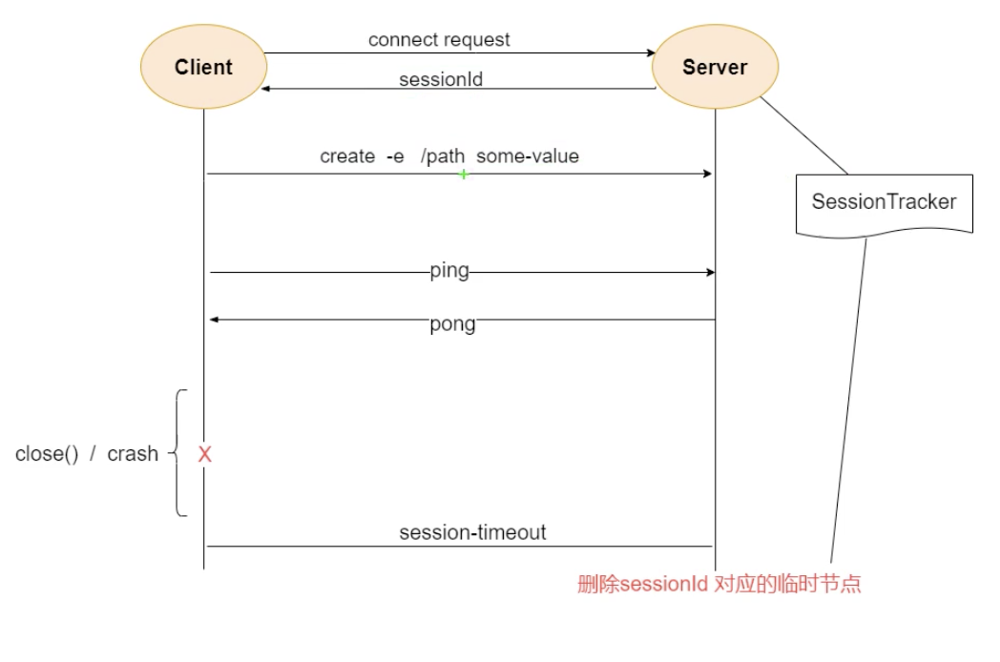
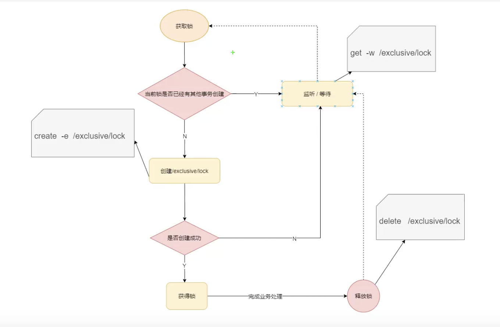
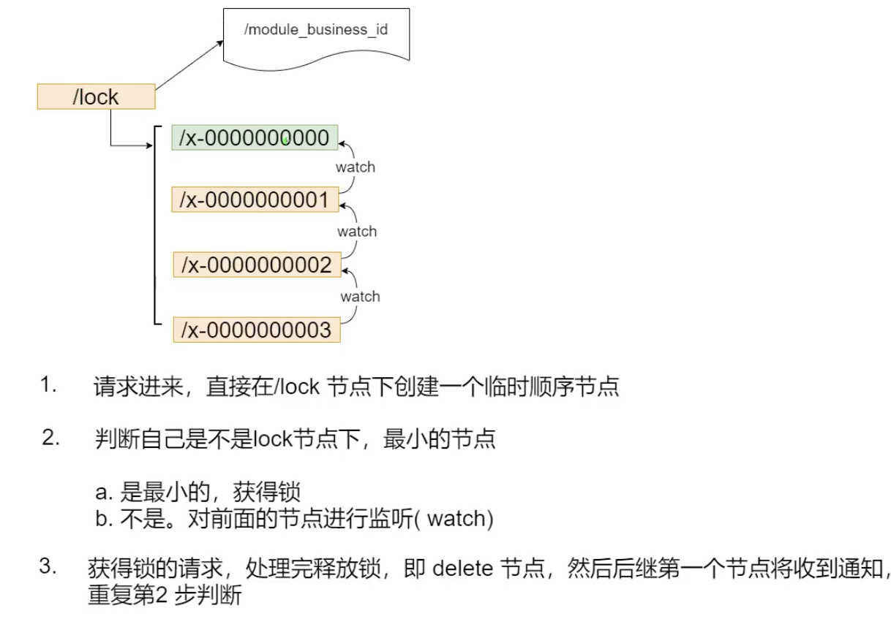
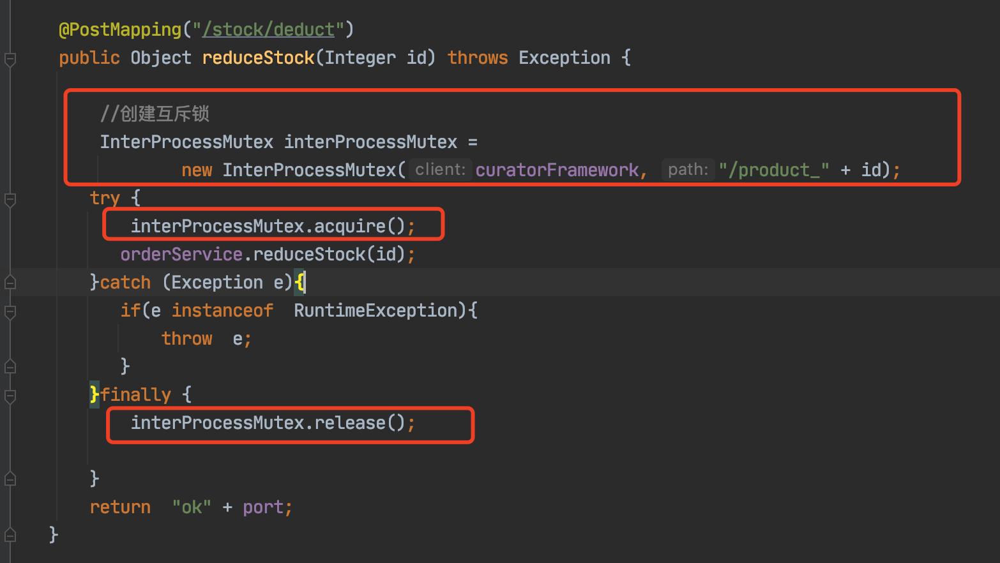
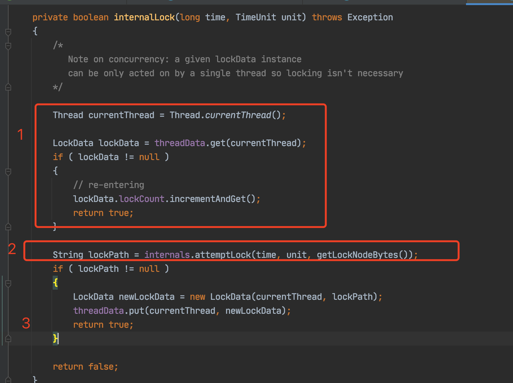
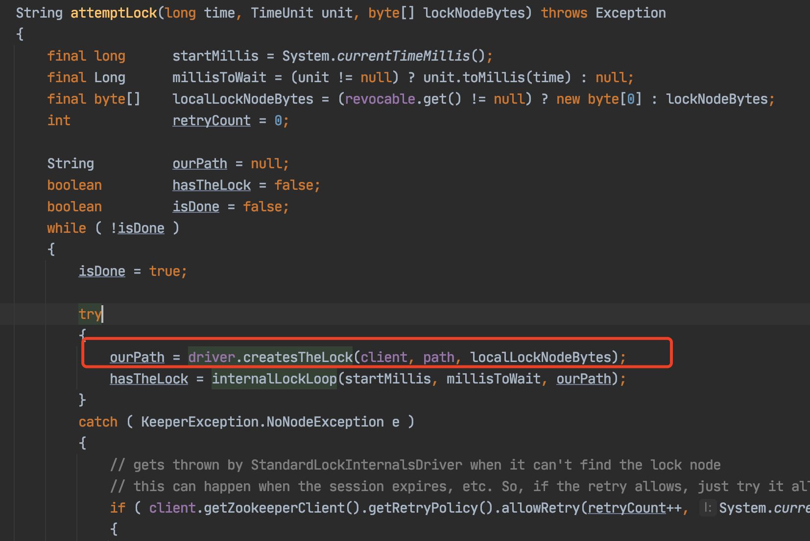
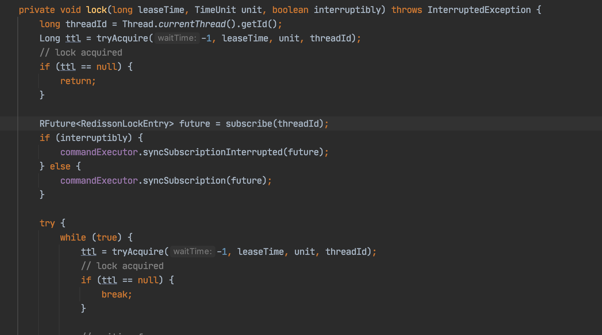
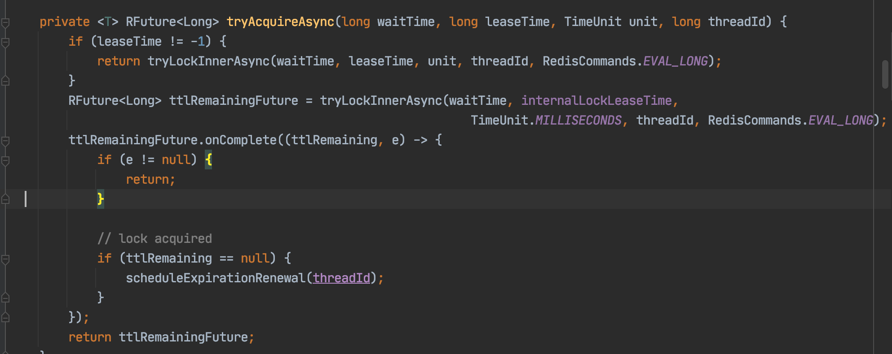
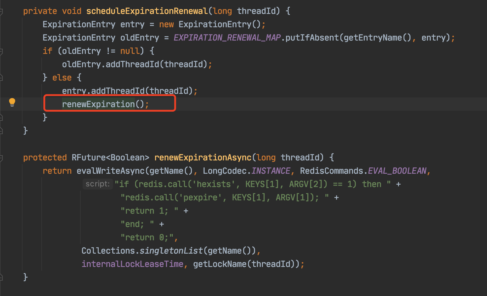
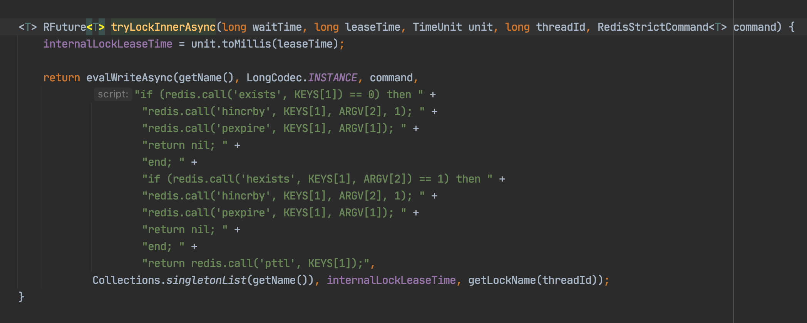

## zookeeper核心概念

### 1、zookeeper是什么

 一个分布式协调框架，它主要用来解决分分布式应用中经常遇到的一些数据管理问题，如：统一命名服务、状态同步服务、集群管理、分布式应用配置项的管理等。c/s 架构


### 2、zookeeper核心概念

  zookeeper有一个非常重要的结构-文件系统的数据结构，所有的数据在zookeeper中都是以树形的方式来组织。

```
.持久节点---一旦创建，永久存在
.临时节点---session超时，会被服务器删除
.持久化顺序节点---持久化节点的基础上，自带顺序
.临时顺序节点----临时结构的基础上，自带顺序

zookeeper-3.5 版本
.容器节点----当没有子节点时，未来会被服务器删除
.TTL节点----过了TTL指定的时间时，被服务器删除
```


#### 2.1、临时节点

zookeeper在创建临时节点时，会在临时节点上记录sessionId。因为临时节点是和sessionId强关联的。sessionId如果超时那么临时节点也会被删除。 在客户端和服务端建立连接之后，后续所有的命令从客户端发送到服务端的命令，那么服务端都会去把这个超时时间 给延长，延长客户端设置好的session超时时间。  这是session的保活机制 是由SessionTracker 具体实现的。



#### 2.2、事件监听机制


#### 2.3、分布式锁

获取锁时先判断这个锁是否有人创建了，如创建了那么其他人就会失败。  创建之后其它人就会会对它 这个节点进行监听。 若没有人创建 那么就会去创建节点，在创建的时候会有很多人一起去创建 肯定有人创建成功，有人创建失败。创建成功的人进行业务处理，用完锁之后释放锁。 释放锁之后 前面对其监听的 就会感知到(zookeeper就会去通知正在进行监听的请求)



通过这种方式去加锁是非公平锁。 使用这种方式加锁 会有问题。 假设有1000个请求 同时来获取锁的时候只有1个请求能成功，999多个的请求都会对它添加监听并等待。 第二次在999个请求收到了 前面1个请求释放锁的通过之后 又会进行一次加锁的竞争。那么这个时候同样也是只有一个请求加锁成功，剩下的998个请求是失败的，然后有去监听/等待。如此循环往复每次都只有一个请求成功 。  那改如何去加锁呢？


通过使用临时顺序节点来处理, 以这种方式来解决上面的获取锁的问，进而避免羊群效应。

如果中间节点销毁，那么就会通知下一个节点 让它修改监听。这样就可以继续监听。




通过curator来创建分布式锁




查看curator加锁过程，分为三步，第1步 获取当前线程，然后判断threadData中有没有当前线程，如果之前加锁成功会把数据加入到这个结构中。如果不等于空说明加锁过了，不需要在和zookeeper进行交互，这里实现锁一个可重入锁。

走到第二步，说明没有加锁过 那么尝试加锁，加锁成功后，进入第三步 会创建LockData吧当前线程放入，作为下一次可重入锁的判断。



加锁逻辑attempLock， 加锁在while循环中进行。 第1步创建临时顺序节点。第二步获取排好序的顺序节点




在分布式环境下多个请求通过Ngnix来分发请求，将请求均匀分发到不同的tomcat服务器上 。synchronized 锁只在JVM内部有效，也就是在一个tomcat下有效，它是没有办法跨tomcat去进行控制的，所有在分布式系统情况下使用synchronized来进行加锁 会出现问题。那么在分布式系统下要控制一段资源的并发争抢问题 就需要分布式锁来解决。


使用redisson来进行分布式锁的实现。

```java
 @RequestMapping("deduct_stock1")
    public String deductStock1(){


        String locKey = "product_001";
        RLock redissonLock = redisson.getLock(locKey);
        try {
            redissonLock.lock();
            int stock = Integer.parseInt(redisTemplate.opsForValue().get("stock"));
            if(stock > 0){
                int realStock = stock -1;
                //jedis.set(key,value)
                redisTemplate.opsForValue().set("stock", realStock+ "");
                System.out.println("扣减库存成功，剩余库存:" + realStock);
            }else {
                System.out.println("扣减库存失败，库存不足:");
            }
        }catch (Exception e){
            e.printStackTrace();
        }finally {
             redissonLock.unlock();
        }
        return  "end";
    }
```

其主要的是redissonLock.lock(); 代码

```java
    @Override
    public void lock() {
        try {
            lock(-1, null, false);
        } catch (InterruptedException e) {
            throw new IllegalStateException();
        }
    }
```




```java
 private Long tryAcquire(long waitTime, long leaseTime, TimeUnit unit, long threadId) {
        return get(tryAcquireAsync(waitTime, leaseTime, unit, threadId));
    }
```

下面图中代码，在加锁成功后 会去加上定时任务 schedulExpirationRenewal(threadId). 这个定时任务就是去延迟key失效时间的。






实现是通过lua脚本方式




在redis 主从节点或者哨兵模式下还是会存在情况，因为它是异步同步，当主节点加锁成功后主节点马上返回给客户端加锁成功。客户端做业务逻辑这个时候redis主节点才会往从节点去同步，如果这个时候主节点刚准备同步给从节点时 突然主节点挂掉了。如果有多个从节点会相互选举，选举出一个新的master。但是这个新来的线程请求过来，到了新的master而这个是 新的master时没有对应的key。这个时候改怎么办？ 那么通过人工去补偿 和编写脚本去修复。

Redlock实现原理 来解决redis主从架构锁失效问题，那么配置多个redis节点，但超过半数redis节点加锁成功后才算加锁成功，但是不推荐使用。


#### 2.4、zookeeper 存在脑裂问题吗？

 假如主节点有效，备份主节点却认 为主节点已经崩溃。这种错误的假设可能发生在以下情况，例如主节点负 载很高，导致消息任意延迟 ，备份主节 点将会接管成为主节点的角色，执行所有必需的程序，最终可能以主节点 的角色开始执行，成为第二个主要主节点。更糟的是，如果一些从节点无 法与主要主节点通信，如由于网络分区(network partition)错误导致，这 些从节点可能会停止与主要主节点的通信，而与第二个主要主节点建立主- 从关系。针对这个场景中导致的问题，我们一般称之为脑裂(split- brain)。

不过在zookeeper中 不存在脑裂，这是因为在zookeeper集群写入数据同步(两阶段提交，半数以上节点写入成功，才能写成功)。那么在网络问题下 向Leader节点写入数据时，会发现它给整个集群其它节点做同步时。根据算法来判断节点个 然后不能同步成功 ，没有大于半数以上的节点 那么就会出现错误，所以改leader节点不是真正意义上的leader节点。 而在后面网络恢复后 重新选举的leader才是真正意义上的leader节点。并把重新选举的leader数据同步给其他的 节点，同时以前的leader节点就会降级为follower节点。


2.5、脑裂

```
集群(M-S的情况)的脑裂通常情况是发生在节点之间通信不可达(分区)的情况下，集群会分裂成不同的小集群，小集群各自选举出自己的master节点，导致原有的集群出现多个master节点的情况。
nacos和zookeeper是如何避免脑裂的？

leader选举，要求节点的投票数>  总节点数量多/2, 有了这个选举原则保证了集群出现分区，无论如何最多只有一个小集群能选举出leader

M-S模式的集群节点个数为什么一般推荐是奇数个?(偶数个也行，但是有很多问题。)
```


