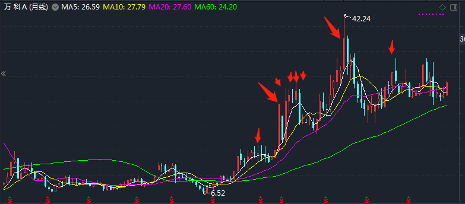
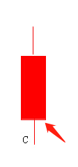
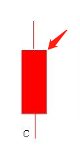
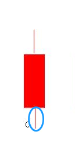
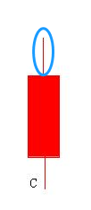

### 一、小白基金学习

#### 1、其实啊股票真的很简单，没有长线短线这种说法，就是 消息影响 市值。

一年的周期看，就要财报影响，一天的周期来看就要实时新闻来影响，一两个月周期 就看政策的影响

#### 2、看图型真的有用？

 图形是无数人交易留下的痕迹，k线和分时图的走势代表着市场的情绪，成交量代表这些有情绪的人真正操作的有几个人

#### 3、新债和可转债的区别？ 

​     新债就是新上的可转债， 而可转债 一般就是指已经上市的。相当于新股和股票的关系。

#### 4、新股和新债区别？

  新股是股票，是上市公司发行的股权。 新债是可转债，就是一家公司缺钱用 找你借钱，承诺多少年后还本金和利息。 不过你可以不要钱到时候把本金要还的钱，转换成股票 就叫可转债。

#### 5、etf啥意？

 etf就是一大篮子股票，就是这个基金募集来的钱，全部买某一行业或者大盘的代表股票，行业好，基金好，行业差基金差，不会因为某个公司 出了负面消息 。而整个行业受到影响

#### 6、黑天鹅

 在金融方面 ，'黑天鹅' 一般指那些出乎意料发生的小概率风险事件，'灰犀牛' 值那些经常被提示去没有得到充分重视的大概率风险事件。

### 二、股票基础知识：

#### 1、什么是K线。

这每一根红色或者绿色的柱子就是k线图，

每一根k线图的含义，先说红色的柱子，红色柱子，分为长方形+两个线（两头）。

a、长方形的下边就是当天的开盘价

b、上边就是收盘价

c、下面这根线就是当天低于开盘价的股价

d、上面那根线就是高于开盘价格的股价

