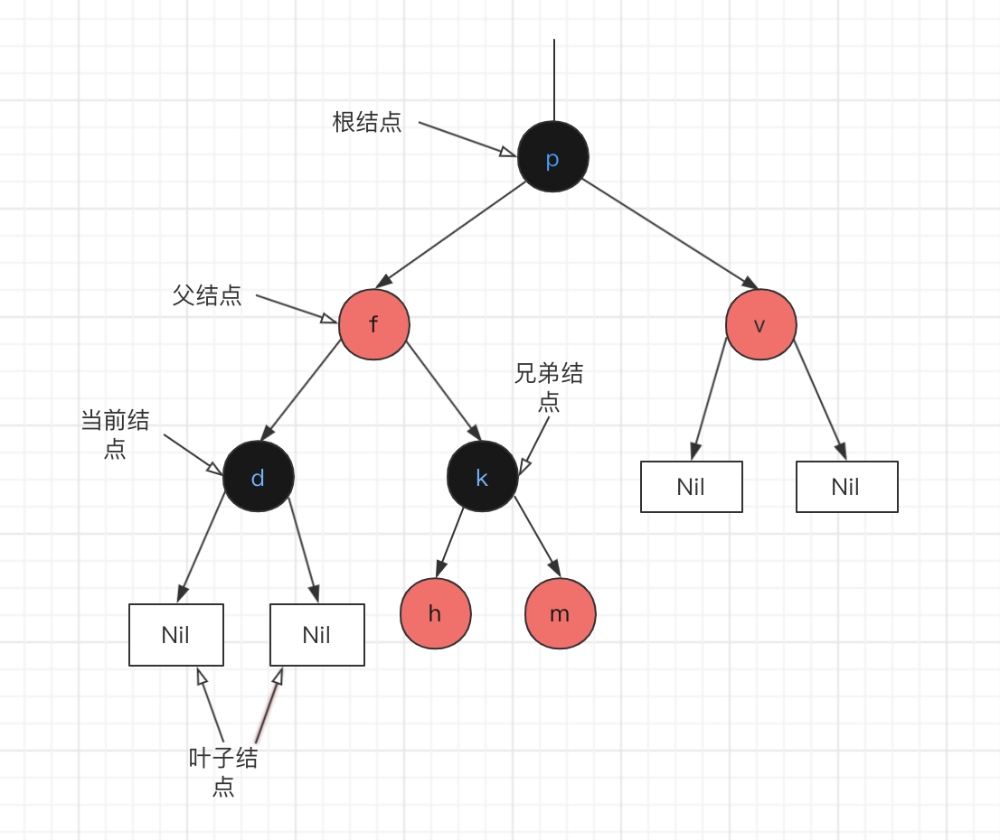
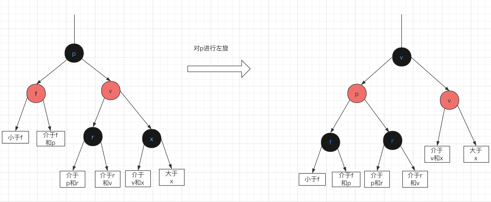
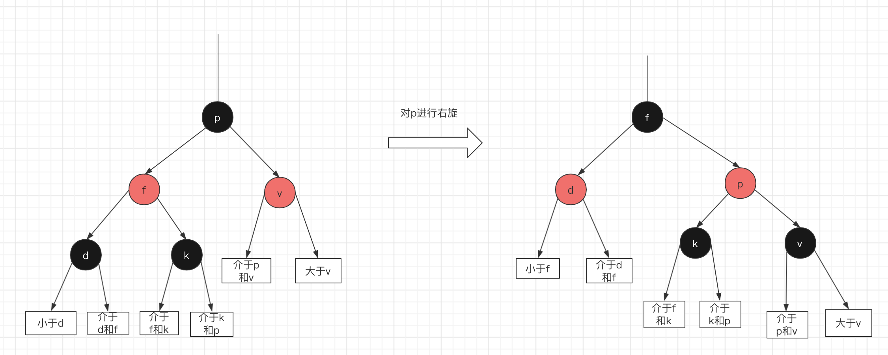

# 红黑树学习

## 1、什么是红黑树

 R-B Tree，全称是Red-Black Tree，又称为“红黑树”，它一种特殊的二叉查找树。红黑树的每个节点上都有存储位表示节点的颜色，可以是红(Red)或黑(Black)。

红黑树难是因为它是自平衡的二叉查找树，在进行插入和删除等时可能会破坏树的平衡的操作时，需要重新自处理 来达到平衡状态

## 2、红黑树的特征

```
（1）每个节点或者是黑色，或者是红色。
（2）根节点是黑色。
（3）每个叶子节点（NIL）是黑色。 [注意：这里叶子节点，是指为空(NIL或NULL)的叶子节点！]
（4）如果一个节点是红色的，则它的子节点必须是黑色的。
（5）每个结点到叶子结点Nil的简单路径经过的黑色结点的个数一样

```

## 3、红黑树的平衡


先简单约定结点的叫法




把正在处理(遍历)的结点叫做当前结点如上图中的d。

红黑树能自平衡，它是通过 左旋、右旋和变色。

```
左旋：以某个结点作为支点(旋转结点)，其右子结点变为旋转结点的父结点，右子结点的左子结点变为旋转结点的右子结点，左子结点保持不变。如图2。
右旋：以某个结点作为支点(旋转结点)，其左子结点变为旋转结点的父结点，左子结点的右子结点变为旋转结点的左子结点，右子结点保持不变。如图3。
变色：结点的颜色由红变黑或由黑变红。
```

对结点p左旋, 图2




对p右旋 ，图3




先不考虑颜色，其旋转操作不会影响旋转结点的父结点，父结点以上的结构还是保持不变的。

```
左旋：只影响旋转结点和其右子树的结构，把右子树的结点往左子树移动。
右旋：只影响旋转结点和其左子树的结构，把左子树的结点往右子树移动。
```

## 4、红黑树查找

 因为红黑树是一颗二叉平衡树，查找不会破坏树的平衡，所以查找和二叉平衡树的查找无异

```
从根结点开始查找，把根结点设置为当前结点；
若当前结点为空，返回null；
若当前结点不为空，用当前结点的key跟查找key作比较；
若当前结点key等于查找key，那么该key就是查找目标，返回当前结点；
若当前结点key大于查找key，把当前结点的左子结点设置为当前结点，重复步骤2；
若当前结点key小于查找key，把当前结点的右子结点设置为当前结点，重复步骤2
```


