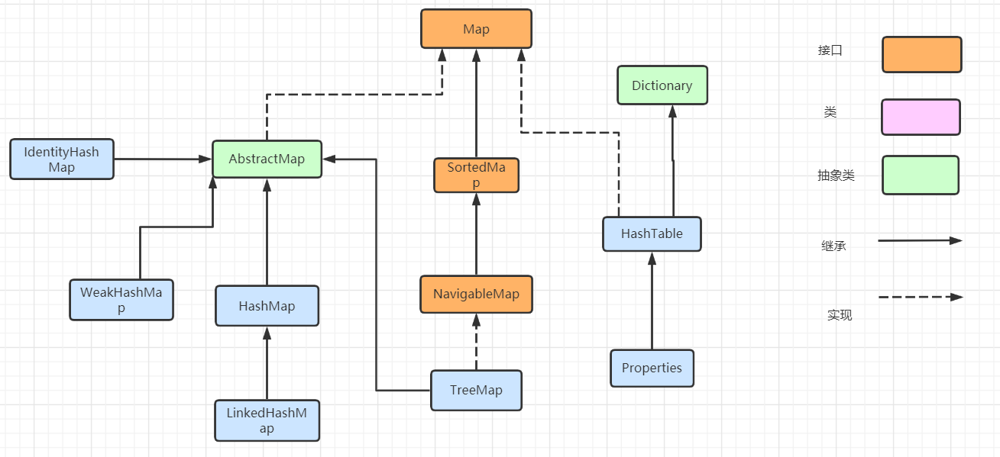

## java 集合相关基础

## 1、Java 集合大致可以分为两大体系，一个是 Collection，另一个是 Map；

```
Collection ：主要由List、Set、Queue接口组成，List代表有序、重复的集合；其中Set代表无序、不可重复的集合；Java 5 又增加了Queue体系集合，代表一种队列集合实现。

Map：则代表具有映射关系的键值对集合。

其中，Java 集合框架中主要封装的是典型的数据结构和算法，如动态数组、双向链表、队列、栈、Set、Map 等。
```


#### 1.1、java.util.Collection 下的接口和继承类关系简易结构图：


这个是idea生成的结构图


#### 1.2、java.util.Map 下的接口和继承类关系简易结构图：




## 2、Collection类

​      这个类是一个接口，并且继承了Iterable,它提供了对集合对象进行基本操作的通用接口。在jdk1.81是新增了default方法。

```
接口中默认方法实现一方面保证了jdk8新特性的加入，比如lambda表达式，函数式接口，另一方面由保证了和老版本的兼容性。
```

下面的stream和parallelStream是流的处理方法。


## 3、List接口类

 该接口继承了Collection接口类，这一个类在Collection接口的基础上 提供其它的方法来操作这个List集合。


### 3.1、集合实现类ArrayList

#### 1)、这个类的默认容量是10

``` 
 /**
     * Default initial capacity.
     */
    private static final int DEFAULT_CAPACITY = 10;
```

底层是一个数组

```
private static final Object[] DEFAULTCAPACITY_EMPTY_ELEMENTDATA = {};
```

#### 2)、构造方法,这个构造方法是需要指定集合大小。

如果设置的容量大于0，那么就根据这个参数来初始化一个数组。如果容量为0，那么就是创建一个默认的空数组。

```
 /**
     * Constructs an empty list with the specified initial capacity.
     *
     * @param  initialCapacity  the initial capacity of the list
     * @throws IllegalArgumentException if the specified initial capacity
     *         is negative
     */
    public ArrayList(int initialCapacity) {
        if (initialCapacity > 0) {
            this.elementData = new Object[initialCapacity];
        } else if (initialCapacity == 0) {
            this.elementData = EMPTY_ELEMENTDATA;
        } else {
            throw new IllegalArgumentException("Illegal Capacity: "+
                                               initialCapacity);
        }
    }
```

#### 3)、如果没有指定集合大小，那么就会创建一个默认的数组大小，这个默认的10

```
 /**
     * Constructs an empty list with an initial capacity of ten.
     */
    public ArrayList() {
        this.elementData = DEFAULTCAPACITY_EMPTY_ELEMENTDATA;
    }
```


#### 4)、get方法 ，通过下标，返回数组中指定位置的元素

```

public E get(int index) {
        rangeCheck(index);

        return elementData(index);
    }
    
    
/** 在获取元素时，首先要去检查这个元素的下标，是否大于了数组的大小。如果超过了这个数组的大小，那么就会报数组越界异常
* Checks if the given index is in range.  If not, throws an appropriate
* runtime exception.  This method does *not* check if the index is
* negative: It is always used immediately prior to an array access,
* which throws an ArrayIndexOutOfBoundsException if index is negative.
*/    
private void rangeCheck(int index) {
        if (index >= size)
            throw new IndexOutOfBoundsException(outOfBoundsMsg(index));
}

```

#### 5)、set方法，往数组中设置一个元素，这个元素根据下标来设置。

```java
 public E set(int index, E element) {
 // 同样首先要检查设置的下班是否超过了数组大小。
        rangeCheck(index);

         // 然后根据索引来获取原来数组中的元素。
        E oldValue = elementData(index);
        // 然后将这个元素赋值到这个 索引下标指定的位置。
        elementData[index] = element;
        最后返回 原数组的值。
        return oldValue;
    }
```

#### 6)、add方法，这个时往数组中添加一个元素。

```java
 public boolean add(E e) {
       //调用确认容量方法，然后将数组大小加1。
        ensureCapacityInternal(size + 1);  // Increments modCount!!
        elementData[size++] = e;
        return true;
    }
    
    
 private void ensureCapacityInternal(int minCapacity) {
        ensureExplicitCapacity(calculateCapacity(elementData, minCapacity));
    } 
    
    // 这个方法去进行容量的确定。
 private static int calculateCapacity(Object[] elementData, int minCapacity) {
      //如果这个数组等于默认
        if (elementData == DEFAULTCAPACITY_EMPTY_ELEMENTDATA) {
        // 那么就跟通过Math.max方法来确定一个用来， 如果这个默认的容量 DEFAULT_CAPACITY >= minCapacity ，则返回DEFAULT_CAPACITY，如果不是则返回minCapacity。 
            return Math.max(DEFAULT_CAPACITY, minCapacity。);
        }
        return minCapacity;
    }
    
    //上面的方法根据返回的容量大小，来调用下面的这个方法
 private void ensureExplicitCapacity(int minCapacity) {
 // 首先将modCount加1。
        modCount++;

        // overflow-conscious code
        // 如果最小容量- 数组长度>0。则进行扩容处理
        if (minCapacity - elementData.length > 0)
            grow(minCapacity);
    }   
    
```

 私有 grow 扩容方法

```java
   private void grow(int minCapacity) {
        // overflow-conscious code
        //首先获取原来数组的长度。
        int oldCapacity = elementData.length;
        // 原来的容量 加上 将原来的容量大小进行向右位移运算 来进行扩容操作。
         //比如原来的值是10，则newCapacity = 10 + (10/2) =15
        int newCapacity = oldCapacity + (oldCapacity >> 1);
        //如果扩容后的容量 - 最小容量小于0。那么新的是容量大小就是 最小容量
        if (newCapacity - minCapacity < 0)
            newCapacity = minCapacity;
       // 如果扩容后的容量 - 最大容量大于0， 则通过hugeCapacity方法来计算。
        if (newCapacity - MAX_ARRAY_SIZE > 0)
            newCapacity = hugeCapacity(minCapacity);
        // minCapacity is usually close to size, so this is a win:
        // 通过Arrays.copyOf来扩容数组。
        elementData = Arrays.copyOf(elementData, newCapacity);
    }

  
  private static int hugeCapacity(int minCapacity) {
        if (minCapacity < 0) // overflow
            throw new OutOfMemoryError();
      // 最小容量大于最大数组大小，那么返回Integer.MAX_VALUE，否则返回MAX_ARRAY_SIZE
        return (minCapacity > MAX_ARRAY_SIZE) ?
            Integer.MAX_VALUE :
            MAX_ARRAY_SIZE;
    }
```

#### 7)、contains方法，判断是否包含某个元素

```java
   public boolean contains(Object o) {
        return indexOf(o) >= 0;
    }
    
    
   public int indexOf(Object o) {
    // 元素如果为null
    if (o == null) {
        // 根据集合的大小，循环获取，如果那个元素是索引下标==null。就返回这个索引下标
         for (int i = 0; i < size; i++)
                if (elementData[i]==null)
                    return i;
     } else {
       //如果要获取的元素不等于null，同样也是根据这个size进行循环，
        // 如果要获取的元素和数组中的元素相同，就返回这个元素的下标 
            for (int i = 0; i < size; i++)
                if (o.equals(elementData[i]))
                    return i;
     }
        return -1;
    }
```

#### 8）、lastIndexOf 从数组最后一个往前找, 如果这个元素和数组中的元素相等，则返回下标

```java
 public int lastIndexOf(Object o) {
        if (o == null) {
            for (int i = size-1; i >= 0; i--)
                if (elementData[i]==null)
                    return i;
        } else {
            for (int i = size-1; i >= 0; i--)
                if (o.equals(elementData[i]))
                    return i;
        }
        return -1;
    }
```

#### 9)、clone方法，是一个浅拷贝方法, 在克隆时会将 modCount置为0。

```java
  public Object clone() {
        try {
            ArrayList<?> v = (ArrayList<?>) super.clone();
            v.elementData = Arrays.copyOf(elementData, size);
            v.modCount = 0;
            return v;
        } catch (CloneNotSupportedException e) {
            // this shouldn't happen, since we are Cloneable
            throw new InternalError(e);
        }
    }
```

#### 10)、remove方法，根据索引下标来移除元素

```java
 public E remove(int index) {
        //先判断要移除的元素下标是否越界。
        rangeCheck(index);

       //将修改数加一
        modCount++;
       //根据索引下标获取数组原来的元素。
        E oldValue = elementData(index);

        // 数组的大小 - 元素是下标 - 1 
        int numMoved = size - index - 1;
        if (numMoved > 0)
            System.arraycopy(elementData, index+1, elementData, index,
                             numMoved);
        // 在移除元素时，将对应的位置设置为null，方便GC回收
        elementData[--size] = null; // clear to let GC do its work

        return oldValue;
    }
```

#### 11)、remove, 根据对象来移除元素。

```java
public boolean remove(Object o) {
        if (o == null) {
            for (int index = 0; index < size; index++)
                if (elementData[index] == null) {
                    fastRemove(index);
                    return true;
                }
        } else {
            for (int index = 0; index < size; index++)
                if (o.equals(elementData[index])) {
                    fastRemove(index);
                    return true;
                }
        }
        return false;
    }
```

#### 12)、clear方法，清除集合中的元素

```java
/**
     * Removes all of the elements from this list.  The list will
     * be empty after this call returns.
     */
    public void clear() {
        modCount++;

        // clear to let GC do its work
        for (int i = 0; i < size; i++)
            elementData[i] = null;

        size = 0;
    }
```

### 3.2、集合实现类LinkedList

####    1)、LikedList是基于链表结构实现的，所以查询速度慢，增删速度快。首先来看该类的继承和实现

```java
public class LinkedList<E>
    extends AbstractSequentialList<E>
    implements List<E>, Deque<E>, Cloneable, java.io.Serializable{
     
      transient int size = 0;

    /**
     * Pointer to first node.
     * Invariant: (first == null && last == null) ||
     *            (first.prev == null && first.item != null)
     */
    transient Node<E> first;

    /**
     * Pointer to last node.
     * Invariant: (first == null && last == null) ||
     *            (last.next == null && last.item != null)
     */
    transient Node<E> last;
    }
```

#### 2)、LikedList提供了特殊的方法，对头尾的元素进行操作

```java
  /**
     * Links e as first element.
     */
    private void linkFirst(E e) {
        final Node<E> f = first;
        final Node<E> newNode = new Node<>(null, e, f);
        first = newNode;
        if (f == null)
            last = newNode;
        else
            f.prev = newNode;
        size++;
        modCount++;
    }

    /**
     * Links e as last element.
     */
    void linkLast(E e) {
        final Node<E> l = last;
        final Node<E> newNode = new Node<>(l, e, null);
        last = newNode;
        if (l == null)
            first = newNode;
        else
            l.next = newNode;
        size++;
        modCount++;
    }
```

#### 3)、add方法添加元素，其实就是调用的linkLast(E e)方法。在链表的尾部添加元素

```
 public boolean add(E e) {
        linkLast(e);
        return true;
    }
    
```

#### 4、remove方法, 从链表中删除元素。

通过给定的元素 来和链表中的元素进行比对，如果相同那么就调用unlink方法。将该节点传入大unlink方法中。但是在删除元素时，一般使用Iterator来进行元素的移除。

```java
public boolean remove(Object o) {
        if (o == null) {
            for (Node<E> x = first; x != null; x = x.next) {
                if (x.item == null) {
                    unlink(x);
                    return true;
                }
            }
        } else {
            for (Node<E> x = first; x != null; x = x.next) {
                if (o.equals(x.item)) {
                    unlink(x);
                    return true;
                }
            }
        }
        return false;
    }

 /**
     * Unlinks non-null node x.
     */
    E unlink(Node<E> x) {
        // assert x != null;
        //首先获取该节点元素，这个节点的前驱和 后继 元素。
        final E element = x.item;
        final Node<E> next = x.next;
        final Node<E> prev = x.prev;

        //如果 前驱节点为null，则下一个节点就是第一个元素
        if (prev == null) {
            first = next;
        } else {
         //如果不等于null,则将这个元素的下一个节点赋值给 前驱节点的下一个节点。
            //然后将当前要删除元素的前驱节点赋值为null
            prev.next = next;
            x.prev = null;
        }

        //如果 后继节点为null, 那么就将前驱节点父赋值给 last节点。
        if (next == null) {
            last = prev;
        } else {
           //如果不为null，那么 将当前元素的前驱节点 赋值给后继节点的 前驱节点。然后将 null赋值给当前节点的后继节点
            next.prev = prev;
            x.next = null;
        }
        //然后将 null赋值给当前节点元素，将链表元素减1，最后返回元素。

        x.item = null;
        size--;
        modCount++;
        return element;
    }

```


#### 5、get方法通过索引来获取元素, 然后返回指定元素索引处的节点。

```java
 public E get(int index) {
        checkElementIndex(index);
        return node(index).item;
    }
    
 /**
     * Returns the (non-null) Node at the specified element index.
     */
    Node<E> node(int index) {
        // assert isElementIndex(index);

        if (index < (size >> 1)) {
            Node<E> x = first;
            for (int i = 0; i < index; i++)
                x = x.next;
            return x;
        } else {
            Node<E> x = last;
            for (int i = size - 1; i > index; i--)
                x = x.prev;
            return x;
        }
    }    
```

#### 6、set方法,根据索引来设置元素。

先根据索引查找到这个节点，然后通过节点来获取到元素，最后将新的的元素赋值给当前节点

```java
  public E set(int index, E element) {
        checkElementIndex(index);
        Node<E> x = node(index);
        E oldVal = x.item;
        x.item = element;
        return oldVal;
    }
```

#### 7、indexOf方法 ,返回索引

```java
public int indexOf(Object o) {
        int index = 0;
        //如果元素等于null，那么遍历这个节点，如果一个节点的元素为null，那么就返回这个元素的索引
        if (o == null) {
            for (Node<E> x = first; x != null; x = x.next) {
                if (x.item == null)
                    return index;
                index++;
            }
        } else {
            //如果不等于null， 那么同样遍历节点，如果传入的元素和当前节点的元素相同，那么就返回该节点的索引
            for (Node<E> x = first; x != null; x = x.next) {
                if (o.equals(x.item))
                    return index;
                index++;
            }
        }
    // 都不是则返回-1。
        return -1;
    }
```

#### 8、push方法，将元素插入到链表的第一个位置。

```java
public void push(E e) {
    addFirst(e);
  }

public void addFirst(E e) {
   linkFirst(e);
}

/**
* Links e as first element.
*/
private void linkFirst(E e) {
    final Node<E> f = first;
    final Node<E> newNode = new Node<>(null, e, f);
    first = newNode;
    if (f == null)
        last = newNode;
    else
        f.prev = newNode;
    size++;
    modCount++;
}
```

#### 9、pop方法，其实是移除第一个元素。

```java
public E pop() {
        return removeFirst();
    }

public E removeFirst() {
    final Node<E> f = first;
    if (f == null)
        throw new NoSuchElementException();
    return unlinkFirst(f);
}

    /**
     * Unlinks non-null first node f.
     */
private E unlinkFirst(Node<E> f) {
    // assert f == first && f != null;
    final E element = f.item;
    final Node<E> next = f.next;
    f.item = null;
    f.next = null; // help GC
    first = next;
    if (next == null)
        last = null;
    else
        next.prev = null;
    size--;
    modCount++;
    return element;
}
```


### 3.3、Vector实现类

#### 1）、默认构造器

默认的构造器中，初始容量是10

```java
public class Vector<E>
    extends AbstractList<E>
    implements List<E>, RandomAccess, Cloneable, java.io.Serializable
{
 //注意这个类中的几个属性， 元素的值是一个Object数组
   protected Object[] elementData;
    
   protected int elementCount; 
    
   protected int capacityIncrement;
 

public Vector() {
        this(10);
    }
//这里的默认构造器，最终调用的方法是

 //初始容量是10， 另一个参数表示
  public Vector(int initialCapacity, int capacityIncrement) {
        super();
        if (initialCapacity < 0)
            throw new IllegalArgumentException("Illegal Capacity: "+
                                               initialCapacity);
        this.elementData = new Object[initialCapacity];
        this.capacityIncrement = capacityIncrement;
    }
}
```

#### 2)、这个类中的方法加了synchronized关键字，都是同步方法。但是在加了synchronized关键字后，效率方面不高。

方法copyInto, 将向量的分量拷贝到指定的数组中。

```java
 public synchronized void copyInto(Object[] anArray) {
        System.arraycopy(elementData, 0, anArray, 0, elementCount);
    }

```

3)、ensureCapacity方法，该方法可以指定vector最小容量的。

```java
  public synchronized void ensureCapacity(int minCapacity) {
        if (minCapacity > 0) {
            modCount++;
            ensureCapacityHelper(minCapacity);
        }
    }

 private void ensureCapacityHelper(int minCapacity) {
        // overflow-conscious code
        if (minCapacity - elementData.length > 0)
            grow(minCapacity);
    }

//这里会去扩容。
private void grow(int minCapacity) {
        // overflow-conscious code
        int oldCapacity = elementData.length;
        //扩容，如果
        int newCapacity = oldCapacity + ((capacityIncrement > 0) ?
                                         capacityIncrement : oldCapacity);
        if (newCapacity - minCapacity < 0)
            newCapacity = minCapacity;
        if (newCapacity - MAX_ARRAY_SIZE > 0)
            newCapacity = hugeCapacity(minCapacity);
        elementData = Arrays.copyOf(elementData, newCapacity);
    }
```

#### 4)、add(E e)方法

```java
 public synchronized boolean add(E e) {
        modCount++;
     // 元素数量+1
        ensureCapacityHelper(elementCount + 1);
     //然后将这个元素放在 数组的最后一个位置上
        elementData[elementCount++] = e;
        return true;
    }
```

#### 5)、remove(Object o)方法

```java
   public boolean remove(Object o) {
        return removeElement(o);
    }

//根据传入的元素，然后从索引0开始查找，如果查找到了元素，那么就进入if判断，然后根据这个返回的索引进行元素的移除
 public synchronized boolean removeElement(Object obj) {
        modCount++;
        int i = indexOf(obj);
        if (i >= 0) {
            removeElementAt(i);
            return true;
        }
        return false;
    }
```

#### 6)、add(int index, E element) 方法

```java
public void add(int index, E element) {
        insertElementAt(element, index);
 }

//根据索引来插入元素
 public synchronized void insertElementAt(E obj, int index) {
        modCount++;
     //如果索引大于了元素数量，那么抛出索引越界异常
        if (index > elementCount) {
            throw new ArrayIndexOutOfBoundsException(index
                                                     + " > " + elementCount);
        }
        //扩容
        ensureCapacityHelper(elementCount + 1);
        System.arraycopy(elementData, index, elementData, index + 1, elementCount - index);
        elementData[index] = obj;
        elementCount++;
}
```

#### 7)、clear() 清除所有元素

```java
 public void clear() {
        removeAllElements();
    }

public synchronized void removeAllElements() {
        modCount++;
        // Let gc do its work
        //遍历这个 元素数量，然后将这个数组中的每个元素都赋值为null，最后将元素数量赋值为0
        for (int i = 0; i < elementCount; i++)
            elementData[i] = null;

        elementCount = 0;
    }
```

#### 8、contains(Object o) 方法，判断这个链表是否包含那个元素

```java
 public boolean contains(Object o) {
        return indexOf(o, 0) >= 0;
    }


//indexOf是从 索引为0的位置开始查找。
public synchronized int indexOf(Object o, int index) {
        if (o == null) {
            //如果传入的元素为空，那么就遍历 链表数量，查找这个链表中元素值==null的元素。
            for (int i = index ; i < elementCount ; i++)
                if (elementData[i]==null)
                    return i;
        } else {
            //如果不为空，同样遍历链表数量，然后判断这个元素和链表中是否有相同的元素。
            for (int i = index ; i < elementCount ; i++)
                if (o.equals(elementData[i]))
                    return i;
        }
        return -1;
    }
```

#### 9、 lastIndexOf(Object o) 这个方式是从 链表的最后一个位置 往前查找

```java
public synchronized int lastIndexOf(Object o) {
        return lastIndexOf(o, elementCount-1);
    }

public synchronized int lastIndexOf(Object o, int index) {
        if (index >= elementCount)
            throw new IndexOutOfBoundsException(index + " >= "+ elementCount);

        if (o == null) {
            for (int i = index; i >= 0; i--)
                if (elementData[i]==null)
                    return i;
        } else {
            for (int i = index; i >= 0; i--)
                if (o.equals(elementData[i]))
                    return i;
        }
        return -1;
    }
```


## 4、Map集合

### 4.1、HashMap集合

####  1、Hashmap的结构，1.7和1.8有哪些区别

#####  a、不同点

(1)、在$\textcolor{red}{jdk1.7}$，$\textcolor{red}{hashMap使用数组+单链表的方式来实现}$，插入使用的是$\textcolor{red}{头插法来进行数据的插入}$。而在$\textcolor{red}{jdk1.8}$时使用了$\textcolor{red}{尾插法}$来进行元素的插入，为什么要怎么做呢？

​    这是因为$\textcolor{red}{jdk1.7是用单链表进行纵向的延伸}$，1.7认为最新插入的应该会先被用到，所以才采用头插法，但是头插入法时在$\textcolor{red}{多线程}$情况下会出现逆序形成$\textcolor{red}{环形链表从而造成死循环问题}$。所以在jdk1.8之后加入了红黑树使用尾插法，能够避免出现逆序且链表死循环的问题。

(2)、扩容后数据存储位置的计算方式不一样：在jdk1.7时**是直接用hash值和需要扩容的二进制数进行&（这里就是为什么扩容的时候为啥一定必须是2的多少次幂的原因所在，因为如果只有2的n次幂的情况时最后一位二进制数才一定是1，这样能最大程度减少hash碰撞）（hash值 & length-1）**

 比如：

 a、用book来计算hashCode=3029737，然后进行二进制转换为101110001110101110 1001。

 b、假设HashMap长度的默认是16，计算Lenght-1 =15, 二进制是1111。

 c、然后将这两个结果进行与运算，101110001110101110 1001  & 1111 = 1001 ，十进制是9，所以index=9。

可以说，Hash算法最终得到的index结果，完全取决于Key的Hashcode值的最后几位。

* 如果HashMap的长度是10(不是2的幂次)，

         ```
          hashCode: 101110001110101110 1001
          Length-1:                    1001
          index:                       1001
         ---------------------------------------
          hashCode: 101110001110101110 1011 
          Length-1:                    1001 
          index:                       1001
         -------------------------------------
          hashCode: 101110001110101110 1111 
          Length-1:                    1001 
          index:                       1001
     在计算的时候,上面三组不同的hashCode，但是运算结果都是1001，也就是说HashMap=10的时候，有些index的结果出现的几率会很大，而有些index的结果永远都不会出现。  这样，显然不符合Hash算法均匀分布的原则。

**当长度16或者其他2的次幂，Length-1的值是所有二进制位全为1**，这种情况下，**index的结果等同于hashCode后几位的值**，只要输入的HashCode本身分布均匀，Hash算法的结果就是均匀的。

* 在JDK1.8时候直接使用的是JDK1.7的时候计算的规律，也就是扩容前的原始位置+扩容的大小值=jdk1.8的计算方式，而不再是jdk1.7的异或方法。 

  ```java
  //在计算hash值的时候:
  //JDK 1.8 简化了扰动函数 = 只做了2次扰动 = 1次位运算 + 1次异或运算
  static final int hash(Object key) {
          int h;
          
          return (key == null) ? 0 : (h = key.hashCode()) ^ (h >>> 16);
      }
  -----------------------------
  //1.7的计算方式: 做了9次扰动处理 = 4次位运算 + 5次异或运算
   final int hash(Object k) {
          int h = hashSeed;
          if (0 != h && k instanceof String) {
              return sun.misc.Hashing.stringHash32((String) k);
          }
  
         // 异或运算
          h ^= k.hashCode();
  
          // This function ensures that hashCodes that differ only by
          // constant multiples at each bit position have a bounded
          // number of collisions (approximately 8 at default load factor).
          //位运算 4次， 异或运算
          h ^= (h >>> 20) ^ (h >>> 12);
          return h ^ (h >>> 7) ^ (h >>> 4);
      }
      
  ```


 1.8之所以添加红黑树是因为 一旦链表过长，会严重影响HashMap的性能，而红黑树具有快速增删查改的特点，这样就可以有效的解决链表过长时操作比较慢的问题。

##### b、相同点

 两个都不是在多线程下使用的，因为在多线程下使用，没有同步处理可能会造成数据不一致问题等。一边在多线程情况下使用ConcurrentHashMap。


#### 2、hashMap底层时如何实现的？

在1.7时底层实现是使用的$\textcolor{red}{数组+单链表的方式来实现}$， 而1.8的时候底层实现是$\textcolor{red}{数组+链表+红黑色}$来实现。

1.7版本的时候在多线程情况下会出现逆序，形成环形链表，从而造成死循环，1.8版对底层实现进行了修改，添加了红黑树，在当链表长度大于8，且哈希表长度大于64时，链表结构会转换成红黑树结构。

对于1.7实现方式,可以看到这个数组是Entry<K,V>。

```java
static class Entry<K,V> implements Map.Entry<K,V> {
        final K key;
        V value;
        Entry<K,V> next;
        int hash;

        /**
         * Creates new entry.
         */
        Entry(int h, K k, V v, Entry<K,V> n) {
            value = v;
            next = n;
            key = k;
            hash = h;
        }
}
```

对于1.8实现方式如下，这个和1.7相比只是名字不一样， 这个改成了Node<K,V>.

```java
static class Node<K,V> implements Map.Entry<K,V> {
        final int hash;
        final K key;
        V value;
        Node<K,V> next;

        Node(int hash, K key, V value, Node<K,V> next) {
            this.hash = hash;
            this.key = key;
            this.value = value;
            this.next = next;
        }
}
```

每个放入的(key,value)都会封装成这样的Node对象，hashMap的数组就是以一系列这样的Node对象构成的数组，链表就是把next指向下一个Node对象。


#### 3、什么是加载因子？加载因子为什么是0.75？

 加载因子也叫扩容因子或负载因子，用来判断什么时候进行扩容的，假如加载因子是0.5，hashMap的初始容量是16，那么当hashMap中有16*0.5=8个元素时，hashMap就会进行扩容。

 那加载因子为什么是0.75而不是0.5或者是1.0呢？这其实是出于容量和性能之间平衡的结果：

```
1、当加载因子设置比较大的时候，扩容的门槛就被提高了，扩容发生的频率比较低，占用的空间会比较小，但此时发生hash冲突的概率就会被提升，因此需要更复杂的数据结构来存储元素，这样对元素的操作时间就会增加，运行效率也会因此降低。
2、当加载因子设置比较小的时候，扩容的门槛就会降低，那么就会去扩容hashmap,这样就会占有更多的空间，此时元素的存储就比较稀疏，发生哈希冲突的可能性就比较小，因此操作性能就会比较高。
3、在加载因子设置不是越大或者越小 就好，这个是根据各方面的权衡来设置的。如设置太大那么hash冲突的概率就会变大，如设置太小，那么就会浪费空间，因为需要经常的进行扩容操作。
```


#### 4、知道哪些常见的解决hash冲突算法吗？

#####  (1)、开放地址法（就是往下找空余地方）

其基本思想是：
当关键字key的哈希地址p=H（key）出现冲突时，以p为基础，产生另一个哈希地址p1，如果p1仍然冲突，再以p为基础，产生另一个哈希地址p2，…，直到找出一个不冲突的哈希地址pi ，将相应元素存入其中。这种方法有一个通用的再散列函数形式：
Hi=（H（key）+di）% m  i=1，2，…，n
其中H（key）为哈希函数，m 为表长，di称为增量序列。增量序列的取值方式不同，相应的再散列方式也不同。主要有以下三种：

```

①线性探测法：di^{i}=1，2，3，…，m-1, 这种方法的特点就是在发生冲突时，顺序查看表中一个单元，直到找出一个空单元或查遍全表。

②平方探测法：di=12，-12，22，-22，…，k2，-k2 ( k<=m/2 )，在发生冲突时，在表的左右进行跳跃式探测，比较灵活。

③伪随机探测：di=伪随机数序列。
  具体实现时，应建立一个伪随机数发生器，（如i=(i+p) % m），并给定一个随机数做起点。
例如，已知哈希表长度m=11，哈希函数为：H（key）= key  %  11，则H（47）=3，H（26）=4，H（60）=5，假设下一个关键字为69，则H（69）=3，与47冲突。

如果用线性探测再散列处理冲突，下一个哈希地址为H1=（3 + 1）% 11 = 4，仍然冲突，再找下一个哈希地址为H2=（3 + 2）% 11 = 5，还是冲突，继续找下一个哈希地址为H3=（3 + 3）% 11 = 6，此时不再冲突，将69填入5号单元。

如果用二次探测再散列处理冲突，下一个哈希地址为H1=（3 + 12）% 11 = 4，仍然冲突，再找下一个哈希地址为H2=（3 - 12）% 11 = 2，此时不再冲突，将69填入2号单元。

如果用伪随机探测再散列处理冲突，且伪随机数序列为：2，5，9，……..，则下一个哈希地址为H1=（3 + 2）% 11 = 5，仍然冲突，再找下一个哈希地址为H2=（3 + 5）% 11 = 8，此时不再冲突，将69填入8号单元。
```

##### (2)、拉链法

```
其实hashmap,hashset都是采用的拉链法来解决哈希冲突的，就是在每个位桶实现的时候，采用链表的数据结构去存取发生哈希冲突的输入域的关键字(也就是被哈希函数映射到同一个位桶上的关键字)。
拉链法解决哈希冲突：
①插入操作：在发生哈希冲突的时候，我们输入域的关键字去映射到位桶（实际上是实现位桶的这个数据结构，链表或者红黑树）中去的时候，我们先检查带插入元素x是否出现在表中，很明显，这个查找所用的次数不会超过装载因子（n/m: n为输入域的关键字个数，m为位桶的数目），它是个常数，所以插入操作的最坏时间复杂度为O(1)的。

②查询操作：和①一样，在发生哈希冲突的时候，我们去检索的时间复杂度不会超过装载因子，也就是检索数据的时间复杂度也是O(1)的

③删除操作：如果在拉链法中我们想要使用链表这种数据结构来实现位桶，那么这个链表一定是双向链表，因为在删除一个元素x的时候，需要更改x的前驱元素的next指针的属性，把x从链表中删除。这个操作的时间复杂度也是O(1)的。

```

拉链法的优点

```
与开放定址法相比，拉链法有如下几个优点：

①拉链法处理冲突简单，且无堆积现象，即非同义词决不会发生冲突，因此平均查找长度较短；

②由于拉链法中各链表上的结点空间是动态申请的，故它更适合于造表前无法确定表长的情况；

③开放定址法为减少冲突，要求装填因子α较小，故当结点规模较大时会浪费很多空间。而拉链法中可取α≥1，且结点较大时，拉链法中增加的指针域可忽略不计，因此节省空间；

④在用拉链法构造的散列表中，删除结点的操作易于实现。只要简单地删去链表上相应的结点即可。

```

拉链法的缺点

```
指针需要额外的空间，故当结点规模较小时，开放定址法较为节省空间，而若将节省的指针空间用来扩大散列表的规模，可使装填因子变小，这又减少了开放定址法中的冲突，从而提高平均查找速度。
```

##### (3)、再哈希法

```
这种方法是同时构造多个不同的哈希函数：
Hi=RH1（key）  i=1，2，…，k
当哈希地址Hi=RH1（key）发生冲突时，再计算Hi=RH2（key）……，直到冲突不再产生。这种方法不易产生聚集，但增加了计算时间。
```

##### (4)、建立公共溢出区

```
这种方法的基本思想是：将哈希表分为基本表和溢出表两部分，凡是和基本表发生冲突的元素，一律填入溢出表
```


#### 5、为什么jdk1.8中对hashmap优化时，把链表转换为红黑树的阈值时8，而不是其他的呢？

我们来看源码中对选择这个的描述

```java
	//Java中解释的原因
   * Because TreeNodes are about twice the size of regular nodes, we
     * use them only when bins contain enough nodes to warrant use
     * (see TREEIFY_THRESHOLD). And when they become too small (due to
     * removal or resizing) they are converted back to plain bins.  In
     * usages with well-distributed user hashCodes, tree bins are
     * rarely used.  Ideally, under random hashCodes, the frequency of
     * nodes in bins follows a Poisson distribution
     * (http://en.wikipedia.org/wiki/Poisson_distribution) with a
     * parameter of about 0.5 on average for the default resizing
     * threshold of 0.75, although with a large variance because of
     * resizing granularity. Ignoring variance, the expected
     * occurrences of list size k are (exp(-0.5) * pow(0.5, k) /
     * factorial(k)). The first values are:
     *
     * 0:    0.60653066
     * 1:    0.30326533
     * 2:    0.07581633
     * 3:    0.01263606
     * 4:    0.00157952
     * 5:    0.00015795
     * 6:    0.00001316
     * 7:    0.00000094
     * 8:    0.00000006
     * more: less than 1 in ten million
```

上面的意思表示：TreeNodes占用空间是普通Nodes的两倍(相较于单链表结构，链表只有指向下一个节点的指针，二叉树则需要左右指针，分布指向左节点和右节点)，所以只有当链表包含足够多的节点时才会转成TreeNodes（考虑到时间和空间的权衡），而是否足够多就是由TREEIFY_THRESHOLD的值决定的。当红黑树中节点数变少时，又会转成普通的链表。并且我们查看源码的时候发现，链表长度达到8就转成红黑树，当长度降到6就转成普通链表。

这就 解释了在往hashmap添加数据时，不一开始就将其转换为TreeNodes，而是在达到一定的节点数时才会转换为TreeNodes, 为了保持平衡，空间和时间的权衡。

当hashCode离散性很好的时候，树型链表用到的概率非常小，因为数据均匀分布在每个链表中，几乎不会有链表中链表长度会达到阈值。但是在随机hashCode下，离散性可能会变差，然而JDK又不能阻止用户实现这种不好的hash算法，因此就可能导致不均匀的数据分布。不过理想情况下随机hashCode算法下所有链表中节点的分布频率会遵循**泊松分布**，我们可以看到，一个链表中链表长度达到8个元素的概率为0.00000006，几乎是不可能事件。这种不可能事件都发生了，说明链表中的节点数很多，查找起来效率不高。**至于7，是为了作为缓冲，可以有效防止链表和树频繁转换。**

之所以选择8，不是随意决定的，而是根据概率统计决定的。

总结：

```
1、选择8作为阈值，时从空间和时间的权衡，并且链表中节点的分布频率遵循泊松分布，到达8的概率小
2、选择7是为了作为缓冲，可以有效防止链表和树的频繁转换
3、在一个开始不会转换为红黑树，虽然红黑树查询时间复杂的低，但是维持红黑树的平衡的代价高。其树结构空间占用时普通链表的两倍。
```

#### 6、如果我默认初始大小为100，那么元素个数到达75会扩容么？

在设置初始值为100时，那么调用的构造方法是

```java
public class HashMap<K,V> extends AbstractMap<K,V>
    implements Map<K,V>, Cloneable, Serializable {

  
  //先调研这个构造方法
public HashMap(int initialCapacity) {
        this(initialCapacity, DEFAULT_LOAD_FACTOR);
    }

//然后调用这个方法
public HashMap(int initialCapacity, float loadFactor) {
        if (initialCapacity < 0)
            throw new IllegalArgumentException("Illegal initial capacity: " +
                                               initialCapacity);
        if (initialCapacity > MAXIMUM_CAPACITY)
            initialCapacity = MAXIMUM_CAPACITY;
        if (loadFactor <= 0 || Float.isNaN(loadFactor))
            throw new IllegalArgumentException("Illegal load factor: " +
                                               loadFactor);
        this.loadFactor = loadFactor;
      //这里会去计算阈值，最终阈值等于=128， 当设置的初始值是100是，在put方法中会去计算
      //，而75 是hashmap的元素个数 ，这里在put时候，会进入resize()方法，会去计算新的阈值是 128 *0.75 = 93 ， 这个阈值93>75所以 在当hansmap中元素个数达到75个时，是不会进行扩容操作的。
        this.threshold = tableSizeFor(initialCapacity);
    }
  
  /**
     * Returns a power of two size for the given target capacity.
     */
    static final int tableSizeFor(int cap) {
        int n = cap - 1; //99
        n |= n >>> 1;  // 99>>1 =49 , 99|49=115
        n |= n >>> 2;  // 115>>2 = 28 , 115|28 =127
        n |= n >>> 4; // 127>>4 = 7, 127|7=127
        n |= n >>> 8; // 127>>8 = 127, 127|127 =127
        n |= n >>> 16; // 127>>16= 127
        //n = 127+1 =128
        return (n < 0) ? 1 : (n >= MAXIMUM_CAPACITY) ? MAXIMUM_CAPACITY : n + 1;
    }


}
```


#### 7、hashMap中为什么数组的长度是2的幂次方？

数组的长度是2的幂次方，其主要目的是为计算hash值时散列行更好。put的源码如下

```java
final V putVal(int hash, K key, V value, boolean onlyIfAbsent,
                   boolean evict) {
        Node<K,V>[] tab; Node<K,V> p; int n, i;
        if ((tab = table) == null || (n = tab.length) == 0)
            n = (tab = resize()).length;
        if ((p = tab[i = (n - 1) & hash]) == null)
            tab[i] = newNode(hash, key, value, null);
        else {
            Node<K,V> e; K k;
            if (p.hash == hash &&
                ((k = p.key) == key || (key != null && key.equals(k))))
                e = p;
            else if (p instanceof TreeNode)
                e = ((TreeNode<K,V>)p).putTreeVal(this, tab, hash, key, value);
            else {
                for (int binCount = 0; ; ++binCount) {
                    if ((e = p.next) == null) {
                        p.next = newNode(hash, key, value, null);
                        if (binCount >= TREEIFY_THRESHOLD - 1) // -1 for 1st
                            treeifyBin(tab, hash);
                        break;
                    }
                    if (e.hash == hash &&
                        ((k = e.key) == key || (key != null && key.equals(k))))
                        break;
                    p = e;
                }
            }
            if (e != null) { // existing mapping for key
                V oldValue = e.value;
                if (!onlyIfAbsent || oldValue == null)
                    e.value = value;
                afterNodeAccess(e);
                return oldValue;
            }
        }
        ++modCount;
        if (++size > threshold)
            resize();
        afterNodeInsertion(evict);
        return null;
    }

```

在计算数组的下表时通过tab[i]=[(n-1)&hash] 的方式来计算

```
// 将(数组的长度-1)和hash值进行按位与操作:
i = (n - 1) & hash  // i为数组对应位置的索引  n为当前数组的大
```

假设$\textcolor{red}{HashMap的长度默认的是16}$，则n-1等于15，那么$\textcolor{red}{二进制就是0 1111}$， 然后$\textcolor{red}{使用15的 二进制表示 和 下面的某个散列值 1110  进行 位与 运算}$。 


可以说，hash算法最终得到的index结果完全取决于hashCode的最后几位。


假设，HashMap的长度为10，则n-1为9，也就是二进制的1001，我们来试一个hashCode：1110时，通过Hash算法得到的最终的index是8


然后将hashCode修改为 1000，其得到的结果还是1000，index还是8.

也就是说，即使我们将hashCode的倒数第二，三位变换为0、1得到index仍然是8，这说明出现相同的index的结果几率变大。这样，就不符合hash算法均匀分布的要求。

而数组长度为2的幂次方，其length-1值的二进制的最后一位都是1，这种情况下，index的结果等于hashCode的最后几位。只要输入的hashCode本身符合均匀分布，hash算法的结果就是均匀的。

所以，hashMap的长度为2的幂次方的原因是为了减少hash的碰撞，尽量使hash算法的结果均匀分布。

```
哈希码"与运算"数组长度实际上 = 将hash值对 数组长度取模运算 即 h% length , 但取模(%) 效率低，为了提高效率，则采用位运算&。 只有当数组长度=2的次幂时，h&(length-1)才等价于 h%length。
----------------------------------------------------------------------
首先，capacity 为 2的整数次幂的话，计算桶的位置 h&(length-1) 就相当于对 length 取模，提升了计算效率；
其次，capacity 为 2 的整数次幂的话，为偶数，这样 capacity-1 为奇数，奇数的最后一位是 1，这样便保证了 h&(capacity-1) 的最后一位可能为 0，也可能为 1（这取决于h的值），即与后的结果可能为偶数，也可能为奇数，这样便可以保证散列的均匀性；
而如果 capacity 为奇数的话，很明显 capacity-1 为偶数，它的最后一位是 0，这样 h&(capacity-1) 的最后一位肯定为 0，即只能为偶数，这样任何 hash 值都只会被散列到数组的偶数下标位置上，这便浪费了近一半的空间
```


#### 8、hashMap的table容量如何确定？loadFactor是什么？该容量如何变化？这种变化带会有什么影响？

```
a、table 数组大小是由 capacity 这个参数确定的，默认是16，也可以构造时传入，最大限制是1<<30；
b、loadFactor是转载因子，主要的目的是用来确定table数组是否需要动态扩容，默认值时0.75，比如table数组大小为16，装载因子为0.75时，threshold就是12，当table当实际值大小超过12时，table就需要动态扩容；
c、扩容时，调用resize()方法，将table长度变为原来的两倍
```

#### 9、hashMap，LinkedHashMap，TreeMap使用场景

```
一般情况下，使用最多的是HashMap
a、HashMap，在Map中插入，删除和定位元素时使用。
b、TreeMap 需要按自然顺序或自定义顺序遍历键的情况下使用。
c、LinkedHashMap 在需要输出的顺序和输入的顺序相同的情况下。
```

#### 10、HashMap 和 HashTable 有什么区别？

```
①、HashMap 是线程不安全的，HashTable 是线程安全的；
②、由于线程安全，所以 HashTable 的效率比不上 HashMap；
③、HashMap最多只允许一条记录的键为null，允许多条记录的值为null，而 HashTable不允许；
④、HashMap 默认初始化数组的大小为16，HashTable 为 11，前者扩容时，扩大两倍，后者扩大两倍+1；
⑤、HashMap 需要重新计算 hash 值，而 HashTable 直接使用对象的 hashCode
```

#### 11.Java 中的另一个线程安全的与 HashMap 极其类似的类是什么？同样是线程安全，它与 HashTable 在线程同步上有什么不同？

```
ConcurrentHashMap 类（是 Java并发包 java.util.concurrent 中提供的一个线程安全且高效的 HashMap 实现）。
HashTable 是使用 synchronize 关键字加锁的原理（就是对对象加锁）；
而针对 ConcurrentHashMap，在 JDK 1.7 中采用 分段锁的方式；JDK 1.8 中直接采用了CAS（无锁算法）+ synchronized。

```


### 4.2 hashMap1.7源码分析

先分析jdk1.7的hashMap

##### (1)、从变量定义和构造方法开始

```java
public class HashMap<K,V>
    extends AbstractMap<K,V>
    implements Map<K,V>, Cloneable, Serializable
{
   //默认的初始容量  16，这个
    static final int DEFAULT_INITIAL_CAPACITY = 1 << 4; // aka 16
    //最大容量
    static final int MAXIMUM_CAPACITY = 1 << 30;
    //默认的加载因子
    static final float DEFAULT_LOAD_FACTOR = 0.75f;
    //定义一个空的数组对象
    static final Entry<?,?>[] EMPTY_TABLE = {};
    /**
     * The table, resized as necessary. Length MUST Always be a power of two.
     数组的长度 总是2的幂次方
     */
    transient Entry<K,V>[] table = (Entry<K,V>[]) EMPTY_TABLE;
    // table will be created when inflated.
    int threshold;
  
    //1、默认无参构造器
    public HashMap() {
      //这里会去初始化，默认的容量 和 加载因子
        this(DEFAULT_INITIAL_CAPACITY, DEFAULT_LOAD_FACTOR);
    }
  
  //指定初始容量，实际上调用的是指定”容量大小“和”默认加载因子“的构造方法
    public HashMap(int initialCapacity) {
        this(initialCapacity, DEFAULT_LOAD_FACTOR);
    }
    
  //3、都是调用的这个方法，
    public HashMap(int initialCapacity, float loadFactor) {
        if (initialCapacity < 0)
            throw new IllegalArgumentException("Illegal initial capacity: " +
                                              initialCapacity);
         //hashmap的最大容量是
        if (initialCapacity > MAXIMUM_CAPACITY)
            initialCapacity = MAXIMUM_CAPACITY;
        if (loadFactor <= 0 || Float.isNaN(loadFactor))
            throw new IllegalArgumentException("Illegal load factor: " +
                                               loadFactor);
        //设置加载因子
        this.loadFactor = loadFactor;
       //设置 扩容阈值=初始容量
        //注意：这里的不是真正的阈值，是为扩展table，而真正的阈值会在在下面重新计算
        threshold = initialCapacity;
        init();
    }

    //4、包含“子map的”构造函数
    // 构造出的hashMap包含传人map的映射关系
    public HashMap(Map<? extends K, ? extends V> m) {
        this(Math.max((int) (m.size() / DEFAULT_LOAD_FACTOR) + 1,
                      DEFAULT_INITIAL_CAPACITY), DEFAULT_LOAD_FACTOR);
        inflateTable(threshold);
       //将传入的子map中的全部元素逐个添加到hashMap中
        putAllForCreate(m);
    }

}
```

从这几个构造方法可知：

1、这些构造方法只是接收初始容量，加载因子，但是没有真正的初始化hash表，即初始化存储数组table

2、真正初始化哈希表(初始化存储数组table),是在第1次添加键值对时，也就是第一次调用put方法时，初始的。


(2)、put方法

```java
public class HashMap<K,V>
    extends AbstractMap<K,V>
    implements Map<K,V>, Cloneable, Serializable
{
  
  //jdk1.7 hashMap
  //
  public V put(K key, V value) {
       //1、判断hash表示是否初始化了，如果没有则初始化hash表 table。
        if (table == EMPTY_TABLE) {
            inflateTable(threshold);
        }
       //2、判断keya是否为null, 
       // 如果为key == null，那么将该键值对存放到数组table中的第一个位置，也就是table[0]
       // key==null, 那么hash=0, 故存放在table[0]
        if (key == null)
            return putForNullKey(value);
        //3、根据key计算hash值
        int hash = hash(key);
        //4、根据hash值，来获取key应该存放在数组table中的位置
        int i = indexFor(hash, table.length);
        //5、通过遍历，以该数组元素为头结点的链表，逐一判断
        for (Entry<K,V> e = table[i]; e != null; e = e.next) {
            Object k;
            //5.1、若该key已存在，则用新的value替换 旧的 value
            if (e.hash == hash && ((k = e.key) == key || key.equals(k))) {
                V oldValue = e.value;
                e.value = value;
                e.recordAccess(this);
                return oldValue;
            }
        }
       //6、若该key不在哈希表中，那么就将key-value添加到table中去
        modCount++;
        addEntry(hash, key, value, i);
        return null;
    }
  
}
```


(3)、分析哈希表初始化

```java
 //初始化数组table
 private void inflateTable(int toSize) {
        // Find a power of 2 >= toSize
       //1、将传入的容量大小转化为： 传入容量大小的最小的2次幂
        int capacity = roundUpToPowerOf2(toSize);
        //2、重新计算阈值 threshold = 容量* 加载因子
        threshold = (int) Math.min(capacity * loadFactor, MAXIMUM_CAPACITY + 1);
        //3、使用计算后的初始容量(2的幂次方),来作为数组table的长度
        table = new Entry[capacity]; //用该容量来初始化table
        initHashSeedAsNeeded(capacity);
    }
    
    
  //将传入的容量大小转化为：传入容量大小的最小的2的幂
  private static int roundUpToPowerOf2(int number) {
        // assert number >= 0 : "number must be non-negative";
        // 如果容量超过了最大值，初始容量设置为最大值，否则设置为 传入容量的2点幂次方
        return number >= MAXIMUM_CAPACITY
                ? MAXIMUM_CAPACITY
                : (number > 1) ? Integer.highestOneBit((number - 1) << 1) : 1;
    }
    
```

##### (3)、当key==null时，将key-value的存储位置设置在固定的位置

```java

 //
    private V putForNullKey(V value) {
      //遍历以table[0]为首的链表，寻找是否存在key==null对应的键值对
      //若有，则用新的value替换旧的，同时返回旧的value值
        for (Entry<K,V> e = table[0]; e != null; e = e.next) {
            if (e.key == null) {
                V oldValue = e.value;
                e.value = value;
                e.recordAccess(this);
                return oldValue;
            }
        }
        modCount++;
      //若链表中没有key==null的键，那么就将这个key==null的键值 存放到Entry中，并放到table[0]到位置
        addEntry(0, null, value, 0);
      //1、在传入的第1个参数=has值=传入的0
      //2、说明：key=null时，那hash值=0，所以hashMap的key可以等于null
      //3、对比hashTbale，由于hashtTable对key直接hashCode，若key=null，会抛出异常，所以hashTable的key不可为null
        return null;
    }
```

从这里可知：

```
hashMap的键可以为null(hashTable的key不能为null)
hashMap的键key可为null且只有1个，但是value可以为null的有多个。
```

##### (4)、数组下标计算

```java

//计算元素放在数组table中的位置
//分为两步
//1、先根据key计算hash值
//1.7的计算方式：根据key获取hashCode，然后在进行 位运算和异或运算
// hash = hashCode + 4次位运算+5次异或运算
final int hash(Object k) {
        int h = hashSeed;
        if (0 != h && k instanceof String) {
            return sun.misc.Hashing.stringHash32((String) k);
        }

        h ^= k.hashCode();
        h ^= (h >>> 20) ^ (h >>> 12);
        return h ^ (h >>> 7) ^ (h >>> 4);
    }
//
//2、在根据得到的hash值，来计算在数组table中的位置
static int indexFor(int h, int length) {
        // assert Integer.bitCount(length) == 1 : "length must be a non-zero power of 2";
        return h & (length-1);
    }


----------------------------------------------
  //jdk1.8实现：根据key转换成 哈希值= 获取hashCode+ 1次位运算+1次异或运算
   static final int hash(Object key) {
        int h;
        return (key == null) ? 0 : (h = key.hashCode()) ^ (h >>> 16);
     }

//而计算key在数组table中位置时，使用是 table[i=(n-1)&hash] ,这个还是和1.7中indexFor方法原理相同
```

总结：计算存放key在数组table中的位置

```
1、计算哈希码 ： h=key.hashCode()。
2、根据hash码再次计算：  h ^= k.hashCode(); h ^= (h >>> 20) ^ (h >>> 12);
                   h ^ (h >>> 7) ^ (h >>> 4);
3、计算存放位置：h&(length-1)                   
```

注意：这里我们知道如何计算数组table中的位置后，我们还要知道为什么要这样去处理。


##### (5)、为什么不直接使用hashCode()处理后的哈希码作为数组table的下标位置？

```
1、因为hashMap的容量范围一般不会取最大值(2^30)，因为一般的设备难以提供这么大大存储空间。对hash码来说一般是整型(int)，也就是说其范围是 -(2^31)~(2^31 -1)之间。 那么计算出的hash码可能不在数组大小范围内，从而导致无法匹配存储位置。

```


##### (6)、为什么在计算数组下标前，需要对哈希码进行二次处理？

```
这样处理的目的是 加大哈希码地位的随机性，使得分布更均匀，从而提高对应数组存储位置的随机性，来减少hash的冲突。
```


##### (7)、若对应key在数组table中没有找到，那么就将key-value添加到数组中去

源码来分析

```java
  //添加键值对Entry到hashMap中去   
  void addEntry(int hash, K key, V value, int bucketIndex) {
       //1、插入时，判断容量是否足够
        // 若不足够，则进行2倍扩容，并重新进行hash值，重新计算存储数组下标
        if ((size >= threshold) && (null != table[bucketIndex])) {
            resize(2 * table.length);
            hash = (null != key) ? hash(key) : 0;
            bucketIndex = indexFor(hash, table.length);
        }

        createEntry(hash, key, value, bucketIndex);
    }

   //扩容
   void resize(int newCapacity) {
       //1、保存旧数组 
        Entry[] oldTable = table;
       //2、保存旧的容量，即数组长度
        int oldCapacity = oldTable.length;
        //3、如果旧的容量 等于 最大容量，那么这个阈值就等于 interger类型的最大值，并退出
        if (oldCapacity == MAXIMUM_CAPACITY) {
            threshold = Integer.MAX_VALUE;
            return;
        }
       //4、根据传入的新的容量(2倍容量)来创建一个 Entry数组对象
        Entry[] newTable = new Entry[newCapacity];
        //5、将旧数组上的数组转移到新的数组table中去，从而完成扩容
        transfer(newTable, initHashSeedAsNeeded(newCapacity));
        //将新的数组table赋值给原来的 table。
        table = newTable;
       // 根据新的容量newCapacity和加载因子loadFactor 来计算阈值，最后得到一个最小的阈值
        threshold = (int)Math.min(newCapacity * loadFactor, MAXIMUM_CAPACITY + 1);
    }

    // transfer()方法
   // 作用：将旧数组上的数组转移到新的table中，从而完成扩容
   // 过程：将旧链表到key-value正序遍历到新的 table,然后在新的链表的头部依次插入数据
     void transfer(Entry[] newTable, boolean rehash) {
       //新的容量
        int newCapacity = newTable.length;
        //遍历旧数组，取出数组中的每个元素
        for (Entry<K,V> e : table) {
            while(null != e) {
                Entry<K,V> next = e.next;
                if (rehash) {
                    e.hash = null == e.key ? 0 : hash(e.key);
                }
               //计算索引值
                int i = indexFor(e.hash, newCapacity);
                //将元素放在数组上：采用单链表的头插入方式，将数组位置的原有数据放在e元素指向的下一个位置，
              // 将需放入的数据放到数组位置中
               //在扩容后，可能会出现逆序：安装旧链表的正序遍历链表，在新链表的头部依次插入
                e.next = newTable[i];
                //将旧数组中的元素，放在新数组中指定的位置
                newTable[i] = e;
                //访问链表下一个Entry链上的元素，然后不断循环，直到遍历完该链表上的所有节点
                e = next;
            }
        }
    }

   //若容量足够，则创建1个新的数组元素Entry 并放入数组中
   void createEntry(int hash, K key, V value, int bucketIndex) {
       //1、将table中该位置原来的Entry 记录下来
        Entry<K,V> e = table[bucketIndex];
        //2、在table中该位置新建立一个Entry：将原来该位置结点的键值对 放入到(链表)后1个节点中，
        //将需要插入的键值对 放入到头结点上(数组上)---- 这样就形成了链表
        //即 在插入元素时，是在链表的头部插入，table中每个位置永远只保存最新插入的Entry，
        //旧的Entry则放入到链表中
        table[bucketIndex] = new Entry<>(hash, key, value, e);
        //3、将哈希表的键值数量 加1 
        size++;
    }
```


  

##### (8)、从HashMap中获取数据

 从hashMap中获取数据的流程和 put方法几乎相同

```java
 public V get(Object key) {
     //1、当key=null时，则 在哈希表数组中的第1个元素(即table[0])为 头结点的链表去寻对应 key==null的键
        if (key == null)
            return getForNullKey();
      //2、当key不等于null时，则根据key去数组table中查找
        Entry<K,V> entry = getEntry(key);

        return null == entry ? null : entry.getValue();
    }

  //根据key在数组中去查找数据
  final Entry<K,V> getEntry(Object key) {
        if (size == 0) {
            return null;
        }
        //1、根据key值，通过hash计算出对应的hash值
        int hash = (key == null) ? 0 : hash(key);
        //2、根据hash值计算出对应的数组下标
        //3、遍历 以该数组下标的数组元素为头结点的 链表所有节点，寻找该key对应的值
        for (Entry<K,V> e = table[indexFor(hash, table.length)];e != null; e = e.next) {
            Object k;
             //若链表值e的hash值和 要获取key的 hash值相等，则表示该Entry时 要查找的键值对
             //	然后在根据 equals判断 key是否相等
            if (e.hash == hash &&
                ((k = e.key) == key || (key != null && key.equals(k))))
                return e;
        }
        return null;
    }
```


### 4.4 hashMap1.8源码分析

##### (1)、1.8中定义的参数变量和构造方法

```java
public class HashMap<K,V> extends AbstractMap<K,V>
    implements Map<K,V>, Cloneable, Serializable {
   //1、容量：必须是2的幂 
    static final int DEFAULT_INITIAL_CAPACITY = 1 << 4; // aka 16
    //2、最大用量 = 2的30次方，若传入的容量大于最大容量，那么容量值将被 最大值替换
    static final int MAXIMUM_CAPACITY = 1 << 30;
    //3、默认的加载因子
    static final float DEFAULT_LOAD_FACTOR = 0.75f;
    //4、链表转化成树的阈值， 当链表长度> TREEIFY_THRESHOLD 该值时，则将链表转化成红黑树 
    static final int TREEIFY_THRESHOLD = 8;
    //5、链表的还原阈值：即红黑树转为链表的阈值，当在扩容时(hashMap的数据存储位置会重新计算)，在重新计算存储位置后，当原有的红黑树内数量<6时，将红黑树 转为链表。
    static final int UNTREEIFY_THRESHOLD = 6;
  
    /**
     * The smallest table capacity for which bins may be treeified.
     * (Otherwise the table is resized if too many nodes in a bin.)
     * Should be at least 4 * TREEIFY_THRESHOLD to avoid conflicts
     * between resizing and treeification thresholds.
     */
    //6、最新树形化容量阈值，即当哈希表中的容量 > 该值时，才能允许树形化链表(即 将链表转化为红黑树)
    // 否则，若桶内元素太多时，则直接扩容，而不是树形化
    // 为了避免进行扩容、树形化选择的冲突，这个值不小于 4 * TREEIFY_THRESHOLD
    static final int MIN_TREEIFY_CAPACITY = 64;
  
  
    //构造函数1: 默认构造函数
    // 加载因子 * 容量 = 默认 = 0.75 * 16
    public HashMap() {
        this.loadFactor = DEFAULT_LOAD_FACTOR; // all other fields defaulted
    }
    
   //构造函数2: 指定"容量大小"的构造函数
   //加载因子=默认=0.75
   public HashMap(int initialCapacity) {
        //实际上调用指定“容量大小”和“加载因子”的构造函数
         //只是传入的加载因子参数 =默认加载因子
        this(initialCapacity, DEFAULT_LOAD_FACTOR);
    }
  
  //构造函数3: 指定"容量大小"和“加载因子”的构造函数
   //加载因子 & 容量 
   public HashMap(int initialCapacity, float loadFactor) {
       //指定初始容量必须非负，否则报错
        if (initialCapacity < 0)
            throw new IllegalArgumentException("Illegal initial capacity: " +
                                               initialCapacity);
        //hashMap的最大容量只能是MAXIMUM_CAPACITY，哪怕传入的> 最大容量
        if (initialCapacity > MAXIMUM_CAPACITY)
            initialCapacity = MAXIMUM_CAPACITY;
        //加载因子 必须为正
        if (loadFactor <= 0 || Float.isNaN(loadFactor))
            throw new IllegalArgumentException("Illegal load factor: " +
                                               loadFactor);
        //设置 加载因子
        this.loadFactor = loadFactor;
        //此处不是真正的阈值，这里是根据传入的容量来计算 阈值，在扩容的时候会根据条件重新计算阈值
        this.threshold = tableSizeFor(initialCapacity);
    }

  
  
    public HashMap(Map<? extends K, ? extends V> m) {
        this.loadFactor = DEFAULT_LOAD_FACTOR;
        putMapEntries(m, false);
    }
  
     static final int tableSizeFor(int cap) {
        int n = cap - 1;
        n |= n >>> 1;
        n |= n >>> 2;
        n |= n >>> 4;
        n |= n >>> 8;
        n |= n >>> 16;
        return (n < 0) ? 1 : (n >= MAXIMUM_CAPACITY) ? MAXIMUM_CAPACITY : n + 1;
    }
  
}
```

注意：这里在创建hashMap对象是或者设置初始容量，但是不会真正初始化哈希表，即初始化数组table。

  真正初始化hash表(初始化存储数组table)是在第1次添加键值对时，即第1次调用put方法时。


##### (2)、向hashMap中添加数据


###### (1)、源码分析

```java
//put方法
public V put(K key, V value) {
       //根据传入key计算hash值
        return putVal(hash(key), key, value, false, true);
    }

//计算哈希值方法
static final int hash(Object key) {
        int h;
        //1、首先根据key获取hashCode，记为h，
        //2、然后在将 h向 右移位，最后进行异或运算
        //注意：这里key==null，那么hash=0，所以hashMap的key可以为null
        //和HashTable对比，HashTable对key直接hashCode,若key=null,会抛出异常，所以hashTable的ke y的key不可为null
       //3、当key不等于null时，那么就先计算出key的hashCode,然后对hash码进行扰动处理,按位 异或(^)
        //  hashCode的高16位和低16wi进行 异或操作
        return (key == null) ? 0 : (h = key.hashCode()) ^ (h >>> 16);
    }

```


对上面的计算，我们要知道为什么要这样去计算，其核心的思想是 为了提高key-value的数组下标位置的随机性 & 分布均匀性，尽量避免出现hash值冲突。 即 对于不同key，存储的数组下标位置要尽可能不一样


###### (2)、put方法分析

```java
final V putVal(int hash, K key, V value, boolean onlyIfAbsent,
                   boolean evict) {
        Node<K,V>[] tab; Node<K,V> p; int n, i;
      //1. 若hash表的数组tab为空，则通过resize创建
        if ((tab = table) == null || (n = tab.length) == 0)
            n = (tab = resize()).length;
      //2. 计算插入数据的 数组索引i,根据键值key计算的hash值到 数组的下标计算方式(n - 1) & hash
       // 3. 在计算时，需判断是否存在hash冲突：
           //若 不存在则 当前table[i] ==null ,那么直接在该数组位置新建节点，插入数据
           //否则代表存在hash冲突，即当前存储位置已存在节点，则进行下面的判断
        if ((p = tab[i = (n - 1) & hash]) == null)
            tab[i] = newNode(hash, key, value, null);
        else {
            Node<K,V> e; K k;
            //a. 判断table[i]的元素的key是否于需要插入的key一样，若相同则 用的新的value 覆盖旧值value
            if (p.hash == hash &&
                ((k = p.key) == key || (key != null && key.equals(k))))
                e = p;
            //b.判断 需要插入的数据结构是否为红黑树or 链表
            // 若是红黑树，则直接在树中插入或更新键值对
            else if (p instanceof TreeNode)
                e = ((TreeNode<K,V>)p).putTreeVal(this, tab, hash, key, value);
            //若是链表，则在链表中插入或者 更新键值对
            //遍历数组table ,判断key是否已存在，采用equals() 对比当前遍历节点的key与需要插入数据的key，若相同，则用新值value覆盖旧value
            //如遍历后没有相同的，则在链表尾部插入数据
            // 新增节点后，需判断链表长度是否>8(桶的树化阈值)，那么就将链表转化为红黑树。
            else {
                for (int binCount = 0; ; ++binCount) {
                     //a、若链表的下一个位置==null， 那么就表示到链表尾部都没有找到相同节点，则创建新节点然后插入节点。        
                    //注：此处是从链表尾插入，与JDK 1.7不同（从链表头插入，即永远都是添加到数组的位置，原来数组位置的数据则往后移）
                    if ((e = p.next) == null) {
                        p.next = newNode(hash, key, value, null);
                        //当链表节点数大于> 树化阈值，则将链表转化为红黑树
                        if (binCount >= TREEIFY_THRESHOLD - 1) // -1 for 1st
                            treeifyBin(tab, hash);
                        break;
                    }
                   //
                    if (e.hash == hash &&
                        ((k = e.key) == key || (key != null && key.equals(k))))
                        break;
                  //更新p 指向下一个节点，继续遍历
                    p = e;
                }
            }
            // 发现key已存在，直接用新value覆盖旧的value 返回旧值
            if (e != null) { // existing mapping for key
                V oldValue = e.value;
                if (!onlyIfAbsent || oldValue == null)
                    e.value = value;
                afterNodeAccess(e);// 替换旧值 会调用的方法(默认实现为空)
                return oldValue;
            }
        }
        ++modCount;
        //插入成功后，判断实际存在的键值数量size > 阈值
      // 若 大于 则进行扩容处理
        if (++size > threshold)
            resize();
       //插入成功是会调用的方法(默认实现为空)
        afterNodeInsertion(evict);
        return null;
    }


        /**
           向红黑树中插入 或者更新键值对
         * Tree version of putVal.
         */
        final TreeNode<K,V> putTreeVal(HashMap<K,V> map, Node<K,V>[] tab,
                                       int h, K k, V v) {
            Class<?> kc = null;
            boolean searched = false;
            TreeNode<K,V> root = (parent != null) ? root() : this;
           //遍历红黑树判断 该节点的key是否与需要插入的key相同
            // 若相同，则用新value替换 旧值
             // 若不相同，则插入
            for (TreeNode<K,V> p = root;;) {
                int dir, ph; K pk;
                if ((ph = p.hash) > h)
                    dir = -1;
                else if (ph < h)
                    dir = 1;
                else if ((pk = p.key) == k || (k != null && k.equals(pk)))
                    return p;
                else if ((kc == null &&
                          (kc = comparableClassFor(k)) == null) ||
                         (dir = compareComparables(kc, k, pk)) == 0) {
                    if (!searched) {
                        TreeNode<K,V> q, ch;
                        searched = true;
                        if (((ch = p.left) != null &&
                             (q = ch.find(h, k, kc)) != null) ||
                            ((ch = p.right) != null &&
                             (q = ch.find(h, k, kc)) != null))
                            return q;
                    }
                    dir = tieBreakOrder(k, pk);
                }

                TreeNode<K,V> xp = p;
                if ((p = (dir <= 0) ? p.left : p.right) == null) {
                    Node<K,V> xpn = xp.next;
                    TreeNode<K,V> x = map.newTreeNode(h, k, v, xpn);
                    if (dir <= 0)
                        xp.left = x;
                    else
                        xp.right = x;
                    xp.next = x;
                    x.parent = x.prev = xp;
                    if (xpn != null)
                        ((TreeNode<K,V>)xpn).prev = x;
                    moveRootToFront(tab, balanceInsertion(root, x));
                    return null;
                }
            }
        }


```


###### (3)、扩容resize方法

```java
final Node<K,V>[] resize() {
        //旧数组
        Node<K,V>[] oldTab = table;
        //旧数组长度
        int oldCap = (oldTab == null) ? 0 : oldTab.length;
        //旧数组扩容阈值
        int oldThr = threshold;
         //初始化 新数组的容量 和 临界值
        int newCap, newThr = 0;
       // old > 0 也就是说 不是首次初始化，因为hashMap 是懒加载方式
        if (oldCap > 0) {
             //如果旧数组长度 大于最大值
            if (oldCap >= MAXIMUM_CAPACITY) {
                 //则 临界值为 整数的 最大值
                threshold = Integer.MAX_VALUE;
                return oldTab;
            }
            //标记 a: 其它情况，扩容两倍旧数组长度== 新数组长度，并且扩容后的长度要 < 最大值， old也要大于 16          
            // 这里oldCap <<1 ,就是将 容量扩容为原来的两倍
            else if ((newCap = oldCap << 1) < MAXIMUM_CAPACITY &&
                     oldCap >= DEFAULT_INITIAL_CAPACITY)
                 //临界值也扩容 原来临界值的2倍
                newThr = oldThr << 1; // double threshold
        }
       // 如果oldCap<0, 但是已经初始化了，比如把元素删除掉之后的情况，那么它的临界值还是存在的
        //如果是首次初始化，它的临界值则为0
        else if (oldThr > 0) // initial capacity was placed in threshold
            newCap = oldThr;
        //首次初始化，给予 默认的值
        else {               // zero initial threshold signifies using defaults
            newCap = DEFAULT_INITIAL_CAPACITY;
            //临界值 等于 容量*加载因子
            newThr = (int)(DEFAULT_LOAD_FACTOR * DEFAULT_INITIAL_CAPACITY);
        }
        //这里对上面的 标记a 补充，也就是初始化容量 小于默认值的16， 此时newThr没有赋值
        if (newThr == 0) {
             //new的临界值
            float ft = (float)newCap * loadFactor;
             //判断是否new容量是否大于最大值，临界值是否大于最大值
            newThr = (newCap < MAXIMUM_CAPACITY && ft < (float)MAXIMUM_CAPACITY ?
                      (int)ft : Integer.MAX_VALUE);
        }
        //把上面各种情况分析出的临界值，在此处真正进行改变，也就是容量和临界值都改变了。
        threshold = newThr;
        @SuppressWarnings({"rawtypes","unchecked"})
        //初始化一个 数组，根据2倍容量 来创建
        Node<K,V>[] newTab = (Node<K,V>[])new Node[newCap];
      //赋予当前的table
        table = newTab;
        //如果旧的hash桶不为空，需要将旧的hash表里面的键值对重新映射到新的hash桶中
        if (oldTab != null) {
            for (int j = 0; j < oldCap; ++j) {
                //临时变量
                Node<K,V> e;
                 //当前哈希桶的位置值不为null，也就是在这个数组下标位置有值，有值表示可能会发生冲突
                if ((e = oldTab[j]) != null) {
                     //把已经赋值后的变量 置位null， 是为了好回收，释放内存
                    oldTab[j] = null;
                    //如果节点的下一个节点为 null，没有下一个元素
                    if (e.next == null)
                        //那么就把该变量的值存入新的数组 newTab中， e.hash & (newCap - 1)并不等于j
                        newTab[e.hash & (newCap - 1)] = e;
                    //如果是红黑树结构，需要进行树拆分然后映射
                    else if (e instanceof TreeNode)
                        //将树中的节点拆分为 高位树和低位树，或者如果树太小，则取消树形化
                        ((TreeNode<K,V>)e).split(this, newTab, j, oldCap);
                    else { // preserve order
                        //链表结构，同样把链表转移到newCap中，就是把链表遍历后，把值转移过去
                        //如果是多个节点到链表，将原链表拆分为两个链表，两个链表的索引位置，
                        //一个为原索引，一个为原索引加上旧hash桶长度的偏移量
                        Node<K,V> loHead = null, loTail = null;
                        Node<K,V> hiHead = null, hiTail = null;
                        Node<K,V> next;
                        do {
                            next = e.next;
                            //链表1
                            if ((e.hash & oldCap) == 0) {
                                if (loTail == null)
                                    loHead = e;
                                else
                                    loTail.next = e;
                                loTail = e;
                            }
                            //链表2
                            else {
                                if (hiTail == null)
                                    hiHead = e;
                                else
                                    hiTail.next = e;
                                hiTail = e;
                            }
                        } while ((e = next) != null);
                        //链表1存放于原索引
                        if (loTail != null) {
                            loTail.next = null;
                            newTab[j] = loHead;
                        }
                      //链表2存放于原索引 加上原hash桶长度的偏移量
                        if (hiTail != null) {
                            hiTail.next = null;
                            newTab[j + oldCap] = hiHead;
                        }
                    }
                }
            }
        }
        return newTab;
    }
```

执行过程


###### (4)、转化为红黑树的过程方法

```java
 final void treeify(Node<K,V>[] tab) {
            TreeNode<K,V> root = null;
            for (TreeNode<K,V> x = this, next; x != null; x = next) {
                next = (TreeNode<K,V>)x.next;
                x.left = x.right = null;
                if (root == null) {  //第一次进入循环，确定头节点，并且是黑色的
                    x.parent = null;
                    x.red = false;
                    root = x;
                }
                else {
                    //x 指向树中的某个节点
                    K k = x.key;
                    int h = x.hash;
                    Class<?> kc = null;
                    //从根节点开始，遍历所有节点跟当前节点 x 比较，调整位置，
                    for (TreeNode<K,V> p = root;;) {
                        int dir, ph;
                        K pk = p.key;
                        if ((ph = p.hash) > h) //当比较节点的哈希值比x 大时，dir为-1
                            dir = -1;
                        else if (ph < h) //当比较节点的哈希值比x 小时，dir为1
                            dir = 1;
                        else if ((kc == null &&
                                  (kc = comparableClassFor(k)) == null) ||
                                 (dir = compareComparables(kc, k, pk)) == 0)
                            //比较节点和x的key
                            dir = tieBreakOrder(k, pk);

                        TreeNode<K,V> xp = p;
                        //把 当前节点变成 x 的父亲
                        //如果当前比较节点的哈希值比 x 大，x 就是左孩子，否则 x 是右孩子
                        if ((p = (dir <= 0) ? p.left : p.right) == null) {
                            x.parent = xp;
                            if (dir <= 0)
                                xp.left = x;
                            else
                                xp.right = x;
                            root = balanceInsertion(root, x);
                            break;
                        }
                    }
                }
            }
            moveRootToFront(tab, root);
        }
```


###### (5)、红黑树拆分spilt方法

```java
 //map容器本身
 //tab表示保存桶头节点的哈希表
 //index 表示从那个位置开始修剪
 //bit 表示要修剪的位数(哈希值)
final void split(HashMap<K,V> map, Node<K,V>[] tab, int index, int bit) {
            TreeNode<K,V> b = this;
            // Relink into lo and hi lists, preserving order
            // 修剪后的两个链表，下面用lo树和hi树来替代
            TreeNode<K,V> loHead = null, loTail = null;
            TreeNode<K,V> hiHead = null, hiTail = null;
            int lc = 0, hc = 0;
            for (TreeNode<K,V> e = b, next; e != null; e = next) {
                next = (TreeNode<K,V>)e.next;
                e.next = null;
                //如果当前节点哈希值的最后一位等于要修剪的 bit 值，用于区分位于哪个桶
                if ((e.hash & bit) == 0) {
                     //把节点放到lo树的结尾
                    if ((e.prev = loTail) == null)
                        loHead = e;
                    else
                        loTail.next = e;
                    loTail = e;
                    ++lc;
                }
                //把当前节点放到hi树
                else {
                    if ((e.prev = hiTail) == null)
                        hiHead = e;
                    else
                        hiTail.next = e;
                    hiTail = e;
                    ++hc;
                }
            }

            if (loHead != null) {
                //	如果 loHead 不为空，且链表长度小于等于 6，则将红黑树转成链表
                if (lc <= UNTREEIFY_THRESHOLD)
                    tab[index] = loHead.untreeify(map);
                else {
                    tab[index] = loHead;
                   /* 
                   * hiHead ！= null 时，表明扩容后，
                   * 有些节点不在原位置上了，需要重新树化
                   */
                    if (hiHead != null) // (else is already treeified)
                        loHead.treeify(tab);
                }
            }
            if (hiHead != null) {
                if (hc <= UNTREEIFY_THRESHOLD)
                    tab[index + bit] = hiHead.untreeify(map);
                else {
                    tab[index + bit] = hiHead;
                    if (loHead != null)
                        hiHead.treeify(tab);
                }
            }
        }
```


总体执行过程图


##### (3)、从hashMap中获取数据 

 get方法和 put方法 过程原理几乎相同

```java
 public V get(Object key) {
        Node<K,V> e;
       //同样先根据要获取的key 来计算hash值， 如果在数组中没有获取到 那么就是返回为null
        return (e = getNode(hash(key), key)) == null ? null : e.value;
    }

 //根据计算好的hash值，作为参数传入getNode方法
 final Node<K,V> getNode(int hash, Object key) {
        Node<K,V>[] tab; Node<K,V> first, e; int n; K k;
         //如果数组不为null 和长度大于>0 并且 数组位置 tab[(n-1) & hash]不为null  
        if ((tab = table) != null && (n = tab.length) > 0 &&
            (first = tab[(n - 1) & hash]) != null) {
           //那么首先判断 第一个节点 的hash值 是否和 传入的 hash值相同
            // 若 hash值相同， 并且节点的k 等于 要获取的 key 那么就返回 第一个节点
            if (first.hash == hash && // always check first node
                ((k = first.key) == key || (key != null && key.equals(k))))
                return first;
           //如果不相等 ，那么就第一个节点往下查找
            if ((e = first.next) != null) {
                //若是节点上 树结构
                if (first instanceof TreeNode)
                    //通过hash值 和key 在红黑树中查找
                    return ((TreeNode<K,V>)first).getTreeNode(hash, key);
                do {
                  //若不是红黑树结构，那么就遍历 链表结构，从链表中 一个个的往下 依次查找
                    if (e.hash == hash &&
                        ((k = e.key) == key || (key != null && key.equals(k))))
                        return e;
                } while ((e = e.next) != null);
            }
        }
        return null;
    }
```

get方法执行过程


数据结构和参数


这里回顾下红黑树的定义和性质, 红黑树是一种含有红黑结点并能自平衡的二叉查找树，它要满足下面的性质

```
性质1：每个节点要么是黑色，要么是红色。
性质2：根节点是黑色。
性质3：每个叶子节点（NIL）是黑色。
性质4：每个红色结点的两个子结点一定都是黑色。
性质5：从任意一个节点到叶子节点，经过的黑色节点是一样的。

从性质5可以推出
 如果一个结点存在黑子结点，那么该结点肯定有两个子结点
```


### 4.5、ConcurrentHashMap1.7源码分析

#### 1、基础属性和默认值

```java
public class ConcurrentHashMap<K, V> extends AbstractMap<K, V>
        implements ConcurrentMap<K, V>, Serializable {
//默认初始值
    static final int DEFAULT_INITIAL_CAPACITY = 16;

    //默认加载因子
    static final float DEFAULT_LOAD_FACTOR = 0.75f;

    /**
      默认并发级别数，也就说这个concurrentHashMap的 默认并发个数是16
     * The default concurrency level for this table, used when not
     * otherwise specified in a constructor.
     */
    static final int DEFAULT_CONCURRENCY_LEVEL = 16;

    /**
      最大容量
     * The maximum capacity, used if a higher value is implicitly
     * specified by either of the constructors with arguments.  MUST
     * be a power of two <= 1<<30 to ensure that entries are indexable
     * using ints.
     */
    static final int MAXIMUM_CAPACITY = 1 << 30;

    /**
       每个segment中table数组的长度，必须是2^n
     * The minimum capacity for per-segment tables.  Must be a power
     * of two, at least two to avoid immediate resizing on next use
     * after lazy construction.
     */
    static final int MIN_SEGMENT_TABLE_CAPACITY = 2;

    /**
      允许最大分段数，限定concurrency Level的边界线
     * The maximum number of segments to allow; used to bound
     * constructor arguments. Must be power of two less than 1 << 24.
     */
    static final int MAX_SEGMENTS = 1 << 16; // slightly conservative

    /**
     * Number of unsynchronized retries in size and containsValue
     * methods before resorting to locking. This is used to avoid
     * unbounded retries if tables undergo continuous modification
     * which would make it impossible to obtain an accurate result
     非锁定情况下调用size和contains方法的重试次数，避免由于table连续被修改导致无限重试
     */
    static final int RETRIES_BEFORE_LOCK = 2;
  
    //计算segment位置的掩码值
    final int segmentMask;

	//用于计算算segment位置时,hash参与运算的位数
    final int segmentShift;

	//Segment数组
    final Segment<K,V>[] segments;

}
```

#### 2、静态内部类Segment 和 键值HashEntry

```java
static final class Segment<K,V> extends ReentrantLock implements Serializable {

	//尝试获取锁的最多尝试次数，即自旋次数
    static final int MAX_SCAN_RETRIES =
            Runtime.getRuntime().availableProcessors() > 1 ? 64 : 1;

	//HashEntry数组，也就是键值对数组
    transient volatile HashEntry<K, V>[] table;
	//元素的个数
    transient int count;
	//segment中发生改变元素的操作的次数，如put/remove
    transient int modCount;
	//当table大小超过阈值时,对table进行扩容,值为capacity *loadFactor
    transient int threshold;
	//加载因子
    final float loadFactor;

    Segment(float lf, int threshold, HashEntry<K, V>[] tab) {
        this.loadFactor = lf;
        this.threshold = threshold;
        this.table = tab;
    }
}


static final class HashEntry<K,V> {
	//hash值
    final int hash;
	//键
    final K key;
	//值
    volatile V value;
	//下一个键值对
    volatile HashEntry<K, V> next;

    HashEntry(int hash, K key, V value, HashEntry<K, V> next) {
        this.hash = hash;
        this.key = key;
        this.value = value;
        this.next = next;
    }
}

```


#### 3、初始化

通过调用构造方法来初始化 最终调用的是这个方法

```java
 public ConcurrentHashMap(int initialCapacity,
                             float loadFactor, int concurrencyLevel) {
        if (!(loadFactor > 0) || initialCapacity < 0 || concurrencyLevel <= 0)
            throw new IllegalArgumentException();
        if (concurrencyLevel > MAX_SEGMENTS)
            concurrencyLevel = MAX_SEGMENTS;
        // Find power-of-two sizes best matching arguments
        int sshift = 0;
       //这个表示Segment数组的大小
       //ssize大小是2的幂次方，默认为16
        int ssize = 1;
        while (ssize < concurrencyLevel) {
            ++sshift;
            ssize <<= 1;
        }
        this.segmentShift = 32 - sshift;
        this.segmentMask = ssize - 1;
        if (initialCapacity > MAXIMUM_CAPACITY)
            initialCapacity = MAXIMUM_CAPACITY;
        
    // initialCapacity 是设置整个 map 初始的大小，
    // 这里根据 initialCapacity 计算 Segment 数组中每个位置可以分到的大小
    // 如 initialCapacity 为 64，那么每个 Segment 或称之为"槽"可以分到 4 个
        int c = initialCapacity / ssize;
        if (c * ssize < initialCapacity)
            ++c;
        //每个Segment中hashEntry数组的大小
        //cap大小也是2的幂次方，最小值为2， 其最终结果根据初始化 容量initialCapacity进行计算
        int cap = MIN_SEGMENT_TABLE_CAPACITY;
        while (cap < c)
            cap <<= 1;
        // create segments and segments[0]
      //创建Segments，也就是Segment数组的第一个元素Segment[0]
        Segment<K,V> s0 =
            new Segment<K,V>(loadFactor, (int)(cap * loadFactor),
                             (HashEntry<K,V>[])new HashEntry[cap]);
       //创建Segment数组对象，根据ssize来创建
        Segment<K,V>[] ss = (Segment<K,V>[])new Segment[ssize];
        //往数组中有序的写入 Segment[0]
        UNSAFE.putOrderedObject(ss, SBASE, s0); // ordered write of segments[0]
        this.segments = ss;
    }
```


#### 4、put方法

put方法 分为两步，第一步是根据键值 来定义在那个Segment片段中，第二步是调用Segment静态内部类的put方法。

````java
//往concurrentHashMap中添加元素
//外层不加锁，在segment段内加锁处理
public V put(K key, V value) {
        Segment<K,V> s;
        if (value == null)
            throw new NullPointerException();
        int hash = hash(key); //获取key的hash值
   //进行 无符号右移运算 然后 按位于运算 得到 段索引
        int j = (hash >>> segmentShift) & segmentMask;
       //获取j位置的Segment，如果为null，则创建
        if ((s = (Segment<K,V>)UNSAFE.getObject          // nonvolatile; recheck
             (segments, (j << SSHIFT) + SBASE)) == null) //  in ensureSegment
            s = ensureSegment(j);
        return s.put(key, hash, value, false);
    }


//segment中方法
 final V put(K key, int hash, V value, boolean onlyIfAbsent) {
            //尝试获取锁，如果获取成功则把hashEntry对象插入到相应的位置
            //如果获取失败，那么就执行scanAndLockForPut
            HashEntry<K,V> node = tryLock() ? null :
                scanAndLockForPut(key, hash, value);
            V oldValue;
            try {
                HashEntry<K,V>[] tab = table;
                 //计算当前元素在Segment中 table的下标
                int index = (tab.length - 1) & hash;
                //在Segment中应该落的table位置的第一个元素
                HashEntry<K,V> first = entryAt(tab, index);
               //	自选
                for (HashEntry<K,V> e = first;;) {
                    //头节点元素 不为空，则以及存在其他元素
                    if (e != null) {
                        K k;
                        //判断key、hash值 是否相等，
                        //若相等，替换原值，并跳出循环
                        if ((k = e.key) == key ||
                            (e.hash == hash && key.equals(k))) {
                            oldValue = e.value;
                            if (!onlyIfAbsent) {
                                e.value = value;
                                ++modCount;
                            }
                            break;
                        }
                      // 若不想的，那么就往下继续遍历
                        e = e.next;
                    }
                  // e为null，那么说明first结点是null 或者 上面if语句链表查找到了最后
                    else {
                         //结点不为null，那么设置node的next为first，node为当前链表的头节点
                        if (node != null)
                            node.setNext(first);
                        else
                          //若为null，那么创建头节点，指定next为first，node为当前链表的头节点
                            node = new HashEntry<K,V>(hash, key, value, first);
                        //结点数+1
                        int c = count + 1;
                        //若结点数大于阈值(临界值) 并且 数组长度小于最大容量那么就进行扩容操作
                        if (c > threshold && tab.length < MAXIMUM_CAPACITY)
                            rehash(node);
                        else
                            //将node放到桶tab中的 index位置
                            setEntryAt(tab, index, node);
                      // 修改次数+1
                        ++modCount;
                       //记录结点数
                        count = c;
                        oldValue = null;
                        //跳出循环
                        break;
                    }
                }
            } finally {
               //释放锁
                unlock();
            }
            return oldValue;
        }


//加锁失败时, 循环尝试加锁, 试几次后, 阻塞等待加锁
 private HashEntry<K,V> scanAndLockForPut(K key, int hash, V value) {
            //	通过键值对的hash值定位到数组tab的第一个键值对
            HashEntry<K,V> first = entryForHash(this, hash);
            HashEntry<K,V> e = first;
            HashEntry<K,V> node = null;
            int retries = -1; // negative while locating node
            //尝试通过CAS获取锁(自旋)
            while (!tryLock()) {
                HashEntry<K,V> f; // to recheck first below
                if (retries < 0) {
                    if (e == null) {
                        if (node == null) // speculatively create node
                          //初始化键值对，next指向null。
                            node = new HashEntry<K,V>(hash, key, value, null);
                        retries = 0;
                    }
                    else if (key.equals(e.key))
                        retries = 0;
                    else
                      //继续往下
                        e = e.next;
                }
              //超过最大自选次数(这个如果是在单处理器下，MAX_SCAN_RETRIES=1，若在多核处理器下为64)，
              // 阻塞，直到获取锁后返回
                else if (++retries > MAX_SCAN_RETRIES) {
                    lock();
                    break;
                }
                //头节点发生变化
                else if ((retries & 1) == 0 &&
                         //这里表示有新的元素进行了链表，并且成为了新的表头
                         // 然后继续遍历，其实就相当于重新执行该方法
                         (f = entryForHash(this, hash)) != first) {
                    e = first = f; // re-traverse if entry changed
                    retries = -1;
                }
            }
            return node;
        }
````

流程图


#### 5、rehash方法

用于对Segment的table数组进行扩容，扩容后的数组长度是原数组的两倍

```java
 private void rehash(HashEntry<K,V> node) {
    //旧数组
     HashEntry<K,V>[] oldTable = table;
     //旧数组长度
     int oldCapacity = oldTable.length;
     //新数组长度为原来 两倍(左移位运算)
     int newCapacity = oldCapacity << 1;
      //新的阈值(新的数组长度*加载因子)
     threshold = (int)(newCapacity * loadFactor);
     //创建新的HashEntry数组 tab，这个为原数组的两倍容量
     HashEntry<K,V>[] newTable =
       (HashEntry<K,V>[]) new HashEntry[newCapacity];
     //新的掩码
     int sizeMask = newCapacity - 1;
     //遍历旧数组，将旧数组中的数据转移新的数组中去
     for (int i = 0; i < oldCapacity ; i++) {
        //遍历取出数组元素，获取原始数组下标的第一个节点
       HashEntry<K,V> e = oldTable[i];
       if (e != null) {
         HashEntry<K,V> next = e.next;
         //在新数组中重新计算下标
         int idx = e.hash & sizeMask;
          //列表只有一个节点
         if (next == null)   //  Single node on list
           newTable[idx] = e;
         //多个节点，那么所有的将被转移
         else { // Reuse consecutive sequence at same slot
           //记录上一个节点
           HashEntry<K,V> lastRun = e;
           //记录上一个节点的下标
           int lastIdx = idx;
           //转移链表
           for (HashEntry<K,V> last = next;
                last != null;
                last = last.next) {
             //重新计算每个节点位置
             int k = last.hash & sizeMask;
             //如果计算的索引 等于第一个元素的索引，那么就将这个索引值赋值给lastIdx和 元素赋值个lastRun
             //如果这这个链表还有下一个节点，那么继续遍历。同样的重新计算值。
             //然后在再次比较前索引值 是否相等，一直查找到最后一个。这里记录元素就是一个链表
             //当节点为null时，进入下面的代码
             if (k != lastIdx) {
               lastIdx = k;
               lastRun = last;
             }
           }
           newTable[lastIdx] = lastRun;
           // Clone remaining nodes
           //根据上面记录元素，这个元素可能有下一个节点元素
           //也是从第一个节点开始
           for (HashEntry<K,V> p = e; p != lastRun; p = p.next) {
             V v = p.value;
             int h = p.hash;
             //重新定位
             int k = h & sizeMask;
             //根据k从新的数组中 找到位置，下面创建一个新的节点，并把这个节点放在这个数组对应的位置
             //这种方式是头插入法。
             HashEntry<K,V> n = newTable[k];
             newTable[k] = new HashEntry<K,V>(h, p.key, v, n);
           }
         }
       }
     }
    //将新节点添加到链表上
     int nodeIndex = node.hash & sizeMask; // add the new node
     node.setNext(newTable[nodeIndex]);
     newTable[nodeIndex] = node;
     table = newTable;
}
```

扩容流程图


#### 6、get方法

get操作不需要加锁，效率高，根据key定位到的segment分段和 遍历table数组的HashEntry元素时 都使用了

UNSAFE.getObjectVolatile方来保证 在无锁情况下获取最新的volatile变量值

```java
 public V get(Object key) {
        Segment<K,V> s; // manually integrate access methods to reduce overhead
        HashEntry<K,V>[] tab;
       //计算hash值
        int h = hash(key);
       //根据hash值计算key在segment的那个分段索引
        long u = (((h >>> segmentShift) & segmentMask) << SSHIFT) + SBASE;
        //根据这个索引值 去获取segment[u]的table数组
        if ((s = (Segment<K,V>)UNSAFE.getObjectVolatile(segments, u)) != null &&
            (tab = s.table) != null) {
           // 遍历table中的HashEntry元素
            for (HashEntry<K,V> e = (HashEntry<K,V>) UNSAFE.getObjectVolatile
                     (tab, ((long)(((tab.length - 1) & h)) << TSHIFT) + TBASE);
                 e != null; e = e.next) {
                K k;
                //找到相同的值返回数据。
                if ((k = e.key) == key || (e.hash == h && key.equals(k)))
                    return e.value;
            }
        }
        return null;
    }
```


#### 7、size方法

size方法用于计算ConcurrentHashMap中存储元素的个数。这里在统计segment中元素的个数是没有加锁，若加锁了那么就会降低读写效率，但是没有加锁在并发情况下存储/删除元素 而造成数据不准确。因此这里使用了比较折中的办法，它先无锁边了三次 把所有的segment的modCount加到sum中，如果与前一次遍历结果相比sum没有改变 那么说明两次遍历没有其他线程修改ConcurrentHashMap,并返回segment的count和。若每次遍历和上一次相比都不一样那么就上锁进行同步处理。

```java
public int size() {
        // Try a few times to get accurate count. On failure due to
        // continuous async changes in table, resort to locking.
        final Segment<K,V>[] segments = this.segments;
        int size;
        boolean overflow; // true if size overflows 32 bits
        long sum;         // sum of modCounts
        long last = 0L;   // previous sum
        int retries = -1; // first iteration isn't retry
        try {
          //无限循环，
            for (;;) {
                 //这里是从-1开始，所以就是三次，若遍历结果相比不相同那么就会 进行加锁操作
                if (retries++ == RETRIES_BEFORE_LOCK) {
                    for (int j = 0; j < segments.length; ++j)
                        ensureSegment(j).lock(); // force creation
                }
                sum = 0L;
                size = 0;
                overflow = false;
                for (int j = 0; j < segments.length; ++j) {
                    Segment<K,V> seg = segmentAt(segments, j);
                   //计算segment的modCount和 count的和
                    if (seg != null) {
                        sum += seg.modCount;
                        int c = seg.count;
                        //判断是否溢出
                        if (c < 0 || (size += c) < 0)
                            overflow = true;
                    }
                }
                if (sum == last)
                    break;
                last = sum;
            }
        } finally {
            //解锁操作
            if (retries > RETRIES_BEFORE_LOCK) {
                for (int j = 0; j < segments.length; ++j)
                    segmentAt(segments, j).unlock();
            }
        }
        return overflow ? Integer.MAX_VALUE : size;
    }
```


**for(;;)和while(true)的区别**

- 从寓意上来看，两种写法都是无限循环
- 从效率上看，while(true)每次循环要判断循环条件,for(;;)循环没有判断，理论上节省机器指令。

 对于早期的C语言，两种写法性能会不一样。for语句编译器会优化成一条汇编指令，而while判断则编译器会生成好几条汇编指令


#### 7、remove方法

```java
public V remove(Object key) {
        int hash = hash(key);
        Segment<K,V> s = segmentForHash(hash);
        return s == null ? null : s.remove(key, hash, null);
    }

//调用segment中的方法
final V remove(Object key, int hash, Object value) {
           //获取同步锁
            if (!tryLock())
                scanAndLock(key, hash);
            V oldValue = null;
            try {
                HashEntry<K,V>[] tab = table;
                int index = (tab.length - 1) & hash;
                HashEntry<K,V> e = entryAt(tab, index);
                 //遍历链表用来保持当前链表节点的前一个节点
                HashEntry<K,V> pred = null;
                while (e != null) {
                    K k;
                    HashEntry<K,V> next = e.next;
                    //找到key对应的键值对
                    if ((k = e.key) == key ||
                        (e.hash == hash && key.equals(k))) {
                        V v = e.value;
                         //键值对的值与传入的value相等
                        if (value == null || value == v || value.equals(v)) {
                             //当前元素为节点，把当前元素的下一个节点设为头节点
                            if (pred == null)
                                setEntryAt(tab, index, next);
                            else
                              //不是头节点，把当前链表节点的前一个节点的next指向当前结点的 下一个节点
                                pred.setNext(next);
                            ++modCount;
                            --count;
                            oldValue = v;
                        }
                        break;
                    }
                    pred = e;
                    e = next;
                }
            } finally {
                unlock();
            }
            return oldValue;
        }


//扫描是否含有指定的key并且 获取同步锁，当方法执行完毕 跳出循环 ，跳出循环肯定成功获取到同步锁，
//跳出循环有两种方法
//  1:通过tryLock方法尝试获取独占锁成功
 // 2:如果自旋次数导演 最大自旋次数 那么就挂起线程，退出循环，
private void scanAndLock(Object key, int hash) {
            // similar to but simpler than scanAndLockForPut
            HashEntry<K,V> first = entryForHash(this, hash);
            HashEntry<K,V> e = first;
            int retries = -1;
            while (!tryLock()) {
                HashEntry<K,V> f;
                if (retries < 0) {
                    if (e == null || key.equals(e.key))
                        retries = 0;
                    else
                        e = e.next;
                }
                else if (++retries > MAX_SCAN_RETRIES) {
                    lock();
                    break;
                }
                else if ((retries & 1) == 0 &&
                         (f = entryForHash(this, hash)) != first) {
                    e = first = f;
                    retries = -1;
                }
            }
        }
```


### 4.6、ConcurrentHashMap1.8源码分析

#### 1、基础属性和默认值 和1.7差不多

```java
public class ConcurrentHashMap<K,V> extends AbstractMap<K,V>
    implements ConcurrentMap<K,V>, Serializable {
    private static final long serialVersionUID = 7249069246763182397L;
   //最大容量 2^30 = 1073741824
   private static final int MAXIMUM_CAPACITY = 1 << 30;
    //默认初始值，必须是2的幂数
    private static final int DEFAULT_CAPACITY = 16;
    //最大数组大小
    static final int MAX_ARRAY_SIZE = Integer.MAX_VALUE - 8;
    //默认并发等级
    private static final int DEFAULT_CONCURRENCY_LEVEL = 16;
    //加载因子
    private static final float LOAD_FACTOR = 0.75f;
    //链表转红黑树阈值 >8 链表转换为红黑树
    static final int TREEIFY_THRESHOLD = 8;
    //树转链表阈值，小于等于6
    static final int UNTREEIFY_THRESHOLD = 6;
    //
    static final int MIN_TREEIFY_CAPACITY = 64;
    //
    private static final int MIN_TRANSFER_STRIDE = 16;
    //
    private static int RESIZE_STAMP_BITS = 16;
    //
    private static final int MAX_RESIZERS = (1 << (32 - RESIZE_STAMP_BITS)) - 1;
    //
    private static final int RESIZE_STAMP_SHIFT = 32 - RESIZE_STAMP_BITS;
    //
    static final int MOVED     = -1; // hash for forwarding nodes
    static final int TREEBIN   = -2; // hash for roots of trees 树节点的hash值
    static final int RESERVED  = -3; // hash for transient reservations 
    
}
```

几个比较重要的概念

```
1、table：用来存放Node节点数据的，默认为null，默认大小为16的数组，每次扩容时大小总是2的幂次方；
2、nextTable：扩容时新生成的数据，数组为table的两倍；
3、Node：节点，保存key-value的数据结构；
4、ForwardingNode：一个特殊的Node节点，hash值为-1，其中存储nextTable的引用。只有table发生扩容的时候，ForwardingNode才会发挥作用，作为一个占位符放在table中表示当前节点为null或则已经被移动
5、sizeCtl:控制标识符，用来控制table初始化和扩容操作的，在不同的地方有不同的用途，其值也不同，所代表的含义也不同
  a.负数代表正在进行初始化或扩容操作
  b.-1代表正在初始化
  c.-N 表示有N-1个线程正在进行扩容操作
  d.正数或0代表hash表还没有被初始化，这个数值表示初始化或下一次进行扩容的大小
```

#### 2、几个重要的内部类

##### 2.1、node类

```java
static class Node<K,V> implements Map.Entry<K,V> {
    final int hash;
    final K key;
    volatile V val;             //带有volatile，保证可见性
    volatile Node<K,V> next;    //下一个节点的指针

    Node(int hash, K key, V val, Node<K,V> next) {
        this.hash = hash;
        this.key = key;
        this.val = val;
        this.next = next;
    }

    public final K getKey()       { return key; }
    public final V getValue()     { return val; }
    public final int hashCode()   { return key.hashCode() ^ val.hashCode(); }
    public final String toString(){ return key + "=" + val; }
    /** 不允许修改value的值 */
    public final V setValue(V value) {
        throw new UnsupportedOperationException();
    }

    public final boolean equals(Object o) {
        Object k, v, u; Map.Entry<?,?> e;
        return ((o instanceof Map.Entry) &&
                (k = (e = (Map.Entry<?,?>)o).getKey()) != null &&
                (v = e.getValue()) != null &&
                (k == key || k.equals(key)) &&
                (v == (u = val) || v.equals(u)));
    }

    /**  赋值get()方法 */
    Node<K,V> find(int h, Object k) {
        Node<K,V> e = this;
        if (k != null) {
            do {
                K ek;
                if (e.hash == h &&
                        ((ek = e.key) == k || (ek != null && k.equals(ek))))
                    return e;
            } while ((e = e.next) != null);
        }
        return null;
    }
}
```


##### 2.2、TreeNode类

当链表的数据过长时 会将其转换为红黑树处理，当然并不是直接转换，而是将这些链表的节点包装成TreeNode放在TreeBin对象中，然后由TreeBin完成红黑树的转换。

```java
static final class TreeNode<K,V> extends Node<K,V> {
        TreeNode<K,V> parent;  // red-black tree links
        TreeNode<K,V> left;
        TreeNode<K,V> right;
        TreeNode<K,V> prev;    // needed to unlink next upon deletion
        boolean red;

        TreeNode(int hash, K key, V val, Node<K,V> next,
                 TreeNode<K,V> parent) {
            super(hash, key, val, next);
            this.parent = parent;
        }

        Node<K,V> find(int h, Object k) {
            return findTreeNode(h, k, null);
        }

        /**
         * Returns the TreeNode (or null if not found) for the given key
         * starting at given root.
         */
        final TreeNode<K,V> findTreeNode(int h, Object k, Class<?> kc) {
            if (k != null) {
                TreeNode<K,V> p = this;
                do  {
                    int ph, dir; K pk; TreeNode<K,V> q;
                    TreeNode<K,V> pl = p.left, pr = p.right;
                    if ((ph = p.hash) > h)
                        p = pl;
                    else if (ph < h)
                        p = pr;
                    else if ((pk = p.key) == k || (pk != null && k.equals(pk)))
                        return p;
                    else if (pl == null)
                        p = pr;
                    else if (pr == null)
                        p = pl;
                    else if ((kc != null ||
                              (kc = comparableClassFor(k)) != null) &&
                             (dir = compareComparables(kc, k, pk)) != 0)
                        p = (dir < 0) ? pl : pr;
                    else if ((q = pr.findTreeNode(h, k, kc)) != null)
                        return q;
                    else
                        p = pl;
                } while (p != null);
            }
            return null;
        }
    }
```

##### 2.3、TreeBin类

该类并不负责key-valu的键值对包装，它用于在链表转换为红黑树时包装TreeNode节点，也就是说ConcurrentHashMap红黑树存放的是TreeBin,而不是TreeNode

```java
 static final class TreeBin<K,V> extends Node<K,V> {
        TreeNode<K,V> root;
        volatile TreeNode<K,V> first;
        volatile Thread waiter;
        volatile int lockState;
        // values for lockState
        static final int WRITER = 1; // set while holding write lock
        static final int WAITER = 2; // set when waiting for write lock
        static final int READER = 4; // increment value for setting read lock

        /**
         * Tie-breaking utility for ordering insertions when equal
         * hashCodes and non-comparable. We don't require a total
         * order, just a consistent insertion rule to maintain
         * equivalence across rebalancings. Tie-breaking further than
         * necessary simplifies testing a bit.
         */
        static int tieBreakOrder(Object a, Object b) {
            int d;
            if (a == null || b == null ||
                (d = a.getClass().getName().
                 compareTo(b.getClass().getName())) == 0)
                d = (System.identityHashCode(a) <= System.identityHashCode(b) ?
                     -1 : 1);
            return d;
        }

        /**
         * Creates bin with initial set of nodes headed by b.
         //构造方法就是在构造一个红黑树的过程
         */
        TreeBin(TreeNode<K,V> b) {
            super(TREEBIN, null, null, null);
            this.first = b;
            TreeNode<K,V> r = null;
            for (TreeNode<K,V> x = b, next; x != null; x = next) {
                next = (TreeNode<K,V>)x.next;
                x.left = x.right = null;
                if (r == null) {
                    x.parent = null;
                    x.red = false;
                    r = x;
                }
                else {
                    K k = x.key;
                    int h = x.hash;
                    Class<?> kc = null;
                    for (TreeNode<K,V> p = r;;) {
                        int dir, ph;
                        K pk = p.key;
                        if ((ph = p.hash) > h)
                            dir = -1;
                        else if (ph < h)
                            dir = 1;
                        else if ((kc == null &&
                                  (kc = comparableClassFor(k)) == null) ||
                                 (dir = compareComparables(kc, k, pk)) == 0)
                            dir = tieBreakOrder(k, pk);
                            TreeNode<K,V> xp = p;
                        if ((p = (dir <= 0) ? p.left : p.right) == null) {
                            x.parent = xp;
                            if (dir <= 0)
                                xp.left = x;
                            else
                                xp.right = x;
                            r = balanceInsertion(r, x);
                            break;
                        }
                    }
                }
            }
            this.root = r;
            assert checkInvariants(root);
        }
   /**代码过长，这里省略部分代码
 }
```


##### 2.4、ForwardingNode类

辅助类，这个类仅仅存活在ConcurrentHashMap扩容操作时，只有一个标志节点，并且指向nextTable，它提供find方法而已，该类也是集成Node节点，其hash为-1，key、value、next均为null

```java
static final class ForwardingNode<K,V> extends Node<K,V> {
       final Node<K,V>[] nextTable;
       ForwardingNode(Node<K,V>[] tab) {
           super(MOVED, null, null, null);
           this.nextTable = tab;
       }

       Node<K,V> find(int h, Object k) {
           // loop to avoid arbitrarily deep recursion on forwarding nodes
           outer: for (Node<K,V>[] tab = nextTable;;) {
               Node<K,V> e; int n;
               if (k == null || tab == null || (n = tab.length) == 0 ||
                       (e = tabAt(tab, (n - 1) & h)) == null)
                   return null;
               for (;;) {
                   int eh; K ek;
                   if ((eh = e.hash) == h &&
                           ((ek = e.key) == k || (ek != null && k.equals(ek))))
                       return e;
                   if (eh < 0) {
                       if (e instanceof ForwardingNode) {
                           tab = ((ForwardingNode<K,V>)e).nextTable;
                           continue outer;
                       }
                       else
                           return e.find(h, k);
                   }
                   if ((e = e.next) == null)
                       return null;
               }
           }
       }
   }
```


#### 3、构造方法

```java
 /**
     * Creates a new, empty map with the default initial table size (16).
     */
    public ConcurrentHashMap() {
    }

    //
    public ConcurrentHashMap(int initialCapacity) {
        if (initialCapacity < 0)
            throw new IllegalArgumentException();
        int cap = ((initialCapacity >= (MAXIMUM_CAPACITY >>> 1)) ?
                   MAXIMUM_CAPACITY :
                   tableSizeFor(initialCapacity + (initialCapacity >>> 1) + 1));
        this.sizeCtl = cap;
    }

    //
    public ConcurrentHashMap(Map<? extends K, ? extends V> m) {
        this.sizeCtl = DEFAULT_CAPACITY;
        putAll(m);
    }

    //
    public ConcurrentHashMap(int initialCapacity, float loadFactor) {
        this(initialCapacity, loadFactor, 1);
    }

    //
    public ConcurrentHashMap(int initialCapacity,
                             float loadFactor, int concurrencyLevel) {
        if (!(loadFactor > 0.0f) || initialCapacity < 0 || concurrencyLevel <= 0)
            throw new IllegalArgumentException();
        if (initialCapacity < concurrencyLevel)   // Use at least as many bins
            initialCapacity = concurrencyLevel;   // as estimated threads
        long size = (long)(1.0 + (long)initialCapacity / loadFactor);
        int cap = (size >= (long)MAXIMUM_CAPACITY) ?
            MAXIMUM_CAPACITY : tableSizeFor((int)size);
        this.sizeCtl = cap;
    }
```


#### 4、初始化方法

初始化发生在initTable中，从上面的构造方法可以看出，ConcurrentHashMap在构造方法中没有做什么事，仅仅设置一些参数而已，真正的初始化发生在插入的时候。

```java
 /**
     * Initializes table, using the size recorded in sizeCtl.
     */
    private final Node<K,V>[] initTable() {
        Node<K,V>[] tab; int sc;
        while ((tab = table) == null || tab.length == 0) {
          //sizeCtl<0 表示有其他线程在初始化，该线程必须挂起
            if ((sc = sizeCtl) < 0)
                Thread.yield(); // lost initialization race; just spin
          //如果该线程获取了初始化的权利，则用CAS将sizeCtl设置为-1,表示本线程正在初始化
            else if (U.compareAndSwapInt(this, SIZECTL, sc, -1)) {
                //进行初始化
                try {
                    if ((tab = table) == null || tab.length == 0) {
                        int n = (sc > 0) ? sc : DEFAULT_CAPACITY;
                        @SuppressWarnings("unchecked")
                        Node<K,V>[] nt = (Node<K,V>[])new Node<?,?>[n];
                        table = tab = nt;
                      //下次扩容的大小
                        sc = n - (n >>> 2); //相当于0.75*n 设置一个扩容的阈值
                    }
                } finally {
                    sizeCtl = sc;
                }
                break;
            }
        }
        return tab;
    }
```

初始化方法initTable()的关键就在于sizeCtl，该值默认为0，如果在构造函数时有参数传入该值则为2的幂次方。该值如果 < 0，表示有其他线程正在初始化，则必须暂停该线程。如果线程获得了初始化的权限则先将sizeCtl设置为-1，防止有其他线程进入，最后将sizeCtl设置0.75 * n，表示扩容的阈值。

#### 5、put方法

ConcurrentHashMap中的put方法和 hashMap没有太大的区别，其核心也是根据hash值计算节点插入在table的位置。如果为空则直接插入，否则插入到链表中或者树中。不过ConcurrentHashMap会涉及到多线程的情况会比较复杂。

```java
 public V put(K key, V value) {
        return putVal(key, value, false);
    }

    /** Implementation for put and putIfAbsent */
    final V putVal(K key, V value, boolean onlyIfAbsent) {
        //1、key,value均不能为null
        if (key == null || value == null) throw new NullPointerException();
        //2、计算hash值
        int hash = spread(key.hashCode());
        //记录链表长度
        int binCount = 0;
        for (Node<K,V>[] tab = table;;) {
            Node<K,V> f; int n, i, fh;
            //3、如果tab为空 或者 数组长度等于0 ，那么就进行初始化操作
            if (tab == null || (n = tab.length) == 0)
                tab = initTable();
            else if ((f = tabAt(tab, i = (n - 1) & hash)) == null) {
              //4、若f为null，说明table中这个位置第一次插入元素，
              //利unsafe.compareAndSwapObject方法插入N ode节点, 
              
              //这里为什么使用Unsafe.getObjectVolatile来获取？因为在java内存模型中，
              //我们知道每个线程都有一个工作内存，里面存储着table的副本，
              //虽然table是volatile修饰的，但是不能保证线程每次都能拿到table中的最新元素。
              //而使用Unsafe.getObjectVolatile可以直接获取到指定内存的数据，保证每次拿到数据都是最新的
                if (casTabAt(tab, i, null,
                             new Node<K,V>(hash, key, value, null)))
                    break;                   // no lock when adding to empty bin
            }
          //有线程正在进行扩容操作，则帮助扩容
            else if ((fh = f.hash) == MOVED)
              //5、MOVED=-1，若f.hash=-1,说明当前f是forwardingNode节点，意味着其它线程正在扩容，则一起进行扩容操作。
                tab = helpTransfer(tab, f);
            else {
               //6、把新的Node节点按链表或者红黑树的方式插入到合适的位置
                V oldVal = null;
               //7、采用同步内置锁实现并发控制
                synchronized (f) {
                   //7.1、节点插入前，再次利用tabAt(tab,i)==f判断，防止被其它线程修改
                   //
                    if (tabAt(tab, i) == f) {
                       //7.2、如果fh=f.hash>0, 也就是f.hash赋值给fh，但是不等于-1
                      //那么说明是f链表节点的头节点
                        if (fh >= 0) {
                            binCount = 1;
                          //7.3、遍历链表，如果找到对应的node节点，则修改value，否则在链表尾部加入节点
                            for (Node<K,V> e = f;; ++binCount) {
                                K ek;
                                if (e.hash == hash &&
                                    ((ek = e.key) == key ||
                                     (ek != null && key.equals(ek)))) {
                                    oldVal = e.val;
                                    if (!onlyIfAbsent)
                                        e.val = value;
                                    break;
                                }
                                Node<K,V> pred = e;
                              //e是头节点，如下一个节点为null，那么把这个key插入到头节点的下一个节点位置上
                                if ((e = e.next) == null) {
                                    pred.next = new Node<K,V>(hash, key,
                                                              value, null);
                                    break;
                                }
                            }
                        }
                        else if (f instanceof TreeBin) {
                          //7.4、如果f是TreeBin类型节点，说明f是红黑树根节点，
                          //则在树结构上遍历元素，更新或者增加节点。
                            Node<K,V> p;
                            binCount = 2;
                            if ((p = ((TreeBin<K,V>)f).putTreeVal(hash, key,
                                                           value)) != null) {
                                oldVal = p.val;
                                if (!onlyIfAbsent)
                                    p.val = value;
                            }
                        }
                    }
                }
                if (binCount != 0) {
                  //8、当链表中节点数 >8时，则把链表转化为红黑树结构
                    if (binCount >= TREEIFY_THRESHOLD)
                        treeifyBin(tab, i);
                    if (oldVal != null)
                        return oldVal;
                    break;
                }
            }
        }
      //9、插入完成后，判断是否扩容
        addCount(1L, binCount);
        return null;
    }
```

注： put方法 里面大量的使用了`CAS`方法，CAS 表示比较与替换，里面有3个参数，分别是**目标内存地址、旧值、新值**，每次判断的时候，会将旧值与目标内存地址中的值进行比较，如果相等，就将新值更新到内存地址里，如果不相等，就继续循环，直到操作成功为止


#### 6、addCount扩容判断

 当table容量不足的时候，即table的元素数量达到容量阈值sizeCtl，需要对table进行扩容。整个扩容分为两部分

1、构建一个新的nextTable,大小为table的两倍

2、把table中的数据复制到nextTable中

```java
private final void addCount(long x, int check) {
       //1、在putval方法中调用addCount方法，传入参数是x=1,check=0,只有发生hash冲突且它们的结构是链表的
      //结构时，check才会大于1
        CounterCell[] as; long b, s;
        if ((as = counterCells) != null ||
            //2、利用CAS方法更新baseCount的值
            !U.compareAndSwapLong(this, BASECOUNT, b = baseCount, s = b + x)) {
            CounterCell a; long v; int m;
            boolean uncontended = true;
            if (as == null || (m = as.length - 1) < 0 ||
                (a = as[ThreadLocalRandom.getProbe() & m]) == null ||
                !(uncontended =
                  U.compareAndSwapLong(a, CELLVALUE, v = a.value, v + x))) {
                fullAddCount(x, uncontended);
                return;
            }
            if (check <= 1)
                return;
            s = sumCount();
        }
       //3、检查是否扩容，默认check=1,需要检查
        if (check >= 0) {
            Node<K,V>[] tab, nt; int n, sc;
          //4、若map.size()大于等于 sizeCtl(达到扩容阈值需要扩容)并且table不是空的，
          //同时table的长度小于最大容量，可以扩容
            while (s >= (long)(sc = sizeCtl) && (tab = table) != null &&
                   (n = tab.length) < MAXIMUM_CAPACITY) {
              //5、根据length得到一个标识
                int rs = resizeStamp(n);
              //sc=sizeCtl，若小于0，表示正在扩容，尝试帮助扩容
                if (sc < 0) {
                   //6、对sizeCtl参数值进行分析判断
                    //判断1: 如果sizeCtl无符号优雅16 不等于rs，则标识符变化了
                    //判断2: 如果sizeCtl=rs+1,表示扩容结束了，不再有线程进行扩容
                    //扩容3: 如果sizeCtl=rs+65535,表示达到最大帮助线程的数量，即65535
                    //判断4: 如果nextTable=null，表示扩容结束
                    //判断5: 如果转移下标transferIndex<=0,表示扩容结束
                    //满足任何一个判断，循环结束，返回table
                    if ((sc >>> RESIZE_STAMP_SHIFT) != rs || sc == rs + 1 ||
                        sc == rs + MAX_RESIZERS || (nt = nextTable) == null ||
                        transferIndex <= 0)
                        break;
                  // 进行CAS 比较，然后确认是否扩容
                    if (U.compareAndSwapInt(this, SIZECTL, sc, sc + 1))
                        transfer(tab, nt);
                }
                //7、如果不在扩容，将sizeCtl更新:标识符左位16位+2，也就会变成一个负数
                else if (U.compareAndSwapInt(this, SIZECTL, sc,
                                             (rs << RESIZE_STAMP_SHIFT) + 2))
                  //8、进行扩容处理,在这个方法中创建一个新的Node<K,V>[] 这个是原来数组的两倍
                    transfer(tab, null);
                s = sumCount();
            }
        }
    }
```


上面的扩容其实是在transfer方法中进行扩容处理，

通过Unsafe.compareAndSwapInt修改sizeCtl值，保证只有一个线程能够初始化next able，扩容后的数组长度为原来的两倍。但是容量是原来的1.5倍(阈值)。

将节点从table转移到nextTable，其遍历、负责的过程。

```
1、首先根据运算得到需要遍历的次数i，然后利用tabAt方法获取i位置的元素f,初始化一个forwardNode实例fwd
2、如果f==null，则在table中的i位置放入fwd,这个过程采用Unsafe.compareAndSwapObjectf方法实现的
3、如果f是链表的头节点，就构造一个反序链表，把它们分别放在nextTable的i和i+n的位置上，移动完成，采用Unsafe.putObjectVolatile方法给table原位置赋值fwd。
4、如果f是TreeBin节点，也做一个反序处理，并判断是否需要untreeify，把处理的结果分别放在nextTable的i和i+n的位置上，移动完成，同样采用Unsafe.putObjectVolatile方法给table原位置赋值fwd。

遍历过所有的节点以后就完成了复制工作，把table指向nextTable，并更新sizeCtl为新数组大小的0.75倍 ，扩容完成。
```


#### 7、transfer方法

transfer方法为ConcurrentHashMap扩容操作的核心方法，因为ConcurrentHashMap支持多线程，而且没有进行加锁 其实现比较复杂，整个过程大体分为两步：

a.构建一个nextTable，其大小为原来大小的两倍，这个步骤是在单线程环境下完成的

b.将原来table里面的内容复制到nextTable中，这个步骤是允许多线程操作的，所以性能得到提升，减少了扩容的时间消耗

源码如下

```java
private final void transfer(Node<K,V>[] tab, Node<K,V>[] nextTab) {
        int n = tab.length, stride;
        //1、这里p判断cpu 核数，每核处理的容量小于16，则强制修赋值为16
        if ((stride = (NCPU > 1) ? (n >>> 3) / NCPU : n) < MIN_TRANSFER_STRIDE)
            stride = MIN_TRANSFER_STRIDE; // subdivide range
        if (nextTab == null) {            // initiating
            try {
                @SuppressWarnings("unchecked")
              //2、构建一个nextTable对象，其容量为原来容量的两倍
                Node<K,V>[] nt = (Node<K,V>[])new Node<?,?>[n << 1];
                nextTab = nt;
            } catch (Throwable ex) {      // try to cope with OOME
                sizeCtl = Integer.MAX_VALUE;
                return;
            }
            nextTable = nextTab;
            transferIndex = n;
        }
        int nextn = nextTab.length;
       //3、连接点指针，用于标志位(fw的hash值为-1，fwd.nextTable=nextTab)
        ForwardingNode<K,V> fwd = new ForwardingNode<K,V>(nextTab);
        //当advance = true;表示该节点已经处理过了
        boolean advance = true;
        boolean finishing = false; // to ensure sweep before committing nextTab
        for (int i = 0, bound = 0;;) {
            Node<K,V> f; int fh;
            //4、控制--i，遍历原hash表中的节点
            while (advance) {
                int nextIndex, nextBound;
                if (--i >= bound || finishing)
                    advance = false;
                else if ((nextIndex = transferIndex) <= 0) {
                    i = -1;
                    advance = false;
                }
              //用CAS计算得到transferIndex
                else if (U.compareAndSwapInt
                         (this, TRANSFERINDEX, nextIndex,
                          nextBound = (nextIndex > stride ?
                                       nextIndex - stride : 0))) {
                    bound = nextBound;
                    i = nextIndex - 1;
                    advance = false;
                }
            }
            if (i < 0 || i >= n || i + n >= nextn) {
                int sc;
              //5、已经完成所有节点复制
                if (finishing) {
                    nextTable = null;
                    table = nextTab; //tab指向 nextTable
                    //sizeCtl阈值为原来的1.5倍
                    sizeCtl = (n << 1) - (n >>> 1);
                  //跳出死循环
                    return;
                }
              //6、CAS 更新扩容阈值，这里 sizeCtl值减-1，说明新加入一个线程参与到扩容操作
                if (U.compareAndSwapInt(this, SIZECTL, sc = sizeCtl, sc - 1)) {
                    if ((sc - 2) != resizeStamp(n) << RESIZE_STAMP_SHIFT)
                        return;
                    finishing = advance = true;
                    i = n; // recheck before commit
                }
            }
          //7、遍历的节点为null，则将tab中的i位置 放入到ForwardingNode 中，
          //使用的是Unsafe.compareAndSwapObjectf方法实现。
            else if ((f = tabAt(tab, i)) == null)
                advance = casTabAt(tab, i, null, fwd);
          //8、f.hash == -1 表示遍历到了ForwardingNode节点，意味着该节点已经处理过了
          //控制并发扩容的核心
            else if ((fh = f.hash) == MOVED)
                advance = true; // already processed
            else {
                //节点加锁
                synchronized (f) {
                  //节点复制工作
                    if (tabAt(tab, i) == f) {
                        Node<K,V> ln, hn;
                        //表示为链表节点，
                        if (fh >= 0) {
                           //构造两个链表，一个是原链表，另一个是原链表的反序排列
                            int runBit = fh & n;
                            Node<K,V> lastRun = f;
                            for (Node<K,V> p = f.next; p != null; p = p.next) {
                                int b = p.hash & n;
                                if (b != runBit) {
                                    runBit = b;
                                    lastRun = p;
                                }
                            }
                            if (runBit == 0) {
                                ln = lastRun;
                                hn = null;
                            }
                            else {
                                hn = lastRun;
                                ln = null;
                            }
                            for (Node<K,V> p = f; p != lastRun; p = p.next) {
                                int ph = p.hash; K pk = p.key; V pv = p.val;
                                if ((ph & n) == 0)
                                    ln = new Node<K,V>(ph, pk, pv, ln);
                                else
                                    hn = new Node<K,V>(ph, pk, pv, hn);
                            }
                          //在nextTable中 i位置插上链表
                            setTabAt(nextTab, i, ln);
                           //在nextTable中 i+n位置插上链表
                            setTabAt(nextTab, i + n, hn);
                           //在tab中 i位置插入 ForwardingNode 表示该节点已经处理过了
                            setTabAt(tab, i, fwd);
                           //表示可以执行--i动作，遍历节点
                            advance = true;
                        }
                      //判断是否为红黑树结构，若是处理逻辑和上面一致
                        else if (f instanceof TreeBin) {
                            //红黑树的迁移
                            TreeBin<K,V> t = (TreeBin<K,V>)f;
                            TreeNode<K,V> lo = null, loTail = null;
                            TreeNode<K,V> hi = null, hiTail = null;
                            int lc = 0, hc = 0;
                            for (Node<K,V> e = t.first; e != null; e = e.next) {
                                int h = e.hash;
                                TreeNode<K,V> p = new TreeNode<K,V>
                                    (h, e.key, e.val, null, null);
                                if ((h & n) == 0) {
                                    if ((p.prev = loTail) == null)
                                        lo = p;
                                    else
                                        loTail.next = p;
                                    loTail = p;
                                    ++lc;
                                }
                                else {
                                    if ((p.prev = hiTail) == null)
                                        hi = p;
                                    else
                                        hiTail.next = p;
                                    hiTail = p;
                                    ++hc;
                                }
                            }
                           //扩容后树节点<=6，将树转为链表
                            ln = (lc <= UNTREEIFY_THRESHOLD) ? untreeify(lo) :
                                (hc != 0) ? new TreeBin<K,V>(lo) : t;
                            hn = (hc <= UNTREEIFY_THRESHOLD) ? untreeify(hi) :
                                (lc != 0) ? new TreeBin<K,V>(hi) : t;
                            
                            //将ln放置在新数组的位置i上
                            setTabAt(nextTab, i, ln);
                            //将hn放置在新数组的位置i+n上
                            setTabAt(nextTab, i + n, hn);
                            ////将原数组该位置设置为fwd，代表该位置已经处理完毕
                            //其他线程一旦看到该位置的hash值为MOVED，就不会进行迁移了
                            setTabAt(tab, i, fwd);
                           // advance 设置为 true，代表该位置已经迁移完毕
                            advance = true;
                        }
                    }
                }
            }
        }
    }
```


8、helpTransfer辅助扩容方法

如果当钱线程在执行put、remove、clear、computeIfAbsent、computeIfPresent、compute、merge等方法的时候，如果发现当前线程在进行扩容操作，则调用此方法进行辅助扩容

```java
  //如果在进行扩容，则尝试去帮助之下transfer任务，此方法都是在循环中被调用，因此本身不用处理连接两次扩容的情况，这种情况在外部调用中处理
 final Node<K,V>[] helpTransfer(Node<K,V>[] tab, Node<K,V> f) {
        Node<K,V>[] nextTab; int sc;
       //判断是否仍然在进行扩容，若变量值改变了，说明扩容结束了
        if (tab != null && (f instanceof ForwardingNode) &&
            (nextTab = ((ForwardingNode<K,V>)f).nextTable) != null) {
            int rs = resizeStamp(tab.length);
           //再次判断是否正在进行扩容
            while (nextTab == nextTable && table == tab &&
                   (sc = sizeCtl) < 0) {
                if ((sc >>> RESIZE_STAMP_SHIFT) != rs || sc == rs + 1 ||
                    sc == rs + MAX_RESIZERS || transferIndex <= 0)
                    break;
               //上面的四个条件不满足时，尝试进行扩容，把正在执行transfer的线程数加1
                if (U.compareAndSwapInt(this, SIZECTL, sc, sc + 1)) {
                    transfer(tab, nextTab);
                    break;
                }
            }
            return nextTab;
        }
        return table;
    }
```


#### 8、treeifyBin转换为红黑树

在put操作时，若发现链表转中结构的元素超过TREEIFY_THRESHOLD 默认为8，则会把链表转为红黑树树，便于提高查询效率

```java
if (binCount >= TREEIFY_THRESHOLD)
      treeifyBin(tab, i);
```

方法treeifyBin

```java
private final void treeifyBin(Node<K,V>[] tab, int index) {
        Node<K,V> b; int n, sc;
        if (tab != null) {
          //如果数组的长度<64 那么就将数组长度扩大1倍 返回
            if ((n = tab.length) < MIN_TREEIFY_CAPACITY)
                tryPresize(n << 1);//数组扩容
            else if ((b = tabAt(tab, index)) != null && b.hash >= 0) {
                synchronized (b) { 
                    //构造一个Treebin对象，把所有Node节点包装成TreeNode放进去
                    if (tabAt(tab, index) == b) {
                        TreeNode<K,V> hd = null, tl = null;
                        for (Node<K,V> e = b; e != null; e = e.next) {
                            //把Node组成的链表，转化为TreeNode的链表，头结点仍然放在相同的位置
                            TreeNode<K,V> p =
                                new TreeNode<K,V>(e.hash, e.key, e.val,
                                                  null, null);//这里只利用了TreeNode封装，没有利用TreeNode的next域和parant域
                            if ((p.prev = tl) == null)
                                hd = p; //设置head
                            else
                                tl.next = p;
                            tl = p;
                        }
                       //在原来index的位置，用TreeBin替换原来的Node对象
                        setTabAt(tab, index, new TreeBin<K,V>(hd));
                    }
                }
            }
        }
    }
```

可以看出构建红黑树的过程树同步的，进入同步代码块后，再次验证table中的index位置元素是否被修改过

 1.根据table中的index位置Node链表，重新生成一个hd头结点的TreeNode
 2.根据hd头结点，生成TreeBin树结构，并把树结构的root节点写到table的index位置的内存中,具体实现如下

```java

  TreeBin(TreeNode<K,V> b) {
            super(TREEBIN, null, null, null);//创建的TreeBin是一个空结点，hash值为TREEBIN(-2)
            this.first = b;
            TreeNode<K,V> r = null;
            for (TreeNode<K,V> x = b, next; x != null; x = next) {
                next = (TreeNode<K,V>)x.next;
                x.left = x.right = null;
                if (r == null) {
                    x.parent = null;
                    x.red = false;
                    r = x;
                }
                else {
                    K k = x.key;
                    int h = x.hash;
                    Class<?> kc = null;
                    for (TreeNode<K,V> p = r;;) {
                      //x代表的是转换为树之前的顺序遍历到链表的位置的节点，r代表的是根结点
                        int dir, ph;
                        K pk = p.key;
                        if ((ph = p.hash) > h)
                            dir = -1;
                        else if (ph < h)
                            dir = 1;
                        else if ((kc == null &&
                                  (kc = comparableClassFor(k)) == null) ||
                                 (dir = compareComparables(kc, k, pk)) == 0)
                            dir = tieBreakOrder(k, pk);
                            TreeNode<K,V> xp = p;
                        //判断要放点left/righ是否为空，不为空继续用
                        if ((p = (dir <= 0) ? p.left : p.right) == null) {
                            x.parent = xp;
                            if (dir <= 0)
                                xp.left = x;
                            else
                                xp.right = x;
                            //每次插入一个元素的时候都调用balanceInsertion来保持红黑树的平衡
                            r = balanceInsertion(r, x);
                            break;
                        }
                    }
                }
            }
            this.root = r;
            assert checkInvariants(root);
        }
```


#### 9、get方法

1.判断table是否为空，如果为空，直接返回null

2.计算key的hash值，并获取指定table中 指定位置的Node节点，通过遍历链表或树结构找到对应的节点，返回value值。

```java
public V get(Object key) {
        Node<K,V>[] tab; Node<K,V> e, p; int n, eh; K ek;
        int h = spread(key.hashCode());
        if ((tab = table) != null && (n = tab.length) > 0 &&
            (e = tabAt(tab, (n - 1) & h)) != null) {
            if ((eh = e.hash) == h) {
                if ((ek = e.key) == key || (ek != null && key.equals(ek)))
                    return e.val;
            }
            else if (eh < 0)
                return (p = e.find(h, key)) != null ? p.val : null;
            while ((e = e.next) != null) {
                if (e.hash == h &&
                    ((ek = e.key) == key || (ek != null && key.equals(ek))))
                    return e.val;
            }
        }
        return null;
    }
```


#### 10、remove方法

移除元素和put操作类似，只是方向是反的

```java
public V remove(Object key) {
    return replaceNode(key, null, null);
}
```


```java
 final V replaceNode(Object key, V value, Object cv) {
       //计算hash值
        int hash = spread(key.hashCode());
       //1、循环遍历数组
        for (Node<K,V>[] tab = table;;) {
            Node<K,V> f; int n, i, fh;
          //2、判断数组 和数组长度， 以及根据hash值在数组中的位置 是否为null
           //若满足条件 表面没有元素等 则跳出 循环
            if (tab == null || (n = tab.length) == 0 ||
                (f = tabAt(tab, i = (n - 1) & hash)) == null)
                break;
            else if ((fh = f.hash) == MOVED)
                //3、帮助扩容
                tab = helpTransfer(tab, f);
            else {
                V oldVal = null;
                boolean validated = false;
                //4、利用synchronized同步锁，保证并发时元素移除安全
                synchronized (f) {
                    if (tabAt(tab, i) == f) {
                       //4.1、判断当前冲突节点，是否为链表结构，若是 循环遍历移除
                        if (fh >= 0) {
                            validated = true;
                            for (Node<K,V> e = f, pred = null;;) {
                                K ek;
                                if (e.hash == hash &&
                                    ((ek = e.key) == key ||
                                     (ek != null && key.equals(ek)))) {
                                    V ev = e.val;
                                    if (cv == null || cv == ev ||
                                        (ev != null && cv.equals(ev))) {
                                        oldVal = ev;
                                        if (value != null)
                                            e.val = value;
                                        else if (pred != null)
                                            pred.next = e.next;
                                        else
                                            setTabAt(tab, i, e.next);
                                    }
                                    break;
                                }
                                pred = e;
                                if ((e = e.next) == null)
                                    break;
                            }
                        }
                      //4.2、若是红黑树结构，利用红黑树二叉树特性进行查找并移除节点，然后调整红黑树结构
                        else if (f instanceof TreeBin) {
                            validated = true;
                            TreeBin<K,V> t = (TreeBin<K,V>)f;
                            TreeNode<K,V> r, p;
                            if ((r = t.root) != null &&
                                (p = r.findTreeNode(hash, key, null)) != null) {
                                V pv = p.val;
                                if (cv == null || cv == pv ||
                                    (pv != null && cv.equals(pv))) {
                                    oldVal = pv;
                                    if (value != null)
                                        p.val = value;
                                    else if (t.removeTreeNode(p))
                                        setTabAt(tab, i, untreeify(t.first));
                                }
                            }
                        }
                    }
                }
                if (validated) {
                    if (oldVal != null) {
                        if (value == null)
                          //5、cheak=-1, 不会进行扩容操作，利用CAS修改basecCount值
                            addCount(-1L, -1);
                        return oldVal;
                    }
                    break;
                }
            }
        }
        return null;
    }
```

从源码知道，步骤执行：

`1`. 循环遍历数组，接着校验参数

`2`.判断是否有别的线程正在扩容，如果是一起扩容

`3`.用synchronized进行同步处理，保证并发时安全移除元素

`4`.因为check=-1,所以不会进行扩容操作，利用CAS操作修改baseCount值


#### 11、总结

concurrentHashMap相比 hashMap来说，提供了在多线程环境下的操作安全性。在jdk1.7中concurrentHashMap采用的是分段锁策略，使用segment来作为数组，因segment类继承了ReentrantLock类，在操作的时候给每一个segment分段都赋予一个对象锁，从而保证多线程环境下的并发操作安全。

对于1.7，hashMap在链表过长的段情况下会使查询效率低，所以1.8时，hashMap引入了红黑树，当链表长度大于8时，会将链表转换为红黑树，而当链表节点个数小于6，则还原为链表。中间有个差值可以有效防止链表和树频繁进行转换。

在jdk1.8中concurrentHashMap使用的结构和 HashMap的结构类似，不过jdk1.8中concurrentHashMap并没有采用分段锁的策略，而是在元素的节点上采用CAS+ synchronized来保证并发的安全性，其代码的复杂度要比1.7复杂得多。


